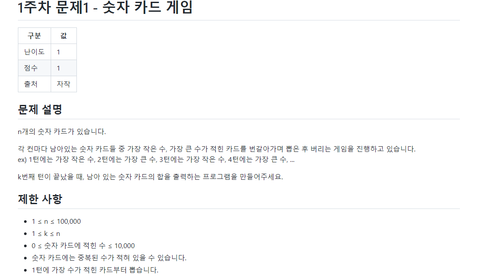
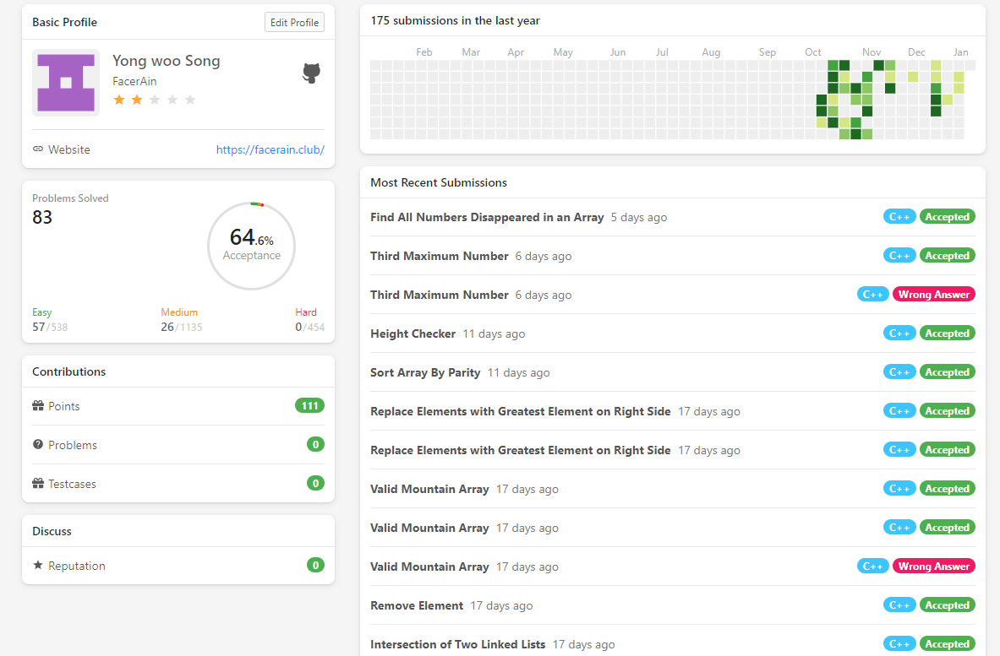
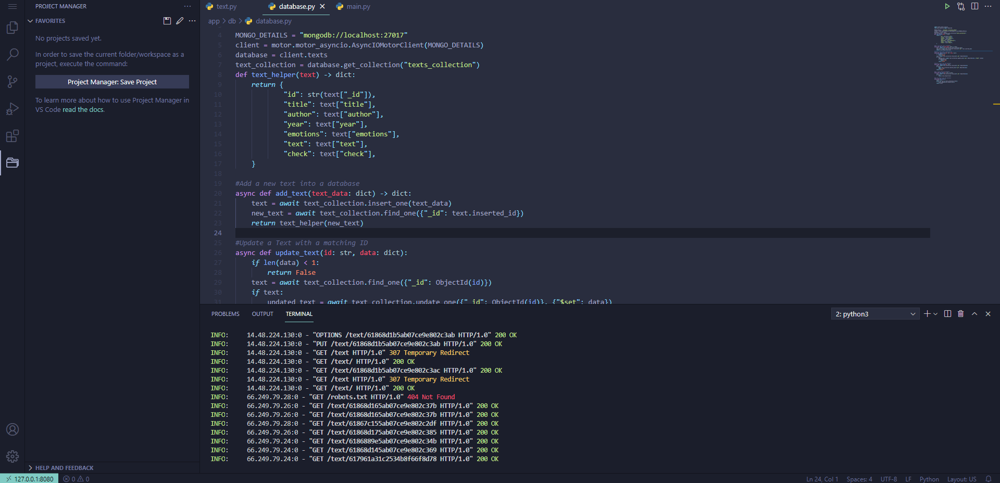
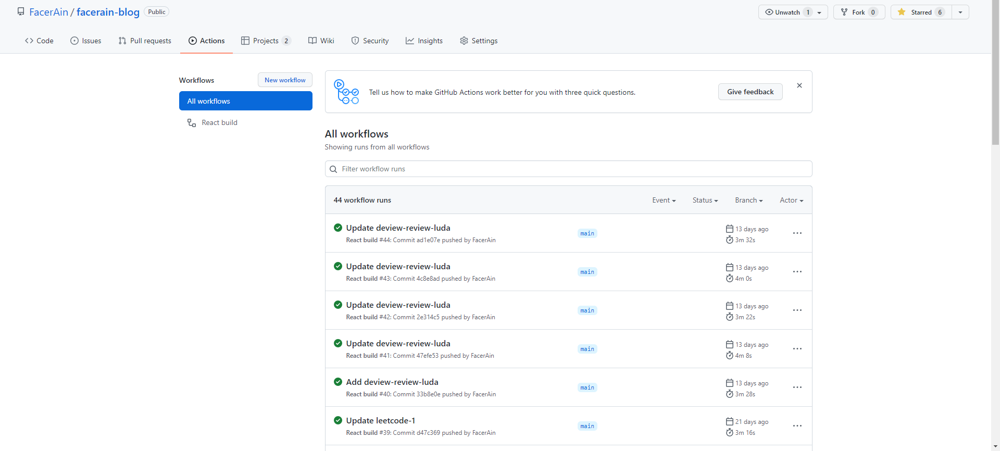

오지 않을 것만 같았던 2022년의 해가 밝았습니다.  
새해를 맞이하며, 2021년 필자의 개발 기록을 회고합니다.  

필자는 2021년 3월에 육군에 입대하였습니다. 군대라는 환경 특성상 많은 것들이 제한되고 어려운 환경이었지만 나름대로 많은 것들을 배울 수 있는 시간이었습니다.  
2021년에는 크게 **5가지 활동**을 진행하였는데 1편과 2편으로 나누어 차례대로 간단히 리뷰해보도록 하겠습니다.

- 알고리즘 문제 풀이
- 클라우드와 데브 옵스 경험기
- FacerAin Blog 개발기
- NLP 공부
- Dongju AI 개발

## 알고리즘 문제 풀이
입대하면서 다짐한 것 중 하나가 **"다른건 몰라도 알고리즘은 열심히 풀고 전역하자"** 입니다.
다행히도 부대에서 점심 시간이나 야간 연등에 알고리즘 문제 풀이할 여건이 보장되어 꾸준히 문제 풀이를 할 수 있었습니다.
또한 마침 여름에 학교 동아리에서 알고리즘 스터디를 개설하여 운좋게 스터디에 참여하여 함께 공부하였습니다. 

여름 스터디가 끝나고는 Leetcode에서 매일 한 문제씩을 목표로 문제를 풀었습니다.  

LeetCode 후기는 [블로그 글](https://facerain.club/leetcode-top-interview-easy/)에서 확인할 수 있습니다.  

2021년 한해에 약 **100개가 넘는 문제**를 풀었습니다. 문제를 풀면서 **"나의 풀이가 과연 최선일까"** 라는 의문을 많이 가졌습니다. 더 나은 풀이, 아이디어를 찾기 위해 다른 사람의 풀이를 여럿 참고했었는데 지금 돌이켜보면 이 습관이 실력 향상에 매우 큰 도움이 되었던 것 같습니다.  

2022년에는 보다 실전 경험과 실력을 쌓고자 **온라인 코딩 테스트나 콘테스트에 많이 참여**해보고자 합니다.  

## 클라우드와 데브옵스 경험기
사지방이라는 **제한된 시간과 환경 내에서 개발**해야 하다보니 평소 개인 노트북으로 개발할 때보다 어려운 점이 많았습니다. 
이를 해결하기 위해 클라우드 상에 온라인 개발 환경을 구축하였는데, 자연스럽게 **클라우드와 데브옵스에 관심이 많아지는 계기**가 되었습니다.  

마음 같아서는 AWS에서 고성능의 인스턴스와 서비스들을 활용하여 개발 환경을 구축하고 싶었습니다.
하지만 가난한 군인의 입장에서 AWS의 막대한 비용을 감당하기는 힘들었습니다.(ㅜㅜ)  
  
차선책으로 처음에는 매달 7000원의 비용을 지불하여 **구름 IDE 학생 라이선스를 사용**하였습니다.
하지만 **컨테이너를 항상 켜둘 수 없고**, **개발 환경 커스터마이징도 제한**되어 얼마가지 않아 사용하지 않았습니다.

지금은 **Vultr**에서 매달 5달러 상당의 인스턴스를 사용 중입니다. RAM 1GB에 CPU V1이라는 낮은 사양이지만 그럭저럭 타협하며 지금까지 잘 사용하고 있습니다.  

개발환경은 인스턴스에 **code-server라는 VS code 기반의 Web IDE 환경을 구축하여 개발** 하고 있습니다. 또한 개발한 웹 서비스들도 해당 인스턴스에서 관리 및 구동하고 있습니다.
인스턴스 사양이 낮은만큼 개발할 때 보다 가벼운 라이브러리와 툴들을 사용하려 노력했던 기억이 납니다.  

그리고 개발할 수 있는 시간이 1분 1초가 귀한만큼, 빌드와 배포에 소요되는 시간을 조금이나마 아끼기 위해서 Github Action으로 **CI/CD 자동화 파이프라인**을 구축했습니다.
지금 보고 계시는 블로그도 글이 업데이트 되면 Github Action에서 자동으로 빌드하고 서버에 실시간으로 Deploy하고 있습니다.   

기존에는 블로그 빌드에서 배포까지 수작업으로 약 **10분 정도가 소요**되었는데, CI/CD 자동화 한 지금은 Repository에 Push만 하면 알아서 **약 3분 이내**에 빌드와 배포를 마칠 정도로 **획기적으로 개선**했습니다. 

  

군대라는 제한된 시간과 환경 속에서 개발과 배포 환경을 운용해보면서 **데브옵스와 클라우드의 중요성과 재미**를 몸소 느낄 수 있었습니다.
예전에는 좋은 프로그램을 만들기 위해서는 코드만 잘 작성하면 되는줄 알았습니다. 하지만 이제는 좋은 프로그램을 만들기 위해서 개발 환경과 인프라, 시스템이 뒷받침되어야 한다는 것을 깨달았습니다. 2022년에는 **k8s와 Kibana** 등 데브옵스와 클라우드를 보다 깊게 공부하고 활용해보고자 합니다. 

## 마치며
지금까지 2021년 알고리즘 문제 풀이, 클라우드와 데브옵스 경험기를 간단하게 리뷰해보았습니다.  
나머지 FacerAin Blog 개발기, NLP 공부, Dongju-AI 개발은 2편에서 다룰 예정입니다.
다들 2022년 한해도 무사히 보내시고, 새해 복 많이 받으세요!