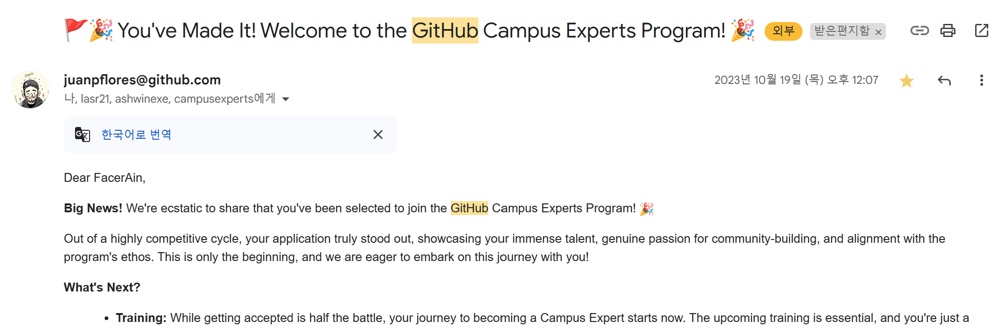
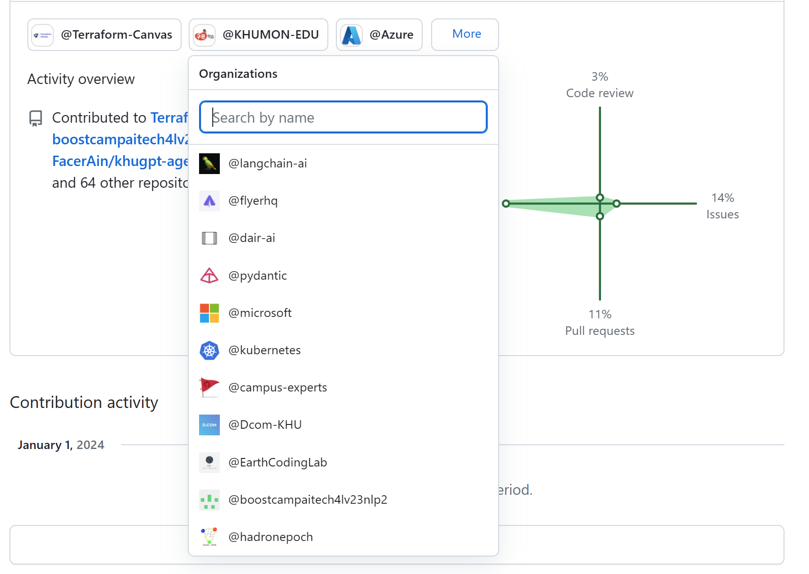
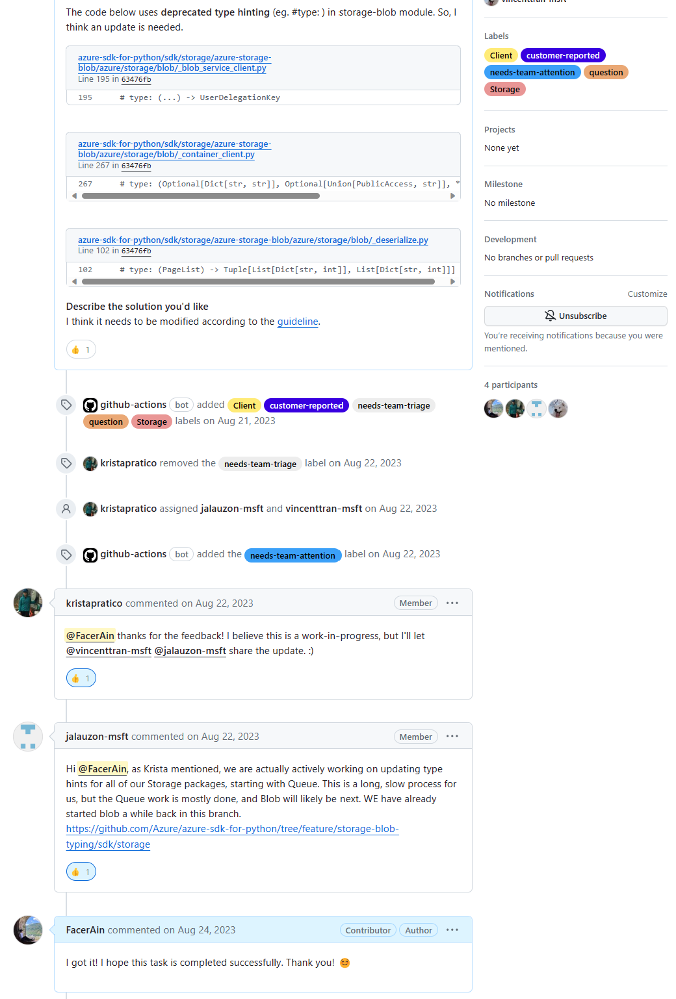

### 들어가며

또 올 것만 같지 않던 2024년 새해가 밝았습니다. 🥲  
오랜만에 복학하고 첫 한 해이기도 했고, 좋은 사람들도 많이 만나고 뜻 깊은 경험들을 할 수 있었던 한 해였습니다.  

무엇보다도 이번 한 해는 **나를 돌아보고**, **앞으로 내가 나아갈 길을 찾은 것 같다**라는 점에서 내면의 큰 성장을 이룬 것 같아 뿌듯합니다.

그럼 이번 2023년 하반기를 돌아보며 어떤 일들을 했는지 회고해보겠습니다. 😊

2023년 상반기 회고는 [여기](https://facerain.github.io/2023-01-review/)에서 보실 수 있습니다.

### 더 넓은 세상으로
첫번째 회고 키워드는 바로 **"더 넓은 세상으로"** 입니다.  

[저번 회고](https://facerain.github.io/2023-01-review/)에서도 언급한 것과 같이, 일단 더 넓은 세상에 부딪혀보며 **예상치 못한 기회**들도 많이 얻고, 많은 것들을 배울 수 있었던 것 같아요. 관련해서 **몇가지 기억에 남는 일**들을 소개해볼게요.

#### 학교 밖으로 나가자
이번 한 해는 학교 밖에 열리는 행사나 컨퍼런스, 세미나에 많이 참여하고, 다양한 사람들을 만나보려 노력했어요. 특히 일부러라도 부스에 계시는 현직 개발자분들에게 한 마디라도 더 말을 걸고, 제가 평소에 궁금해 했던 것이나 생각을 여쭤보려 열심히 돌아다녔던 기억이 있네요. 그리고 현장에서 다양한 이야기를 들으며, **내가 어떤 개발자가 되고 싶은지**, **어떻게 좋은 개발자로 성장할 수 있는지**에 대해 다시 한번 생각해볼 수 있었던 것 같아요. 특히나 학생 때 **최대한 많은 경험을 해보고, 도전을 두려워하지 않는 것** 이 중요하다는 것을 다시 한번 느낄 수 있었어요. ☺️

  

그리고 현직 개발자 분들에게 **커피챗 요청**을 드려 평소 궁금했던 것들에 대해 현업에서는 어떻게 해결해나가고 있는지 질문을 드려보기도 했어요! (내향인인 저에게는 정말 큰 용기가 필요했답니다...😭) 짧은 시간이었지만, 확실히 학부생 시각에서는 쉽게 볼 수 없는 현업 종사자 입장에서의 **깊이 있는 인사이트와 생각** 들을 엿볼 수 있는 정말 뜻 깊은 시간이었습니다!   

기회를 마냥 기다리지 말고 찾으라는 말이 있듯이, 앞으로도 내가 이루고 싶고 배우고 싶은 것이 있으면 **실패를 두려워하지 않고, 일단 도전하고 쟁취할 수 있는 사람**이 되고 싶어요. 어찌보면 지금 학생 때만 가질 수 있는 특권이니까요 😊

#### Github Campus Expert 도전
더불어 평소 커뮤니티 성장에도 관심이 많았고, 다양한 나라의 학생들과 교류해보고 싶어서, Github에서 주관하는 커뮤니티 리더 양성 및 지원 프로그램인 **Github Campus Expert** 선발 과정에도 도전했어요! 지금까지 평생 살면서 가장 긴 영문 자기소개서를 쓰고, 5분 내외의 영어로 자기 소개 비디오를 찍으면서, **내가 인생에서 영어를 이렇게 못했나** 힘들었던 기억이 있네요. 😅😅  그래도 커뮤니티 성장에 대한 열정과 이야기를 잘 전달이 된 덕분이지 운좋게 합격해서 현재 **8주 간의 트레이닝** 과정도 잘 마무리했답니다! 2024년에는 Github Campus Expert로서 지식 공유와 커뮤니티 성장 관련 활동을 열심히 해볼 계획입니다. 

  

또한 다양한 나라에서 비슷한 꿈을 쫓는 학생들을 보며, 어찌보면 한국이라는 작은 세상에서 한 발자국 벗어나 **전 세계의 다양한 개발자들과 함께 교류하고 일해보고 싶다는 욕심**도 가지게 되었어요. 그러기 위해서 고등학교 이후로 손도 안댔던 **영어 공부**도 다시 시작했답니다.

여담으로, 나중에 들어보니 선발 경쟁률이 약 **170 대 1** 이었다고 하더라고요... 그래도 지금까지의 고생과 노력을 조금이나마 인정 받는 것 같아 뿌듯했습니다. ☺️  

#### 오픈소스 커뮤니티 기여
올해는 또한 오픈소스 커뮤니티에도 많은 관심을 가졌었어요. 기능적으로 큼직한 기여를 수행한 것은 아니지만, 여러 관심 있는 오픈소스 저장소의 **번역, 문서 개선, 버그 수정** 등을 통해 **커뮤니티에 기여**할 수 있었던 것 같아요.  

  

특히나 microsoft의 azure sdk나 langchain과 같은 어느정도 규모가 있는 프로젝트의 코드를 직접 하나하나 뜯어보고, 기여를 해보면서 **규모 있는 프로젝트의 아키텍처와 코드를 어떻게 개발 및 관리**하고, **전체적인 개발 파이프라인이 어떻게 동작하는지** 큰 그림을 엿볼 수 있던 점이 정말 좋은 경험이었습니다.  

그리고 이제는 개발하다가 궁금한 점이 생기면, 단순히 Stack Overflow나 ChatGPT에 물어보는 것이 아니라, **유사한 기능을 수행하는 오픈소스의 코드 속에서 아이디어나 메커니즘**을 뜯어보고, 이를 바탕으로 **내 코드를 개선**해나가는 **스킬(?)** 도 생긴 것 같네요..!

또한 누가 시키지 않아도, 모두가 자발적으로 프로젝트를 발전시키고, 더 좋은 기여 문화를 만들기 위해 노력하는 모습을 보면서 **오픈소스 커뮤니티의 강력한 힘**을 느낄 수 있었던 것 같아요! 

이를 바탕으로 2024년에는 작은 프로젝트라도 좋으니, 한번 오픈소스 프로젝트에 **메인테이너 급으로 기여**를 해보고 싶어요. 😊 

  

  

### 시간과 집중력 관리하기
두번째 회고 키워드는 **"시간과 집중력 관리하기"** 입니다. 저번 회고에서도 아쉬운 점으로 시간과 집중력 관리를 꼽았었는데요, 이를 어떻게 개선할까 많은 고민을 했답니다!  

곰곰히 생각해보니, 가장 큰 문제는 내가 정확히 **일의 우선 순위와 진행 상황을 파악하지 못하고 있다는 점** 이었어요. 그러다보니 당장 중요한 일을 먼저 하지 않고, 다른 불필요한 일을 하다가 결국엔 시간이 부족해져서 **퀄리티가 낮아지거나**, 어떤 일을 하려고 딱 앉았는데 **어디서부터 다시 시작해야할지 몰라 헤매고 시간을 낭비하는** 일이 많았던 것 같아요.  

그래서 이를 개선하고자 노션을 이용해서 **매주 그리고 매일, 일의 우선 순위를 정하고, 진행 상황을 파악할 수 있는 나만의 시스템과 루틴**을 만들어서 실천해보고 있어요! 자세하게 소개해드리면... 블로그 글 시리즈 하나 분량이라 다음에 기회가 되면 따로 소개해드릴게요. 😊

  

또한 더불어 알차게 시간을 쓰기 위해 **RIZE** 라는 생산성 앱도 사용하고 있어요!  
RIZE는 자동으로 내가 하고 있는 일과 집중한 시간을 추적해주는 앱이에요. 사용해보면서 놀랐던 점은 **"생각보다 불필요하게 낭비되고 있는 시간이 정말 많다"** 라는 점이었어요. 하루 종일 책상 앞에 앉아있다고 생각했는데, 사실 집중한 시간은 2시간도 채 되지 않는 것이죠. 그래서 **집중할 때는 짧은 시간이라도 최대한 집중하고, 쉴 때는 확실히 쉬고자** 노력했어요. 이 과정에서 **뽀모도로 타이머**와 같은 기법도 유용하게 활용했던 것 같아요! 그러다보니 생각보다 **내가 정말로 바쁜게 아니라 시간을 효율적으로 잘 쓰고 있지 못하고 있다는 사실** 을 깨달을 수 있었던 것 같아요. 

  

누구나에게 하루 24시간은 동일하게 주어집니다. 하지만 **주어진 시간을 어떻게 쓰느냐에 따라 시간의 가치와 삶의 밀도는 천차만별로 달라지는 것** 같아요. 그래서 앞으로도 **내게 주어진 시간을 소중하게 쓸 수 있도록** 노력하고자 합니다. 우리에게 주어진 시간은 결코 무한하지 않으니까요 😊

### 내가 하고 싶은 일은?
이번 학기 가장 큰 성취는 **"개발의 재미를 다시금 찾았다"** 라는 점 이었어요! 사실 대학교에 입학하고 **남들에게 실력을 증명하고, 무언가 아웃풋을 내야 한다는 압박감** 이 너무나 컸던 것 같아요. 그러다보니 **크고 멋져보이는 프로젝트, 최신 기술, 네임드 있는 단체** 와 같은 것에만 매몰되고, 결국에는 **내가 개발을 하면서 느끼는 즐거움**을 잊고 있었던 것 같아요. 

다시금 돌이켜보면 제가 이 **자리(?)** 까지 올 수 있었던 원동력은 **"소소한 개발의 즐거움"** 였던 것 같아요. 누가 시키지 않아도 소소하게라도 새로운 것을 만들며, 개발 공부를 하는게 재밌었어요. 하지만 언제부터인가 조바심과 불안감에 휩싸여 **내가 가진 장점과 색깔을 다 버리고 남들이 하는 것만 따라가려고 했던 것** 같아요. 

그래서 이번 학기는 취업, 커리어, 스펙 이런 것들을 살짝 내려놓고 **"내가 하고 싶은 개발"** 을 하는데 집중했어요. 하루동안 혼자 심심해서 뭔가 재밌어 보이는 서비스를 만들어보기도 했네요. 그리고 소소하게 주변 친구들에게 공유해보고 피드백을 받아보며 다시금 개발에 재미를 느낄 수 있었던 것 같아요.   

  

물론 평생을 하고 싶은 것만 하면서 살 수는 없습니다. 개발 또한 마찬가지라 생각해요. 때로는 당장 하고 싶지 않은 프로젝트도 맡고 공부도 해야하는 순간이 옵니다.  하지만 그렇다고 아직 오지도 않은 미래를 위해 자기 자신을 너무 희생만 하는 것도 바람직하지 않다고 생각해요. 적당히 **현실과 이상, 하고 싶은 것과 해야 하는 것 사이에 균형을 잡을 수 있는 지혜가 필요한 시점**이라고 생각합니다. ☺️  

그리고 엄태웅 님의 `좋은 인재가 가진 10가지 특징` 이라는 글에서 언급해주신 내용입니다.
> 무엇을 선택하든 결국 나의 몰입과 열정이 성장을 이뤄낼 것을 믿으며, 작은 선택을 재지 않는다.  

결국은 개발자로 성공하기 위해 정해진 길이나 선택지는 없다고 생각합니다. 결국에는 **나의 선택을 최고의 선택으로 만들도록 노력** 하는 것이죠. 2024년 한 해는 **나의 선택을 믿고 밀어붙일 수 있는 담대함과 용기**를 가질 수 있도록 노력해보려 합니다.

### 이제는 기술적 깊이를 쌓을 때  

살짝 부끄러운 이야기지만, 어쩌다보니 이번 학기에 정독한 **개발 관련 전문 서적과 논문이 0건** 입니다. 😅 아무래도 개발에도 흥미를 잃다보니 자연스럽게 개발 관련 공부와도 살짝 멀어진 것 같아요. 그래서 2024년부터는 마음을 다잡고, 다시 기본기를 탄탄히 할 수 있도록 공부를 꾸준히 해보고자 합니다. 구체적인 방법은 조금 더 고민을 해보고 있어요!
- NLP, LLM 관련 논문 일주일에 한 편 이상 리뷰
- CS 기초 (컴퓨터 구조, 운영체제, 네트워크 등) 랩업
- TBA

### 마무리하며

제가 좋아하는 가수인 윤하님의 `오르트구름` 의 한 소절로 이번 회고를 마무리하겠습니다. 보이저호의 이야기가 담긴 노래인데, `녹이 슨 심장에 쉼 없이 피는 꿈` 이라는 가사가 참 마음에 와닿았네요 🔥  
다들 2024년도 화이팅입니다!

> 두 눈 앞에 끝, 사뿐 넘어가   
> 한계 밖의 trip, 짜릿하잖아  
> 녹이 슨 심장에 쉼 없이 피는 꿈  
> 무모하대도 믿어 난

감사합니다. 😊

