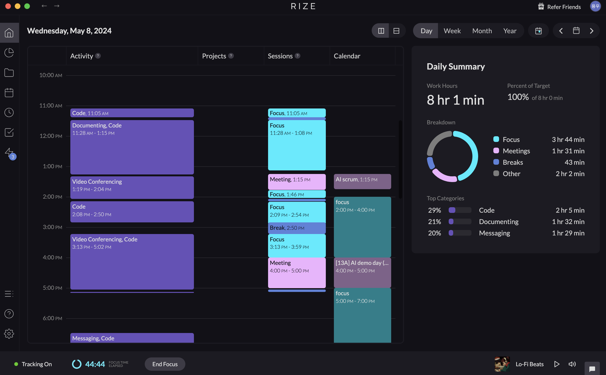

### 들어가며

어느덧 2024년 5월이 밝았습니다.

돌이켜 보면, 2021년부터 꾸준히 회고를 작성하기 시작했는데, 벌써 3년이라는 시간이 흘러 6번째 회고를 작성하고 있습니다. 이전에 쓴 솔직담백한 회고들을 다시 읽어보니, 3년 동안 참 많은 것을 깨닫고 성장했다는 것을 느낄 수 있었네요! 😀

이전에 작성한 회고들은 아래에서 확인할 수 있습니다!

[FacerAin's 2021 Review 1편](https://facerain.github.io/2021-review/)

[FacerAin's 2021 Review (2)](https://facerain.github.io/2021-review-2/)

[FacerAin's 2022 Review 1편](https://facerain.github.io/2022-review/)

[FacerAin's 2023 상반기 Review](https://facerain.github.io/2023-01-review/)

[FacerAin's 2023 하반기 Review](https://facerain.github.io/2023-02-review/)

특히, 전부터 꼭 가고 싶었던 뤼튼테크놀로지스에서 운 좋게 **ML Engineer Intern**으로 3월부터 일하게 되었습니다! 최고의 팀원들과 AI의 Next Step을 목표로 정말 재밌게 다양한 문제들을 고민하고 해결하고 있습니다.

학교가 아닌 현업이라는 새로운 세상에 던져진 만큼 정말 많은 것들을 느끼고 배우고 있네요 😀  관련한 이야기는 다음에 다른 글로 다루도록 할게요!

올 해 회고는 다음 세가지 키워드를 차례로 함께 살펴보고자 합니다. (나중에 더 추가될 수도 있습니다 🌻)

1. 시간 관리
2. 성장과 커리어
3. 삶과 휴식

첫번째 회고 주제는 바로 ‘시간’입니다. 

[FacerAin's 2023 하반기 Review](https://facerain.github.io/2023-02-review/) 에서도 다루었던 주제인데요,

시간 관리의 중요성은 누구나 잘 알고 있습니다. 어릴 적부터 ‘시간은 금이다’와 같은 말을 들으며, 시간의 중요성에 대해서 배워 왔는데요. 하지만 하루하루 바쁜 일들에 치이다 보면, 시간의 소중함은 그새 잊고 눈 앞의 일에 치여 하루 하루 흘러가는 대로 살아가게 되는 것 같아요. 

특히 이제는 직장 생활을 시작하면서 24시간이라는 한정된 시간 속에서 성과를 내고, 동시에 삶과 휴식도 챙겨야 하다보니 더욱 신경쓰게 되는 것 같아요. 

그렇다면 우리에게 주어진 한정된 시간을 어떻게 현명하게 쓸 수 있을까요? 시간에 어떻게 끌려다니지 않을 수 있을까요?

### 여러분은 ‘시간’을 어떻게 활용하고 계신가요?

> 내가 헛되이 보낸 오늘은 어제 죽은 이가 그토록 갈망하던 내일이다. \- 소포클레스

모두에게 24시간은 공평하게 주어집니다. 하지만 이 시간을 어떻게 활용하는지 사람들마다 천차만별입니다. 어떤 이는 하루에 참 많은 일들을 수준 높게 끝내는 반면, 또 다른 이는 하루를 그저 흐지부지 보내기도 합니다.

저 역시 많은 시간을 책상 앞에서 보내지만, 그 시간 동안 실질적으로 많은 것을 이루었다고 느낀 적은 많지 않습니다. 계획한 일들을 제때 하지 않고 미루다가 결국 마감에 쫓기는 경험도 자주 했던 것 같아요.

도대체 왜 이런 일들이 발생하는 걸까요? 보다 효율적인 시간 관리를 위해 제가 느끼고 실천했던 방법들을 몇가지 공유해보고자 해요.

### 우리는 왜 바쁠까요? 우리는 정말 바쁠까요?

> 바쁘다고 좋은게 아니다. (심지어 개미조차도 바쁘다)  
**대체 무엇 때문에 바쁜가?**  
반드시 이 질문을 던져야 한다.  
\- 헨리 데이비드 소로

우리 주변에서 ‘바쁘다’라는 말을 참 많이 하는 것 같아요. 저도 그렇고요!

그런데 “우리는 정말 24시간을 몰입해서 바쁘게” 살아가고 있었을까요?

제 자신을 돌아보며, 제 결론은 '아니오'였습니다.

저는 RIZE라는 앱을 통해 하루 동안 집중하는 시간을 추적해보았습니다. 그 결과 한 가지 일에 온전히 집중하는 시간이 1~2시간에 불과하다는 사실을 알게 되었어요. 대부분의 시간은 각종 메신저, 알림, 미팅 등으로 인해 집중하지 못하고 흘러갔습니다. 즉, 바쁘다고 느꼈지만 정작 중요한 일들에는 몰입하지 못하고 있었던 것이죠.

그래서 하루 종일 열심히 일했다고 생각했지만, 막상 성과는 잘 나오지 않고 몸은 피로해지는 악순환에 빠지게 되는 것 같아요.

### 목적 없는 시간을 경계하자

이러한 문제의 근본적인 원인은 '명확한 목적 없이 시간을 사용했기 때문'이라고 생각합니다.

예를 들어, 시험 기간에 공부해야 하는데 실제로는 책상에 앉아서 유튜브 숏츠를 보며 딴 짓 하는 등 다른 일에 시간을 소비하는 경험이 있을 거에요.

일도 마찬가지라고 생각해요. 하기는 해야 하지만, 무엇을 정확히 해야 할지 모르고, 명확한 목적도 없이 시작하면 이메일 확인이나 웹 서핑과 같은 당장 더 재미있고 유혹적인 일에 쉽게 빠지게 되는 것이죠.

그래서 저는 일을 할 때 명확한 시간과 목적을 설정하려고 노력합니다.

예를 들어 "45분 동안 A에 대해 조사해서 문서화하고 공유하기", "1시간 동안 B 코드의 버그 수정하고 테스트 코드 작성하기"와 같이 구체적인 목표와 예상 소요 시간을 정합니다. 그리고 실제로 타이머를 설정하고 그 시간 동안 일을 진행하는 것이죠.

이 방법을 실천하니 다음과 같은 장점이 있었어요.

1. 당장 해야 할 일의 목적이 명확해진다.
2. 데드라인을 설정하고, 일이 무한정 늘어지는 것을 방지할 수 있다.
3. 예상한 시간을 초과했다면, 어떤 부분에서 어려움을 겪었는지 파악하고 피드백할 수 있다.
4. 집중할 때 확실히 집중하고, 쉴 때 푹 쉬는 등 시간을 계획적으로 사용할 수 있다.

### 다음/내일은 없다. 지금 이 순간만 있을 뿐.

> 나는 분위기가 조성되기를 기다리지 않는다.  
그걸 기다리다가는 아무것도 이루지 못할 테니까.  
지금이 시작할 때임을 마음이 알아야 한다. \- Pearl S. Buck

일을 하다 보면 일을 하기 위한 최적의 분위기가 조성되기를 기다리는 경우가 많아요. 예를 들어 책을 읽고자 할 때 외부의 방해가 없고, 조용하며, 배가 적당히 부르고, 피곤하지 않은 등 완벽한 조건이 갖추어져야만 시작하려고 다짐하는 경우가 많습니다. 하지만 하루에 이러한 시간이 과연 얼마나 있을까요? 또 그 타이밍이 온다고 해도 과연 그 일을 수준 높게 해낼 수 있을까요? 

완벽한 조건의 시간은 결코 오지 않으며, 결국 '지금 이 순간'이 일을 해낼 수 있는 최적의 때라는 것을 느꼈습니다.

인생에서도 마찬가지라는 생각이 듭니다. 대학교에 입학하면, 회사에 들어가면 등 어떤 조건만 이루어지면 자연스럽게 많은 일들이 성취될 것이라고 흔히들 믿고는 합니다. 하지만 대학교에 입학하고, 취업을 해도 또 그때 나름대로의 어렵고 힘든 점이 닥치더라고요. 

영화 '죽은 시인의 사회'에서 나오는 Carpe Diem (현재를 잡아라)라는 말을 많이 들어보셨을 겁니다. 결국 우리가 어떤 일을 해내기 위한 완벽한 순간은 결국 지금 이 순간이라는 것을 다짐하며 살아가고자 합니다.

### 맺으며

이번 시간에는 제가 정말 감명 깊게 본 영화 ‘어바웃 타임’의 대사를 인용하며 마무리하고자 합니다.

우리 삶 속에서 가장 빛나는 순간은 다른 어느 때도 아닌 바로 오늘이라는 것을 잊지 않고자 해요.

이제 난 시간 여행을 하지 않는다.  
단, 하루 조차도
그저 내가 이 날을 위해 시간 여행을 한 것처럼  
나의 특별 하면서도 평범한 마지막 날이라고 생각하며  
완전하고 즐겁게 매일 매일을 지내려고 노력할 뿐이다  
우린 우리 인생의 하루하루를 항상 함께 시간 여행을 한다  
우리가 할 수 있는 최선은 이 멋진 여행을 즐기는 것 뿐이다  

감사합니다 ☺️