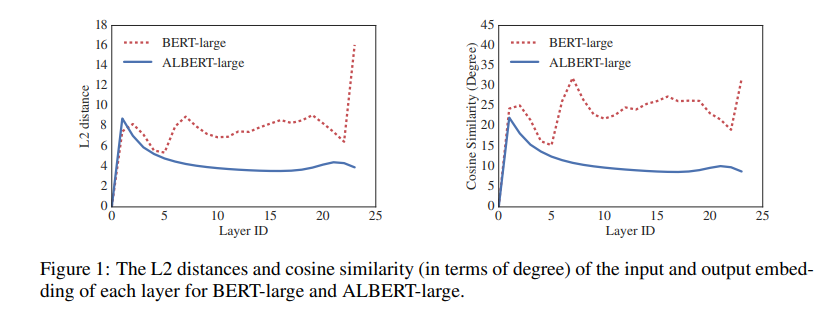
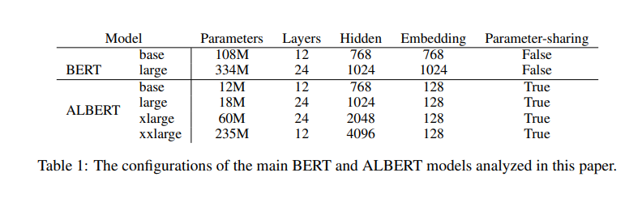
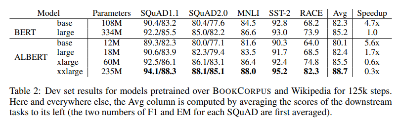
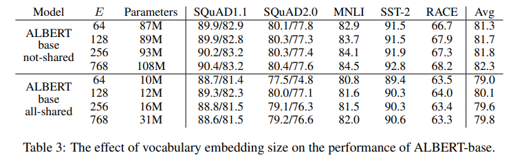
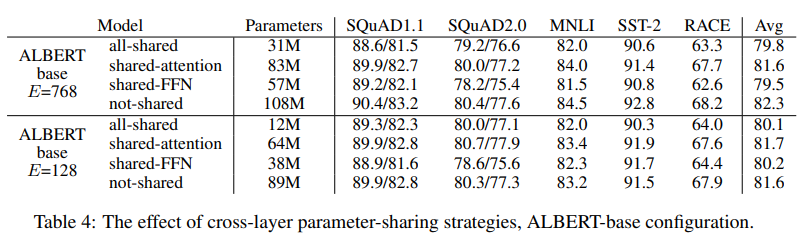
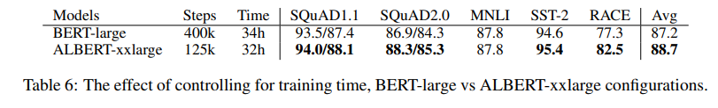
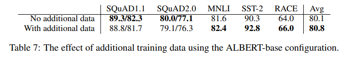
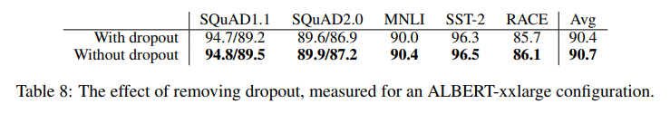
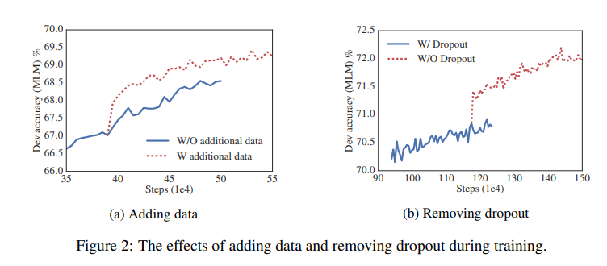

이번 시간에는 [ALBERT 논문](https://arxiv.org/abs/1909.11942)을 리뷰합니다. ALBERT는 BERT의 파생 모델입니다. 두가지 파라미터를 줄이는 기법을 통해 기존 BERT 모델보다 적은 파라미터와 학습 시간으로 더욱 좋은 성능을 낸 것이 특징입니다. BERT 논문 리뷰는 [링크](https://facerain.club/bert-paper/)에서 확인할 수 있습니다. 😊 

> 원활한 이해를 위해 실제 논문과 글의 순서나 구성을 살짝 바꾸었습니다.

## Abstract

- NLP 모델 사이즈 증가는 성능 향상에 영향을 미쳤다.
- 하지만 **모델 사이즈 증가는 GPU/TPU 메모리 한계와 훈련 시간이 길어진다는 문제점**이 있음
- ALBERT는 **두가지 parameter-reduction 테크닉**을 사용하여 **적은 메모리 사용과 훈련 속도 향상을 이룸**
- multi sentence input에 대해서는 문장 간 일관성(inter sentence coherence) 모델링을 통해 성능을 향상
- GLUE, RACE, SQuAD 벤치마크에서 BERT-Large보다 적은 파라미터로 **SOTA 성능을 달성**

## The Elements of ALBERT

ALBERT 모델은 BERT 모델의 파생 모델입니다. **BERT 모델 대비 파라미터를 줄이면서, 성능은 향상시키기 위해 세가지 parameter-reduction 테크닉을 적용하였습니다.**

이들 테크닉을 통해 ALBERT는 성능 저하 없이, parameter-efficiency를 향상시킬 수 있었습니다.

**실제로, BERT-large와 비슷한 ALBERT 모델 구성은 18배 적은 파라미터로 1.7배 빠르게 훈련시킬 수 있습니다.** 

parameter-reduction 테크닉을 하나씩 살펴보겠습니다.

### 1. Factorized embedding parameterization

**큰 사이즈의 단어 임베딩을 두 개의 작은 행렬로 분해하는 기법입니다.**

작은 행렬로 분해하는 이유는 무엇일까요? BERT에서 통상 임베딩 크기 E와 히든 레이어 크기 H를 똑같게 설정합니다. 하지만 이러한 결정은 아래 이유들 때문에 좋지 않다고 합니다.

첫번째로 모델링 관점에서 bert에서 사용하는 Wordpeice 임베딩 기법은 context-independent한 표현을 학습합니다. 반면에 히든 레이어는 context-dependent한 표현을 학습합니다.

**BERT-like한 모델들은 주변 문맥을 고려하는 context-dependent 표현을 통해 강력한 성능을 발휘하였습니다. 따라서 ALBERT는 context-independent한 워드피스 임베딩 사이즈 E보다 context-dependent한 히든 레이어의 크기 H를 크게 설정하는 것이 모델 성능 향상에 유리합니다.** (H >> E) 

 

**하지만 단순히 히든 레이어의 크기 H를 크게 설정할 수는 없습니다.** 그 이유를 살펴보겠습니다.

히든 레이어의 크기(H)를 증가시키면 임베딩 행렬의 크기인 (V X E)도 같이 커지게 됩니다.  NLP에서 통상 사전의 크기(V)를 크게 사용합니다. 따라서 임베딩 행렬의 크기(V X E)와 커지게 되는데, 앞서 살펴봤듯이 context-dependent한 임베딩 행렬이 커지는 것은 모델 훈련에 있어 비효율적입니다. **즉, 증가하는 파라미터의 개수에 비해 모델 성능 향상의 효율이 떨어지게 됩니다.**

> Q. H가 커지면 임베딩 행렬의 크기인 (V X E)도 같이 커지는 이유는?  
> A. 일반적인 워드피스 임베딩의 크기는 (사전 크기(V) * 임베딩 차원(E))입니다. 그리고 앞서 언급했듯이, 이때 히든 레이어 크기(H)도 통상 워드피스 임베딩의 크기(E)와 같게 설정합니다. 따라서 H가 증가하면 E도 증가하여, 결국 임베딩 행렬의 크기 (V X E)도 커지게 됩니다.

**따라서 연구팀은 굳이 사이즈가 클 필요가 없는 워드피스 임베딩 사이즈 E를 이용하여 임베딩 행렬을 분리하였습니다.**

one-hot 인코딩 된 사전 벡터 (V)를 히든 레이어(H)에 바로 투영(V X H)시키는 것이 아닌, 낮은 차원의 워드피스 임베딩 벡터 E에 먼저 투영(V X E)시키고, 그리고 낮은 차원 워드피스 임베딩 벡터를 H(E X H)에 투영시키는 것입니다.  **이를 통해 O(V X H)에서 O(V X E + E X H)로 파라미터의 개수를 감소시킬 수 있습니다.**

예를 들어 설명해보겠습니다. V = 30000, H = 768, E = 128이라고 가정하겠습니다.

기존 방법은 (V X H)로 30000 X 768(=약 2천 3백만) 차원을 가집니다.

**하지만 연구팀이 제안한 방법은 (V X E + E X H)로  30000 X 128 + 128 X 768(=약 3백 90만) 차원으로 약 10배 가까이 파라미터를 감소시킬 수 있습니다.**  

### 2. Cross-layer parameter sharing

연구팀은 파라미터 효율성을 높이기 위해 **Cross-layer parameter sharing**을 제안합니다. parameter sharing 기법에는 여러가지가 있습니다.

1. Sharing Feed-Forward-Network (FFN) parameters across layers
2. Sharing Attention Parameters
3. Sharing All parameters across layers

**여기서 ALBERT는 3번째 옵션인 레이어 간 모든 파라미터를 공유하는 방법(All shared)을 사용하였습니다.**

아래 도표는 BERT-large와 ALBERT-large의 각 레이어에서 L2 거리와 코사인 유사도를 비교한 것입니다. ALBERT가 확실히 레이어 간 transition이 부드러운 것을 볼 수 있습니다. **이는 parameter sharing이 모델의 파라미터 안정화에 영향을 미쳤다고 볼 수 있습니다.**

### 3. Inter-sentence coherence loss

BERT에서는 MLM(Masked Language Modeling)과 NSP(Next Sentence Prediction) 두 가지 Task를 학습합니다. **여기에서 연구팀은 이전 연구를 통해 NSP Task가 모델 성능 향상에 큰 도움이 되지 않는다고 판단합니다.** 그 이유는 NSP가 MLM에 비해 난이도가 쉽기 떄문입니다. 또한 NSP는 주제 예측(Topic Prediction)과 문장의 일관성(Coherence Prediction)에 대한 예측을 동시에 수행합니다. 그러나 주제 예측은 문장 일관성 예측에 비해 쉽고, MLM에서도 주제 예측을 수행하여 기능이 겹친다는 단점이 있습니다.

**따라서 연구팀은 NSP 대신 Sentence-Order Prediction (SOP)를 제안합니다.**

SOP는 두 문장의 순서가 올바른 Positive 샘플과, 두 문장의 순서를 뒤바꾼 Negative 샘플을 구분하는 Task입니다. 

**SOP는 NSP와 다르게 주제 예측은 수행하지 않고,  상호 문장 간의 일관성 (Inter-sentence coherence) 을 학습합니다.** 

이를 통해 모델은 담론(discourse) 수준의 일관성을 보다 미세하게 분별할 수 있습니다.

실제로 NSP는 SOP를 수행하지 못하지만, SOP는 NSP까지 수행할 수 있습니다. (sec 4.3)

## Model Setup

아래 표는 BERT와 ALBERT 모델의 하이퍼파라미터 설정을 비교하여 나타낸 것입니다.

**파라미터의 수가 ALBERT가 BERT에 비해 확연히 적은 것을 볼 수 있습니다.**

  

## Experimental Results

### Experimental Setup

**연구팀은 BERT와의 비교를 위해 BERT와 동일한 실험 SETUP을 따랐습니다.** 

- 16GB의 BOOKCORPUS와 English Wikipedia 텍스트 데이터 사용
- 입력 포맷은 “[CLS] x1 [SEP] x2 [SEP]”
- 최대 입력 문장의 길이는 512로 제한
- 10%의 확률로 512자보다 작은 문장을 랜덤하게 생성
- 워드피스 사전 크기 : 30000 (BERT와 XLNET도 동일)
- n-gram 마스킹 사용, 최대 n-gram 크기는 3
- 배치 크기: 4096
- LAMB 옵티마이저 사용 (lr=0.00176)
- 125,000 스텝 수행
- 모델 사이즈에 따라 64~512개의 TPU 사용

### EVALUATION BENCHMARKS

연구팀은 SQuAD, RACE, GLUE 벤치마크 데이터 셋을 사용하여 모델의 성능을 측정했습니다.

먼저 전체적인 **BERT와 ALBERT의 성능 비교**를 알아보겠습니다.

지금까지 연구팀이 강조한 것처럼 파라미터 효율성이 크게 좋아졌습니다. 특히, 아래 표를 보면 ALBERT-xxlarge 모델이 BERT-large 모델에 비해 70%의 파라미터를 사용하여, 모든 벤치마크에서 평균 2%의  성능 향상을 이루었습니다.

  

사전 embedding size E를 키운 경우는 어떨까요? **E가 커질수록 성능 향상은 있었지만, 큰 발전은 없었다고 합니다.** E가 128일때 가장 준수한 성능을 보인다고 합니다.  

연구팀은 Cross-layer parameter sharing의 strategies들의 성능을 비교해보았습니다. **all-shared의 경우 성능 하락이 있었습니다.** 마찬가지로 shared-FFN에서도 성능 하락이 있었습니다. **반면에 shared-attention에서는 성능 하락이 거의 없었습니다.**

다음으로 SOP(Sentence Order Prediction) 성능을 비교해보겠습니다. **SOP를 사용했을 때 전반적으로 향상된 성능을 보였습니다.** 특히 multi-sentence Task에서 성능이 좋았습니다. 주목할 점은, SOP의 경우 NSP 태스크까지 잘 수행한다는 점입니다. 
의 영향")

추가로 연구팀은 학습 시간을 제한하여 BERT와 ALBERT 모델을 비교하였습니다. **동일한 학습 시간 대비 ALBERT 모델이 더 좋은 성능을 보였습니다.**

마지막으로 연구팀은 모델에 드롭아웃과 추가 데이터를 적용하여 실험하였습니다. 추가 데이터를 적용하였을 때는 SQuAD를 제외한 Task에, 성능 향상이 있었습니다. 드롭아웃을 적용하였을 때는 전반적으로 성능이 하락하였습니다. **사이즈가 큰 트랜스포머 기반 모델은 드롭아웃이 성능을 저하시킨다고 합니다.**

  

## Discussion

- 연구팀은 **BERT보다 적은 파라미터로 더 좋은 성능을 보이는 ALBERT 모델을 제안**
- ALBERT 모델의 **훈련과 추론 시간을 줄이는 방안**에 대해 추가 연구 필요

## Reference

- 구글 BERT의 정석(수다르산 라비찬디란)

