이번 시간에는 [BERT: Pre-training of Deep Bidirectional Transformers for Language Understanding](https://arxiv.org/abs/1810.04805) 논문을 리뷰합니다.  
BERT는 등장과 동시에 Question Answering 등 다양한 NLP 문제들에 강력한 성능을 보여주며 NLP 분야에 한 획을 그었습니다.

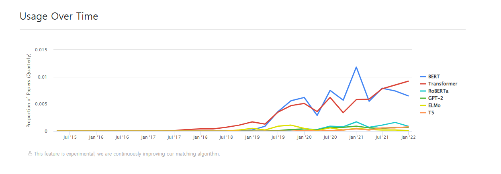
위 그림은 bert 모델의 사용 추이를 나타낸 그래프입니다. 2022년 현재까지도 많은 논문에서 BERT 모델을 다루는 것을 볼 수 있습니다. 이처럼 BERT 모델은 최신 NLP 트렌드를 이해하기 위해서 필수라해도 과언이 아닙니다. 그럼 BERT에 대해 함께 알아보도록 합시다!

## Abstract

- 연구팀은 BERT(**Bidirectional Encoder Representations from Transformers**) 모델을 제시합니다.
- BERT는 Deep bidirectional representation 모델로 unlabeled text를 **양방향으로 학습한 것이 특징** 입니다. (ELMO와 GPT-1과의 주요한 차이점)
- 모델은 downstream task를 수행하기 위해 큰 모델 수정 없이 **단지 하나의 출력 레이어를 추가하는 것으로 파인튜닝을 진행** 할 수 있습니다.
- 특히 파인튜닝한 bert 모델은 **11개 NLP Task에서 SOTA 성능을 달성** 할 정도로 성능이 좋은 것이 특징입니다.

## Introduction

최근 많은 NLP Task에서 pre-trained 모델을 사용하고 있습니다. pre-trained 모델이 성능이 좋고 효율적이기 때문입니다.  
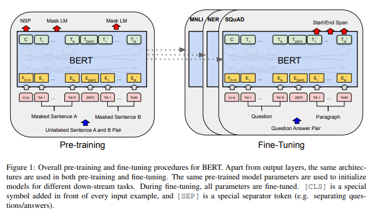
pre-trained 언어 모델을 downstream-task에 적용하는 방법으로는 크게 두 가지가 있습니다.
**바로 Feature based와 Fine Tuning입니다.** 두 방법의 특징은 아래와 같습니다.

### Feature based

- **어떤 특정 task를 해결하기 위한 architectures를 만들고, 여기에 pre-trained representations를 추가적인 feature로 제공하는 방법입니다.**
- 대표적인 방법으로는 ELMO가 있습니다.

### Fine Tuning

- **특정 task를 위한 파라미터는 최소한으로 두고, pre-trained parameter를 downstream task로 학습시키는 방식입니다.**
- 대표적인 방법으로는 gpt-1이 있습니다.

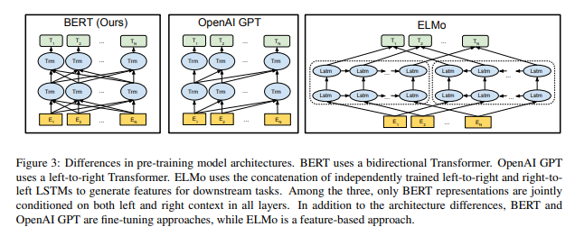

위에서 언급한 ELMO와 GPT-1 모두 단방향 구조라는 공통점이 있습니다.

> Q. ELMO 구조를 보면 양방향 아닌가요?  
> A. bi-LSTM 구조를 자세히 보면 left-to-right LSTM과 right-to-left LSTM이 결합되어 있습니다. 이 두개의 LSTM은 독립적으로 학습되어 결합되는데, 이는 근본적으로는 양방향이 아닌 단방향 모델이라 할 수 있습니다.

연구팀은 **단방향 구조가 pre-trained 모델의 성능을 제한** 한다고 생각하였습니다. 따라서 연구팀은 **모든 레이어에서 양방향 학습을 할 수 있는 bert를 제안합니다.**  
이를 위해 bert에는 크게 **두가지 학습 Task를 진행** 합니다.

### MLM(Masked Laguage Model)

기존 Language Model의 경우 주어진 단어 시퀀스를 통해 그 다음 단어를 예측하는 Task로 학습합니다. 하지만 이때 현재 입력 단어 이후의 단어들의 정보를 모델에게 알려줄 수 없습니다.(left-to-right, 단방향)

그에 반해 MLM(Masked Laguage Model)은 문장에서 무작위 토큰에 빈칸(MASK)을 해놓으면 빈칸(Mask)에 맞는 단어를 찾는 것이 목표로 합니다. Transformer encoder에 특정 토큰에 MASK 처리를 한 문장을 한번에 넣고 MASK 단어의 정답을 찾게 하도록 합니다. **이는 Mask 단어의 left, right context를 모두 활용해야 하므로 deep-bidirectional 학습을 가능하게 합니다.**

### NSP(Next Sentence Prediction)

**두 개의 문장이 이어지는 문장인지 모델이 맞추도록 하는 Task입니다.** 자세한 내용은 아래 섹션에서 다시 살펴보겠습니다.

## Model Architecture

BERT는 Transformer에서 **Encoder 부분만을 사용하여 구성**됩니다.
Transformer가 궁금하신 분은 [Transformer 논문 리뷰](https://facerain.club/transformer-paper/)를 참고해주세요!  
연구팀은 BERT_base와 BERT_large로 나누어 모델을 구축하였습니다.
각 모델의 파라미터는 아래와 같습니다. L은 레이어의 개수, H는 히든 레이어의 크기, A는 self-attention의 head의 개수를 의미합니다.

- BERT_base: L=12, H=768, A=12, Total Parameter=110M
- BERT_large L=24, H=1024, A=16, Total Parameter=340M

이때 **BERT-base는 OpenAI GPT와의 비교를 위해 같은 모델 사이즈를 채택**하였습니다.

## Input Representation

BERT의 입력은 세가지 임베딩이 더해져 구성됩니다.
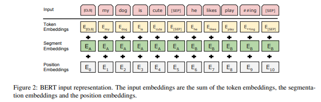

- **Token Embedding**
  - 토큰에 WordPiece Embedding을 수행합니다.
  - [CLS]는 문장의 시작을 의미하는 스페셜 토큰으로, 분류 Task에서 사용합니다.
  - 문장의 구분을 의미하는 [SEP], MLM에서 Mask할 토큰을 의미하는 [MASK], 배치 데이터의 길이를 맞춰주기 위한 [PAD] 등의 토큰이 있습니다.
- **Segment Embedding**

  - 입력 문장 쌍에서 앞 문장에는 A embedding, 뒤의 문장에는 b embedding을 더해줍니다.
  - 이때 더해주는 임베딩 값은 고정된 값입니다.
  - 만약 입력 문장이 단일 문장일 경우에는 A embedding만 더해주면 됩니다.

- **Positional Embedding**
  - Transformer와 마찬가지로 Token의 위치 정보를 주입하기 위해 Positional Embedding을 더해줍니다.

## Pre-Training

BERT는 2가지 pre-train 태스크를 수행합니다.
바로 앞서 살펴본 MLM(Masked LM)과 NSP(Next Sentence Prediction)입니다. 각각의 Task를 자세히 살펴보겠습니다.

### 1. MLM(Masked Language Model)

본 연구에서 GPT나 ELMO가 가지는 단방향 학습 문제를 해결하기 위해 MLM을 도입하였습니다. 랜덤으로 토큰을 마스킹하여 모델이 해당 마스킹 된 토큰의 원래 단어를 맞추도록 하는 Task입니다.

MLM에 필요한 학습 데이터를 만드는 절차는 아래와 같습니다.

- 전체 학습 데이터 토큰의 15%을 마스킹 대상 토큰으로 선정합니다.
- 마스킹 대상 토큰 가운데 80%는 [Mask] 토큰으로 만듭니다. (my dog is hairy -> my dog is [MASK])
- 마스킹 대상 토큰 가운데 10%는 토큰을 그대로 둡니다. (my dog is hairy -> my dog is hairy)
- 마스킹 대상 토큰 가운데 10%는 토큰을 랜덤으로 다른 토큰으로 대체합니다. (my dog is hairy -> my dog is apple)

MLM은 마스킹 대상 토큰을 예측하는 pre-training task를 수행하게 됩니다.

> Q. 왜 모든 마스킹 대상 토큰을 마스킹하지 않고 일부는 그대로 두거나 다른 단어로 바꾸나요?  
> A. [Mask] 토큰은 pre-train 과정에서만 사용하고, fine-tuning 과정에서는 사용하지 않습니다. 이는 두 과정 사이의 불일치(mismatch)를 유발하여 downstream task를 수행할 때 문제가 생길 수 있습니다. 따라서 마스킹 대상 토큰을 랜덤으로 두거나 그대로 둬서 모델이 모든 단어 사이의 의미적, 문법적 관계를 세밀히 살필 수 있게 합니다.

### 2. NLP (Next Sentence Prediction)

Question Answering(QA)나 Natural Language Infrence(NLI)와 같은 Task에서는 **두 문장 사이의 관계(Relationship)을 이해하는 것이 중요합니다.** 하지만 기존 Languauge Model에서는 문장 사이의 관계를 학습시키기 어려웠습니다. 이를 해결하고자 BERT는 **NSP를 통해 문장 사이의 관계를 모델이 이해할 수 있도록 합니다.**

NSP에 필요한 학습 데이터를 만드는 절차는 아래와 같습니다.

- 모든 학습 데이터는 1건당 문장 두개로 구성된 문장 쌍으로 구성합니다.
- 학습 문장쌍 데이터 중 50%는 동일한 문서에서 실제 이어지는 문장쌍을 선정합니다. 정답 Label로는 참(IsNext)를 부여합니다.
- 나머지 50%는 서로 다른 문서에서 랜덤으로 뽑아 문장쌍을 구성합니다. (관계가 없는 문장 만들기) 정답 Label로는 거짓(NotNext)를 부여합니다.

이제 모델에서는 문장 쌍이 참(IsNext)인지 판별하는 Task를 수행하게 됩니다.  
앞서 살펴본 BERT 구조를 보면, 맨 앞의 출력 토큰이 C입니다. 해당 C 토큰으로 문장 쌍이 참인지 판별하는 NSP Task를 수행하는 것입니다.  

### Pre-training Data

연구팀은 데이터셋으로 BookCorpus(800M Words)와 English Wikipedia(2500M Words)를 사용하였습니다.  
이때 Wikipedia 데이터셋의 경우 표나 도표 등은 제외한 text passages만 사용했습니다. 또한 긴 문맥으로 학습하기 위해 Billion Word Benchmark처럼 섞인 문장으로 구성된 corpus를 사용했습니다.

## Fine-tuning

이번에는 Bert 모델을 Fine-Tuning 하는 방법에 대해서 알아보겠습니다.
Bert 모델의 Fine-tuning은 비교적 단순합니다. **Task에 알맞는 입력과 출력 데이터로 Bert 모델의 모든 파라미터를 end-to-end로 업데이트(파인튜닝)하면 됩니다.** 이때 Token representation은 token level task (sequence tagging, QA 등)에 사용됩니다. 또한 [CLS] Representation은 Classification (entailment, sentiment analysis 등)에 사용됩니다. 아래 그림은 BERT의 파인튜닝 과정을 도식화한 것입니다.
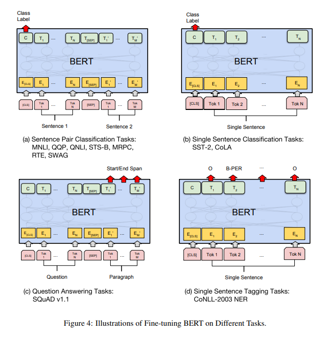

**파인튜닝은 프리트레인보다 적은 비용으로 학습을 진행할 수 있다는 장점**이 있습니다. 실제로 후술할 실험에서도 연구팀은 대부분의 downstream task를 파인튜닝하는데 single Cloud TPU로 1시간 정도 밖에 소요되지 않았다고 합니다.

## Experiments

연구팀은 11개의 NLP Task에 대하여 BERT 파인튜닝을 수행하였습니다.

1. **GLUE(General Language Understanding Evaluation)**

- 모델의 자연어 이해 능력을 평가하기 위해 9가지 Task로 구성된 벤치마크입니다.
- GLUE에 대한 자세한 설명은 [글](https://huffon.github.io/2019/11/16/glue/)을 참고해주세요.

2. **SQuAD (Stanford Question Answering Dataset)**

- Wikipedia를 바탕으로 만든 질의응답(QA) Task 벤치마크입니다.
- 2.0은 1.1을 개선한 버전으로 문제를 보다 현실적으로 가공하였습니다.

3. **SWAG(Situations With Adversarial Generation)**

- 앞 문장이 주어지고, 보기로 주어지는 4가지 보기 중에 가장 적절한 문장을 고르는 Task입니다.

결과는 아래와 같습니다.

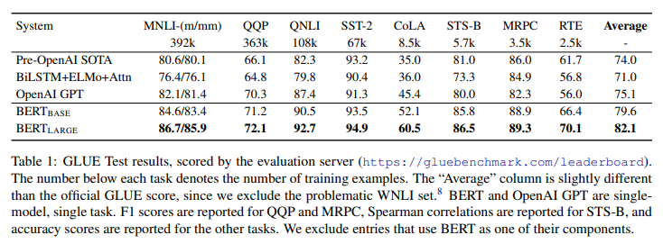
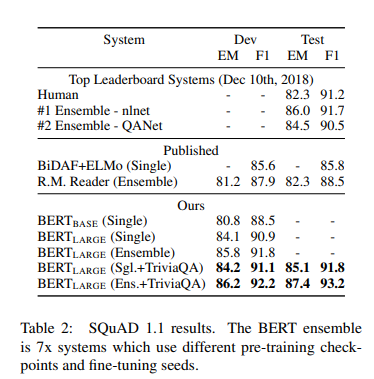
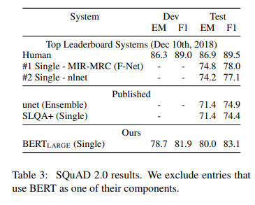
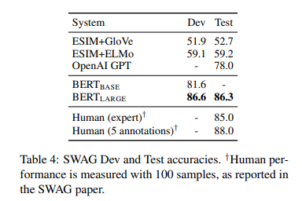

**BERT는 모든 Task에서 SOTA 성능을 달성합니다.** 😊 (구글의 기술력은 도대체 어디까지...)

## Ablation Studies

BERT는 MLM이나 NSP 등 다양한 요소를 모델에 적용하여 성능 향상을 이루어냈습니다.
연구팀은 BERT에서 **어떤 요소가 성능 향상에 어떻게 기여했는지 구체적으로 알아보기 위해 Ablation study를 수행**합니다.

> Q. Ablation study가 뭐죠?  
> A. Ablation study는 모델이나 알고리즘을 구성하는 다양한 구성요소(component) 중 어떠한 “feature”를 제거할 때, 성능(performance)에 어떠한 영향을 미치는지 파악하는 방법을 말한다. (출처: https://sangminwoo.github.io/glossary/atod)

### Effect of Pre-training Tasks

연구팀은 아래와 같은 모델로 기존 모델과 어떤 차이가 있는지 실험을 진행하였습니다.

1. **NO NSP**  
   기존 모델에서 NSP를 제거합니다.
2. **LTR(Left To Right) & NO NSP**  
   기존 모델에서 MLM과 NSP를 제거합니다.
3. **LTR(Left To Right) & NO NSP + BiLSTM**  
   기존 모델에서 MLM과 NSP를 제거하고, 모델 위에 임의로 초기화된 BiLSTM을 추가합니다.

결과는 아래와 같습니다.
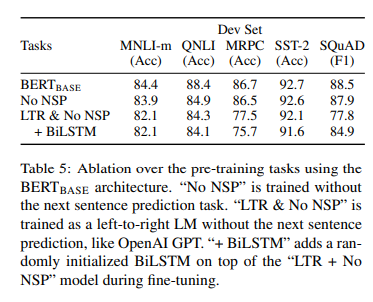

1. **NO NSP**
   QNLI, MNLI 그리고 SQuAD 1.1 성능이 떨어졌습니다.
2. **LTR(Left To Right) & NO NSP**  
   모든 Task에서 성능 저하가 발생하였으며, 특히 MRPC와 SquAD에서 큰 폭으로 성능이 떨어졌습니다.
3. **LTR(Left To Right) & NO NSP + BiLSTM**  
   BiLSTM을 추가했을 때 SQuAD의 성능이 향상하였습니다. 이는 **양방향 학습이 QA와 같은 두 문장간의 관계가 중요시되는 Task에 큰 영향**을 미치고 있음을 알 수 있습니다.

연구팀은 **ELMO처럼 LTR과 RTL 모델 각각 학습하여 representation을 합치는 방식**도 고려했습니다. 하지만 이 방법은 **세 가지 문제점**이 있다고 합니다.

- single bidirectional model보다 두 배의 계산량이 필요하다.
- RTL의 경우 질문에 대한 답을 판단할 수 없습니다. 따라서 QA와 같은 Task의 경우에 직관적이지 않을 수 있습니다.
- 모든 레이어에서 왼쪽과 오른쪽 컨텍스트를 모두 사용할 수 있기 때문에 deep bidirectional model에 비해 성능이 떨어집니다. (\*)

> (\*)사실 세번째 문제점은 이해가 잘 되지 않아서 논문 원문도 같이 첨부합니다!  
> this it is strictly less powerful than a deep bidirectional model, since it can use both left and right context at every layer.

### Effect of Model Size

연구팀은 모델 크기에 따른 파인튜닝 성능 차이도 알아보았습니다.  
결과는 아래와 같습니다.

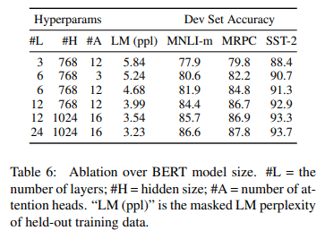

**모델의 사이즈가 크면 클수록 좋은 성능을 보이고 있습니다.** 또한 사이즈가 큰 모델은 small scale task에서도 좋은 성능을 보입니다.

### Feature-based Approach with BERT

마지막으로 BERT를 Feature-based로 사용했을 때 성능을 분석하였습니다.

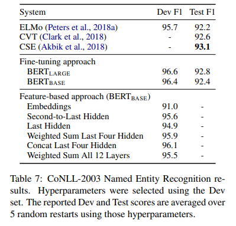

BERT를 **Feature-based로 사용하면 다음과 같은 이점**이 있습니다.

- Transformer Encoder 상에 모든 NLP Task를 적용할 수 없습니다. 따라서 Feature-based 방식으로 task-specific model을 추가하여 사용할 수 있습니다.
- 연산이 무거운 학습 데이터를 한번 pre-compute하여 representation을 생성하고, 이 위에 연산이 가벼운 모델을 사용하여 많은 실험을 수행하는 식으로 Computational Benefit을 얻을 수 있습니다.

또한 위 표에서 Concat Last Four Hidden의 경우 SOTA 모델인 Fine-tuning BERT Base와 0.3 F1밖에 차이나지 않는 것을 볼 수 있습니다.  
**이는 BERT가 Fine-tuning뿐만 아니라 Feature Based에서도 우수한 성능을 보여준다는 뜻입니다.**

## Conclusion

- **Deep Bidirectional Model**을 통해 같은 pre-train 모델로 **모든 NLP Task에서 SOTA를 달성**할 수 있었다.
- pre-train 모델을 통해 적은 resource로도 좋은 성능을 낼 수 있다.

## Reference

- 한국어 임베딩 (이기창)
- [https://misconstructed.tistory.com/43](https://misconstructed.tistory.com/43)
- [https://chloelab.tistory.com/25](https://chloelab.tistory.com/25)
- [https://sangminwoo.github.io/glossary/atod](https://sangminwoo.github.io/glossary/atod)
