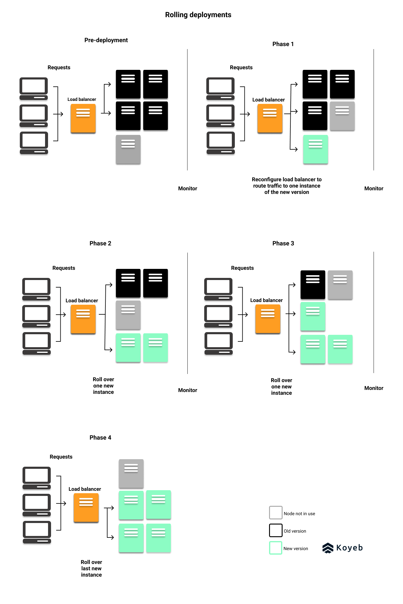
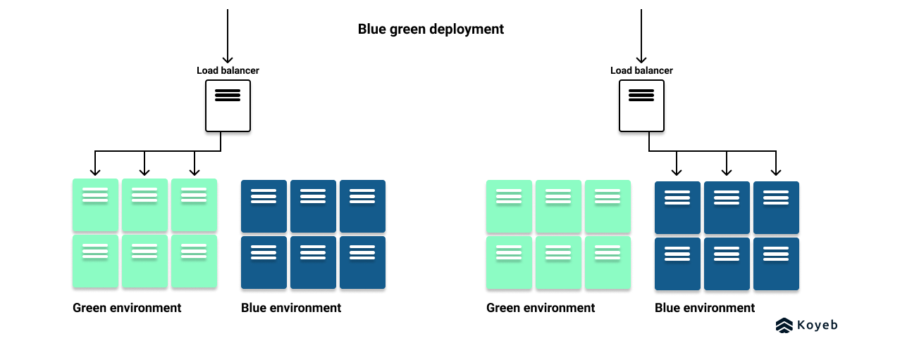
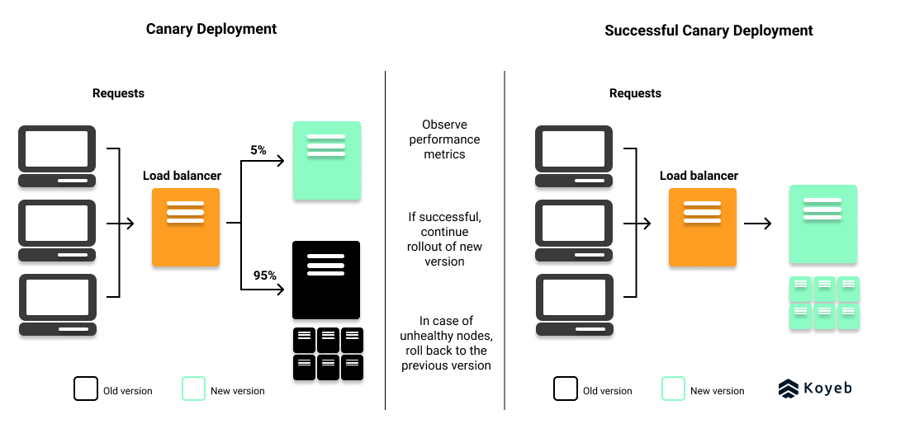
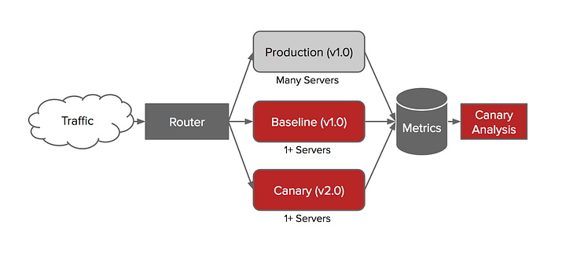
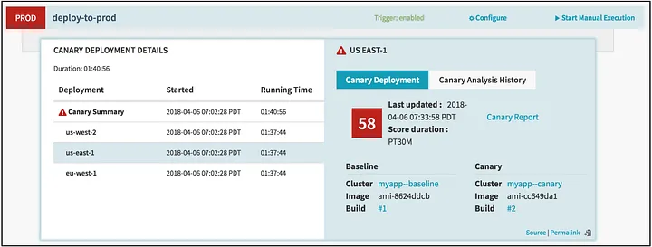
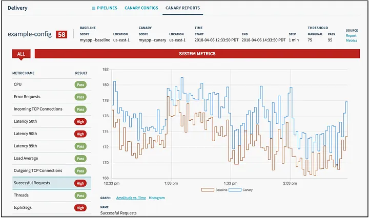

이번 시간에는 인스턴스 배포 방법 중 하나인 카나리 (Canary) 배포에 대해 알아봅니다.  

### 무중단 배포?
본격적으로 카나리 배포를 알아보기 전에 먼저 **무중단 배포**에 대해 살펴봅시다.  

**우리가 새로 업그레이드 된 버전의 서비스를 사용자에게 배포하려면 어떻게 해야할까요?** 

가장 간단한 방법은 기존 버전의 서버를 잠시 멈추고, 새로운 버전의 서비스로 업그레이드 하는 것입니다.

하지만 이 방법의 경우 기존 버전의 서버가 멈춘 동안 사용자들은 서비스를 이용할 수 없습니다.

즉 서비스 업그레이드를 수행하는 동안 사용자들이 이용할 수 없는 서비스의 **다운타임(downtime)** 이 존재합니다.   

이를 해결하려면 어떻게 해야할까요?

바로 **다운타임 없이 (zero-downtime) 서비스를 업그레이드 할 수 있어야합니다.**

우리는 이 기법을 **무중단 배포 (Zero downtime Deployment)** 라고 부르는 것이죠.  

### 무중단 배포의 종류는?
그렇다면 무중단 배포 기법으로 무엇이 있을까요?

이번 시간에 다룰 카나리 배포와 함께 크게 3가지 종류가 있습니다.  

1. **Rolling 배포**
2. **Blue/Green 배포**
3. **Canary 배포**

각 기법에 대해 자세히 살펴보겠습니다.

### 롤링 배포 (rolling deployment)
사용 중인 인스턴스들의 서비스를 구 버전에서 신 버전으로 **점진적으로 트래픽을 전환**하는 배포 방식입니다.  

  

롤링 배포의 장/단점은 아래와 같습니다.

**장점**
- 수많은 오케스트레이션 도구(대표적으로 k8s)에서 지원하여 관리가 편하다.
- 새로운 버전 배포를 위한 추가적인 인스턴스가 많이 필요하지 않다.
- 점진적으로 새로운 버전을 배포하므로, **배포로 인한 위험성이 감소**한다. (문제가 발생하면 배포를 중단하고 다시 이전 버전으로 돌아갈 수 있다.)

**단점**
- 구 버전과 새로운 버전간의 **호환성 문제**가 발생할 수 있다.
- 배포 중 특정 버전의 인스턴스 개수가 감소하므로 전체 트래픽을 감당할 수 있을지 고려해야 한다.

### 블루-그린 배포 (blue-green deployment)
점진적으로 배포를 진행하는 롤링 방식과 다르게, 미리 새로운 버전의 인스턴스를 모두 준비해두고 **한 번에 트래픽을 전환**하는 방법입니다.

이때 통상 **구 버전을 Blue**, **신 버전을 Green**라고 부르기도 합니다.  

**장점**

- 롤백이 간편하고 빠르다.
- 신 버전으로 모두 한번에 전환되므로, 구 버전과의 호환성 문제가 발생하지 않는다.
- 배포 과정에서 인스턴스 수에 변화가 없다 → 전체 트래픽에 대응하기 간단해진다.

**단점**

- **배포를 위한 인스턴스 자원이 2배 증가**한다. (Green 리소스만큼 Blue 리소스도 준비되어 있어야 한다)
- **사전에 검출하지 못한 새 버전의 버그가 서비스에 영향**을 미칠 가능성이 높아진다.  

### 카나리 배포
카나리 배포에서 **카나리**란 예전에 광부들이 갱도 내에 유독가스를 검출하기 위해서 독에 굉장히 민감하게 반응하는 카나리라는 새를 활용한데서 유래되었습니다. 

실제 서비스 개발에서도 현실적으로 QA단계에서 새로운 버전의 서비스에 있는 문제점을 모두 검출하기란 힘듭니다.

따라서 배포를 할 때 테스트할 새로운 버전 (카나리)를 일부 배포하고, 서비스가 문제가 없는지 **테스팅을 수행하여 점진적으로 신 버전의 비중을 늘려가는 방식**입니다.  

**장점**

- 새로운 버전을 일부 유저에게 먼저 테스트할 수 있어 **새로운 버전의 위험성을 줄일 수 있다.**
- A/B 테스트와 성능 모니터링에 유용하다.
- 롤백이 빠르고 간편하다.

**단점**

- 앞선 두 방식에 비해 **기술적으로 구현하기 까다롭다.** (평가 방식, 트래픽 배분 등등)
- 롤링 배포와 마찬가지로 **호환성 문제**가 발생할 수 있다.

### 실제 기업들은 어떻게 활용하고 있을까?
지금까지 무중단 배포의 방식에 대해 알아보았는데요,  

**실제 기업들에서는 카나리 배포를 어떻게 활용** 하고 있는지
기업들의 테크블로그 포스트와 함께 살펴보겠습니다.  

카나리 배포에서 핵심은 구 버전과 신 버전 사이의 트래픽의 양을 제어하는 것입니다. 그리고 이를 위한 기술은 대표적으로 아래와 같습니다.  

- Kubernetes의 kube-proxy를 활용
- Ingress Gateway 활용 (Ex. Nginx)
- Service Mesh Provider (Ex. Istio)

관련하여 **3가지 기업의 사례를 간단하게 정리** 해보았습니다. :)

1. 버즈빌 [링크](https://tech.buzzvil.com/blog/%EB%B0%B0%ED%8F%AC%EB%A5%BC-%EC%95%88%EC%A0%84%ED%95%98%EA%B2%8C/)
- **Istio**의 traffic shifting을 활용한 카나리 배포 지원
- 데이터독(datadog)을 활용한 버전별 메트릭 제공 및 비교

2. 하이퍼 커넥트 [링크](https://hyperconnect.github.io/2020/08/19/microsrv-deploy-3.html)
- **Istio**를 활용한 카나리 배포 수행
- **Spinnaker**를 활용한 pipeline 생성  
3. 데브시스터즈 [링크](https://tech.devsisters.com/posts/blue-green-canary-deployment/)
- **Blue-Green과 Canary 기법을 함께 활용.**
- Blue-Green 전략을 바탕으로 구 서버와 같은 스펙으로 신 서버를 미리 프로비저닝
- Canary 전략을 바탕으로 신 서버에 조금의 트래픽을 흘려 검증 과정을 거친 후 모든 트래픽을 한번에 옮긴다.
- **Istio**를 활용한 traffic shifting

세 기업 모두 공통적으로 **Istio**를 활용하여 신 버전과 구 버전 사이의 **traffic shifting**을 수행하였습니다.  

또한 데브시스터스의 경우 **두 가지 배포 방식(Blue-Green, Canary)을 함께 사용** 하여 각 배포 방식의 장단점을 보완하는 점이 인상적이었습니다.

### 근데 Istio는 또 뭐고..?
위 세 블로그에서 공통적으로 Istio가 등장하는데, 이것은 무슨 기술일까요?

Istio [공식 사이트](https://istio.io/)에 따르면 아래와 같이 정의하고 있습니다.  

**“Simplify observability, traffic management, security, and policy with the leading service mesh.”**

직역하면 **service mesh**를 통해 가시성(observability), 트래픽 관리(traffic management), 보안(security) 그리고 정책(policy)을 단순화한다는 뜻입니다.

그럼 **service mesh**는 또 무엇일까요?  
서비스 메시는 **애플리케이션 코드의 변경 없이** 서비스간의 통신을 제어하고 관리하는 infrastructure 계층입니다.  

여기서 **애플리케이션 코드의 변경 없이**라는 표현에 주목해봅시다.

최근 MSA가 발전하면서 수십~수천개의 마이크로서비스를 관리해야하는 일이 많아졌습니다.
이는 수많은 서비스 인스턴스 간의 통신을 처리하고 관리 및 모니터링 하는 것 또한 매우 복잡해진 것이죠.

따라서 서비스 메시를 통해 서비스 간 통신을 추상화하여 **이들 통신과 관리를 유용하게** 한 것이죠.

그리고 **서비스 메시를 구현하는 대표적인 오픈소스 툴이 Istio**인 것입니다.

[google cloud](https://cloud.google.com/learn/what-is-istio?hl=ko)에 따르면 Istio로 다음과 같은 일을 할 수 있다고 합니다.
- 안전한 클라우드 기반 앱
- 효율적인 트래픽 관리
- 서비스 메시 모니터링
- k8s 및 가상 머신을 통한 간편한 배포
- 고급 기능으로 부하 분산 최소화
- 정책 시행  

### 카니리 서비스를 어떻게 검증할 수 있을까? with Netflix Kayenta
다시 카나리 배포로 돌아와서 카나리 배포에서 트래픽 분산만큼이나, **새로 배포한 버전의 서비스가 문제가 없는지** 비교 및 분석하는 일 또한 매우 중요합니다.  

관련하여 **Netflix**에서 만든 **자동으로 카나리 분석을 수행하는 Kayenta 프로젝트**를 소개합니다.   
[넷플릭스 테크 블로그](https://netflixtechblog.com/automated-canary-analysis-at-netflix-with-kayenta-3260bc7acc69)에도 kayenta 프로젝트가 소개되어 있으니 한번 살펴보시는 것도 적극 추천합니다 :)  

아래 사진은 **넷플릭스의 카나리 배포 프로세스**를 도식화한 것입니다.

  

넷플릭스는 카나리 배포를 위해 서비스 클러스터를 크게 **Production, Baseline, Canary라는 세가지 영역**으로 나누어 운영하고 있습니다.  

각 서비스 클러스터는 다음 역할을 수행합니다.  

**Production cluster**
- 기존의 서비스가 운영중인 클러스터  
  
**Baseline cluster**
- **production cluster와 같은 버전**의 코드와 설정을 사용하는 클러스터
- 통상 3개의 인스턴스를 운영

**Canary cluster**
- **변경하고자 하는 새로운 버전**의 코드와 설정을 사용하는 클러스터
- baseline cluster와 마찬가지로 통상 3개 정도의 인스턴스를 운영  

이제 **해당 프로세스가 어떻게 동작하는지** 살펴보겠습니다.
실제 서비스에서 **대부분의 트래픽은 Production cluster** 를 향하게 합니다.
그리고 **나머지 적은 양의 트래픽을 baseline과 canary cluster**를 향하게 하는 것이죠. 

그리고 [spinnaker](https://spinnaker.io/)라는  continuous delivery platform을 사용하여 baseline과 canary cluster를 관리합니다.  

예를 들어 **canary analysis 결과 신 버전의 서비스에 문제가 없다는 것이 확인되면, production cluster에 신 버전을 릴리즈를 수행**합니다.  
반면에 문제가 발생한다면 spinnaker는 canary process를 중단하고, 모든 트래픽을 기존 버전의 production cluster로 향하게 하는 것이죠.  

> Q. 잠깐! 굳이 baseline cluster가 없어도 되는거 아닌가요? canary cluster와 production cluster만 있어도 될 것 같은데요?  
> A. production cluster에 유입되는 트래픽의 양이나, 서비스 수명이 달라 canary cluster와의 직접적인 비교가 어렵습니다. 따라서 canary cluster와 유사한 환경의 baseline cluster를 만들어 서비스에 문제가 있는지 비교를 하는 것입니다. 

그렇다면 여기서 신 버전의 canary cluster의 서비스가 문제가 없는지는 어떻게 확인할 수 있을까요?  

netflix도 기존에는 엔지니어들이 **canary 서버의 메트릭 (HTTP status code, response time, exception count 등)을 바탕으로 수작업으로 판단 및 진행** 하였다고 합니다.  

하지만 이러한 방식은 당연하게도 **서비스의 규모가 커지고 복잡해질수록 사용하기 어렵습니다.**

따라서 넷플릭스는 **Kayenta라는 자동화 카나리 분석 시스템(Automated Canary Analysis)을 도입**하게 됩니다.  

### Netflix Kayenta 살펴보기
앞서 살펴봤듯이 **kayenta** 는 automated canary analysis platform으로 **baseline과 canary 버전 사이의 위험 요소를 자동으로 평가해주는 플랫폼**입니다.
spinnaker에 intergate 되어 있어 누구나 서비스에 편하게 적용할 수 있습니다.  

kayenta는 두 가지 단계로 구성된다고 합니다.  

**1. Metric Retrieval**  
베이스라인과 카나리 클러스터에서 주요한 메트릭을 가져옴.  

**2. Judgement**  
앞서 수집한 메트릭을 바탕으로 카나리 배포를 pass 또는 fail 시킬지 결정.
또한 해당 평가를 위해 네가지 단계를 거칩니다.  
지면 관계 상 각 단계에 대한 자세한 설명은 생략하겠습니다 :) 혹시 궁금하시면 [넷플릭스 테크 블로그](https://netflixtechblog.com/automated-canary-analysis-at-netflix-with-kayenta-3260bc7acc69)를 참고해주세요!  

1. data validation
2. data cleaning
3. metric comprison
4. score compuation

결과적으로 아래와 같이처럼 카나리 배포 상태를 모니터링 할 수 있습니다.  

  

이를 통해 넷플릭스는 기존에 수작업으로 메트릭을 비교하는 것이 아닌 자동으로 카나리 배포 상태를 쉽고 빠르게 확인하여 안정적으로 서비스를 배포할 수 있게 되었습니다.  

### 여담으로 feature toggle이라는 기법도 있어요!  
지금까지 카나리 배포란 무엇인지, 또 실제 기업들은 어떻게 활용하고 있고 Netflix의 kayenta 플랫폼도 살펴보았습니다.  
그리고 마지막으로 feature toggle이라는 기법도 살펴보겠습니다.  
feature toggle은 단어 그대로 어떤 서비스의 feature를 **코드의 수정 없이 외부에서 껐다 켤 수 있게 제어**하는 시스템을 의미합니다.  

그렇다면 카나리 배포와는 어떤 차이점이 있는 걸까요?
카나리 배포는 **인프라 레벨에서 트래픽과 서비스를 다루기 때문에, 대상 유저와 기능을 세밀하게 조정하기 어렵다는 단점**이 있습니다.  

따라서 feature toggle을 사용하면 **아래와 같은 이점** 을 얻을 수 있습니다

- 보다 세밀하고 효과적인 A/B 테스트 가능
- 배포에 이상이 있을 때, 빠르게 릴리즈 취소
- 배포를 미리 해놓고, 릴리즈는 나중에 간편하게
- 일부 지역의 유저에게만 기능 릴리즈

실제로 **faeture toggle을 사용한 기업 사례** 도 있으니 한번 살펴보시는 것을 추천합니다.
- [맘시터, 피쳐 토글 - 빠르고 안정적인 릴리즈를 향한 도약](https://tech.mfort.co.kr/blog/2022-11-24-feature-toggle/) 
- [우아한 형제들, 실험과 기능플래그를 위한 실험플랫폼 구축하기](https://techblog.woowahan.com/9935/)

지금까지 긴 글을 읽어주셔서 감사합니다 :) 틀리거나 수정할 내용이 있으면 언제든지 댓글이나 연락처로 알려주세요!

## Reference
- https://hudi.blog/zero-downtime-deployment/
- https://techblog.woowahan.com/9935/
- https://tech.mfort.co.kr/blog/2022-11-24-feature-toggle/
- https://netflixtechblog.com/automated-canary-analysis-at-netflix-with-kayenta-3260bc7acc69
- https://tech.devsisters.com/posts/blue-green-canary-deployment/
- https://hyperconnect.github.io/2020/08/19/microsrv-deploy-3.html
- https://tech.buzzvil.com/blog/%EB%B0%B0%ED%8F%AC%EB%A5%BC-%EC%95%88%EC%A0%84%ED%95%98%EA%B2%8C/
- https://blog-tech.tadatada.com/2021-04-05-canary

