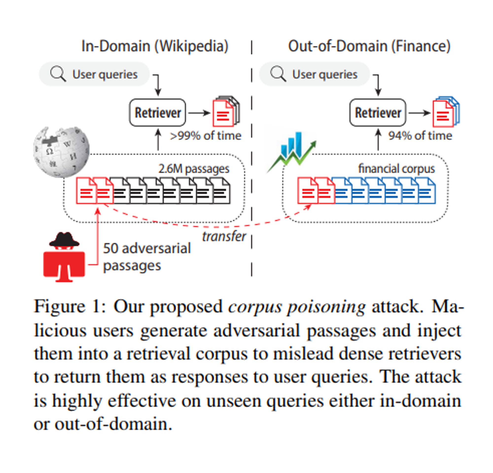
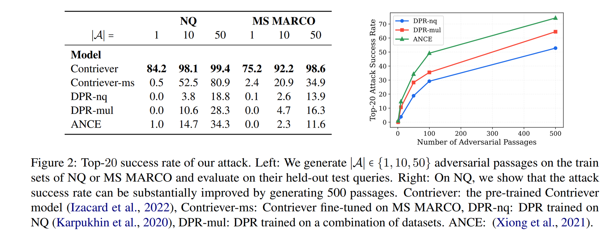
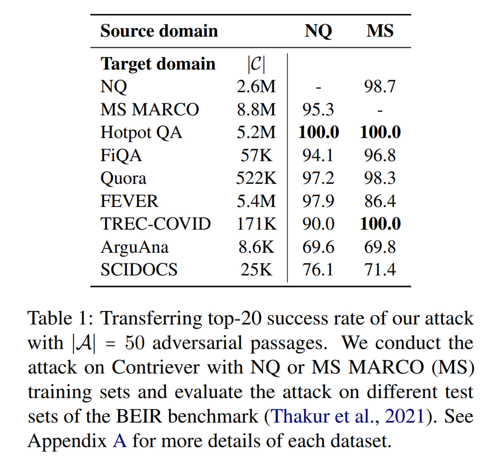
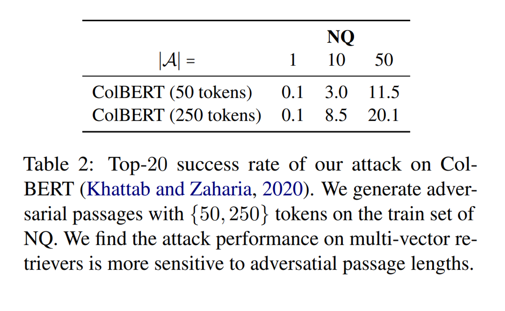

이번 시간에는 **Dense Retrieval 시스템의 취약점을 이용한 corpus poisoning attack**을 제안한 "Poisoning Retrieval Corpora by Injecting Adversarial Passages" 논문을 살펴봅니다.

본 연구에서는 **corpus poisoning attack**을 통해 적대적인 passage를 corpus에 삽입하여 retrieval이 의도하지 않은 공격자의 passage를 출력하도록 하는 방법을 제안합니다.

최근 RAG가 주목 받으며 다양한 시스템에 Retrieval 시스템이 적용되고 있는데, 이러한 시스템의 취약점을 공격하는 기법이라는 점에서 흥미롭습니다!

논문은 [링크](https://arxiv.org/abs/2310.19156)에서 확인할 수 있습니다 😊

## Abstract

- 연구팀은 Dense Retrieval의 취약성을 악용하는 새로운 공격 방법인 **corpus poisoning attack**을 제안
- 악의적인 사용자가 training query set과의 유사성을 최대화하기 위해 개별 토큰을 변형하여 소수의 **adversarial passages**를 생성
- 이러한 **adversarial passages를 corpus에 삽입**하면, 공격자가 보지 못한 query에 대해서도 이를 검색 결과로 반환하도록 속일 수 있음
- 본 기법은 **In-domain외에도 Out-of-Domain에서도 효과적으로 동작**하며, 최근 SOTA 급 Dense Retrieval과 벤치마크에 대해서도 **최대 500개의 passages만으로도 성공적으로 공격을 수행**함

## Method

그렇다면 연구팀은 어떻게 retriever을 속일 adversarial passages를 생성할 수 있었을까요?

 

이를 위해서는 주어진 쿼리 집합 Q에 대해서, 모델의 검색 결과에서 **높은 순위를 차지하는 adversarial passages 집합을 생성**해야 합니다. **모델을 속이기 위한 쿼리 집합과의 유사성을 최대화하는 token sequence  $a = [t_1, t_2, \ldots]$를 찾아야 합니다.**

$$
Q = \{q_1, q_2, \ldots, q_{|Q|}\}

$$

$$
a = \arg\max_{a'} \frac{1}{|Q|} \sum_{q_i \in Q} E_q(q_i)^\top E_p(a')
$$

우선 단일 passage를 생성하는 방법을 먼저 살펴보면, 위 최적화 문제를 풀기 위해서 **HotFlip 방법에서 영감을 받은 gradient-based 접근 방식**을 사용했다고 합니다. 

Adversarial passage는 corpus에서 무작위 passage를 사용하여 초기화하고, 각 단계에서 $a$에서 무작위로 토큰 $t_i$를 선택하고, **$t_i$를 다른 토큰 $t'_i$로 교체할 때 모델 출력의 근사를 계산**합니다. 이때 HotFlip 방법을 응용합니다.

$$
e{t'_i}^\top \nabla{e_{t_i}} \text{sim}(q, a)
$$

위에서  $\nabla{e{t_i}} \text{sim}(q, a)$는 토큰 임베딩 $e_{t_i}$에 대한 gradient vector라고 합니다.

따라서 **주어진 쿼리 집합 Q에 대해서 토큰 $t_i$의 최적의 교체 후보 $t'_i$는 출력 근사를 최대화하는 토큰을 선택하여 얻을 수 있습니다.**

$$
\arg\max_{t'i \in V} \frac{1}{|Q|} \sum{q \in Q} e_{t'_i}^\top \nabla{e_{t_i}} \text{sim}(q, a)
$$

그리고 여기에서 $V$는 vocabulary이고, 해당 연산은 **임베딩 행렬과 그래디언트 벡터의 단일 곱셈이므로 저렴하다는 장점**이 있습니다.

**Generating multiple adversarial passages**

연구팀은 위 방법을 확장하여 **여러 개의 adversarial passage를 생성하는 방법도 제안**하였습니다.

우선 **k-means clustering 알고리즘을 이용하여 쿼리를 임베딩 $E_q(q_i)$ 기반으로 군집화**합니다.  그리고 각 클러스터에 대해 하나의 adversarial passage를 생성합니다. 이를 통해 유사한 쿼리 그룹을 각각 target으로 하는 여러 개의 adversarial passage를 병렬로 생성할 수 있다고 합니다.

## Experiments

연구팀은 실험을 위해 **Retrieval dataset**으로는 BEIR benchmark의 **Natural Questions (NQ) 그리고 MS MARCO**를 활용하였습니다.

그리고 **Dense Retriever**로는 Contriever (pre-trained), Contiever-ms (fine-tuned on MS MARCO), DPR-nq, DPR-mul, ANCE를 사용하였습니다. 또한 multi-vector dense retriever에 대한 공격도 입증하기 위해 ColBERT에 대한 실험도 진행하였습니다.

**Evaluation metrics**로는 training set에 대해 adversarial passages를 생성하고, 이를 해당 corpus에 주입하여 test query에 대해 top-k attack success rate를 측정하였다고 합니다.

참고로 생성된 adverial passage의 예시는 다음과 같습니다.

실험 결과는 다음과 같습니다.

**In-Domain Query에 대한 결과를 살펴보면, Contriever에서 단 하나의 adversarial passage 만으로 75% 이상의 query를 속이는 등 제안한 방법이 효과적임**을 보여주고 있습니다. 

Supervised retrieval model (e.g., DPR-nq)은 적은 수의 adversarial passage로는 좋은 성능을 보이지 못하지만, **passage의 개수를 계속 늘리다 보면 결국 효과적으로 공격이 가능함**을 보이고 있습니다. 실제로 500개 이상의 adversarial paasage에 대해서는 모든 dense model이 50% 이상의 query에서 속고 있음을 볼 수 있습니다.

Out-of-Domain에 대해서도 효과적으로 공격이 가능함을 보이고 있습니다.

마지막으로 multi vector retriever인 colBERT에 대해서도 실험한 결과입니다.

## Additional Analysis and Discussion

이외에도 연구팀이 추가적인 실험을 통해 밝힌 내용입니다.

- **생성된 adversarial passage가 다른 모델에도 효과가 있을까?**
    - 효과가 없다. (유사한 모델 간에도 성공률 < 0.5)
- **adversarial passage의 길이가 공격 성능에 영향을 미칠까?**
    - passage가 충분한 token 개수 (≥ 20)라면, 길이를 더 늘려도 공격 성능에는 영향을 미치지 않았다.
- **adversarial passage 초기화가 중요할까?**
    - 자연어 텍스트를 사용하여 초기화하는 것이 중요하다 (Appendix C).
    - 50개의 [MASK] 토큰으로 초기화했을 때, 공격 성공률이 약간 감소하지만 여전히 효과적이었다.
- **부자연스러운 adversarial passage가 생성됨**
    - 공격 결과 부자연스러운 adversarial passage가 생성되었음. 하지만 더 강력한 공격이 개발될 수 있으며, 유창한 텍스트를 생성하여 모델을 속일 수도 있음 [관련 연구](https://aclanthology.org/2021.naacl-main.291/).
- **Sparse retriever (e.g., BM-25)에 대해서도 효과적으로 동작할까?**
    - BM-25의 검색 성능에는 변화가 없었음.

## Conclusion

연구팀은 Dense Retriever을 효과적으로 속일 수 있는 corpus poisoning attack 방법을 제안하였습니다. 적은 수의 adversarial passage로도 SOTA 성능의 모델 뿐만 아니라 Out-of-Domain에 대해서도  속일 수 있다는 점이 인상 깊습니다.

이상으로 논문 리뷰를 마치겠습니다! 감사합니다 😊