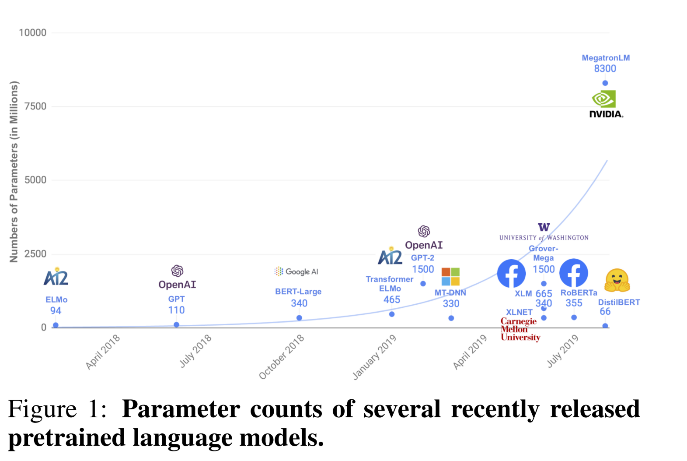
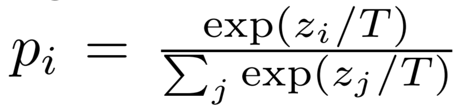
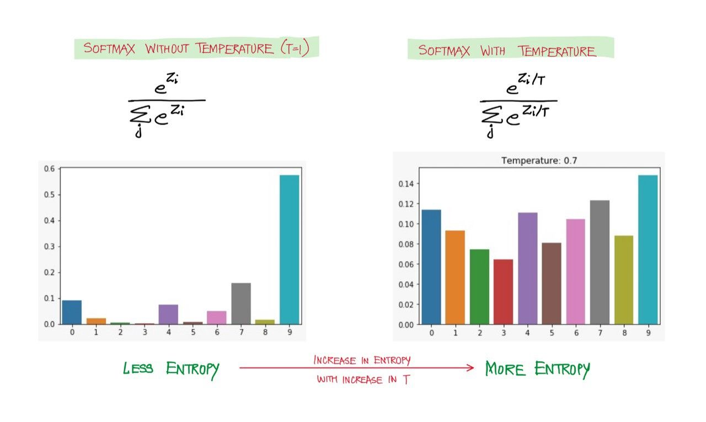
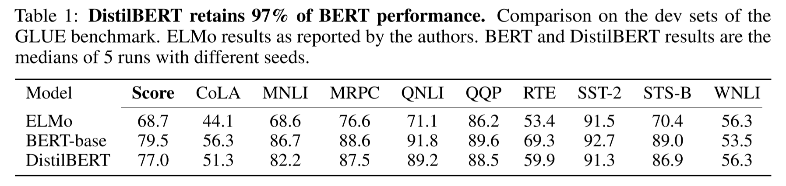
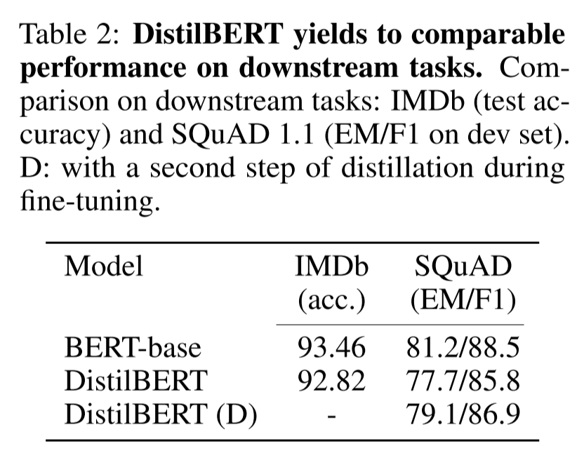
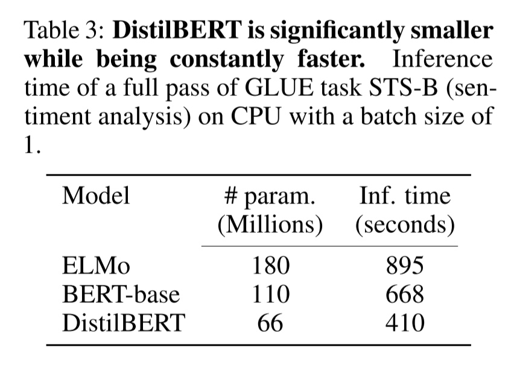
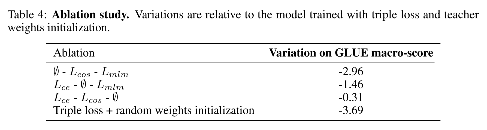

이번 시간엔 BERT의 지식 증류 버전인 **DistilBERT**를 살펴봅니다. 최근 모델 사이즈가 커짐에 따라 성능도 비약적으로 향상하였지만, **컴퓨팅 자원이 많이 들고, 실제 서비스에 활용하기 어렵다는 단점도 생겼습니다**. 해당 논문에서 지식 증류 기법 통해 이 문제를 어떻게 해결하였는지 확인해보세요 :) 논문은 [링크](https://arxiv.org/abs/1910.01108)에서 확인할 수 있습니다.

## Abstract
- 최근 NLP 분야에서 큰 사이즈의 프리트레인 모델들을 많이 사용하고 있다.
- 하지만 이러한 큰 모델들은 학습과 추론(inference) 과정에서 큰 비용과 리소스가 필요하다는 한계가 있다.
- 따라서 연구팀은 **DistilBERT**라 불리는 작은 사이즈로 프리 트레인할 수 있는 언어 모델을 제안함
- DistillBERT는 파인 튜닝을 거치고 다양한 Task에 대해서 좋은 성능을 보여주었다.
- 이전 연구에서는 대부분 task-specific 모델에 지식 증류(knowledge distillation)을 사용했지만, 해당 연구는 프리 트레인 과정에서 지식 증류를 사용하였다.
- **이를 통해 기존 BERT 모델 대비 언어 이해 능력을 97%로 유지하면서 사이즈를 40% 가까이 줄이고, 60%로 더 빨라진 성능을 제공할 수 있었다.**
- inductive biases를 극복하기 위해, 세가지 loss를 최소화하는 방향으로 학습을 진행.

> inductive biases란?  
> 학습 모델이 지금까지 만나보지 못했던 상황에서 정확한 예측을 하기 위해 사용하는 추가적인 가정을 의미한다. [출처](https://www.dacon.io/forum/405840)  

  

## Knowledge distillation

**지식 증류(knowledge distillation)** 은 **큰 사이즈의 모델(teacher model)의 동작을 재현하는 압축된 작은 사이즈의 모델 (student model)을 훈련**시키는 기술입니다.

일반적으로 잘 학습된 모델은 올바른 class에 높은 확률을 부여하고, 그렇지 않은 class에 대해서는 0에 가까운(near-zero) 확률을 가집니다. 하지만 그렇다고 **near-zero 확률들이 불필요한 것은  아닙니다.** 연구팀은 **near-zero 확률들이 모델의 일반화 능력에 큰 영향을 미친다**고 주장합니다. 

따라서 student 모델이 teacher 모델에게 이러한 부분을 반영하여 학습할 수 있도록 **soft-max temperature** 를 도입하였습니다. 아래 수식에서 T가 temperature를 의미하며, T=1일때는 기본적인 Softmax 함수입니다.  

  

**T 값이 높을수록 확률 분포가 부드러워지고, 보다 다양한 클래스에 대해 정보가 제공됩니다.**

따라서 teacher와 student 모델을 학습시킬 때 같은 T 값을 적용한 soft-max temperature를 적용합니다. 다만 inference 단계에서는 T=1인 일반적인 소프트맥스 함수를 사용합니다.  

  
[이미지 출처](https://hackernoon.com/softmax-temperature-and-prediction-diversity)  

**해당 연구에서는 아래의 3가지 loss를 최소화 하는 방향으로 학습이 진행됩니다.**

- Distillation Loss
    - 소프트 타깃과 소프트 예측 사이의 교차 엔트로피 손실 (T > 1)
- Masked Language Modeling Loss
    - 하드 타깃과 하드 예측 사이의 교차 엔트로피 손실 (T = 1)
- Cosine Embedding Loss
    - Teacher와 Student의 hidden state vector 사이의 거리로 두 모델의 state가 같은 방향을 바라보게 하여, 더욱 정확하게 학습을 진행할 수 있다.  

## DistillBERT: a distilled version of BERT

연구팀은 앞서 살펴본 지식 증류를 BERT 모델에 적용하였습니다.

사전 학습된 BERT-base 모델(teacher)을 바탕으로 작은 사이즈의 BERT 모델(student)에게 지식을 전달하여야 합니다.

### Student architecture

Student Model은 아래와 같이 구성됩니다.

- BERT에서 token-type embedding과 pooler를 제거
- 레이어의 개수를 2배 감소
    - hidden state의 차원을 줄이는 대신 레이어의 수를 줄인 이유는 최근 Transfomer 모델들은 고도로 최적화된 연산 라이브러리를 사용하기 때문에 **hidden state의 차원을 줄이는 것은 계산 효율성 향상에 큰 의미가 없다고 합니다. 따라서 연구팀은 레이어의 개수를 줄이는 방향으로 진행했습니다.**

### Student Initilaization

앞서 Teacher 모델과 Student 모델의 차원은 같게 설정하였습니다. **따라서 Teacher Model로부터 Weight를 가져와서 Student 모델에 사용하였습니다.** (Teacher Model의 레이어가 Student보다 2배 많습니다. 따라서 레이어 두개 중 하나를 가져왔다고 합니다.)

### Distillation

RoBERTa에서 제안한 방법처럼 NSP 태스크를 제거하고, 매우 큰 사이즈의 배치와 dynamic masking을 적용하여 학습을 진행하였습니다. RoBERTa 모델에 대한 자세한 설명은 [블로그 포스트](https://facerain.club/roberta-paper/)를 참고해주세요 :)  

### Data and compute power

Student 모델은 Teacher 모델과 동일한 학습 데이터를 사용하였습니다. 약 90시간동안 8개의 16GB V100 GPUs를 사용하여 학습하였습니다. 참고로 RoBERTa 모델은 1024개의 32GB V100 GPUs로 하루가 소요되었다고 합니다.  

### Experiments

학습 결과는 아래와 같습니다.

GLUE 벤치마크를 사용하여 모델의 성능을 측정한 결과 **기존 BERT 대비 약 97% 성능**이라는 거의 비슷한 성능을 보여주었습니다.  

downstream task에서도 기존 BERT와 비슷한 성능을 보여주었습니다.  

  

**마지막으로 기존 BERT 모델과 비교했을때 40% 가까이 적은 파라미터로 inference에서 60% 빠른 속도를 낼 수 있었다고 합니다.**

위와 같이 모델의 사이즈를 줄이면서 처리 속도를 높인 결과 edge device(스마트폰, 개인 PC)에도 모델을 활용할 수 있게 되었습니다. 그 예로, Iphone 7 Plus에서 토크나이징 과정은 제외하고, 기존 BERT보다 71% 빠르게 처리가 가능하고, 총 모델 용량이 207MB이 가능했다고 합니다.  

### Ablation Study

연구팀은 앞서 설정한 3가지 Loss 그리고 가중치 초기화가 모델의 성능에 미친 영향을 알아보기 위해 ablation study를 진행하였습니다.  

그 결과 Masked Language Modeling Loss를 제거한 것은 모델의 성능에 크게 떨어뜨리지 않았지만, 가중치 초기화는 큰 영향을 미친 것을 볼 수 있습니다.  

## Conclusion

- 기존 BERT보다 40% 작고, 60% 빠르며, 97%의 성능을 내는 DistilBERT 모델 제안
- BERT에 성공적으로 Distillation을 적용할 수 있었고, edge application에 설득력 있는 옵션이 될 것

## Reference

- 구글 BERT의 정석 (수다르산 라비찬디란)