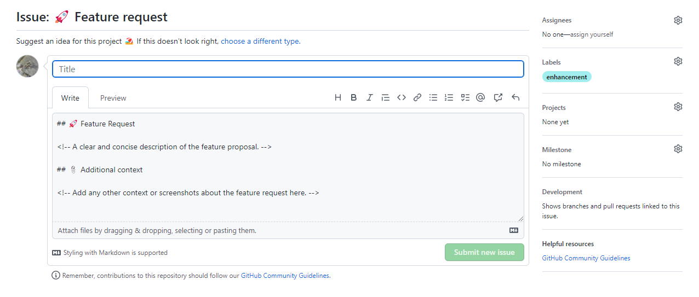
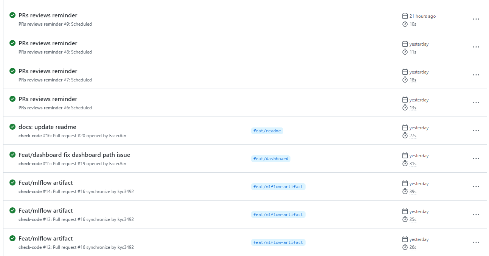
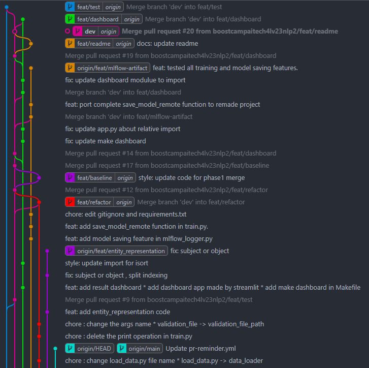
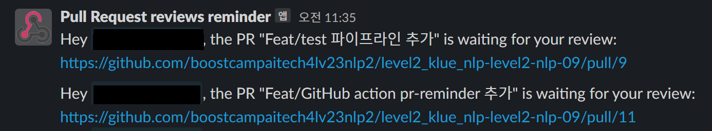

이번 시간에는 제가 부스트캠프 AITech 4기를 진행하며, 함께했던 **팀 지구코딩실**에서 어떻게 협업을 했었는지 작성했던 글을 공유드리고자 합니다. 

팀에 협업 문화를 어떻게 도입하면 좋을지 고민하시는 분들에게 도움이 되셨으면 좋겠습니다!

### 시작하며

이번 대회에서 지구코딩실의 주요 목표 중 하나는 **“우리 함 제대로 된 협업을 해보자”** 였습니다!

이를 위해 대회 전 일주일 간 **지구코딩실이 어떻게 협업을 하면 좋을지** 많은 이야기를 나눴습니다.

그 스토리를 소개해보고자 합니다 😊

### 좋은 협업이란 무엇일까?

어떻게 협업을 하면 좋을지 논하기 전에,

우선 **좋은 협업이란 무엇일까** 다시 생각해보는 시간을 가졌습니다.

살면서 협업을 안해본 사람은 없습니다. 우리는 학창 시절부터 대학생 때 이르기까지 수 많은 협업을 겪습니다.
하지만 **좋은 협업**에 대한 기억은 얼마 없습니다. 왜 그럴까요?

바로 **팀에서 진지하게 협업을 고민해보지 않았기 때문**이라고 생각합니다.

사람들마다의 가치관, 목표, 능력, 스타일은 모두 다릅니다. 

이런 다양한 사람들이 모인 하나의 팀이라는 집단에서 **완벽한 협업을 바라는 것은 어찌보면 모순**과 같습니다.

따라서 팀에서 협업에 대해 충분한 대화를 거치고, 고민을 해야한다고 생각합니다.

그래야만 다른 생각을 가졌더라도, 서로 배려하며 하나의 목표를 향해 달려갈 수 있다고 생각합니다.

이를 위해 지구코딩실에서는 **팀 문화 소개 세미나** 시간을 가지고 **각자 자신이 생각하는 팀 문화**, 그리고 **이미 기업들에서는 어떤 팀 문화를 가지고 있는지** 이야기를 나눠보는 시간을 가졌습니다.

그리고 세미나에서 나눈 이야기를 바탕으로 

**지구 코딩실은 3가지 Core Values를 정하고**, 이를 외부에도 소개할 수 있도록 웹페이지도 만들어보았습니다. ⬇️⬇️

[Earth Coding Lab](https://earthcodinglab.github.io/landing-page/)

**지구코딩실 Core Values** 

1. 혁신은 바보같은 질문부터
2. 기억보다는 기록을
3. Follwer보다는 Creator

### ECL Style 협업 시스템 고안

팀을 위한 Core Value를 바탕으로, 지구코딩실은 구체적으로 협업을 어떻게 할지 의논하였습니다.

저번 대회를 통해 아래와 같은 개선사항을 발견할 수 있었습니다.

- 각자 명확한 목표 및 Task가 팀원간 공유가 잘 안된다
- git을 사용하고는 있지만 코드 협업은 실상 이루어지고 있지 않다

위 문제들을 해결하고자 아래와 같은 저희 팀만의 협업 시스템을 완성하였습니다.

**노션 협업 가이드**

[Our Conventions](https://www.notion.so/Our-Conventions-bba7b7e0d7aa4b46ba766c9ca31a160f) 

**git 협업 가이드**

[ECL Git-Flow](https://www.notion.so/ECL-Git-Flow-e5fed1b7b7074b498363b97ab89d3c9a) 

### 룰을 지키게 하지 말고, 지킬 수 밖에 없게 하자

커밋 컨벤션, PR 컨벤션 등 협업을 위한 수 많은 규칙들이 있는데, 모든 규칙을 항상 숙지하며 지키는 것은 어렵습니다.

이를 해결하기 위해 **템플릿**이라는 기능을 적극적으로 활용하였습니다.

[python-template](https://github.com/EarthCodingLab/ECL-python-template)

아래와 같이 어떤 작업을 수행할 때 이에 필요한 규칙과 양식등을 자동으로 불러오는 것이죠.

그러면 개발자는 **매번 규칙을 외우고 다닐 필요 없이** 양식에 맞게 필요한 내용들을 작성하기만 하면 됩니다. 

또한 github-action을 적극적으로 활용하여 **파이썬 스타일 체크, 코드 테스팅도 자동으로 수행**하고 있습니다.

### 앞으로 어떻게 더 나아갈 수 있을까?

5명 팀원 모두 협업을 위해 노력해주신 덕분에, 프로젝트 시작 일주일이 지난 지금까지도 협업 시스템은 매우 원활하게 잘 돌아가고 있습니다.

또한 협업 시스템 개선 노력도 현재진행형으로 진행하고 있습니다.

**협업을 위해 시스템을 만들었는데, 오히려 시스템에 얽매여 협업에 방해를 받으면 안된다**

라는 나름의 교훈도 배울 수 있었습니다.

ECL-Style 협업 시스템을 적용한 첫 번째 대회이고, 이런저런 시행착오를 겪고 있습니다.

하지만 이런 과정에서 결국 중요한 것은 **팀에서 진지하게 협업을 고민해보자** 라는 것을 느낄 수 있었습니다. 아무리 글로벌 빅테크 기업의 협업 방식을 가지고 와도, 우리 팀에 맞지 않는다면 그것은 좋은 협업 문화라 할 수 없습니다. 따라서 우리 팀만의 좋은 협업 문화를 만들기 위해 충분한 노력과 대화가 필요함을 배웠습니다.

앞으로도 ECL Style 협업 시스템은 계속 발전할 예정이니, 많은 관심 부탁드립니다. 😊