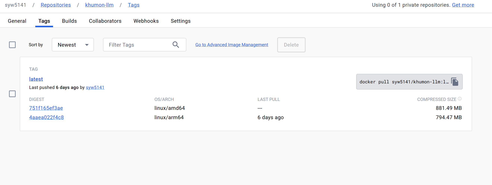

### 문제 상황
어느 날 **로컬 개발 환경(Intel CPU PC)** 에서 빌드한 **도커 이미지**를 **Raspberry pi 4** 에서 구동시키려고 했는데, 다음과 같은 에러가 발생하였습니다.
```
exec format error
```

### 무엇이 문제였을까요?
[다음 글](https://stackoverflow.com/questions/73285601/docker-exec-usr-bin-sh-exec-format-error)에 따르면 CPU 아키텍처의 차이에 의해 위 문제가 발생한다고 합니다.

실제로 저의 개발 환경은 **AMD64(x86_64) 기반** Intel I5 CPU를 사용하고 있었고, Raspberry pi 4는 **ARM 기반** CPU를 사용하고 있었습니다. 즉, 두 CPU 아키텍처 간 차이에 의해 도커 이미지가 정상적으로 구동되지 않은 것이죠. 참고로 최근 맥북에 장착되는 M1, M2 칩도 ARM 기반으로 제작이 되고 있습니다.  
보다 CPU 아키텍처에 대한 자세한 설명은 [블로그 글](https://velog.io/@480/%EC%9D%B4%EC%A0%9C%EB%8A%94-%EA%B0%9C%EB%B0%9C%EC%9E%90%EB%8F%84-CPU-%EC%95%84%ED%82%A4%ED%85%8D%EC%B2%98%EB%A5%BC-%EA%B5%AC%EB%B6%84%ED%95%B4%EC%95%BC-%ED%95%A9%EB%8B%88%EB%8B%A4)을 참고해주세요!

### 그럼 어떻게 해결할 수 있을까요?
과거에는 특수한 상황이 아니면 크게 ARM 아키텍처를 신경 쓸 필요가 없었습니다. 하지만 이제는 맥북, 라즈베리파이 등 ARM 기반 칩셋이 보편화되고 있습니다. 따라서 이들에 대응할 수 있어야 합니다.

2023년 기준 가장 추천하는 방법은 Docker의 **buildx**를 활용한 **multi-architecture build**를 하는 것입니다. 이 방법을 사용하면 amd64, arm64 등 각 플랫폼에 맞는 적절한 이미지를 한꺼번에 만들 수 있습니다.

또한 다양한 아키텍처의 이미지는 dockerhub 상에서 하나의 repository로 편하게 관리할 수 있습니다. 즉, 아키텍처 별로 별도의 repository를 생성할 필요가 없습니다.



docker buildx를 활용하여 multi-architure build하는 방법은 이미 많은 블로그들에 자세히 소개되어 있으니, 자세한 설명은 생략하겠습니다.
- https://meetup.nhncloud.com/posts/255
- https://www.docker.com/blog/how-to-rapidly-build-multi-architecture-images-with-buildx/
- https://80000coding.oopy.io/54dc871d-30c9-46cb-b609-2e8831541b5e


### 이번 일을 통해서
최근 가상화와 SW 기술이 발전함에 따라 개발자는 크게 시스템과 하드웨어, OS 단에 대한 신경을 쓰지 않아도 되는 줄 알았습니다. 하지만 이번 일을 통해서 SW 개발자도 어느정도는 자신이 개발 및 배포하고자 하는 환경의 하드웨어와 시스템에 대해 이해하고 있어야 함을 깨달았습니다. 다음부터는 CPU와 하드웨어, 칩셋에 대한 이야기에 조금 더 귀를 기울여 들어보고자 합니다! 감사합니다 :)