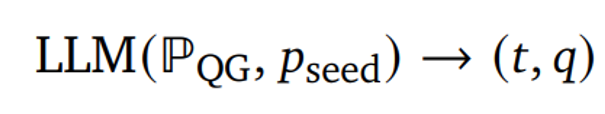

이번 시간에는 구글 딥마인드에서 발표한 Gecko 논문을 리뷰합니다.

Gecko는 LLMs로부터 지식 증류 (knowledge distillation)를 통해 학습한 text embedding 모델입니다. 작은 모델 사이즈로도 큰 모델과 비견되는 높은 성능을 내는 것이 특징입니다.

논문은 [링크](https://arxiv.org/abs/2403.20327)에서 확인할 수 있습니다.

## Abstract

- Gecko라는 compact하고 versatile한 text embedding 모델을 제안
- retriever에서 LLMs로부터의 지식 증류를 활용하여 강력한 retrieval 성능을 달성
- 증류 과정은 두 가지로 구성됨
    - LLM을 사용하여 다양한 paired data (query, task description) 생성
    - 각 쿼리에 대한 후보 passage를 retrieve하고 동일한 LLM을 활용하여 positive, negative passage를 다시 라벨링
- Massive Text Embedding Benchmark (MTEB) 벤치마크에서 아래와 같은 성과를 거둠
    - 256 embedding 차원의 모델이 768 embedding 크기의 모델보다 모든 항목에서 성능을 능가함
    - 768 embedding 차원의 Gecko는 평균 점수 66.31을 달성하여 7배 더 큰 모델과 5배 더 높은 차원의 임베딩과 비견됨  

## Training Recipe for Gecko

Gecko는 1.2B 사이즈의 pre-trained transformer 모델을 기반으로 pre-finetuning과 fine-tuning 두 가지 단계를 거칩니다.

### Pre-finetuning

우선 본격적으로 모델을 fine-tuning하기에 앞서, pre-finetuning을 진행합니다.

Pre-finetuning을 통해 작은 사이즈의 dual-encoder에서 다양한 다운스트림 태스크 (document retrieval, semantic similarity 등)의 성능을 높일 수 있습니다.

모델을 다양한 텍스트에 노출시켜, compact한 text embedding 모델을 훈련하는 데 필요한 다양성을 확보할 수 있습니다.

학습 절차는 다음과 같습니다.

우선 사전 학습된 언어 모델 (M)을 활용하여, 주어진 토큰 시퀀스 (n)과 임베딩 차원 (d)에 대한 contextualized token embedding (W)를 얻습니다.

그리고 앞서 구한 W을 n 축을 따라 평균을 취하여 {q_i, p_i} 쌍의 벡터 표현을 얻습니다.

여기서 각 query 앞에 데이터셋 특유의 작업 특성인 t를 추가하여, 각 쿼리가 최적화되는 작업을 알 수 있게 합니다. (ex. question answering, search result 등)

위 과정을 수식으로 표현하면 아래와 같습니다.

그리고 각 미니 배치 (B)에 대해 in-batch negative contrastive learning을 수행합니다. 

이때 similiarity function으로는 cosine similiarity를 사용합니다.

### FRet: Two-Step LLM Distillation
이제 fine-tuning을 위해 LLM을 활용하여 FRet: Few-shot Prompted Retrieval 데이터셋을 생성합니다.

전통적으로는 사람이 직접 작업한 labeled dataset을 많이 활용했습니다. 하지만 이러한 dataset을 만드는 과정은 시간과 비용이 많이 들고, bias나 다양성 부족을 초래할 수 있습니다.

따라서 본 연구팀은 LLM을 활용하여 text embedding model을 훈련하기 위한 데이터셋을 만드는 방법을 제안합니다.

데이터셋 생성은 LLM-Based Query generation과 LLM-Based Positive and Negative Mining 두 가지 단계로 이루어져 있습니다. 각 단계에 대해 한번 살펴보겠습니다!

**LLM-Based Query generation**

우선 학습에 필요한 query와 task를 만들어야 합니다.

이를 위해 web corpus C에서 무작위로 가져온 P_seed와 고정 프롬프트 P_QG를 이용하여 LLM을 통해 task description과 query 쌍을 생성합니다. 여기서 task description은 retrieval의 유형을 설명하는 것으로, 아래와 같은 예시가 있습니다.

- ‘Given a query, find a passage that has the answer to the query’ (question answering)
- ‘Given a query, find a passage that allows you to check whether the query is true or not’ (fact checking)

데이터셋을 생성할 때 다양성도 중요한 요소 중 하나입니다. FRet은 두 가지 소스를 통해 다양한 데이터셋을 구성할 수 있다고 합니다.

첫 번째로, 데이터셋 생성에 사용하는 웹 코퍼스에는 본질적으로 블로그, 뉴스, 위키백과와 같은 다양한 주제와 스타일이 포함되어 있다고 합니다.

두 번째로, 프롬프트에 다양한 작업 설명을 추가함으로써 LLM이 더 다양한 작업 설명과 쿼리를 생성하도록 권장했다고 합니다.

**LLM 기반 긍정 및 부정 샘플링**

학습을 진행할 때 쿼리와 관련된 positive 및 negative 샘플을 잘 구성하는 것도 중요한 요소입니다.

연구팀은 앞서 샘플링에서 사용했던 P_seed를 그대로 사용하지 않고, 임베딩 모델을 활용하여 생성된 쿼리 q에 대한 양질의 positive 및 negative passage를 찾는 방법을 제안합니다.

P_seed를 사용하지 않는 이유는 해당 passage가 쿼리에 대해 최적이라는 보장이 없고, 생성된 쿼리가 비교적 긴 passage의 특정 측면에 초점을 맞추는 경우가 많다는 관찰이 있었기 때문입니다.

임베딩 모델을 활용하여 생성된 쿼리와 관련된 상위 N개의 이웃 P를 검색하고, LLM을 활용하여 검색된 passage의 순위를 매깁니다. 이때 순위는 Query likelihood과 Relevance classification라는 두 지표의 RRF (Reciprocal Rank Fusion) 앙상블로 매깁니다.

Query likelihood는 LLM을 사용하여 passage p가 주어졌을 때 생성된 쿼리 q의 log-likelihood을 측정하는 방법입니다.

그리고 Relevance classification는 LLM을 사용하여 쿼리 q와 패시지 p가 주어졌을 때 특정 관련성 레이블의  log-likelihood을 측정합니다.

이제 앞서 매긴 rank를 활용하여 positive와 negative passage를 샘플링합니다.

positive passage는 아래 수식처럼 가장 높은 rank의 passage로 선정합니다.

이 과정에서 데이터셋의 약 15%의 경우 긍정적 구절이 ( p^+ )와 ( p_{seed} )가 다르다고 합니다. 이는 q에 대해 더 관련성 높은 구절이 존재할 수 있음을 시사한다고 합니다.

negative passage를 선택하는 방법에는 두 가지가 있습니다.

첫 번째는 가장 낮은 점수를 받은 negative passage를 선택하는 방법이고, 두 번째는 남은 이웃 중에서 샘플링하는 방법입니다.

위 과정을 통해 연구팀은 660만 개의 샘플이 포함된 FRet 데이터셋을 완성할 수 있었습니다.

최종적으로 모델은 다음 training objective로 fine-tuning이 수행됩니다. 여기서 문장의 의미 유사성을 측정하는 symmetric text embedding tasks를 위해 same-tower negatives 방법론도 추가하였다고 합니다. same-tower negative에 대한 자세한 내용은 [SamToNe 논문](https://arxiv.org/abs/2306.02516)을 참고해주세요!

### Experiments

 Massive Text Embedding Benchmark (MTEB)로 모델을 평가하였으며, 실험 결과는 아래와 같습니다.

 

 

 

 ### Conclusion

Gecko는 LLM이 생성한 데이터셋인 FRet을 바탕으로 높은 성능을 보였으며, LLM을 활용하여 positive, negative passage target을 효과적으로 식별할 수 있음을 입증하였습니다. 그리고 LLM 기반의 relabeling과 데이터셋의 다양성의 중요성 또한 보여주는 연구였습니다.

감사합니다. 😊