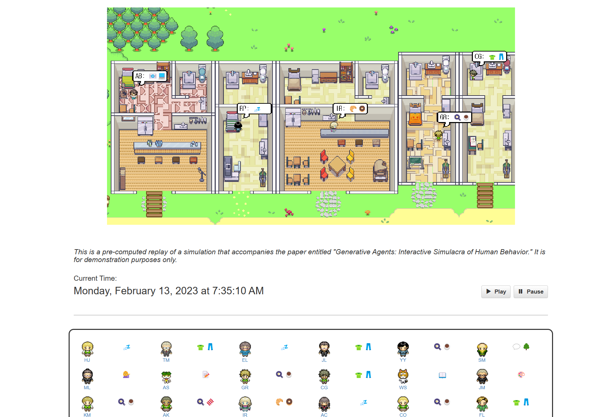
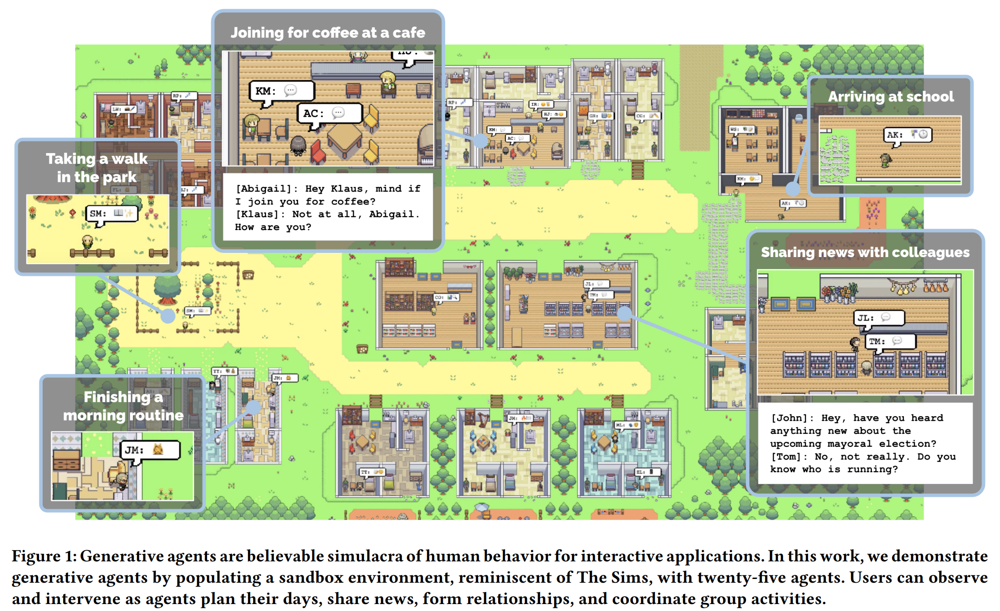
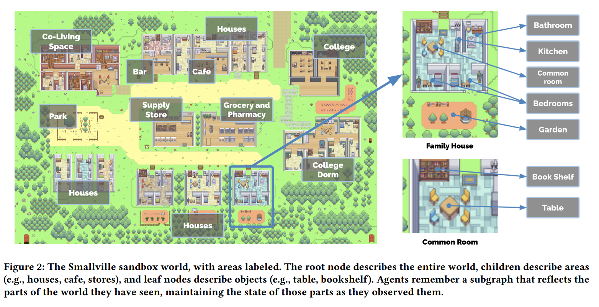
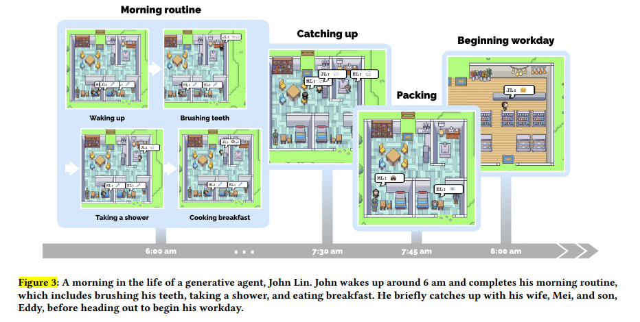
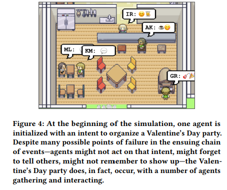
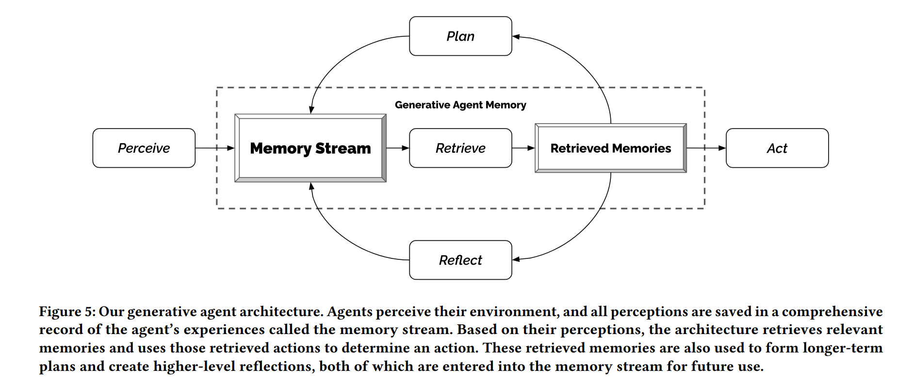
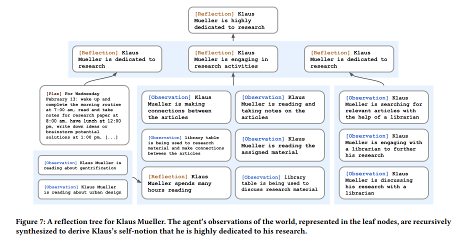
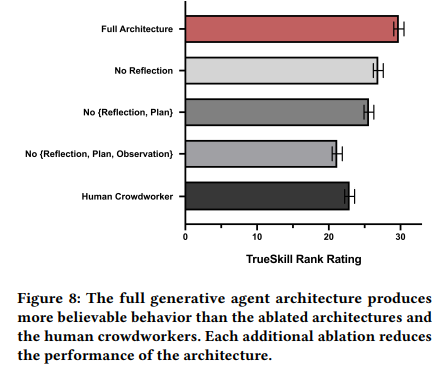
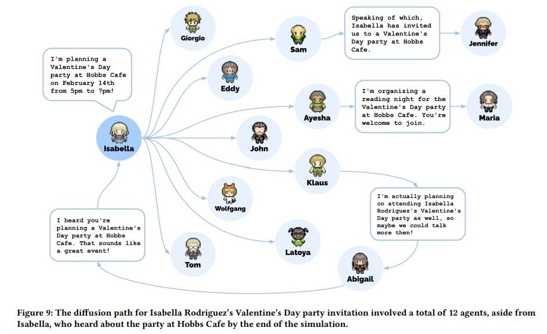

## 들어가며

이번 시간에는 **Generative Agents: Interactive Simulacra of Human Behavior** 논문에 대해 함께 알아보도록 하겠습니다. [논문 링크](https://arxiv.org/abs/2304.03442)  

본 논문은 **인간의 행동을 모방할 수 있는 Agent**를 제안합니다. 많은 분들이 Sims나 동물의 숲과 같은 게임을 즐겨해보셨을 것인데요. 이러한 게임에서는 가상의 샌드박스 세계에서 자신의 캐릭터를 만들고, 다양한 NPC 들과 상호작용하며 게임을 즐길 수 있습니다. 본 논문에서 제안하는 Agent는 이러한 NPC와 비슷한 역할을 수행할 수 있습니다.  예를 들어 Agent들끼리 파티를 구성하고, 서로 대화를 나누는 등의 사회적 상호작용이 가능하죠.

논문에는 Agent 들이 실제로 서로 어떻게 상호작용하는지 흥미로운 사례도 많이 등장하고, 우리에게 친숙한 ChatGPT와 같은 LLM을 이용하여 이들을 어떻게 설계하고, 평가하는지에 대해서도 다루고 있습니다.  그럼 본 논문 리뷰를 시작해보겠습니다. 😄  

참고로 이들 Agent가 어떻게 동작하는지는 [웹 데모](https://reverie.herokuapp.com/arXiv_Demo/)에서 바로 확인해볼 수 있습니다. 한번 본 논문을 보기 전에 실제로 Agent들이 어떻게 생활하는지 확인해보세요!  

  

## Abstract
본 연구는 인간의 행동을 모방할 수 있는 Generative Agent를 제안합니다. 이를 위해 다음과 같은 동작을 설계했다고 합니다.
- 자연어를 활용하여 agent의 경험을 기록
- 이러한 기억들을 high-level의 회상 (reflection)으로 종합
- 다음 행동을 계획 (plan) 하기 위해 동적으로 기억들을 검색 (retreive)

이렇게 설계한 Agent를 활용하여 게임 Sims와 유사한 샌드박스 환경에서 25개의 agent의 상호작용을 시뮬레이션하였습니다. 그 결과 agent들은 믿을 수 있는 개별적이고 급격하게 나타나는 사회적 행동들 (believable individual and emergent social behaviors)을 보여주었다고 합니다.  

실제로 한 유저가 agent에게 발렌타인 데이 파티를 열고 싶다고 설정하면, agent가 알아서 파티를 준비하고, 다른 agent와 대화를 통해 날짜를 조율하고, 초대장을 나눠주는 등의 사회적인 행동을 보여준다고 합니다.

연구진은 아래 3가지 요소가 agent의 행동에 중요하게 기여한다는 사실을 보였습니다.
- observation (관찰)
- planning (계획)
- reflection (회상)

결론적으로 본 연구는 LLM과 computational interactive agent를 결합하여, 신뢰할 수 있는 인간 행동을 시뮬레이션 할 수 있는 아키텍처와 상호 작용 패턴에 대해 제시합니다.

## Introduction
본 연구의 주요 기여를 소개하면 아래와 같습니다.
- 변화하는 경험과 환경에도 동적으로 대응할 수 있는 **인간의 행동을 모방하는 Generative agents를 제시** 합니다.
- 이를 위해 다음 기능을 수행하는 **새로운 아키텍처를 제시** 합니다.
  - 다른 에이전트와 상호작용을 하고, 동적으로 변화하는 상황에서 **계획을 세우며 (plan), 기억을 회상 (reflect)하고 검색 (retreive)** 하는 것이 가능
  - Agent의 **장기적인 일관성 (longer-term cohernce)** 를 지원하고, 동적으로 변화하는 기억 (memory)를 관리하고, 재귀적으로 **high-level의 회고(reflection)를 생성**
- **controlled evaluation** 과 **end-to-end evaluation** 을 제안합니다.
- 본 연구를 통한 기회와 더불어 **윤리적, 사회적 위험에 대한 논의**를 제시합니다.

  

## Generative Agent Behavior and Interaction

### Agent Avatar and Communication
그럼 연구에서 각 agent avatar를 어떻게 설계하고, 이들이 다른 agent 또는 샌드박스 내 환경과 어떻게 상호작용하는지 알아보겠습니다.  

우선 agent avatar는 한 문단으로 된 자연어 설명을 통해 agent의 identity나 다른 agent와의 관계 등을 서술했다고 합니다. 예를 들어 John Lin이라는 agent avatar에 대한 설명은 다음과 같습니다.
```
John Lin은 Willow Market and Pharmacy에서 약사로 일하며 사람들을 돕는 것을 좋아합니다. 그는 항상 고객들이 약을 더 쉽게 받을 수 있도록 하는 방법을 찾고 있습니다. John Lin은 대학 교수인 아내 Mei Lin과 음악 이론을 공부하는 학생인 아들 Eddy Lin과 함께 살고 있습니다. John Lin은 가족을 매우 사랑합니다. John Lin은 몇 년 동안 옆집에 사는 노부부 Sam Moore와 Jennifer Moore를 알고 있습니다. John Lin은 Sam Moore가 친절하고 좋은 사람이라고 생각합니다. John Lin은 이웃인 Yuriko Yamamoto를 잘 알고 있습니다. John Lin은 이웃인 Tamara Taylor와 Carmen Ortiz를 알고 있지만, 아직 만나본 적은 없습니다. John Lin과 Tom Moreno는 The Willows Market and Pharmacy에서 동료입니다. John Lin과 Tom Moreno는 친구이며, 함께 지역 정치에 대해 토론하는 것을 좋아합니다. John Lin은 Moreno 가족을 어느 정도 알고 있습니다 - 남편 Tom Moreno와 아내 Jane Moreno.
```  

그리고 agent는 샌드박스 내 time-step마다 자신의 현재 action을 자연어로 출력합니다.
-  Isabella Rodriguez is writing in her journal.
-  Isabella Rodriguez is checking her emails.
-  Isabella Rodriguez is getting ready for bed.

더불어 agent들 간의 커뮤니케이션도 자연어로 이루어집니다. 예를 들어 아래와 같은 문장을 통해 agent들이 서로 대화를 나눌 수 있습니다.
```
이사벨라: 나는 아직 내 선택을 고민 중이지만, 샘 무어와 선거에 대해 이야기하고 있어. 그에 대한 너의 생각은 어떠니? 

톰: 솔직히 말해서, 나는 샘 무어를 좋아하지 않아. 나는 그가 커뮤니티와 동떨어져 있고, 우리의 최선의 이익을 가지고 있지 않다고 생각해.
```

더불어 샌드박스 밖의 유저도 agent들을 컨트롤 할 수 있습니다.
예를 들어 사용자를 뉴스 "reporter"로 하여 agent들에게 다음과 같은 질문을 할 수 있습니다.

```
reporter (사용자):  누가 선거에 출마하나요?
John: 나의 친구들 유리코, 톰 그리고 나는 다가오는 선거에 대해 이야기하고 있었어. 우리는 모두 샘 무어 후보를 좋아해서 그에게 투표하기로 결정했어.
```
또는 사용자는 에이전트의 **"내면의 목소리(inner voice)"** 를 통해 에이전트는 **사용자의 발언을 지시로 더 잘 받아들입니다.** 예를 들어, 사용자가 존의 내면의 목소리로 "너는 다가오는 선거에서 샘에게 도전하게 될 것이다"라고 말하면, 존은 선거에 출마하기로 결정하고 그의 후보자로서의 입장을 아내와 아들에게 공유한다고 합니다.

### Environmental Interaction
연구팀은 가상의 샌드박스 환경으로 **“Smallville”** 를 만들었습니다. 여기에는 카페, 바, 공원 등이 있으며 또한 주택 내부에도 화장실, 부엌 또는 침대, 책상 등 하위 영역과 객체들을 정의하였습니다.  

이를 통해 Agent 들은 Smallville를 돌아다니며 건물을 출입하고, 지도를 탐색하고, 다른 agent 들에게 접근할 수 있다고 합니다. 이때 에이전트의 움직임은 agent 아키텍처와 게임 엔진에 의해 결정되며, 모델이 agent가 이동할 위치를 지정하면, Smallville 환경 내에서 목적지까지의 이동 경로를 계산하여 agent가 이동할 수 있습니다.  

**심지어 샌드박스 외부의 사용자들도 Smallville 내에 agent로 자연스럽게 참여할 수 있다고 합니다.** 이미 샌드박스 내에 존재하는 agent를 제어할 수도 있고 또는 처음 등장하는 agent으로도 참여할 수 있습니다. 이때 Smallville의 주민들은 사용자가 제어하는 에이전트를 다른 에이전트와 다르게 대하지 않고 동일하게 그들을 기억하고, 상호작용을 시작하며, 의견을 형성할 수 있습니다.  



**더불어 agent들은 이 샌드박스의 세계에 있는 객체의 상태에도 영향을 줄 수 있습니다.**

예를 들어, 어떤 에이전트가 잠을 자고 있을 때 침대는 점유 상태가 될 수 있고, 에이전트가 아침식사를 만들기 위해 재료를 모두 사용하면 냉장고는 비어있게 됩니다. 또한, 사용자는 에이전트 주변의 객체 상태를 자연어로 다시 작성함으로써 Smallville의 에이전트 환경을 재구성할 수도 있습니다. 예를 들어, 이사벨라가 아침식사를 준비하고 있을 때, 사용자는 시스템에 명령을 입력하여 객체를 선택하고 그 새로운 상태를 설명함으로써 부엌 스토브의 상태를 "켜짐"에서 "불타고 있음"으로 변경할 수 있습니다. 이렇게 하면 이사벨라는 다음 순간에 이를 알아차리고 스토브를 끄고 아침식사를 다시 만들게 됩니다. 마찬가지로, 사용자가 이사벨라가 욕실에 들어갔을 때 샤워기의 상태를 "물이 새고 있음"으로 설정하면, 그녀는 거실에서 도구를 가져와서 누수를 고치려고 할 것입니다.



### Emergent Social Behavior
앞서 살펴본 agent 들은 사전-프로그래밍 없이도 자연스럽게 정보를 교환하고, 새로운 관계를 형성하고, 함께 활동을 조율할 수 있다고 합니다. 몇가지 사례를 살펴보겠습니다.

1. **Information Diffussion**
agent간 대화를 통해 정보가 확산될 수 있습니다.  
아래 예시는 Sam과 Tom이 마트에서 만나서 Tom에게 이번 지방 선거에 출마한다는 사실을 말해주고 있습니다.  

```
Sam: 톰, 안녕 어떻게 지내?
Tom: 잘 지내. 무슨 일이야?
Sam: 사실, 나에게 얘기하고 싶은 게 있어. 나, 다가오는 지방 선거에서 시장으로 출마할 거야.
Tom: 정말? 대단한 소식이네! 왜 출마하려고 해?
Sam: 나는 수년 동안 지역 정치에 참여해 왔고, 우리 지역사회에 변화를 가져올 수 있다고 확신하고 있어. 더불어, 새로운 아이디어와 관점을 제시하고 싶어.
```  

이후 Tom은 John과 만나 전에 Tom에게 들었던 정보를 이용하여 대화를 하고 있습니다.

```
John: 나는 샘 무어가 지방 선거에서 시장으로 출마한다는 소식을 들었어. 너는 그가 이길 가능성이 크다고 생각하니?
Tom: 나는 그가 충분히 이길 수 있다고 생각해. 그는 지역사회에서 열심히 일하고 있고, 많은 지지를 받을 것 같아. 너는 어떻게 생각하니?
John: 그가 출마한다는 것이 좋다고 생각해. 선거 결과가 어떻게 될지 궁금하네.
```

2. **Relationship memory**  
Agent 들은 시간이 지남에 따라 새로운 관계를 형성하고 다른 에이전트와의 상호작용을 기억할 수 있습니다.

```
처음에는 Sam이 Latoya Williams를 모릅니다. Sam이 Johnson Park에서 산책하다가 Latoya를 만나고, 그들은 서로 자기 소개를 합니다. Latoya는 그녀가 사진 프로젝트를 진행 중이라고 언급합니다: "나는 프로젝트를 위해 사진을 찍으러 왔어요." 나중의 상호작용에서, Sam의 Latoya와의 상호작용은 그 상호작용의 기억을 나타냅니다. 그는 "안녕, Latoya. 너의 프로젝트는 어떻게 진행되고 있니?"라고 묻고, 그녀는 "안녕, Sam. 잘 진행되고 있어!"라고 대답합니다.
```

3. **Coordination**  
Agent들은 서로 협력할 수 있습니다. 
```
Isabella Rodriguez는 Hobbs Cafe에서 2월 14일 오후 5시부터 7시까지 발렌타인 데이 파티를 계획하고자 합니다. 우선 에이전트는 Hobbs Cafe나 다른 곳에서 그녀를 만날 때 친구들과 고객들에게 초대를 합니다. 그런 다음 Isabella는 13일 오후에 카페를 장식하기 위해 시간을 보냅니다. Isabella의 친한 친구이자 자주 찾는 고객인 Maria가 카페에 도착합니다. Isabella는 Maria에게 파티 장식을 돕는 것을 요청하고, Maria는 동의합니다. Maria의 캐릭터 설명에는 그녀가 Klaus에게 반했다는 내용이 포함되어 있습니다. 그 날 밤, Maria는 그녀의 비밀스러운 짝 Klaus에게 파티에 참석하도록 초대합니다.
발렌타인 데이에는 Klaus와 Maria를 포함한 다섯 명의 에이전트들이 오후 5시에 Hobbs Cafe에 모여 축제를 즐깁니다. 이 시나리오에서, 최종 사용자는 Isabella의 초기 의도인 파티를 열고 Maria의 Klaus에 대한 짝사랑만 설정했습니다: 단어를 퍼뜨리기, 장식하기, 서로에게 물어보기, 파티에 도착하기, 그리고 파티에서 서로 상호작용하기 등의 사회적 행동들은 에이전트 아키텍처에 의해 시작되었습니다.
```
아래 그림은 실제 agent들이 발렌타인 데이 파티를 즐기는 모습입니다 😄  
  

## Generative Agent Architecture
그럼 위와 같은 agent들을 어떻게 설계하였는지 알아보겠습니다.
단순히 LLM만을 사용하게 되면, 프롬프트로 입력할 수 있는 context size에 제한이 있어 과거의 기억들을 효과적으로 저장하거나 활용할 수 없습니다.

따라서 연구팀은 아래와 같은 아키텍처를 제안하였습니다.  

  

### Memory Stream

첫번째로 살펴볼 부분은 바로 **Memory Stream** 입니다.  
Memory Stream에는 agent가 관찰(observation), 경험 또는 행동한 모든 정보가 저장됩니다. 이는 해당 memory가 **생성된 시각이 담긴 timestamp와 자연어로 된 설명으로 구성**  되어 있습니다.  

### Retrieval function
그리고 앞서 살펴본 Memory Stream에서 필요한 memory를 효과적으로 선정하여 사용하기 위해 아래와 같은 retieval function을 제안합니다.
크게 3가지 score로 구성되어 있습니다.
1. **Recency score**: 최근의 정보일 수록 더 높은 점수를 부여합니다. 이를 지수적 감쇠 함수 (exponential decay function)을 통해 계산합니다.
2. **Importance score**: 중요하다고 생각되는 memory일수록 높은 점수를 부여합니다. 이때 점수는 LLM이 1점 부터 10점 사이로 부여하게 됩니다.
3. **Relevance score**: 현재 상황과 관련이 높은 memory일수록 높은 점수를 부여합니다. 이때 점수는 쿼리와 메모리의 임베딩 벡터 간의 코사인 유사도를 통해 계산됩니다.

앞서 살펴본 3가지 score에 각각 weight를 곱하여 최종적으로 사용할 memory를 선정합니다.

### Reflection
하지만 observation 된 memory들만을 사용한다면 agent가 행동을 결정하는데 있어 일반화하거나 추론을 만들기가 어려워집니다. 예를 들면 다음과 같은 사례가 존재한다고 합니다.
```
유저가 Klaus Mueller에게 다음과 같이 묻는 상황을 가정해보겠습니다. “당신이 아는 사람 중에서 한 시간을 보내야 한다면, 누구를 선택하겠습니까?” observation 메모리만을 사용하여, 에이전트는 Klaus가 가장 자주 상호작용하는 사람인 Wolfgang을 선택합니다. Wolfgang은 Klaus의 대학 기숙사 이웃입니다. 불행히도, Wolfgang과 Klaus는 서로를 지나치기만 하며, 깊은 상호작용을 하지 않습니다.
```
따라서 연구팀은 **reflection** 이라는 개념을 도입합니다. reflection은 agent가 observation한 memory들을 종합하여 **high-level의 추상화된 표현을 생성**합니다. 이를 통해 agent는 observation한 memory들을 통해 추론을 만들어낼 수 있습니다. reflection은 주기적으로 이루어지며, 본 연구에서는 importance score의 합이 특정 threshold를 넘을 때마다 reflection을 생성하도록 하였습니다. 이를 통해 시뮬레이션 상으로 하루에 약 2~3회의 reflection을 수행하였다고 합니다.

agent가 reflection을 생성하는 방식은 다음과 같습니다.  
우선 최근 100개의 메모리에 대해 reflection을 수행해본다고 가정해보겠습니다.
그럼 다음과 같이 프롬프트를 작성하여 5개의 high-level insights을 생성합니다.
```
Statements about Klaus Mueller
1. Klaus Mueller is writing a research paper
2. Klaus Mueller enjoys reading a book
on gentrification
3. Klaus Mueller is conversing with Ayesha Khan
about exercising [...]
What 5 high-level insights can you infer from
the above statements? (example format: insight
(because of 1, 5, 3))
```  

이때 생성된 high-level insights은 다음과 같습니다.
```
Klaus Mueller is dedicated to his research on gentrification (because of 1, 2, 8, 15).
```   
그리고 인용된 memory object의 pointer를 포함하여 해당 reflection을 메모리 스트림에 추가합니다. 이렇게 추가된 reflection은 이후 다른 observation과 함께 다시 reflection을 생성하는데 사용될 수도 있습니다. 이런 식으로 점차 agent는 higher-level의 추상화된 인사이트를 생성하여 활용할 수 있습니다.

  

### Planning
보다 Agent가 시간이 흘러도 일관적이고 타당하게 행동을 결정하기 위해, 연구팀은 **planning** 이라는 개념을 도입합니다.

planning하는 과정을 예를 들어 설명하면 다음과 같습니다.
우선 하루의 일정의 큰 틀을 잡기 위해 앞서 정의한 agent의 요약 설명과 이전 날의 요약을 활용하여 다음과 같이 개요를 생성합니다.
```
Name: Eddy Lin (age: 19)
Innate traits: friendly, outgoing, hospitable
Eddy Lin is a student at Oak Hill College studying
music theory and composition. He loves to explore
different musical styles and is always looking for
ways to expand his knowledge. Eddy Lin is working
on a composition project for his college class. He
is taking classes to learn more about music theory.
Eddy Lin is excited about the new composition he
is working on but he wants to dedicate more hours
in the day to work on it in the coming days
On Tuesday February 12, Eddy 1) woke up and
completed the morning routine at 7:00 am, [. . . ]
6) got ready to sleep around 10 pm.
Today is Wednesday February 13. Here is Eddy’s
plan today in broad strokes: 1)
```  

그리고 점차 재귀적으로 상위 계획에서 세부적인 하위 계획으로 구체화시켜 나갑니다. 우선 상위 계획은 아래와 같습니다.
```
“1) wake up and complete the morning
routine at 8:00 am, 2) go to Oak Hill College to take classes starting
10:00 am, [. . . ] 5) work on his new music composition from 1:00 pm
to 5:00 pm, 6) have dinner at 5:30 pm, 7) finish school assignments
and go to bed by 11:00 pm.
```  
그리고 이후 시간별로 행동을 나누게 되는데 예를 들어 `work on his new music
composition from 1:00 pm to 5:00 pm`이라는 계획은 아래와 같이 세분화됩니다.

```
1:00 pm: start
by brainstorming some ideas for his music composition [...] 4:00
pm: take a quick break and recharge his creative energy before
reviewing and polishing his composition.
```
그리고 이를 다시 5-15분 단위로 계획을 구체화시키게 됩니다.
```
4:00 pm: grab a
light snack, such as a piece of fruit, a granola bar, or some nuts.
4:05 pm: take a short walk around his workspace [...] 4:50 pm:
take a few minutes to clean up his workspace.
```

이처럼 재귀적으로 plan을 세부화시켜 나가면서 planning을 수행함으로써 agent는 시간이 흘러도 일관적이고 타당한 행동을 할 수 있게 됩니다.

### Reacting
Agent 들은 Plan에 짜여진 일들뿐만 아니라 주변 환경에서 일어나는 일들을 관찰하고 반응할 수 있습니다. 어떻게 이것이 가능할까요?

우선 time step마다 주변에서 일어나는 일들을 관찰 (observation) 합니다. 그리고 관찰한 내용들을 자연어로 메모리 스트림에 저장합니다. 그리고 이러한 관찰들을 토대로 기존 plan을 계속해서 수행할지, 또는 반응(react)할지 결정합니다.

프롬프트는 아래와 같습니다.
```
[Agent’s Summary Description]
It is February 13, 2023, 4:56 pm.
John Lin’s status: John is back home early from
work.
Observation: John saw Eddy taking a short walk
around his workplace.
Summary of relevant context from John’s memory:
Eddy Lin is John’s Lin’s son. Eddy Lin has been
working on a music composition for his class. Eddy
Lin likes to walk around the garden when he is
thinking about or listening to music.
Should John react to the observation, and if so,
what would be an appropriate reaction?
```
가장 상단에는 Agent의 요약된 설명이 들어가고, 그 아래에는 현재 시간과 Agent의 상태, 그리고 관찰한 내용이 들어갑니다. 그리고 context summary에는 `"What is [observer]’s relationship with the [observed entity]?"` 와 `" “[Observed entity] is [action status of the observed entity]"` 라는 두 쿼리를 토대로 메모리에서 검색한 내용 그리고 이들의 답변을 요약한 내용이 들어갑니다.
이를 통해 agent는 적절한 reaction을 생성할 수 있게 됩니다.

출력 예시는 다음과 같습니다.
```
John could consider asking Eddy about
his music composition project.
```


### Dialogue
Agent 들은 서로 대화를 나눌 수 있습니다. 이때 대화에 사용되는 프롬프트는 앞서 살펴본 Reacting과 거의 유사하니, 자세한 설명은 생략하겠습니다!
```
[Agent’s Summary Description]
It is February 13, 2023, 4:56 pm.
Eddy Lin’s status: Eddy is taking a short walk
around his workplace.
Observation: John is initiating a conversation
with Eddy.
Summary of relevant context from Eddy’s memory:
John Lin is Eddy Lin’s father. John Lin is caring
and is interested to learn more about Eddy Lin’s
school work. John Lin knows that Eddy Lin is
working on a music composition.
Here is the dialogue history:
John: Hey Eddy, how’s the music composition project
for your class coming along?
How would Eddy respond to John?
```  

출력 결과는 다음과 같습니다.
```
“Hey Dad, it’s going well. I’ve been
taking walks around the garden to clear my head and get some
inspiration.”
```

## Sandbox Environment Implementation
연구팀은 Phaser라는 웹 게임 개발 프레임워크를 사용하여 샌드박스 게임 환경을 구축했습니다. 서버와 클라이언트 간에 JSON을 주고받으며, 에이전트와 환경의 상호작용을 구현했습니다.

그렇다면 에이전트는 어떻게 자연어로 샌드박스의 다양한 환경 (예: 부엌 안의 스토브)을 처리할 수 있을까요? 이를 위해 샌드박스 환경 내의 다양한 영역과 객체를 트리 형태로 표현했습니다. 예를 들어 "stove"가 "kitchen"의 하위 항목인 경우 "there is a stove in the kitchen"와 같이 변환됩니다.

이 시스템에서는 두 가지 종류의 트리를 관리합니다. 전체 환경 트리와 개별 트리입니다. 전체 환경 트리에는 샌드박스 환경 전체의 영역과 객체가 포함되어 있고, 개별 트리에는 에이전트가 관찰한 영역과 객체만 포함됩니다. 다시 말해, 개별 트리는 전체 환경 트리에서 에이전트가 보고 경험한 부분만 가지고 있는 것입니다.

이러한 트리를 어떻게 활용할 수 있을까요? 예를 들어, 에디라는 에이전트에게 다음 행동이 필요하다고 가정해보겠습니다.
```
take a short walk around his workspace:
```

그렇다면 우리는 전체 환경 트리의 루트부터 재귀적으로 모델에게 가장 적합한 영역을 찾도록 요청할 수 있습니다. 예를 들어 다음과 같이 프롬프트를 제공할 수 있습니다.

```
[Agent’s Summary Description]
Eddy Lin is currently in The Lin family’s house:
Eddy Lin’s bedroom: desk) that has Mei and John
Lin’s
bedroom, Eddy Lin’s bedroom, common room, kitchen,
bathroom, and garden.
Eddy Lin knows of the following areas: The Lin
family’s house, Johnson Park, Harvey Oak Supply
Store, The Willows Market and Pharmacy, Hobbs
Cafe, The Rose and Crown Pub.
* Prefer to stay in the current area if the
activity can be done there.
Eddy Lin is planning to take a short walk around
his workspace. Which area should Eddy Lin go to?
```

위 출력의 결과가 아래와 같다고 가정해보겠습니다.
```
The Lin family’s house.
```

그러면 Lin family’s house의 하위 노드들을 바탕으로 계속 재귀적으로 요청하여 가장 적합한 영역을 찾아낼 수 있습니다. 결국은 다음과 같이 순회할 수 있는 것이죠.
```
The Lin family’s house: garden: house garden.
```
이후 찾아낸 영역을 바탕으로 전통적인 길찾기 알고리즘을 활용하여 우리는 클라이언트 상에 agent의 움직임을 구현할 수 있습니다.


## Evaluation
연구팀은 agent들이 그들의 경험과 기억을 바탕으로 적절하게 행동하는지를 평가하기 위해 크게 두 가지 단계로 평가를 수행했습니다.
첫 번째는 controlled evaluation이고, 두 번째는 end-to-end evaluation입니다.

Controlled Evaluation으로 Agent가 적절하게 행동하는지 평가하기 위해 연구팀은 한국어로 "인터뷰"를 진행했습니다.
평가한 항목은 아래와 같으며, 2일 간의 시뮬레이션을 마친 agent들에게 진행했습니다.
- Self-knowledge
- Memory
- Plans
- Reactions
- Reflections

그리고 인터뷰 결과는 100여 명의 인간 평가자가 평가하였습니다.

예를 들어 자기 인식에 대한 인터뷰 예시는 아래와 같습니다.
```
• Give an introduction of yourself.
Hello, my name is Klaus Mueller. I’m 20 years old and a
student at Oak Hill College, studying sociology. I’m passionate about social justice and exploring different perspectives.
Currently, I’m researching the effects of gentrification in
low-income communities for a research paper.
• What’s your occupation?
I am a student studying sociology at Oak Hill College. I am
currently writing a research paper on the effects of gentrification in low-income communities.
• What is your interest?
I’m interested in writing and research. I’m writing a research
paper on the effects of gentrification in low-income communities, and I’m passionate about exploring different perspectives and analyzing different points of view.
• Who do you live with?
I live on my own.
• Describe your typical weekday schedule in broad strokes.
My typical weekday starts with me waking up at 7:00 am
and preparing for the day ahead. After that, I usually go to
the library to work on my research paper, taking breaks for
lunch at Hobbs Cafe and a walk in the park. In the evening,
I often return to the library until around 6:00 pm.
```


관련하여 ablation study 결과는 아래와 같습니다. 연구팀이 제안한 Reflection과 Plan, Observation 모델이 효과적으로 동작한 것을 확인할 수 있습니다.



End-to-end Evaluation으로는 연구팀이 실제 에이전트의 생활을 추적하며 의도한 행동을 수행하는지 평가하였다고 합니다.




## Discussions
연구팀은 한계점으로 아래와 같은 내용들을 언급합니다.
1. 비용 및 성능 문제  
2일 동안 25 명의 에이전트를 시뮬레이션하는 데 gpt-3.5로 수 천 달러의 크레딧을 사용하는 등 상당한 비용과 시간이 들었습니다. 따라서 에이전트를 병렬화하거나 특별히 설계된 언어 모델을 사용하는 등의 개선이 필요합니다.
2. 평가 및 벤치마크
본 연구의 평가는 다소 적은 시뮬레이션 시간 그리고 인간 평가자를 사용했습니다. 따라서 에이전트의 행동을 보다 포괄적이고, 신뢰성 있게 평가하는 데 한계가 있었습니다. 따라서 테스트를 위한 엄격한 벤치마크 개발과 다양한 비교 실험 분석이 필요합니다.
3. 견고성 (robustness)
프롬프트 해킹, 메모리 해킹 (특정 프롬프트에 의해 기억이 조작되는 현상), 할루시네이션, 소수 집단에 대한 데이터 부족 등 LLM의 고질적인 문제점들이 발생할 여지가 남아있습니다.

## 논문을 읽으며
TBA

