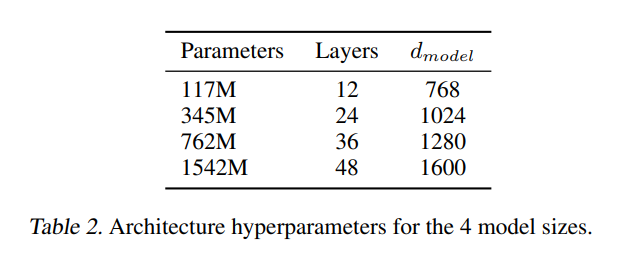
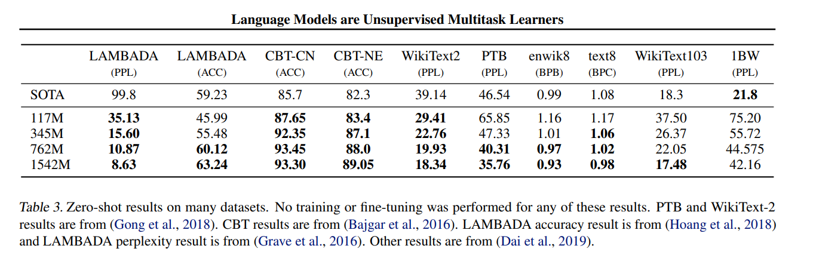
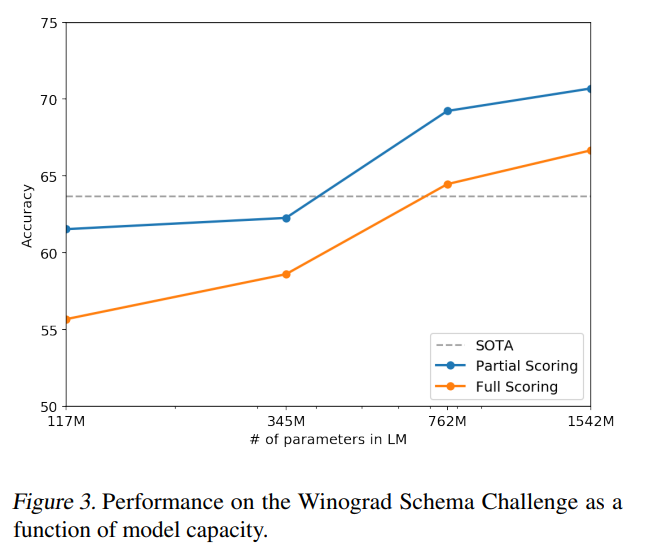
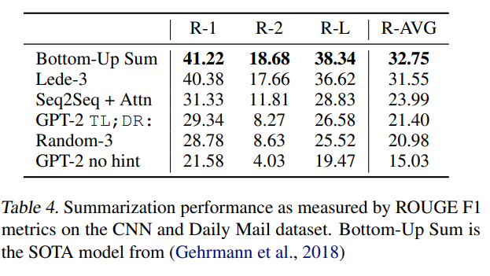
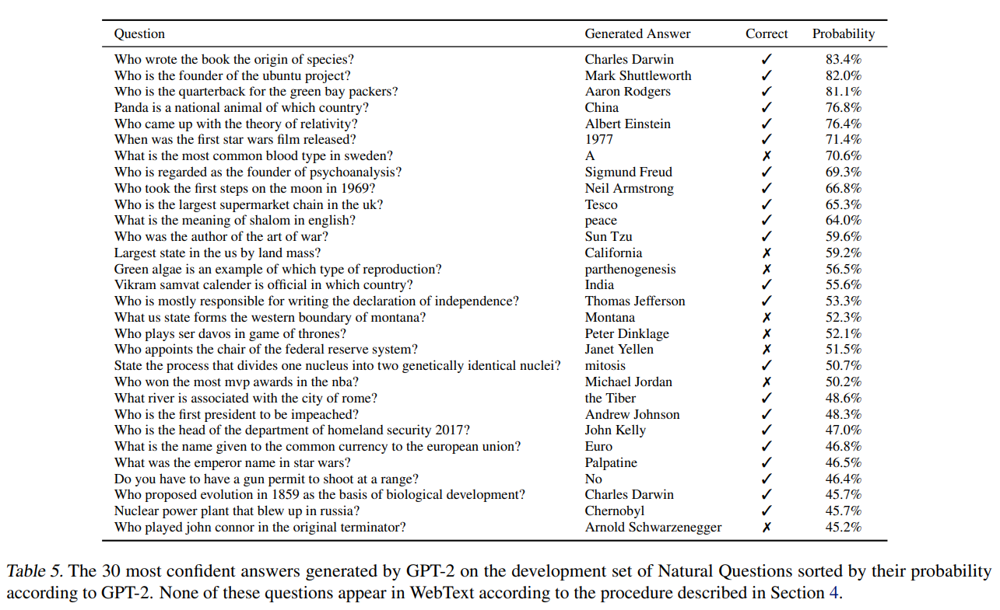
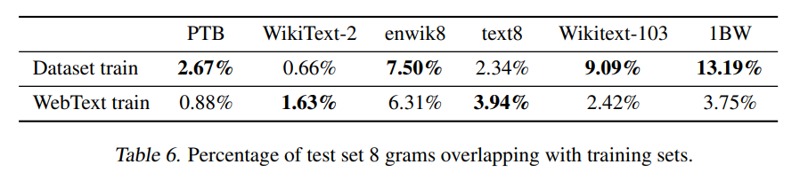
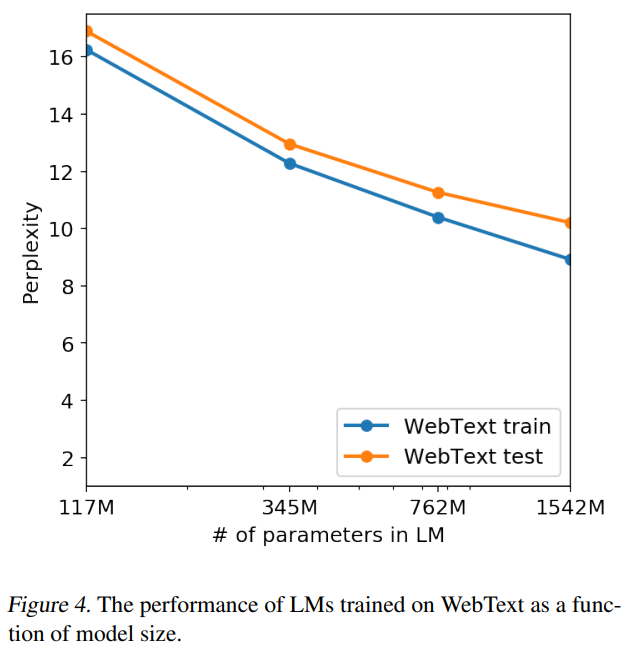

이번 시간에는 [GPT-2 논문](https://d4mucfpksywv.cloudfront.net/better-language-models/language_models_are_unsupervised_multitask_learners.pdf)을 리뷰합니다. GPT-2는 GPT-1의 후속 모델로,**이전 모델과 전체적인 구조는 비슷하나, 보다 더 크고 많은 학습 데이터와 파라미터로 성능을 높였습니다.** GPT-1과 어떤 차이점이 있는지 위주로 논문을 살펴보도록 하겠습니다. 지금부터 GPT-2 논문 리뷰를 시작하겠습니다!

## Abstract

- 연구팀은 **명시적인 지도 학습 없이도(제로샷 학습)** QA, 기계 번역 등을 수행할 수 있는 언어 모델을 제시함.
- 해당 언어 모델을 학습시킬 때 **WebText**라 불리는 수 백만개의 웹페이지 데이터를 사용함.
- 제로샷 학습과 모델 성능 향상에 있어서 **언어 모델의 크기는 중요**하다.
- 1.5B개의 파라미터를 가지는 GPT-2는 제로샷 학습으로도 대부분의 언어 모델링 데이터셋에서 **SOTA 성능을 달성.** 그럼에도 WebText 데이터셋에 여전히 **underfit하다.**

## Introduction

최근 ML에서 많은 데이터 셋과 큰 사이즈의 모델을 지도 학습하여 좋은 성능을 보이고 있습니다. 하지만 이들 시스템들은 다루기 힘들고, 데이터 분산과 task의 약간의 변화에도 민감하다는 단점이 있습니다. 즉, **competent generalists**보다 **narrow experts**에 초점이 맞춰져 있습니다. \*\*\*\*

하지만 narrow experts를 학습 시키기 위해서는 충분하고 다양한 학습 데이터가 필요하나, **이들을 구하기는 쉽지 않습니다.** 또한 **조금만 Task나 데이터가 달라져도 제 성능을 발휘하지 못한다는 단점**이 있습니다. 따라서 연구팀은 **추가 학습 데이터가 없어도 다양한 Task를 수행할 수 있는 competent generalists, 즉 범용적인 모델을 제시하고자 합니다.**

연구팀이 제안한 **GPT-2 모델은 그 어떤 파라미터나 구조 변경 없이 제로샷 학습으로 다운스트림 Task를 수행할 수 있습니다.**

## Approach

### Training Dataset

기존에는 **Common Crawl**이라는 웹 스크랩을 사용하였습니다. 이는 다양한 출처의 텍스트 데이터를 얻을 수 있었으나, 몇가지 문제가 있었습니다. **바로 상당수의 데이터가 이해할 수 없게(unintelligible) 구성되어 있다는 점입니다.**

따라서 연구팀은 **WebText라는 새로운 데이터셋**을 구축하였습니다.

기존 Common Crawl과는 다르게 **사람이 큐레이팅하고 필터링한 웹 페이지만을 포함**하였습니다. 물론 이때 모든 링크를 사람이 검수하기에는 한계가 있습니다. 따라서 추천 3 이상을 받은 Reddit 글에서만 스크랩을 진행하였습니다.

이렇게 만들어진 데이터셋은 4천 5백만개의 링크로 이루어지며, **40기가 상당의 텍스트 데이터**로 구성되었습니다. 이때 연구팀에 따르면 **위키백과 데이터는 제거**하였다고 합니다. 그 이유는 위키 백과는 다른 데이터셋에서도 많이 포함되어 실험과 변인 통제에 어려움이 생기기 때문입니다.

### Input Representation

GPT-2에서는 **Byte-level BPE를 사용**하였습니다.

기존 BPE에서는 byte level이 아닌 Unicode code points(?)에서 동작하였습니다. 이는 모든 Unicode 문자열을 모델링하기 위해 Unicode symbol의 전체 크기 만큼을 필요로 합니다.

따라서 연구팀은 BPE 대신 Byte-level BPE를 사용하였습니다. 이를 통해 13만개의 Token 사전을 **256개의 Token 사전으로 줄일 수 있었습니다.** 또한 이는 모델이 **어떤 종류의 전처리, 토큰화, 단어 사전 크기라도 모두 사용할 수 있게 합니다.**

물론 Byte-level BPE의 문제도 있습니다. 바로 한정적인 사전 슬롯과 모델 크기를 비효율적으로 사용할 수 있는 문제입니다. 예를들어 dog이라는 단어에서 dog., dog!, dog?과 같이 다양한 변형을 가지게 되는 것입니다. 연구팀은 이를 해결하기 위해 **BPE가 어떤 바이트 시퀀스로부터 문자 범주를 넘어 병합하지 못하도록 막았습니다.**

### Model

**GPT-2는 기존 GPT-1 모델과 거의 유사한 구조를 사용하였습니다.**

변경한 점은 아래와 같습니다. 하나씩 살펴보겠습니다.

1. Layer Normalization
   1. Layer Normalization을 각 서브 블록의 입력으로 옮겼습니다. (pre-activation residual network와 유사)
2. Additional Layer Normalization
   1. 추가적인 Layer Normalization을 마지막 self-attention 블록 뒤에 추가하였습니다.
3. Modified Initialization
   1. N이 residual layer의 수라고 할 때, residual layer의 가중치에 1/sqrt(N)을 곱하였습니다.
4. 단어 사전의 크기가 50257개로 커졌습니다.
5. context size가 512 토큰에서 1024 토큰으로 늘어났습니다.
6. 배치사이즈로 512로 더 커졌습니다.

## Experiments

연구팀은 **4가지 모델 사이즈를 사용하여 실험을 진행**하였습니다. 아래 표는 4가지 모델 사이즈를 나타낸 것입니다.  

모델 사이즈별로 각각 아래와 같은 특징이 있습니다.

1. (117M) GPT-1과 동일한 사이즈.
2. (345M) BERT 모델과 유사한 크기
3. (1542M) 연구팀이 제시한 GPT-2 모델로 좋은 성능을 보여줌

**이때 모든 사이즈의 모델 모두 underfit 된 것이 특징입니다.** 즉, 더 오래 학습시키면 더 좋은 성능을 얻을 수 있을 것이라고 합니다.

### Language Modeling

실험 결과는 아래와 같습니다. 대부분의 벤치마크에서 SOTA 성능을 보여주고 있는 것을 확인할 수 있습니다. 이때 모델은 파인튜닝을 거치지 않은 Zero-shot 학습 결과입니다.

### Children’s Book Test (CBT)

**다른 종류의 품사(동사, 명사, 전치사 등)에 대한 언어모델의 성능을 측정하기 위한 벤치마크**입니다. 제거된 단어에 대해 10개의 답중 맞는 답을 고르는 방식의 Task입니다.

결과는 아래와 같습니다.
")

### LAMBADA

**모델이 장거리 의존성(long-range depedency) 역량을 평가**합니다. 문장의 마지막 단어를 예측하는 Task입니다.

### Winograd Schema Challenge

**텍스트 속의 모호함(ambiguities)을 해석하여 모델의 상식적인 추론 역량**을 평가합니다.

### Reading Comprehension (CoQA)

7개 분야의 문서에서 질문자와 답변자로 구성된 대화 데이터셋입니다. **모델의 독해 능력과 과거 대화에 따른 답변 능력을 측정합니다.**

GPT-2는 좋은 성능을 보였는데, **파인튜닝이 없어도 다른 모델들을 능가했다는 점**이 주목해볼만 합니다.

### Summarization

**CNN과 Daily Mail dataset으로 모델의 텍스트 요약(Summarization) 능력**을 평가하였습니다. 텍스트 요약에서는 기존 SOTA 모델 대비 **좋은 성능을 보이지 못했습니다.**

### Translation

**WMT-14 영어-프랑스어 데이터셋을 사용하여 평가를 진행했습니다.** 번역 또한 **SOTA 모델 대비 좋은 성능을 보이지 못했습니다.** 연구팀은 그 이유로 모델을 학습시킨 WebText 데이터셋에서 영어가 아닌 웹페이지는 필터링해서 프랑스어가 10MB정도 남아있었다고 합니다. 그럼에도 이정도의 성능을 보인 것에 충분히 의미가 있다고 합니다.

### Question Answering

**SQuAD와 같은 QA Task에서 주로 사용하는 정확히 일치하는지(exact match metric)** 에서는 4.1%의 정확도로 기존보다 5.3배 높은 정확도를 보였습니다. 하지만 작은 크기의 모델들은 정확도를 1%도 넘지 못하였는데, **이는 모델의 사이즈가 QA Task에 중요한 영향을 미친다는 것을 의미합니다.**

**가장 자신있는 질문 1%를 평가하는 Task**에서는 63%의 정확도로, 기존 정보 검색과 문서 추출 기반 QA 시스템보다 약 30~50% 떨어지는 성능을 보였습니다. 아래 표는 GPT-2가 생성한 30개의 자신있는 질문들입니다.

## Generalization vs Memorization

모델이 **단순 암기(memorization)** 하여 답을 내는 것은 **일반화(generalization) 성능을 측정**하는데 방해가 됩니다.

Computer Vision 분야에서 이미지 데이터셋 안에서 비슷한 이미지가 겹치는 경우가 있었다고 합니다. 그 예로, CIFAT-10은 **Train과 Test 데이터 셋에서 3.3%의 이미지가 겹쳐 일반화(generalization) 성능이 과대평가되었다고 합니다.** 연구팀은 이를 확인하기 위해 몇가지 실험을 추가로 진행하였습니다.  
**WebText training set 토큰에 대해 8-gram Bloom Filter를 만들어 실험을 진행하였습니다.**

그 결과 **WebText의 경우 겹침(overlap)이 적어 실험에 사용해도 괜찮다는 결론**이 나왔습니다. 주목할 점은 기존 Dataset의 경우 겹침(overlap)이 높다는 사실입니다. **이처럼 텍스트 데이터의 중복을 방지하기 위해 연구팀은 중복 제거(de-duplication)에 기반한 n-gram overlap 방법을 추천한다고 합니다.**

Memorization 정도를 측정하는 다른 방법으로 **held-out set과의 성능 비교**가 있습니다.

아래 표를 보면 두 set의 성능이 비슷한 것을 볼 수 있습니다. **이는 Memorization이 모델 성능 개선에 큰 영향을 미치지 못하였으며, 모델이 아직 underfit하다는 것을 의미합니다.**

## Discussion & Conclusion

- 충분히 크고 다양한 데이터셋으로 학습한 언어 모델은 다양한 분야의 Task에서 좋은 성능을 보여준다.
- GPT-2의 제로샷 성능은 언어 모델링 데이터셋 8개 중에 7나 SOTA 성능을 보여주었다.
- 모델이 제로샷으로도 잘 동작한다는 것은 지도 학습 없이도 충분히 크고 다양한 데이터로 학습한다면 좋은 성능을 보일 수 있다는 것을 제시합니다.
