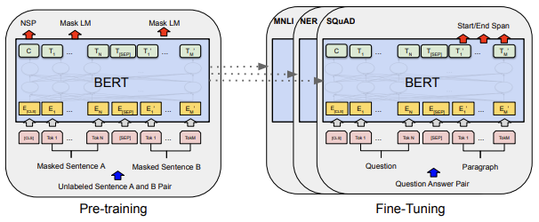

이번 시간에는 Andrew Ng 교수님의 Stanford ML 수업에서 다룬 **효율적인 논문 읽기**를 정리해보았습니다.  
원본 강좌는 아래에서 확인할 수 있습니다.

[Stanford CS230: Deep Learning | Autumn 2018 | Lecture 8 - Career Advice / Reading Research Papers](https://www.youtube.com/watch?v=733m6qBH-jI)

> 논문 읽기뿐만 아니라 ML 커리어 발전에 대한 내용도 있습니다! 관심 있으신 분들은 강의 영상을 보시는 것을 추천 드립니다!

## 들어가며...

ML/DL을 공부하다보면 ML/DL 논문 읽기의 중요성을 많이 강조합니다.
하지만 입문자 입장에서 논문을 읽는 것은 쉽지 않습니다. 빽빽하게 영어와 수식으로 채워진 머신러닝/딥러닝 논문을 읽는다는 것이 참 막막합니다. 이를 극복하기 위한 Andrew Ng 교수님의 논문 읽기 Tip을 정리합니다.

## 세상의 논문, 다 읽을 필요 없다.

세상에는 정말 많은 논문이 있습니다. 또한 하루에도 수 백개의 논문이 쏟아져 나옵니다. **이들 논문을 다 읽을 필요가 있을까요? 정답은 X 입니다.**  
본격적으로 논문을 읽어보기 전에, **내가 읽어볼 논문들의 리스트를 만들어봅니다.**
그리고 여러 논문들을 쭉 훑어보며 **더 읽어볼 논문과 아닌 논문을 취사 선택합니다.**
과정을 정리하면 아래와 같습니다.

1. 읽을 논문 리스트 만들기
2. 논문 리스트에서 자세히 읽을 논문 선택하기

그러면 얼마나 많은 논문을 읽어야할까요? 교수님은 아래와 같은 가이드라인을 제시합니다.

- **5~20개 읽어봄**: 해당 분야에 기초적인 지식을 갖추고, 어느정도 응용하여 작업할 수 있다.
- **50~100개 읽어봄**: 해당 분야에 깊은 지식을 갖춤.

## 논문 어떻게 읽는가?

그럼 논문을 어떻게 읽는 것이 좋을까요?
교수님은 **처음부터 끝까지 순서대로 논문을 읽는 것은 바람직하지 않다**라고 합니다.
논문 읽는 법을 자세히 살펴보겠습니다.

1. **Title/Abstract/Figure 읽어보기**

우선 첫번째로 할 것은 논문의 Title, Abstract, FIgure을 읽어보는 것입니다. **해당 논문이 무엇을 말하고자 하는지 대략적으로 파악하는 것이 목표입니다.** 특히 ML/DL에서는 Figure 몇 개로 해당 논문의 내용을 요약해둔 경우가 많이 있어 이해하는데 큰 도움이 됩니다.

2. **Introduction/Conclusion/Figures 읽어보기**  
   Introduction이나 Conclusion은 심사위원들에게 **해당 논문이 왜 Accept 되어야 하는지 설득하는 글** 이라고 볼 수 있습니다. 따라서 논문 저자들은 해당 부분을 아주 신중하게 작성합니다.  
   따라서 **Introduction이나 Conclusion만 꼼꼼히 읽더라도 해당 논문이 말하고자 하는 바를 전체적으로 깨달을 수 있습니다.**
   또한 이 단계에서 해당 논문을 더 자세히 읽을지 말지를 결정할 수 있습니다.

**이때 Related Work 경우에는 훑어보거나 건너뛰는 것이 좋습니다.** Related Work의 경우에는 논문 저자가 해당 논문이 얼마나 우수한지 입증하기 위해 다른 연구들을 이것저것 많이 소개하는 부분입니다. 따라서 해당 분야에 익숙하지 않다면 이해하기 어려울 수 있고, 논문을 이해하는데 큰 도움이 되지 않기 때문에 넘어가셔도 무방합니다.

3. **수식은 생략하거나 훑어보기**

4. **처음부터 끝까지 전체적으로 읽어보기 (단 이해 안 가는 것은 넘어가기)**  
   논문을 읽다보면 이해가 도저히 안가는 부분이 있을 수 있습니다. **이해가지 않는 부분은 과감히 생략하도록 합시다.** 우리가 읽을 논문은 굉장히 많습니다. 이해가지 않는 내용을 위해 많은 시간을 소모하는 것을 비효율적일 수 있습니다. 또한 그 내용이 지금은 잘 쓰지 않고 중요하지 않은 내용일 수도 있습니다. 따라서 이해 안가는 부분은 과감히 넘어가도록 합니다.

## 논문을 읽고나서

교수님은 논문을 읽고나서 아래 네 가지 물음에 답해보라고 제시합니다. 이들 질문에 답할 수 있다면 논문을 잘 이해했다는 뜻입니다.

1. **저자가 이루고 싶어한 것은?**
2. **해당 연구에서 중요한 요소(key elements)는?**
3. **이 논문에서 내가 무엇을 사용할 수 있을까?**
4. **Reference 중에서 더 읽어볼만한 것이 있는가?**

## 논문을 어디서 찾을 수 있을까?

그렇다면 읽을 논문은 어디서 찾을 수 있을까요? 웹 서핑이나 블로그 포스트 등을 통해 얻거나, 주요 State-Of-The-Art 모델들을 찾아보는 방법이 있습니다. 교수님은 추가로 4가지 방법을 제시합니다.

1. **트위터**
   최근 많은 연구자들이 Twitter를 사용해 논문이나 학술 정보를 공유합니다. 이들을 통해 최신 논문 정보들을 얻을 수 있습니다. Ex) @kiankata @AndrewYNg

2. **ML Subreddit**
   [https://www.reddit.com/r/MachineLearning/](https://www.reddit.com/r/MachineLearning/)에서 다양한 ML 관련 정보들을 얻을 수 있습니다.

3. **주요 ML 학회 (NIPS/ICML/ICLR)**
   NIPS/ICML/ICLR와 같은 **주요 머신러닝 학회** 에서 매년 발표되는 중요한 ML 논문들을 얻을 수 있습니다.

4. **친구 혹은 커뮤니티**

## 논문 속 수식을 이해하기

논문 속 수식을 어떻게 잘 이해할 수 있을까요?

- **처음부터 다시 유도해보자**  
  시간이 오래 걸릴 수 있지만 가장 확실한 방법입니다. 빈 종이에 해당 수식을 직접 처음부터 다시 유도해보는 것입니다. 이를 통해 수식을 깊게 이해하고 실력을 크게 향상시킬 수 있습니다.

## 논문 속 코드를 이해하기

마찬가지로 논문 속 코드는 어떻게 이해할 수 있을까요?

1. **오픈소스 활용하기**
   최근에는 [paperswithcode](https://paperswithcode.com/)처럼 논문 속 코드가 오픈 소스로 많이 공개되어 있습니다. 이들 오픈 소스를 실행시켜보며 이해하는 방법이 있습니다.

2. **밑바닥부터 코드를 구현해보기**
   수식과 마찬가지로 논문을 밑바닥부터 코드로 구현해보는 것입니다. 처음부터 하나하나 논문을 코드로 구현하다보면 논문을 보다 깊게 이해할 수 있습니다.

## 꾸준하게.

**Steady Reading, not shorts burst.**

**실력 향상을 위해 무엇보다 중요한 것은 꾸준함입니다.**  
방학동안 50 \~ 100개의 논문을 몰아서 읽으려하지 말고, 주당 1 \~ 2개의 논문을 꾸준히 읽도록 해봅시다. 그럼 어느새 실력이 크게 향상한 자신을 발견할 수 있을겁니다.
