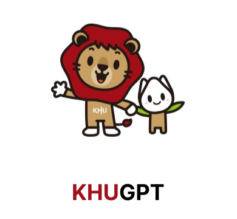
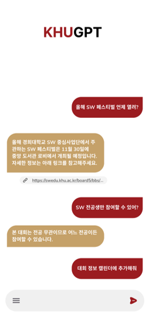
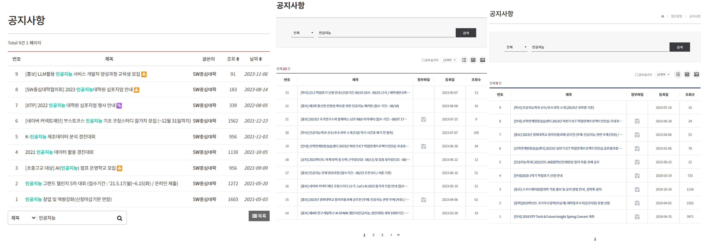
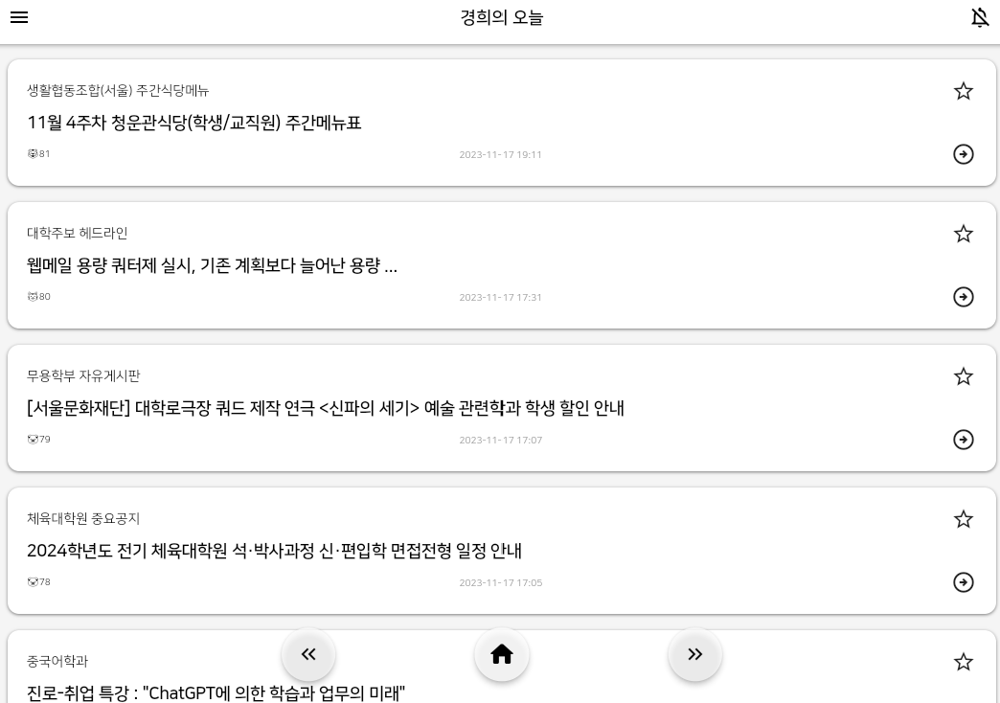
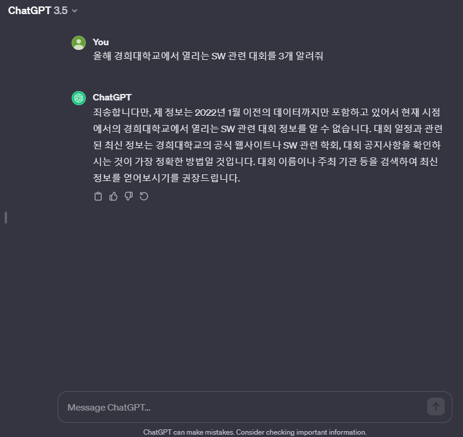
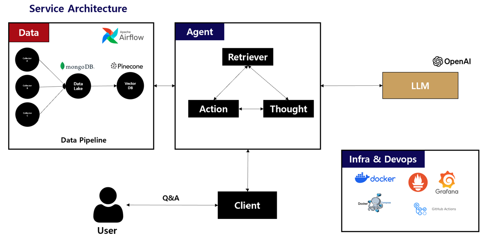
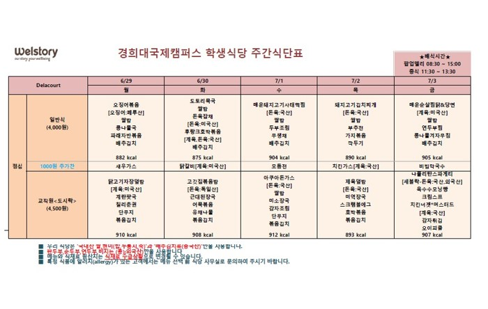

## KHUGPT, 어떤 서비스인가요?
**KHUGPT**는 **경희대학교 학생들을 위한 대화형 검색 엔진 서비스**입니다. 

예를 들어 사용자가 "올해 소프트웨어 관련 대회 정보 알려줘", "올해 겨울에 모집하는 해외 연수 프로그램 있을까?", "오늘 학식 알려줘" 등의 **교내 정보와 관련된 질문**을 하면 **적절한 답변과 관련 링크를 제공**해주는 서비스입니다. 따라서 학생들은 친구에게 물어보듯이 교내 정보를 쉽고 빠르게 검색을 할 수 있습니다.

## 어떤 불편함이 있었나요?
학교 생활을 하면서 **교내 정보를 한 곳에서 쉽게 찾아볼 수 없다** 는 점이 불편했습니다. 

예를 들어 제가 **"올해 겨울에 열리는 교내/외 인공지능 관련 대회"** 을 찾아본다고 해보겠습니다.
그럼 일단 적어도 아래 홈페이지들 모두 살펴봐야 합니다. 
- 컴퓨터공학과
- 소프트웨어중심대학사업단
- 소프트웨어융합대학
- 학과 동아리 단톡방

여기에 더불어 각 게시판 별로 검색 키워드도 고민해야하고 (AI, 인공지능, 대회 등) 각 게시글을 직접 들어가보며 내가 찾는 정보가 맞는지 확인도 해봐야 합니다. 
즉, **내 의도에 맞는 정보를 검색하기가** 쉽지 않다는 것이죠. 그러다보니 대회, 장학금, 프로그램 등 학교 생활에 도움되는 정보들을 자연스럽게 놓치게 됩니다.  

관련하여 학과 교수님께서 [경희의 오늘](http://opensource.khu.ac.kr/#/)이라는 학교에서 올라오는 공지사항을 한 눈에 볼 수 있는 데모 서비스를 만드셨습니다.

하지만 아직 **"사용자가 원하는 게시글"** 을 찾기 위해서는 요일별로 직접 하나하나 보면서 찾아봐야 한다는 불편함이 있습니다.

## 문제를 어떻게 해결하고자 하나요?
정리하자면 기존에는 학과에서 원하는 정보를 찾으려면 아래 절차를 거쳐야합니다.
> 1.  원하는 정보가 있을법한 학과 홈페이지에 접속한다. 
> 2.  해당 홈페이지에서 원하는 정보가 있을법한 게시판에 접속한다.
> 3.  해당 게시판에서 원하는 정보가 있을법한 키워드로 검색한다. (또는 스크롤을 내리며 쭉 탐색한다.)
> 4.  해당 검색 키워드에서 원하는 정보가 있을법한 게시글에 접속한다.
> 5.  해당 게시글 글을 읽어보며 원하는 정보가 존재하는지 찾아본다.

사실 과장한 감이 없지 않아 있지만... **사용자는 원하는 정보를 검색하기 위해 꽤나 번거로운 과정**을 거쳐야한다는 것이죠. 특히 타과생이나 외부인이라면 관련 홈페이지를 찾는 것부터 쉽지 않을 것이라고 생각합니다. 

이를 최근 ChatGPT를 필두로 대두되는 **LLM (Large Language Model)** 을 활용하여 해결하고자 했습니다. 미리 교내 정보들을 어디엔가 기억해두고, 이를 바탕으로 LLM이 필요한 정보들을 판단하여 사용자 의도에 맞는 답변을 생성하는 것이죠. 따라서 사용자는 별도로 홈페이지에 접속해서 찾아보는 과정없이 **보다 쉽고 편리하게 원하는 정보를 검색** 할 수 있는 것을 목표로 합니다.

> 1. KHUGPT에게 원하는 정보를 질문한다.
> 2. KHUGPT는 사용자 의도에 맞는 답변을 생성한다.
> 3. KHUGPT의 답변을 바탕으로 추가 질문을 하거나 제공된 관련 링크에 접속한다.

예를 들어 사용자는 다음과 같이 정보를 검색할 수 있는 것이죠.

Q. 올해 겨울에 열리는 교내/외 인공지능 관련 대회 알려줘  

A. 2023년 11월 18일 기준으로 올해 겨울에 열리는 인공지능 대회를 알려드리겠습니다. A 대회는 ~~ 대상으로 ~~에 열리며 ...  [관련 링크] B 대회는 ... [관련 링크] ...

## 어떤 기술들이 필요한가요?
위 서비스를 어떻게 구현할 수 있을까요?  
당연하게도, Chatgpt와 같은 LLM은 기본적으로 교내 정보를 바탕으로 답변을 할 수 없습니다.
그렇다면 LLM이 어떻게 교내 정보를 알게 할 수 있을까요?

언어 모델을 추가로 학습시키는 방법으로 가장 먼저 떠올릴 수 있는 것은 바로 **파인튜닝 (Fine-Tuning)** 입니다. 하지만 LLM에 파인 튜닝을 도입하기에는 다음과 같은 단점이 존재합니다.

1.  최신 정보 대응이 어려움.
2.  비교적 높은 학습 및 리소스 비용.  

가장 치명적인 부분은 **(1) 최신 정보 대응** 입니다. 검색 서비스 특성상 **사용자들이 최신 정보를 원할 가능성**이 높습니다. 하지만 하루 혹은 주에 한번씩 모델을 파인튜닝 시키기에는 리소스의 낭비가 심합니다. 또한 LLM의 태생적인 문제로 손꼽히는 **할루시네이션(Hallucination)** 현상이 발생할 가능성도 남아 있죠.

따라서 위 문제를 해결하기 위해 **RAG (Retrieval Augmented Generation)** 을 도입하기로 하였습니다.
**RAG는 LLM이 답변을 생성할 때 외부 데이터베이스(Vector DB 등)에서 관련도가 높은 문서를 찾아 활용**하는 기술입니다. [관련 논문](https://arxiv.org/abs/2005.11401)  

RAG를 활용하면 파인튜닝 대비 다음과 같은 장점이 있습니다. 

1. 비교적 낮은 데이터 업데이트 난이도
   - RAG는 외부 데이터베이스에 최신 정보를 추가하기만 하면 되므로, 파인 튜닝에 비해 업데이트 난이도가 낮습니다.
2. 할루시네이션 억제
   - RAG는 실제 정보가 담긴 문서를 바탕으로 답변을 생성하므로 할루시네이션이 발생할 확률이 비교적 줄어든다. 

이를 위해서는 크게 3가지 할 일이 있습니다.
> 1. **Collect**: 교내 게시글들을 수집해서 저장해둬야 한다.
> 2. **Retrieve**: 사용자 질문과 관련된 게시글들을 찾을 수 있어야 한다.
> 3. **Agent**: LLM과 찾은 게시글들을 바탕으로 사용자 질문에 알맞는 답변을 생성하여야 한다.

따라서 구상한 기본적인 **서비스 아키텍처**는 다음과 같습니다.

위 아키텍처를 바탕으로 서비스의 동작 흐름을 정리하면 아래와 같습니다.

1. 주기적으로 Collector에서 학과별 홈페이지에서 게시글을 수집한다.
2. 수집한 게시글은 우선 Data Lake에 적재하고, 그후 Embedding된 벡터 형태로 Vector Store에 적재한다.
3. Client에서 사용자의 질문이 들어오면, Agent에서 사용자의 질문된 연관된 문서 K개를 Retreive 한다.
4. Retrieve한 K개의 문서를 바탕으로 Agent는 LLM을 통해 적절한 답변과 관련 링크를 생성한다.

위와 같은 과정을 통해 서비스는 사용자에게 원하는 답변을 생성할 수 있는 것이죠.

## 예상되는 어려움이 있나요?
앞서 구상한 서비스 아키텍처를 소개드렸습니다.  
아키텍처를 구상하면서 동시에 **예상되는 어려움**도 있었는데요, 몇가지를 소개해드리고자 합니다.  

1. **Collector의 데이터 수집**  
수집해야 하는 학과 사이트는 어림짐작해도 적어도 100개가 넘습니다. 하지만 이들 사이트가 동일한 포맷의 코드로 구성되어 있지 않아 일일히 개발자가 맞게 크롤링 코드를 작성해야 합니다. 더불어 어느 특정 사이트의 경우에는 로그인을 필요로 합니다. 따라서 이들을 어떻게 효율적으로 수집할 수 있을 것인지 고민해보아야 합니다.  

2. **Retriever의 Bottleneck**  
아무리 **모델이 똑똑하더라도, Retriever가 사용자 질문과 관련 없는 문서만 제공한다면 모델은 좋은 답변을 생성할 수 없습니다.** 좋은 retreiver란 최소한의 후보 문서 k로 가장 사용자에게 필요한 정보를 제공할 수 있는 모델이라고 생각합니다. 특히 LLM은 토큰당으로 과금이 이루어지므로, 단순히 제공하는 후보 문서 K개를 늘리게 되면 서비스의 비용  증가로 이어질 수 있습니다. 이외에도 날짜  정보나 사용자의 정보 들을 바탕으로 문서들을 어떻게 찾을 수 있을 것인지에 대한 고려도 필요합니다.
정리하자면 **"어떻게하면 사용자 의도에 맞는 문서를 잘 찾아올 수 있는 Retreiver"** 를 만들 수 있을 것인가라는 고민이 필요합니다.  

1. **Text가 아닌 이미지, 표 데이터의 처리**  
학교 내 많은 게시글에서 별도의 텍스트 없이 포스터 등의 이미지로만 정보를 제공하기도 합니다. 특히 학식의 경우 아래 그림과 같이 표로 구성된 이미지 형태로 제공되고 있습니다. "단순히 OCR 돌리면 되는거 아니야?"라고 생각할 수 있지만, OCR은 비용이 많이 들어가는 작업일 뿐더러 **이미지를 텍스트로 변환하는 과정에서 상당한 양의 정보 손실**이 발생합니다. 예를 들어 아래 그림을 단순히 OCR을 수행하게 되면 오징어 볶음이 월요일 메뉴라는 정보를 잃어버리게 됩니다. 물론 이미지를 표 형태로 변환하는 **Table OCR** 기술도 존재합니다. 하지만 몇개의 상용 서비스를 통해 테스트를 해본 결과 1) 한글 분석을 지원하지 않거나, 성능이 매우 낮다 2)  정형화된 Grid 형태의 테이블을 지원한다. 라는 단점이 존재했습니다.  

또 다른 방법으로는 Image도 이해할 수 있는 GPT-4와 같은 멀티 모달 모델을 통해 분석을 수행하는 방법이 있습니다. 하지만 비용적인 측면이나 해당 모델이 실제 효과적으로 분석을 수행하는지는 추가적인 탐구가 필요할 것 같습니다. 

## 앞으로의 계획은 어떻게 되나요?

2023년 11월 말까지 **KHUGPT v1.0을 개발하여 공개**할 예정입니다.  

제공하고자 하는 기능은 다음과 같습니다. 
1. Streamlit 기반의 간단한 Chat Interface 제공
2. 교내 주요 사이트 (취업, 장학, 전공 관련) 등의 QA 수행 가능
3. airflow를 활용한 배치 데이터 파이프라인 구축

우선 빠르게 필요한 핵심 기능들을 완성한 뒤 더욱 개선할 부분 (Agent, Retrieval 등)을 찾아 개선 및 고도화할 예정입니다.  

KHUGPT 프로젝트에 많은 관심 부탁드립니다! 감사합니다. ☺️
