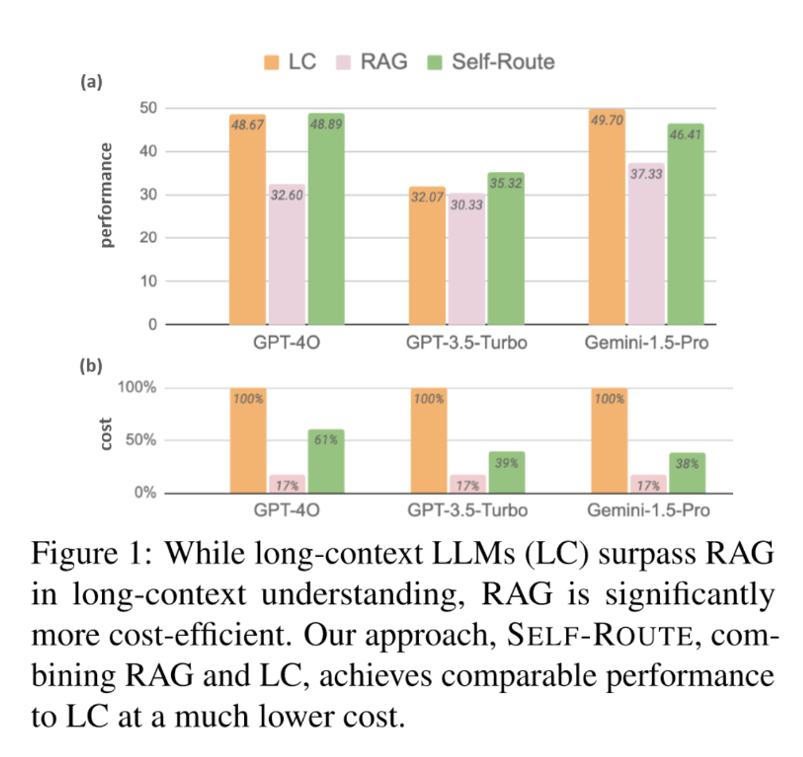
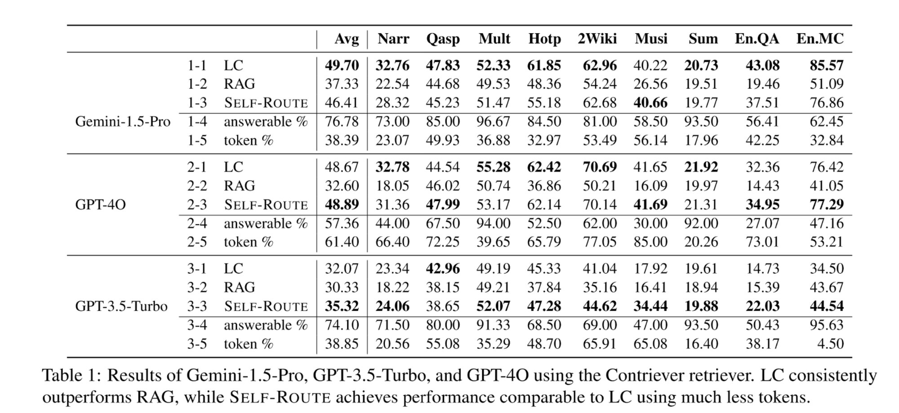
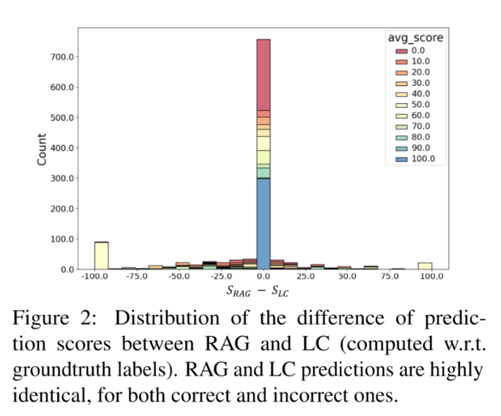
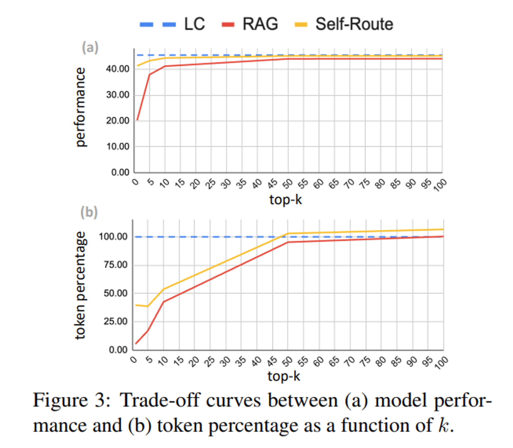
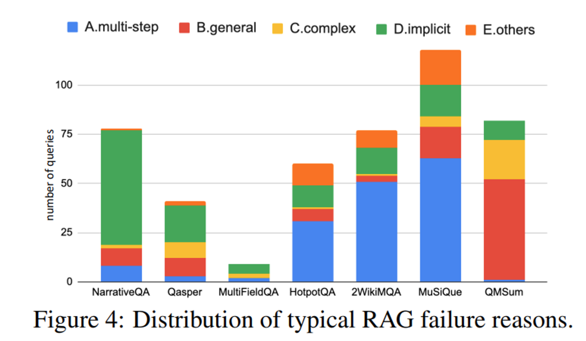
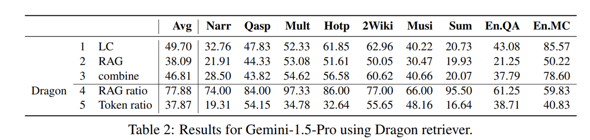

이번 시간에는 **RAG와 Long-Context LLMs의 성능을 비교**하고, **두 방법을 혼합한 Self-Route를 제안**한 논문을 살펴봅니다. 최근에 출시된 Gemini 1.5와 같은 모델들은 Context window size가 1 Million에 달하는 등 매우 많은 토큰을 한 번에 입력 받을 수 있습니다. 이는 영문 소설 8권을 한 번에 입력할 수 있는 양입니다. 이러한 점을 활용해 별도의 Retrieval 과정 없이 Long-Context를 한 번에 입력하는 방법도 고려할 수 있게 되었습니다. 이를 통해 기존 RAG보다 높은 품질의 답변을 생성할 수 있습니다.

하지만 긴 컨텍스트를 매번 입력으로 사용하면 token 비용이 늘어날 수밖에 없습니다. 연구팀은 이를 해결하고자 RAG와 LC (Long Context) LLMs의 장단점을 적절히 합친 Self-Route라는 방법을 제안합니다. 논문은 [링크](https://www.arxiv.org/abs/2407.16833)에서 확인할 수 있습니다!

## Abstract

- Gemini나 GPT-4와 같은 최근 LLM 모델들은 Long Context를 입력 받고 이해할 수 있는 능력들을 보여주고 있음
- 이에 전통적인 RAG 방법과 Long Context를 입력으로 바로 사용하는 LC 방법의 comprehensive comparison을 진행함
- RAG와 비교하여 LC가 높은 성능을 보이고 있으나, cost를 많이 쓴다는 문제점도 가지고 있음
- 이를 해결하고자 model의 self-reflection을 기반으로한 LC와 RAG 방법을 혼합한 SELF-ROUTE 방법을 제안함.
    - SELF-ROUTE를 통해 computation cost를 효과적으로 줄이면서, LC에 준하는 성능을 보여줄 수 있음.

## Benchmarking RAG VS LC
### Datasets and Metrics

RAG와 LC의 성능을 비교하기 위해 연구팀은 [LongBench](https://github.com/THUDM/LongBench)와 [**∞**Bench](https://github.com/OpenBMB/InfiniteBench)를 활용하여 평가 데이터셋을 구성하였습니다.

두 벤치마크 데이터셋 모두 모델의 Long Context 성능을 평가하기 위해여 각각 평균 7K, 100K개의 토큰의 문장으로 구성된 것이 특징입니다. 연구팀은 (1) in English, (2) real 그리고 (3) query-based에 맞는 task를 선정하여 데이터셋을 구성하였습니다.

그리고 Evaluation metric으로는 **multi-choice QA task에서는 F1 Score**를, **summarization task에 대해서는 ROUGE  Score**를 사용했습니다.

### Models and Retrievers

평가하는 모델로는 **Gemini-1.5-Pro (1M), GPT-4O(128K), GPT-3.5-Turbo(16K)**를 사용하였습니다.

그리고 RAG를 위한 Retriever로는 [Contriever](https://github.com/facebookresearch/contriever)와 [Dragon](https://arxiv.org/abs/2302.07452)을 사용하였습니다. 이때 retrieval 전략으로는  사전에 300 token 단위로 나눈 chunk를 top k개를 뽑아 query embedding과 token embedding의 cosine similiarity을 이용했다고 합니다.

### Benchmarking Results

아래 Figure 1과 Table 1에서 평가 결과를 확인할 수 있습니다. **전반적으로 RAG에 비해 LC의 성능이 높은 것**을 볼 수 있습니다. 또한 최근에 나온 모델일수록 (GPT-4O와 Gemini-1.5-Pro) long context를 이해하는 capacity가 커짐에 따라 두 방법의 성능의 격차가 커지는 것을 확인할 수 있습니다. 반면에 GPT-3.5-Turbo의 경우에는 16K라는 제한된 context window로 인해 RAG에 비해 그다지 좋은 성능을 보여주고 있지 못합니다.





## Self-Route

앞서 결과를 살펴보면, LC의 경우 RAG에 비해 높은 성능을 보여주나 long-context를 한 번에 입력해야 하므로, **덩달아 비용 또한 매우 높아진다는 문제점**이 있습니다.

더불어 연구팀은 RAG와 LC가 동일한 답변을 내놓거나 완전히 다른 답변을 내놓는 경우가 생각보다 많다는 점을 발견했습니다. 아래 그림은 RAG와 LC의 점수 차이를 시각화한 것입니다. 가운데에 우뚝 솟은 막대를 볼 수 있는데요, 이는 RAG와 LC가 동일한 답변을 생성한 비율이 매우 높음을 보여줍니다. 또한 양 끝의 두 막대는 RAG만 맞았거나, LC만 맞은 케이스들을 보여줍니다.



이처럼 RAG와 LC의 답변이 일치하거나 혹은 아예 다르다는 점을 바탕으로 연**구팀은 RAG와 LC를 결합한 SELF-ROUTE라는 방법을 제안**합니다.

SELF-ROUTE는 두가지 step으로 동작합니다.

1. RAG-and-Route step
2. Long-context Prediction step

**RAG-and-Route step**

우선 첫 번째 단계에서는 기존 RAG 방식처럼 Retrieving된 Chunk를 활용하여 답변을 생성합니다. 이때 모델에게 아래와 같은 프롬프트로, 만약 제공된 context를 바탕으로 답변을 할 수 없으면 unanswerable을 출력하도록 지시합니다.

```jsx
 Write unanswerable if the query can not be answered based on the provied text.
```

**Long-context Prediction step**

만약 첫 번째 단계에서 unanswerable이 출력되었다면, 기존 LC 방식처럼 full-context를 모델의 입력으로 제공합니다.

위 과정을 통해 Gemini-1.5-Pro에서 약 82%의 쿼리가 RAG-and-Route 단계로 처리되고, 나머지 작은 비율의 쿼리만이 Long-context Prediction 단계로 처리되어, **RAG 방식의 장점인 Token Cost를 절약하면서, RAG로 답변하지 못하는 경우 LC로 처리함으로써 답변 품질 또한 높일 수 있었다**고 합니다.

앞서 살펴보았던 결과 그림과 표를 다시 보면, Self-Route를 통해 LC에 근접한 성능을 냄과 동시에 Token 비용 또한 효과적으로 절감한 것을 볼 수 있습니다.


## Analysis

### Ablations of k

아래 도표는 retrieve chunk의 top-k 개수와 성능, 그리고 비용 간의 관계를 보여줍니다. 당연히, top-k가 높아질수록 성능이 향상되는 것을 볼 수 있습니다. 또한 Self-Route에서 **비용은 비선형적**인데, 이는 k 값이 증가하면 RAG에 필요한 토큰의 양이 늘어나지만, **더 많은 쿼리가 LC가 아닌 RAG로 라우팅**되기 때문입니다.

Self-Route에서 평균적으로 **top-k=5일 때 비용이 가장 낮은 것**을 볼 수 있습니다. 하지만 NarrativeQA와 QMSum과 같은 추출형 질문을 포함하는 데이터셋에서는 k=1이 가장 낮은 비용을 나타내는 등 **최적의 k 값은 데이터셋에 따라 달라질 수 있습니다.**



### Why does RAG fail?

더불어 연구팀은 LC와 비교하여 RAG가 실**패하는 케이스에 대한 분석을 진행**했습니다. 앞서 unanswerable이라 판단한 케이스들에 대해 LLM 프롬프팅을 통해 케이스를 분류하였습니다.

아래와 같이 크게 **4가지 케이스**로 나눌 수 있다고 합니다.

1. 다단계 추론이 필요한 경우
    1. “What nationality is the performer of song XXX”와 같이 쿼리가 여러 단계의 추론을 요구하는 경우
2. 일반적인 쿼리
    1. “What does the group think about XXX”와 같이 일반적인 내용의 쿼리라 retriever가 적절한 쿼리를 구성하는데 어려움을 겪는 경우
3. 길고 복잡한 쿼리
    1. 쿼리가 길고 복잡한 경우 retriever가 이를 이해하는데 어려움을 겪음
4. 암시적인 (implicit) 쿼리
    1. space voyage와 관련된 대화 중에 “What caused the shadow behind the spaceship?”와 같이 전체 문맥을 이해하고 여러 단서를 조합하여 답을 유추해야 하는 경우

데이터셋 별로 실패 케이스에 대한 분포를 나타낸 그림은 아래와 같습니다.



### Different retrievers

Contriever와 더불어 Dragon retriever에 대해서도 실험을 진행했는데, 아래 표와 같이 Contriever와 비슷한 성능을 보여주고 있습니다. 이는 해당 연구가 일반화된 retriever에 적용될 수 있음을 보여줍니다.



## Conclusion

- RAG와 LC에 대한 성능과 비용 사이의 trade-off에 대한 비교 분석을 진행
- LC는 long-context understanding이 뛰어난 반면, RAG는 낮은 비용과 context size의 제약이 덜하다는 이점이 있음.
- 연구팀은 RAG와 LC의 장점을 결합한 self-reflection을 기반으로 한 쿼리를 동적으로 라우팅하는 방법인 SELF-ROUTE를 제안

감사합니다! 😊