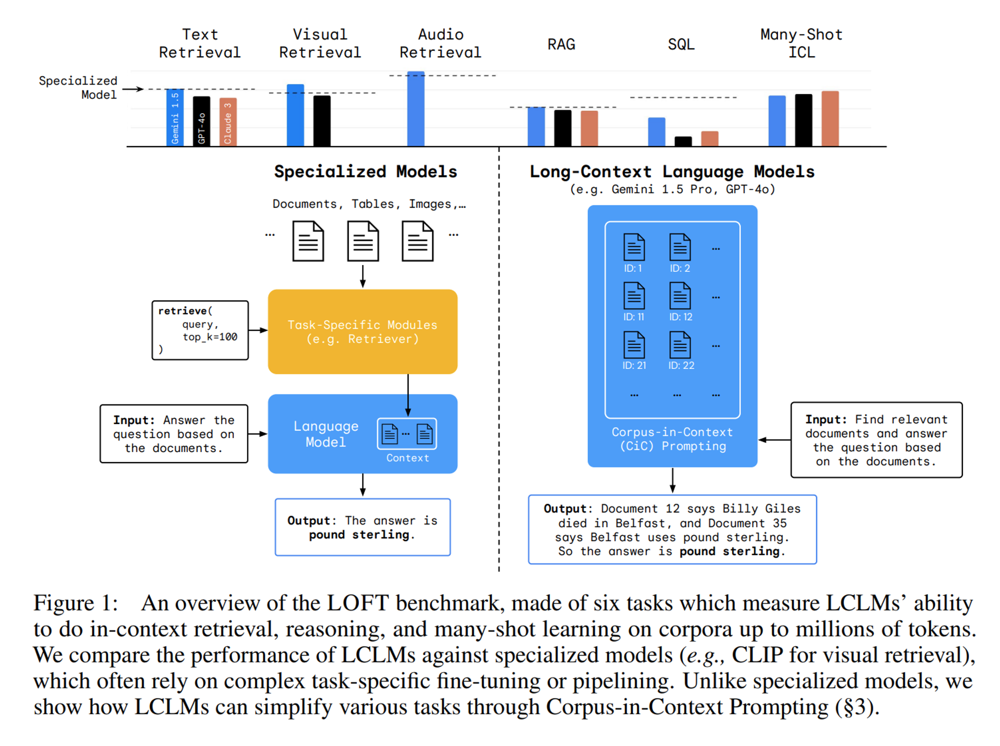
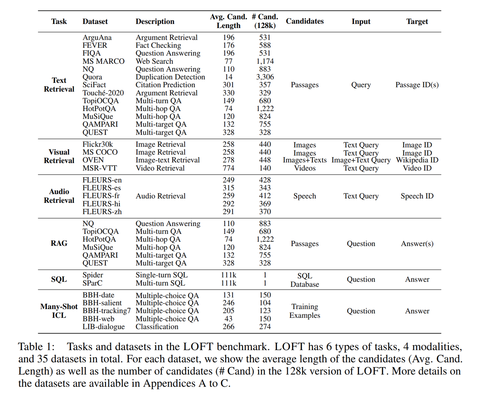
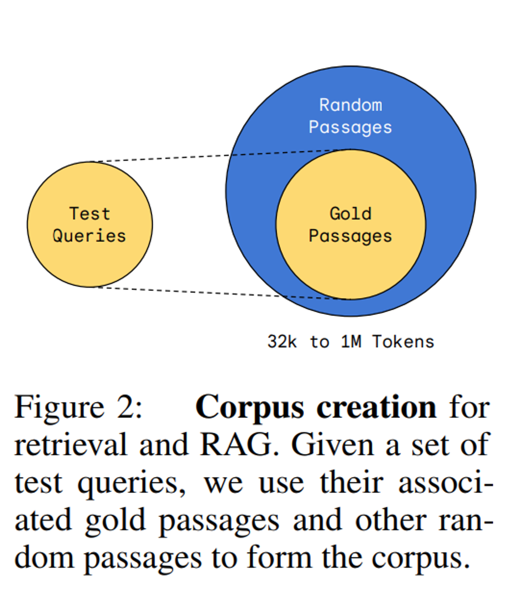
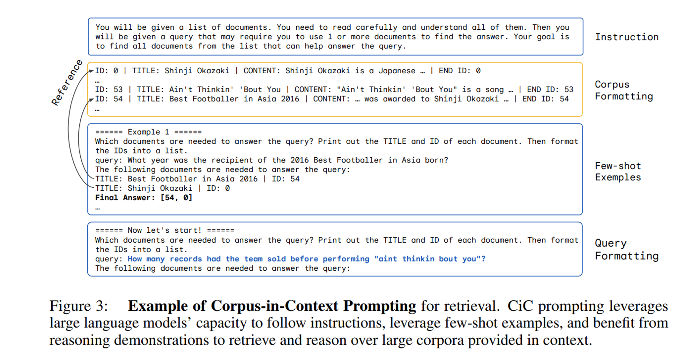
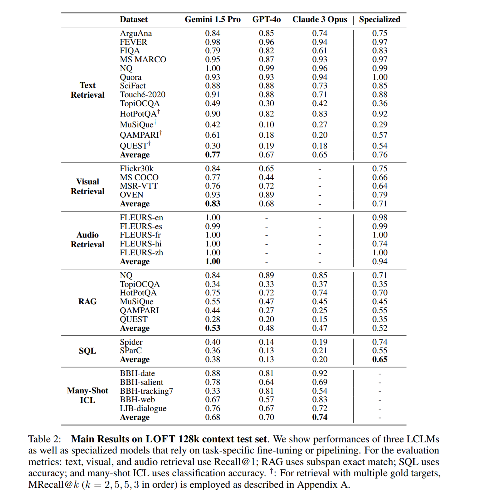
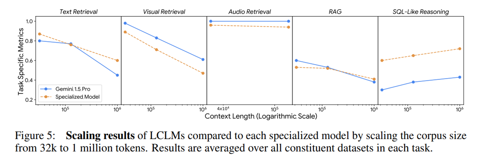
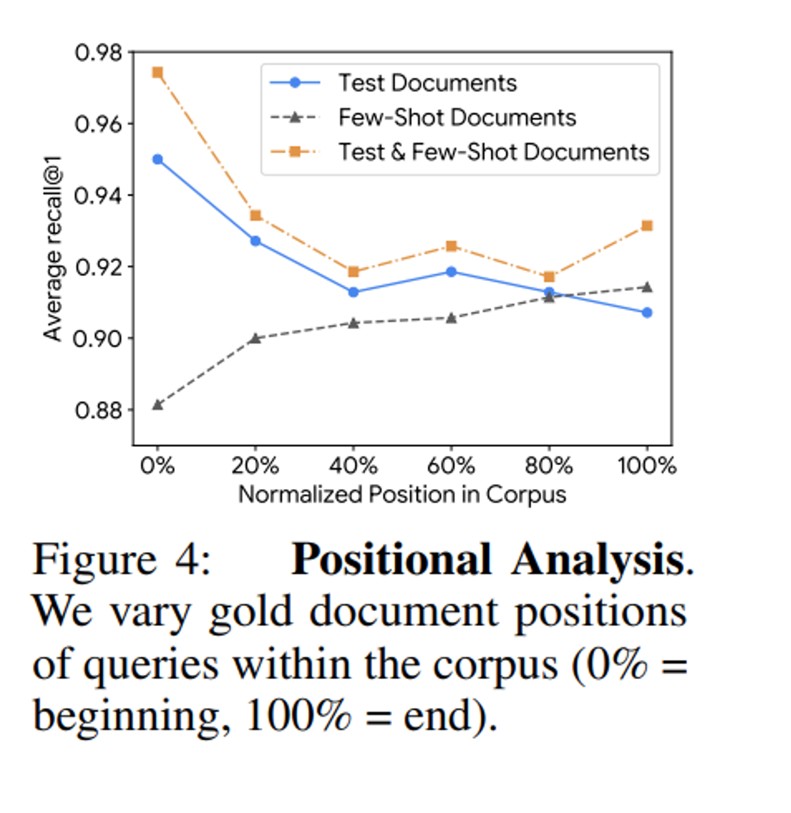
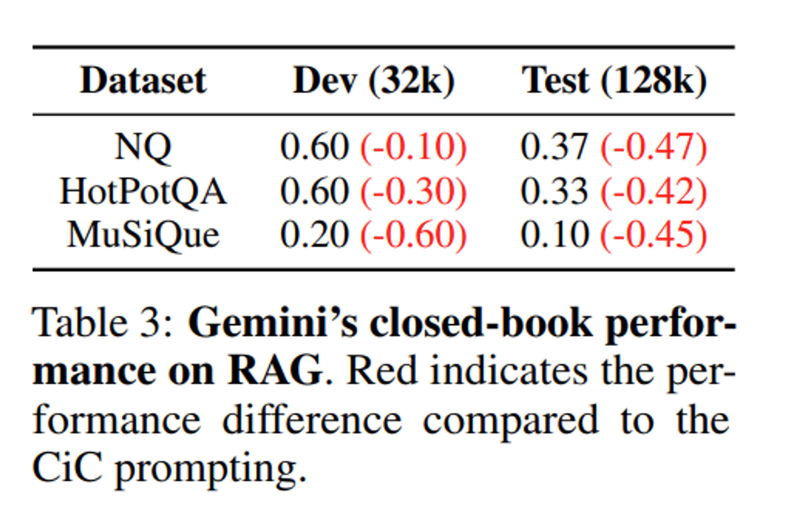
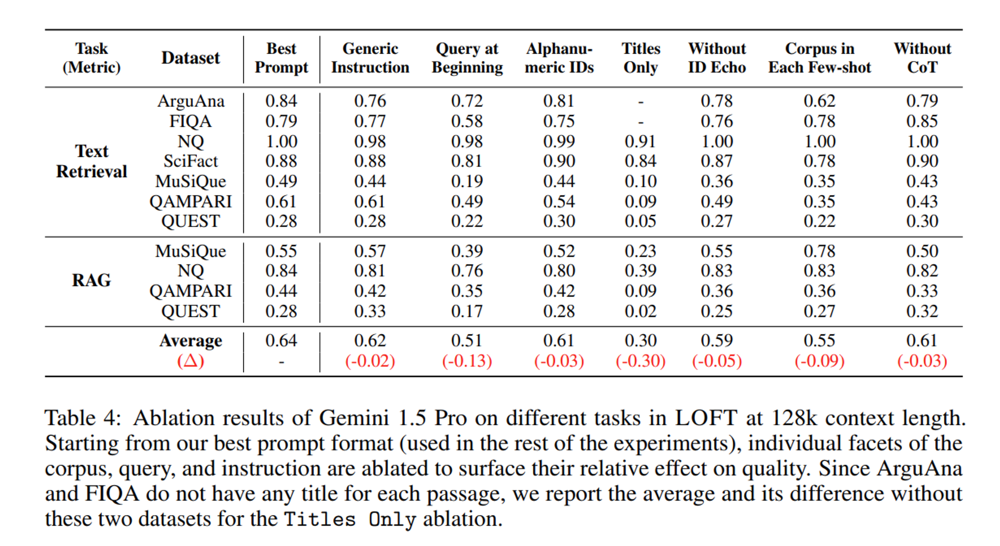

이번 시간에는 Long-context language model(LCLMs)의 장점과 이를 평가할 수 있는 벤치마크인 LOFT를 제안한 Can Long-Context Language Models Subsume Retrieval, RAG, SQL, and More? 논문을 소개합니다.

Long-context language model(LCLMs)은 전통적인 Retriever이나 Database와 같은 외부 툴에 의존하는 방식이 아닌, 전체 corpus를 한 번에 입력하여 다양한 작업을 수행할 수 있도록 합니다.

최근 발표되는 Gemini-1.5와 GPT-4o와 같은 모델들은 굉장히 큰 Context-size를 자랑하고 있는데, 이와 함께 LCLMs이 기존 방법과 비교하여 얼마나 효과적이고 이를 어떻게 평가할 수 있을지 살펴보면 좋을 것 같습니다. 논문은 [링크](https://arxiv.org/abs/2406.13121)에서 확인할 수 있습니다.

## Abstract

- 전체 corpus를 native하게 수집하고 처리할 수 있는 **LCLMs의 능력을 활용하면 여러가지 이점**을 가질 수 있음
    - **User-friendliness 향상**
        - 외부 툴 (retriever, end-to-end)에 대한 전문 지식이 없어도 되므로, 유저가 더욱 쉽게 활용할 수 있음
    - **견고한 End-to-End 모델링**
        - 복잡한 파이프라인을 구축할 필요가 없으므로, 이로 인한 에러를 줄일 수 있음
    - **고급 프롬프트 기술 적용**
        - 시스템 전체에 걸쳐 고급 프롬프트 기술을 적용할 수 있음
- LCLMs의 성능을 평가하기 위한 **LOFT 벤치마크 제안**
    - 수백만개의 토큰이 필요한 작업을 평가할 수 있음
- LCLMs에서 다음과 같은 특징들을 발견
    - 별도로 훈련하지 않아도, 기존의 SOTA급 검색 및 RAG 시스템과 대등한 성능을 보임
    - SQL와 같은 태스크에서 필요한 구성적 추론(compositional reasoning)에서는 아직 챌린지가 남아 있음
    - 프롬프트 전략이 성능에 큰 영향을 미침

### LOFT: A 1 Million+ Token Long-Context Benchmark

최근 LLM 모델들의 Context Size가 확장됨에 따라 corpus 전체를 온전히 context로 사용할 수 있게 되었습니다. 이는 별도로 복잡한 파이프라인을 구축하거나 최적화를 진행하지 않아도 된다는 장점이 있습니다. 

하지만 **기존에는 이러한 LCLMs의 잠재력을 평가할 만한 벤치마크가 부재**했습니다. "needle-in-haystack”와 같은 synthetic task나 고정된 길이의 데이터셋에 의존하여 Long context task를 충분히 평가하고 있지 못했습니다.

따라서 **연구팀은 LCLMs를 효과적으로 평가할 수 있는 LOFT (Long-Context Frontiers) 벤치마크를 제안**합니다.

LOFT 벤치마크는 LCLMs의 한계를 시험하고 평가할 수 있도록, **6가지의 task와 35개의 데이터셋으로 구성**되어 있습니다. 또한 텍스트 뿐만 아니라 visual, audio 등 **다양한 modality에 대해서도 평가**할 수 있습니다.

그리고 고정된 길이의 context만을 제공한 기존 데이터셋과 달리 **LOFT는 32K, 128K 그리고 1M등 다양한 context length를 지원**하며, 더 나아가 수십 억 토큰으로도 **자동으로 쉽게 확장이 가능**하다는 장점을 가지고 있습니다.

구성된 벤치마크 데이터셋은 다음과 같습니다.

각 Task 별로 Corpus를 생성한 방법에 대해 알아보겠습니다.

**Retrieval & RAG**

연구팀은 다양한 retriever 및 RAG 데이터셋과 더불어 BEIR, multi-turn conversational QA, multi-hop QA, multi-target QA (집합 연산 등 요구) 그리고 multimodal 등 다양한 데이터셋을 활용하였습니다.

이들을 활용하여 **corpus를 생성한 방법**은 다음과 같습니다.

- few-shot, development 그리고 test 쿼리의 모든 gold passage를 가져옵니다.
- 그리고 원하는 context-size의 도달할 때까지 random passage를 샘플링합니다.
- positional bias를 피하기 위해 gold passage와 random passage를 섞습니다.

위 방법을 통해 작은 corpus(e.g., 128K)가 더욱 큰 corpus (e.g., 1M)의 subset이 되도록 보장하고, 더욱 큰 사이즈의 context도 자유롭게 생성할 수 있게 되었다고 합니다.

**Many-shot ICL (In-Context Learning)**

Big-Bench Hard (BBH)와 LongICLBench (LIB) 데이터셋을 활용하여 제작하였으며, Retrieval & RAG task와 동일한 방식으로 작은 corpus가 큰 corpus에 포함될 수 있도록 생성했다고 합니다.

**SQL**

Spider와 SparC 데이터셋을 활용하였습니다.

한 가지 특징으로는 corpus를 공유하는 다른 Task와는 달리 **LOFT의 크기 별로 query set가 다르다**고 합니다. 그 이유는 각 context length에 대한 corpus를 구성하려면 모든 table이 해당 context length보다 크지 않도록 데이터베이스를 선택해야 하는데, 이때 연구팀은 해당 context에 맞는 가장 큰 데이터베이스를 선택하였다고 합니다. 이로 인해 예를 들어 **1M 토큰 설정에 대한 데이터베이스가 더 작은 context length에 맞지 않을 수 있다**고 합니다.

추가로 연구팀은 최대 context length의 90% 까지 Corpus를 생성하여, tokenizer들의 차이와 뒤에서 살펴볼 instruction과 formatting이 들어갈 수 있는 공간을 확보했다고 합니다.

## Corpus-in-Context Prompting

LCLMs을 더욱 잘 활용하기 위해 연구팀은 CiC (Corpus-in-Context Prompting) 기법을 제안합니다.

Prompt는 크게 Instruction, Corpus Formatting, Few-shot Examples 그리고 Query Formatting으로 구성이 되어 있습니다.

**Instruction**

LCLMs의 동작을 안내하기 위해 task 별로 instruction을 제공합니다. 예를 들어 검색 작업에서는 모델에게 corpus를 주의 깊게 읽고, 질문에 답하기 위해 관련 문서를 찾도록 지시할 수 있습니다.

**Corpus Formatting**

전체 corpus를 프롬프트에 삽입하는 부분입니다. corpus의 각 candidate에는 고유한 ID가 할당되는데, 이를 통해 검색 작업 등에서 LCLMs가 올바른 후보 ID를 출력하도록 할 수 있습니다.

더불어 corpus의 format은 검색 성능 등에 큰 영향을 미친다고 합니다.

**Few-Shot Examples**

few-shot example을 제공함으로써 LCLM이 적절한 response format을 출력하고, task 정확도를 높이는데 도움을 줄 수 있다고 합니다. 그리고 각 few-shot example에 Chain-of-Thought 추론을 동반하여 복잡한 multi-hop 추론이 필요한 task에 도움을 줄 수 있습니다.

추가적으로 해당 CiC 기법은 쿼리가 프롬프트의 끝에 나타나기 때문에 **corpus를 미리 한번만 인코딩하여 사용하는 prefix-caching**을 통해 **LCLMs의 성능을 유지하면서 계산 비용을 줄일 수 있다**고 합니다. 

### LOFT Tasks and Primary Results

연구팀은 LOFT 벤치마크로 Gemini 1.5 Pro, GPT-4o, Claude 3 Opus를 평가하였습니다.

또한 각 Task 별로 특화된 파인 튜닝이나 파이프라인을 가지는 specialized models도 함께 평가하여, 별도의 파인 튜닝을 거치지 않은 LCLMs 성능과 비교하였습니다.

각 Task 별 specialized models은 다음과 같습니다.

- Text Retrieval & RAG → Gecko
- Visual Retrieval →  CLIP-L/14
- Audio Retrieval → PaLM 2 DE
- SQL-Like Compositional Reasoning → DAIL-SQL

LOFT 128K context test set에 대한 **주요 결과**는 다음과 같습니다.
대부분의 Task에서 Specialized model과 비교해도 LCLMs가 오히려 높은 성능을 보이고 있음을 알 수 있습니다. 하지만 **SQL task에 대해서는 비교적 낮은 성능**을 보이고 있습니다.

**Scaling Results**

각 task 별로 **corpus의 크기가 성능에 미치는 영향**을 살펴보겠습니다. 전반적으로 **corpus의 크기가 늘어날수록 LCLMs와 Specialized model 모두 성능이 하락**하는 것을 볼 수 있습니다. 반면에 Audio Retrieval의 경우에는 Corpus의 size가 성능에 큰 영향을 미치지 않고 있는데, 연구팀은 아직 해당 Task의 난이도가 충분하게 어렵지 않다는 점을 지적합니다.

**Positional Analysis**

연구팀은 Text Retrieval task에서 gold document의 위치가 검색 성능에 미치는 영향도 살펴보았습니다. 실험 결과는 다음과 같습니다.

- **test query의 gold document가 corpus의 끝으로 이동할수록 성능이 저하**된다. (프롬프트 후반부에서 주의력이 감소함)
- 반대로 **few-shot query의 gold document를 끝에 배치하면 recall이 향상**된다. (few-shot이 주의력 약화를 완화할 수 있음)
- **few-shot과 test query의 gold document를 함께 배치하면 성능이 일관되게 향상**된다. (모델이 답을 찾기 위해 어디를 봐야 하는지 정보를 제공하기 때문)

**Closed-Book Ablations**

RAG task에서 Gemini-1.5-Pro 모델에 대해 context에서 corpus를 제거하여 LCLM이 parametic knowledge만으로는 성능이 어떤지를 평가하였습니다. 그 결과로 **closed-book 성능이 현저히 떨어지는 것**을 볼 수 있습니다. 이는 **외부의 corpus를 활용하여 추론 능력을 향상시키는 것의 중요성**을 나타낸다고 합니다.

**CiC Prompt Ablations**

연구팀은 CiC Prompt에 대한 Ablation study도 진행하였습니다. **전반적으로 CiC Prompt의 각 요소가 성능 향상에 관여하고 있는 점**을 확인할 수 있습니다.

### Conclusion & Limitations

연구팀은 LCLMs의 능력을 평가하기 위해 LOFT라는 벤치마크를 제안했습니다. 이 벤치마크를 통해 LCLMs가 별도의 추가 훈련이나 복잡한 파이프라인 없이도 검색, RAG, 멀티 모달 등의 다양한 분야에서 **뛰어난 성능을 보일 수 있음을 입증**했습니다. 또한, **데이터셋의 컨텍스트 크기를 쉽게 확장**할 수 있어, LCLMs가 발전함에 따라 평가 기준도 지속적으로 유효하게 유지될 수 있습니다.

하지만 LCLMs에는 **많은 컴퓨팅 자원과 비용이 필요**하다는 점이 한계점으로 꼽힙니다. 예를 들어, 448M 입력 토큰으로 구성된 LOFT 128k 테스트 셋을 평가하는 데만 Gemini 1.5 Pro에서 $1,568라는 엄청난 비용이 듭니다.

또한, API의 제약으로 인해 prefix caching을 사용하지 못하는 경우, Gemini 1.5 Pro API는 32k 입력 토큰에 약 4초, 128k 입력 토큰에 약 12초, 100만 입력 토큰에 약 100초의 중간 지연 시간이 발생합니다. 이외에도 본 연구에서는 검색 및 RAG 작업을 100만 토큰으로 제한한 점이 실제 응용 서비스에서는 수백만 혹은 수십 억개의 문서를 처리하는 경우와 다를 수 있다고 합니다.

이처럼 LCLMs는 별도의 훈련 없이도 다양한 Task에서 높은 성능을 보이는 반면에, 아직 성능과 비용이라는 문제점을 안고 있습니다. 앞으로 효율적이고 값싼 LCLMs의 다양한 방법들이 연구되길 기대하며 논문 리뷰를 마무리하겠습니다. 감사합니다 .😊

