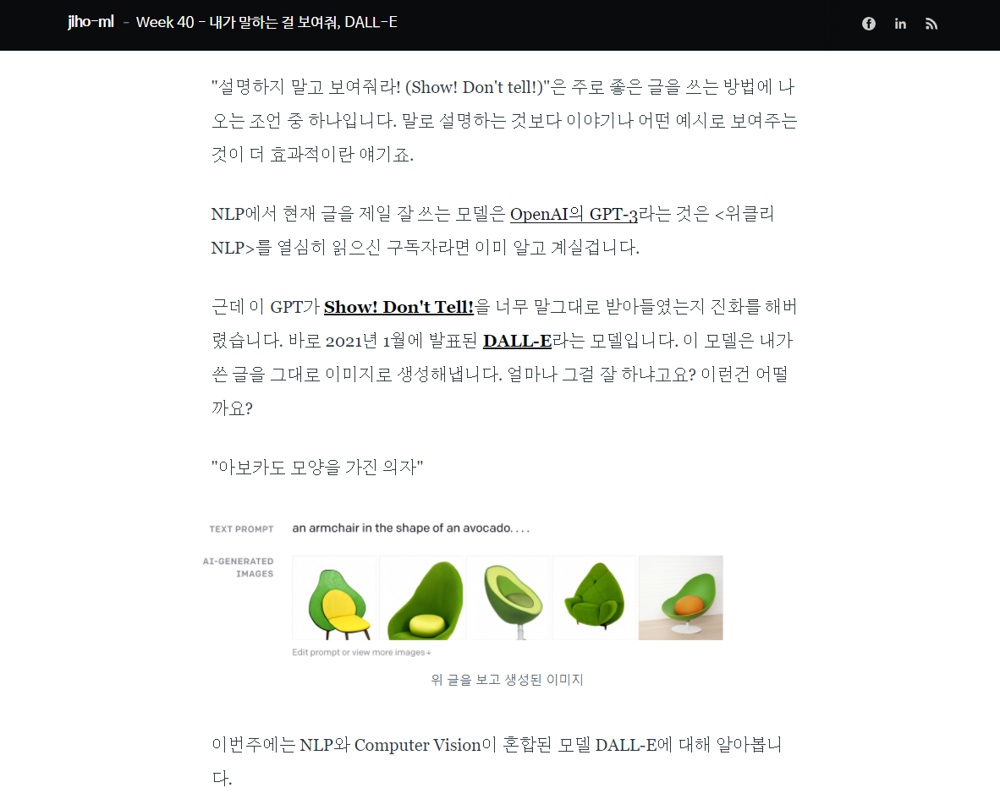
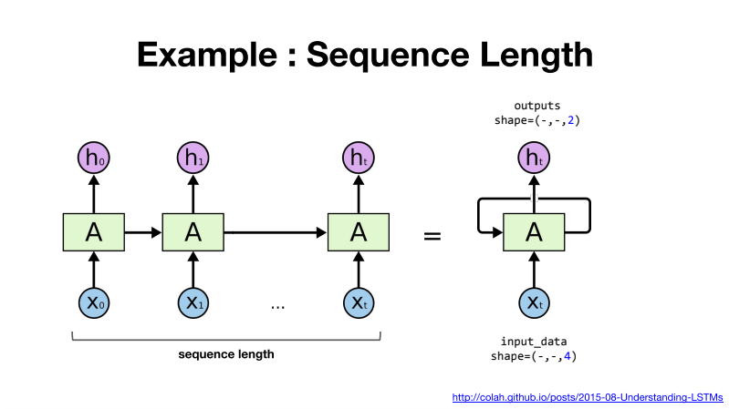
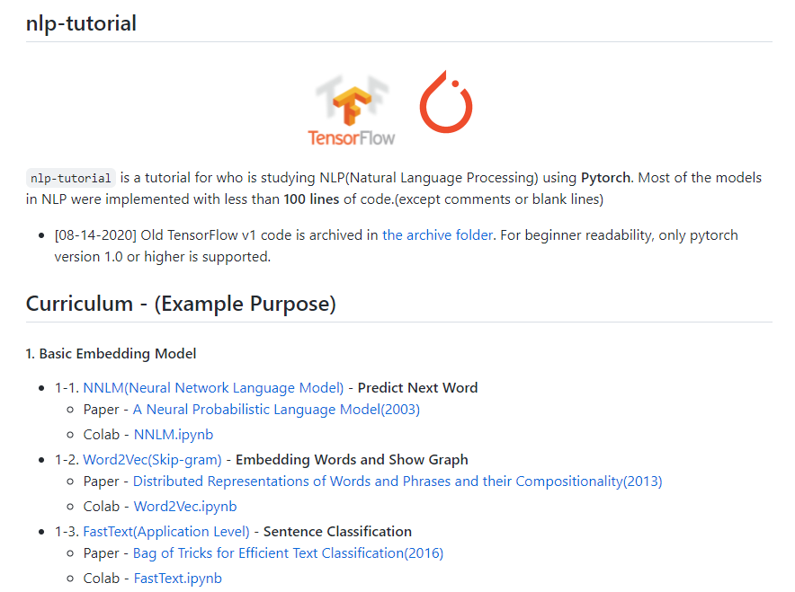
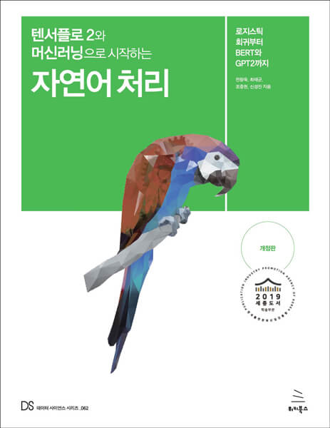
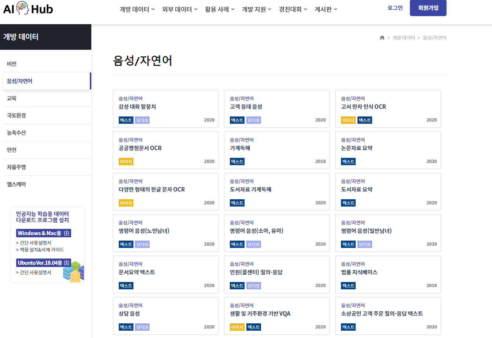
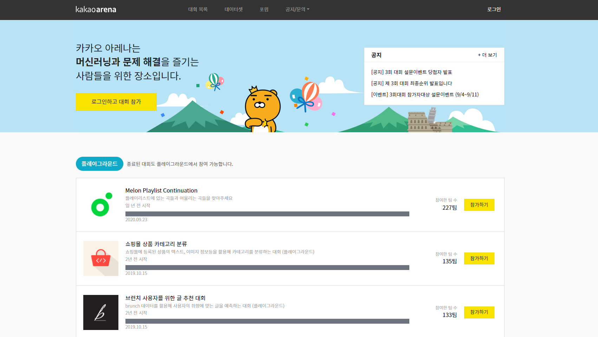

## NLP 공부 어떻게 시작할까요?

최근 딥러닝이 각광받으면서 자연어처리(NLP) 분야에도 매우 큰 발전이 있었습니다. 이에 NLP에 대한 관심이 뜨거워지고 있습니다.
하지만 막상 NLP 공부를 시작하자니 **어떻게 시작하면 좋을지 막막**해 하시는 분들이 많습니다.  
필자 또한 NLP 공부를 처음 시작할 때 컴퓨터 비전 등의 타 분야에 비해 **턱없이 부족한 자료**로 이리저리 헤매며 힘들게 공부했었던 경험이 있습니다.
이에 조금이라도 **쉽고 편하게 NLP를 공부**할 수 있도록 필자 나름의 **가이드라인을 공유**하고자 합니다.

## 어떤 분들이 읽으면 좋나요?

- NLP를 공부하고 싶은데 **어디서부터 공부해야할지 모르겠다**.
- 나만의 **NLP 프로젝트를 진행** 해보고 싶다.
- **최신 NLP 트렌드를 이해** 하고 싶다.
- NLP를 본격적으로 공부(연구)하기 전 **NLP 기초 지식을 쌓고 싶다.**

세부적인 NLP 이론보다는 **NLP의 큰 그림을 이해하는 것** 에 포커스를 두었습니다.
더 나아가 **간단한 NLP 서비스를 개발** 하고, BERT나 GPT-3 등 **최신 NLP 트렌드를 이해** 할 수 있는 역량을 쌓는 것이 목표입니다.

## 필요한 배경 지식이 있나요?

- **파이썬 기초**  
  모르는 파이썬 문법이나 코드가 나와도 **책이나 구글링으로 찾아보며 이해할 수 있는 수준**이면 충분하다고 생각합니다!
  **파이썬을 공부하는 방법** 은 이미 인터넷 상에 많이 나와있으니 **자세한 설명은 생략** 하겠습니다.

이외에도 선형대수, 미분방정식과 같은 **수학적 지식**들과 **머신러닝/딥러닝**을 알고 있으면 보다 NLP를 **수월하게 공부**할 수 있습니다. 하지만 지금 당장 이들을 몰라도 공부하는데 큰 지장은 없습니다. 오히려 NLP를 공부하면서 이들 지식의 필요성을 느끼고 함께 공부한다면, 더 큰 학습 효과를 누릴 수 있다고 생각합니다.

## 학습 가이드 선정 기준

이 글을 읽으시는 분들 중 대부분 **혼자서** 공부하는 **학생** 또는 **주니어 개발자**가 많을 것이라 생각됩니다.
이에 **학습 가이드라인 선정 기준**으로 딥러닝과 NLP 입문자가 **혼자서 충분히 공부할 수 있는 난이도**인지 고려하였습니다.

## 0. 워밍업하기 - 위클리 NLP

[https://jiho-ml.com/tag/weekly-nlp/](https://jiho-ml.com/tag/weekly-nlp/)

구글에서 컴퓨터 언어학자로 재직하시는 **박지호**님께서 연재하시는 **NLP 튜토리얼**입니다. 누구나 이해할 수 있는 **친절한 설명**이 특징으로 NLP 기초를 쌓기에 제격입니다. 2021.11.26 기준 Week 46까지 공개되었으며 지금도 꾸준히 연재되고 있습니다. **기초적인 NLP 지식**부터 BERT나 GPT와 같은 **최신 NLP 기술**까지 다루고 있어 전체적인 NLP의 원리와 흐름을 이해할 수 있습니다. 본격적으로 NLP를 공부하기 전 **위클리 NLP 내용을 쭉 읽고 정리**한다면 앞으로의 NLP 공부에 매우 큰 도움이 됩니다.

## 1. 딥러닝 기초 쌓기 - 모두를 위한 딥러닝 시즌 2

[https://deeplearningzerotoall.github.io/season2/](https://deeplearningzerotoall.github.io/season2/)

최신 NLP 기술의 대부분은 **딥러닝에 기반**하였다 해도 과언이 아닙니다. 따라서 딥러닝에 대한 이해가 반드시 필요합니다. 이를 위해 **모두를 위한 딥러닝 시즌2**를 추천합니다. 풍부한 강의 영상과 실습 코드로 **딥러닝에 대한 이해**와 Pytorch와 Tensorflow와 같은 **딥러닝 프레임워크 사용법**을 익힐 수 있습니다.

> Q. Pytorch와 Tensorflow 중 어떤 프레임워크를 선택해야 하나요?  
> A. 필자의 개인적인 의견으로 Pytorch를 추천합니다. Tensorflow는 최근에 버전 1에서 2로의 큰 업데이트가 있었습니다. 이에 코드의 많은 부분이 변경되어 입문자 입장에서 학습하는데 혼란이 있을 수 있습니다. 또한 Pytorch가 Tensorflow에 비해 난이도가 쉽다는 의견이 많아 Pytorch를 첫 딥러닝 프레임워크로 추천합니다.

## 2. NLP, 본격적으로 공부해보자! - graykode/nlp-tutorial

[https://github.com/graykode/nlp-tutorial](https://github.com/graykode/nlp-tutorial)

지금까지 **전반적인 NLP 개념**들과 **딥러닝 기초**를 익혔습니다. 이제 본격적으로 **NLP 주요 모델들을 직접 파이썬으로 구현**해봅시다. 학습 자료로 graykode님의 **nlp-tutorial을 추천**합니다. 위클리 NLP에서 간단하게나마 배웠던 RNN, Attention, BERT등의 핵심 NLP 모델들을 **100줄 이내의 깔끔한 코드로 직접 구현**해볼 수 있습니다. 또한 **관련 논문도 수록**되어 있어 욕심 있다면 더욱 **깊이 있는 학습이 가능**합니다.

## 3. 실제 데이터에 활용해보자! - 텐서플로 2와 머신러닝으로 시작하는 자연어 처리

이제 데이터셋을 활용하여 NLP 문제를 해결해볼 시간입니다. 본 책은 **실제 데이터셋을 활용하여** 텍스트 분류, 유사도 분석, 챗봇 구현 등의 **NLP 문제를 해결**합니다. 데이터셋을 활용하여 **데이터를 전처리**하고 **모델을 학습**시키는 등 **전체적인 NLP 개발 프로세스를 숙달**할 수 있습니다.

## 4. 더 깊게 공부해보자! NLP

최근에 NLP 기술은 폭발적으로 성장하고 있고 공부할거리 또한 무궁무진합니다. **NLP를 더욱 깊게 공부하고 싶으신 분**들을 위해 **몇 가지 방향을 안내**드리고자 합니다.

### 4-1. NLP 토이 프로젝트 진행하기

**이론과 실전은 다르다**는 말이 있습니다. 이제 예제를 따라하는 것이 아닌 **자신이 직접** 실제 데이터 셋을 가지고 **모델을 개발**해봅시다. 게임 내의 악성 채팅을 필터링하는 모델, 뉴스 기사를 한 줄로 요약해주는 모델 등 우리 주변에 NLP를 활용할 수 있는 재밌는 프로젝트가 매우 많이 있습니다.

> Q. 모델 학습에 필요한 데이터셋은 어디서 구할 수 있나요?  
> A. **학습 데이터셋**은 직접 **웹 크롤링**을 하거나 [AI Hub](https://aihub.or.kr/)와 같은 사이트에서 구할 수 있습니다.

### 4-2. 논문 읽고 구현하기

NLP를 깊게 공부하기에는 사실 **논문**만한 것이 없습니다.
자신이 관심 있는 주제의 논문부터 **가볍게 읽어보는 것**을 추천합니다.
최신 NLP 연구 트렌드를 이해하고 실력도 크게 향상시킬 수 있습니다.

[Google Scholar](https://scholar.google.com/)에서 원하는 키워드의 논문을 검색하는 방법이 있습니다. 아니면 NLP Top Conference에서 그 해 발표한 논문들을 살펴보는 방법이 있습니다.
NLP Top Conference에 대한 자세한 소개는 [링크](https://www.junglelightspeed.com/the-top-10-nlp-conferences/)를 참고해주세요!

### 4-3. 경진 대회에 참여하기

[Kaggle](https://www.kaggle.com/), [Dacon](https://dacon.io/) 등의 데이터 사이언스 경진 플랫폼이 있습니다. 또한 매년 상시적으로 [KaKao Arena](https://arena.kakao.com/), [Naver AI Rush](https://campaign.naver.com/clova_airush/) 등의 데이터 사이언스 경진대회가 개최되기도 합니다. 이들 경진대회에 참여한다면 실력도 기르고 우수한 결과물에 대해서는 상금이나 입사 혜택도 받을 수 있습니다.

## Reference

- [https://jiho-ml.com/1st-anniversary-qna/](https://jiho-ml.com/1st-anniversary-qna/)
- [https://ebbnflow.tistory.com/256](https://ebbnflow.tistory.com/256)
- [https://www.dacon.io/competitions/official/235813/overview/description](https://www.dacon.io/competitions/official/235813/overview/description)
