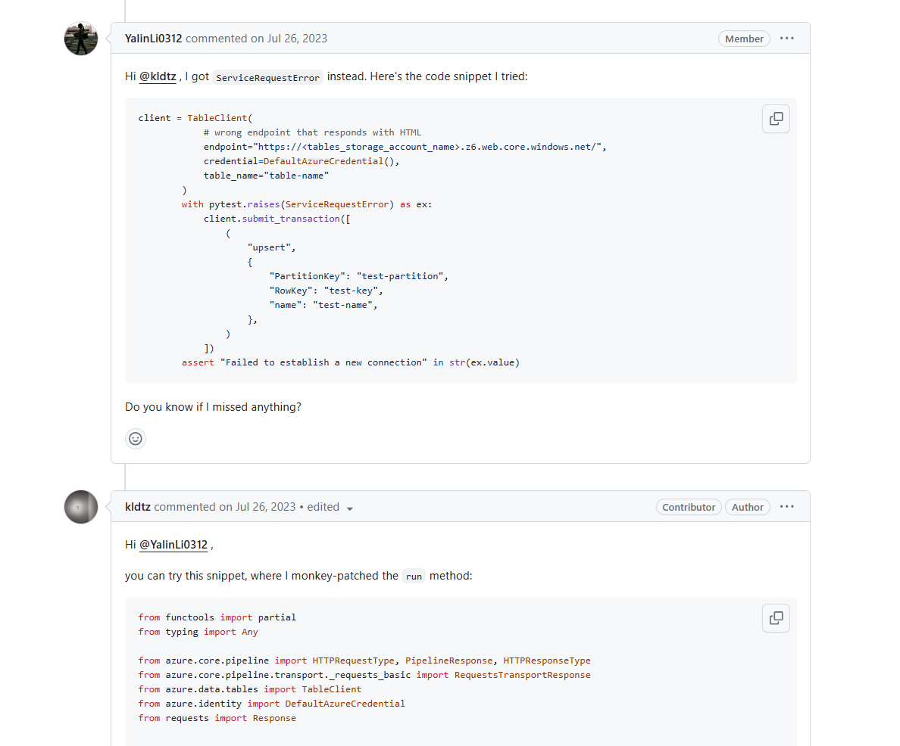

## 들어가며
어느날 [azure-sdk-for-python](https://github.com/Azure/azure-sdk-for-python)의 한 [PR](https://github.com/Azure/azure-sdk-for-python/pull/31265) 을 살펴보며 **Monkey Patch** 관련하여 궁금한 내용을 정리해보았습니다. 😄  

👉 해당 PR 링크: https://github.com/Azure/azure-sdk-for-python/pull/31265

## 어떤 점이 궁금했나요?
PR을 쭉 읽어보던 중 아래 내용이 눈에 띄었습니다.  
  

골자는 다음과 같습니다.
1. Contributor가 어떤 기능을 개선하기 위해 작업을 진행
2. 하지만 ServiceRequestError가 발생
3. Maintainer는 ServiceRequestError를 해결하기 위해 monkey patch를 제안

여기서 바로 `monkey patch`라는 단어가 등장하는데요, 예전에 전공 수업에서 얼핏 들었던 경험이 있어 무엇인지 궁금하여 더욱 찾아보았습니다.

## Monkey Patch란?

Monkey Patch는 **런타임에 동적으로 코드를 수정**하는 기법을 말합니다.
즉, 원본 소스코드를 변경하지 않고 실행 중인 프로그램의 인스턴스, 메서드 등을 **동적으로 변경**하는 것을 말합니다. 실제로 Monkey Patch는 **테스트 코드 작성**에 많이 활용되는데요, 테스트 코드 작성 시 실제 API 호출이 필요한 부분이나, 외부 서비스와의 연동이 필요한 부분을 **가짜 객체 혹은 메서드로 대체**하여 테스트를 진행할 수 있습니다.  

해당 PR에서도 마찬가지로 client의 `run` 동작은 실제 API 호출이 필요한 부분이기 때문에, **API 호출을 대체하는 가짜 메서드를 만드는** 방식으로 monkey patch를 활용하였습니다. 관련 코드는 아래와 같습니다.  

```python
def patch_run(self, request: HTTPRequestType, **kwargs: Any) -> PipelineResponse[HTTPRequestType, HTTPResponseType]:
    response = Response()
    response.status_code = 405
    response._content = b"<!DOCTYPE html><html><head><title>UnsupportedHttpVerb</title></head><body><h1>The resource doesn't support specified Http Verb.</h1><p><ul><li>HttpStatusCode: 405</li><li>ErrorCode: UnsupportedHttpVerb</li><li>RequestId : 98adf858-a01e-0071-2580-bfe811000000</li><li>TimeStamp : 2023-07-26T05:19:26.9825582Z</li></ul></p></body></html>"
    response.url = 'https://<storage>.z6.web.core.windows.net/$batch'
    response.headers = {
        "x-ms-error-code": "UnsupportedHttpVerb",
        "content-type": "text/html"
    }
    return PipelineResponse(
        http_request=None,
        http_response=RequestsTransportResponse(
            requests_response=response,
            request=None,
        ),
        context=None,
    )


if __name__ == '__main__':
    client = TableClient(
        endpoint="https://<storage>.z6.web.core.windows.net/",
        credential=DefaultAzureCredential(),
        table_name="syncenabled"
    )
    client._client._client._pipeline.run = partial(patch_run, client)
    client.submit_transaction([
        (
            "upsert",
            {
                "PartitionKey": "test-partition",
                "RowKey": "test-key",
                "name": "test-name",
            },
        )
    ])
```  

테스트 환경에서의 `client.submit_transaction` 동작을 위해 `client._client._client._pipeline.run`을 사용자가 임의로 정의한 `patch_run`으로 monkey patch 하였습니다.  

이를 통해 `client.submit_transaction` 동작 시 `client._client._client._pipeline.run`이 호출되는데, 이는 위에서 정의한 `patch_run` 메서드를 호출하게 됩니다.  

## Partial은 또 뭐죠?
Monkey Patch를 수행하는 코드는 다음과 같은데요.
```python
client._client._client._pipeline.run = partial(patch_run, client)
```
여기서 `partial`이라는 다소 생소한 함수가 등장합니다.  
`functools.partial()` 은 **하나 이상의 인자가 이미 채워진 새 버전의 함수** 를 만들 때 사용하는 함수입니다. 다시 말하면 `client._client._client._pipeline.run`에 patch_run의 인자를 미리 채우고, 추가로 client라는 인자를 추가한 것이죠. 


