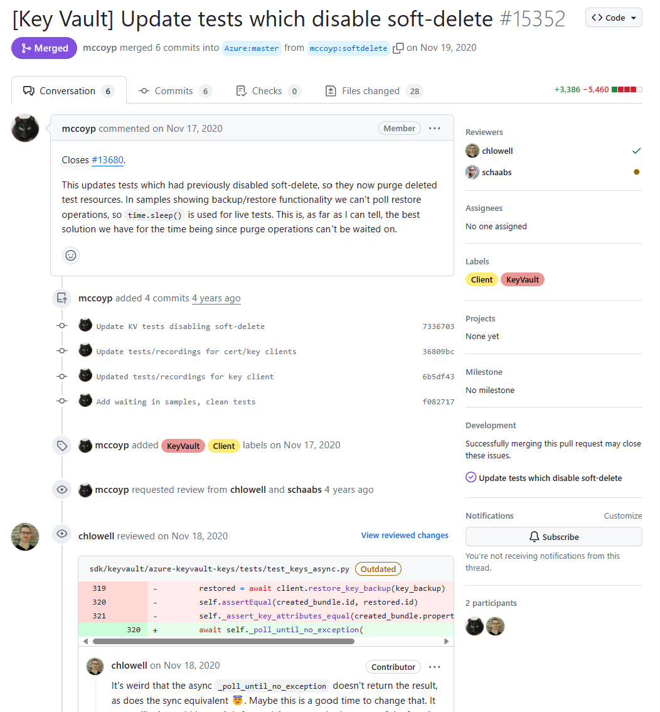
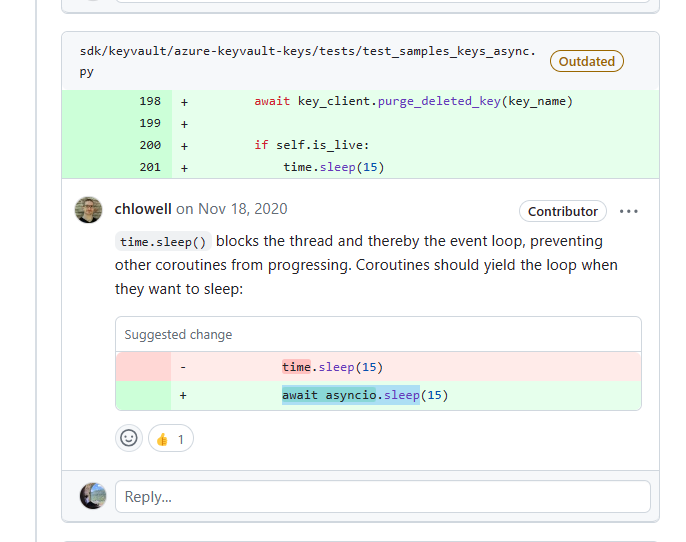

## 들어가며
이번 시간에는 azure-sdk-for-python의 [PR](https://github.com/Azure/azure-sdk-for-python/pull/15352)을 통해 **soft-delete** 기법을 알아보겠습니다. 😄  

## 어떤 점이 궁금했나요?

위 PR은 기존 코드에서 test를 위해 비활성화했던 soft-delete 기능을 다시 활성화하며, test code들을 수정한 내용입니다. 해당 PR을 읽어보던 중 `soft delete` 키워드가 문득 궁금해져 찾아보게 되었습니다.  

## Soft Delete란?
Soft Delete는 데이터베이스에서 자주 사용하는 용어로, **데이터를 삭제하지 않고, 삭제된 것처럼 표시**하는 기법을 말합니다. 즉, 데이터를 삭제하지 않고, 삭제된 것처럼 표시하는 것이죠. 이를 통해 데이터를 복구할 수 있습니다. **반대되는 개념으로 Hard Delete** 가 존재하죠.

실제로 Hard Delete는 SQL의 `DELETE` 쿼리를 사용하여 데이터를 삭제한다면, Soft Delete는 `UPDATE` 쿼리를 사용하여  `is_deleted` 컬럼을 `True`로 변경하는 방식으로 데이터를 삭제합니다.

## 그렇다면 Soft Delete가 왜 필요할까요?  
Soft Delete의 가장 큰 장점은 **복구가 가능하다는 것** 입니다. 우리가 **데이터를 실수로 삭제** 하거나, **정책 상으로 일정 기간 동안 데이터가 복구 가능** 해야 하는 경우가 있습니다. 이런 경우에 Soft Delete를 활용하면 손 쉽게 데이터를 복구 할 수 있습니다. 또한 데이터를 바탕으로 통계를 내야하는 경우에도 Soft Delete를 유용하게 활용할 수 있습니다.

## Soft Delete의 단점은 없을까요?
soft delete는 데이터를 삭제하지 않기 때문에, **데이터베이스의 용량을 차지** 하고 있게 됩니다. 또한 soft delete를 사용하면 데이터를 조회할 때, `is_deleted` 컬럼을 항상 체크해야 하기 때문에 **조회 속도가 느려질 수 있다는 단점**도 있습니다.

이외에도 해당 [블로그 글](https://brandur.org/soft-deletion)에서 **soft delete의 단점** 을 다음과 같이 소개하고 있습니다.

1. 모든 코드에서 `delete_at` 조건을 체크하고 있어야 한다.
2. 외래키의 기능이 상실된다.
3. 종속성을 체크하며 데이터의 정리가 어려워진다.
4. 현실적으로 서비스 상에서 삭제 취소, 즉 복구가 잘 일어나지 않는다.

따라서 저자는 `delete_at` 컬럼을 사용하는 것 대신에, 삭제된 데이터들을 보관하는 `deleted_record`를 만들어서 관리하는 것을 추천하고 있습니다.  혹시 자세한 내용이 궁금하시다면 [링크](https://brandur.org/soft-deletion)에서 확인해보세요!  

## 여담

**해당 PR의 리뷰 내용 중에** `time.sleep()` 대신 `await asyncio.sleep()`을 사용하라는 의견이 있는데, 다음 시간에는 **두 함수의 동작 방식의 차이** 에 대해서 자세히 알아보도록 하겠습니다. 감사합니다. 😄

