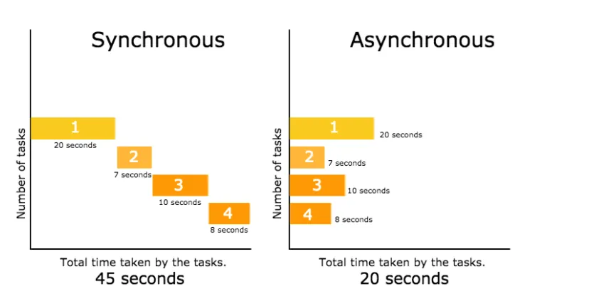
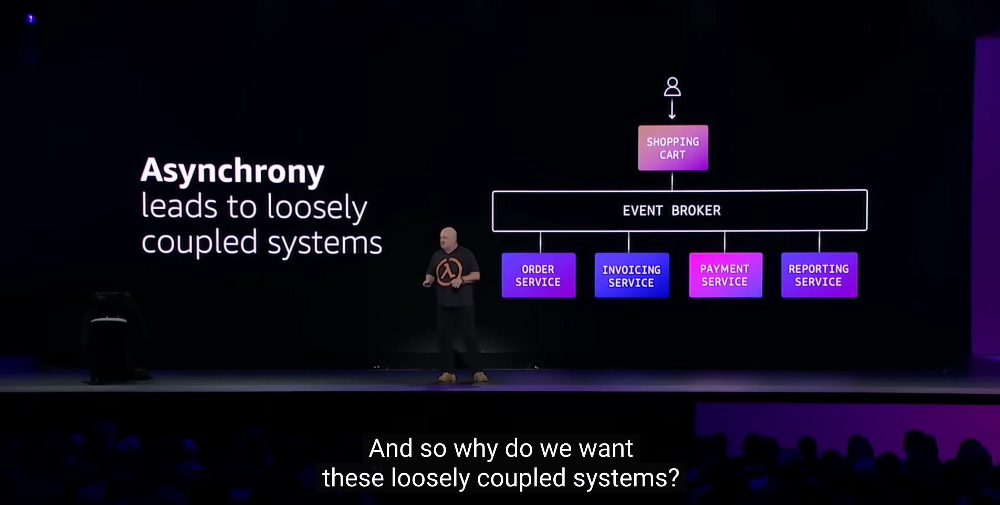

### 들어가며
이번 시간에는 Python으로 비동기 (asynchronous)를 처리하는 방법에 대해 알아봅니다.
비동기, 프로그래밍을 하다보면 정말 많이 마주치는 개념인데요.
Python 상에서 비동기 프로그래밍을 어떻게 할 수 있을지 함께 차근차근 살펴보아요!

### 비동기 (asynchronous)란 뭔가요?

**“The world is asynchronous”**  

무려 2022년 AWS re:invent Keynote에서 등장한 문구입니다. [키노트 링크](https://youtu.be/RfvL_423a-I?feature=shared&t=666)  

도대체 비동기가 무엇이길래, AWS 기조 연설에서도 이렇게 강조하는 것 일까요?


간단하게 말하면, 동기는 일을 순서대로 처리하는 방식을 이야기하고,
비동기란 앞의 일의 결과를 기다리지 않고, 다음 일을 시작하는 방식을 이야기합니다.


[이미지 출처](https://medium.com/@vivianyim/synchronous-vs-asynchronous-javascript-de4918e8ad62)  

> Q. 비동기 = 병렬 처리?  
> 비동기 처리를 여러 작업을 병렬적으로 (한꺼번에) 처리하는 개념으로 가끔 오해하고는 합니다.  
> 엄밀하게 이야기하면 비동기와 병렬 처리는 같은 개념이 아닙니다.  
> 자세한 내용은 [링크](https://stackoverflow.com/questions/6133574/how-to-articulate-the-difference-between-asynchronous-and-parallel-programming)를 참고해보세요!
>
> 

예를 들어 우리가 패스트푸드 점에서 세트 메뉴를 주문하면, 꼭 메뉴마다 정해진 순서 없이, 먼저 완성되는 순서대로 쟁반 위에 올려 세트를 완성하는 것을 볼 수 있어요.

이처럼 **작업의 실행 및 완료 순서를 보장하지 않는 시스템을 우리는 비동기**라고 불러요.

비동기는 주로 **시스템의 응답성**을 높이기 위해 많이 사용합니다.

앞에 느린 작업 (대표적으로 File or Network I/O) 작업이 있을 때, 이것이 끝날 때까지 계속 기다리지 않고, 다른 작업들을 먼저 처리할 수 있습니다. 이를 통해 사용자 입장에서는 더 응답 속도를 기대할 수 있는 것이죠.  

더 나아가, AWS는 시스템 설계 측면에서도 비동기의 이점을 설명합니다.

비동기를 사용하면 느슨하게 결합된 시스템 (loosely coupled system)을 만들 수 있다고 합니다.




시스템을 느슨하게 결합하면 아래 3가지 장점이 있다고 합니다.

- **Fewer Dependency**
    - 시스템 혹은 컴포넌트 간의 의존성이 적어집니다.
    이는  변경 사항이 발생 했을 때, 다른 곳을 수정해야 하는 일을 줄일 수 있습니다.
- **Failure isolation**
    - 한 컴포넌트에서 에러가 발생해도, 다른 컴포넌트의 작업에 영향을 주지 않고, 전체 작업이 완료될 수 있도록 합니다.
- **Evolvable architectures**
    - 새로운 변경 사항이 발생 했을 때 해당 컴포넌트만 교체해주면 됩니다.
    - 즉 아키텍처의 개발 및 발전이 용이해 집니다.

위 아키텍처를 **Event Driven Architecture**라고도 하는데, 다른 포스트에서 한번 다루어보도록 할게요 😀 

 이외에도 AWS에서 비동기의 이점과 이를 자사 제품에 어떻게 녹여냈는지 잘 설명했는데 꼭 한번 들어보는 것을 추천드려요!


### 그래서 Python에서도 비동기를 할 수 있나요?

정답은 당연히 `Yes`입니다!

아래 코드는 각 Task를 동기 방식으로 처리한 예시에요.

```python
import time
import datetime

def task(seconds):
    time.sleep(seconds)

def main():
    start = time.time()
    task(3)
    task(3)
    task(3)
    print(time.time() - start)
    
main()

#output: 9.009347915649414
```

실행 시간은 당연하게도 약 **9초**가 소요되는 것을 볼 수 있어요.

이를 비동기로 처리하면 어떻게 될까요?

```python
import asyncio
import time

async def task(seconds):

    await asyncio.sleep(seconds)

async def main():
    start = time.time()
    await asyncio.gather(
        task(3),
        task(3),
        task(3)
    )
    print(time.time() - start)

asyncio.run(main())

#output: 3.002739906311035
```

놀랍게도 **3초**가 소요되는 것을 볼 수 있습니다!

특히 python에서 비동기를 처리하기 위한 `asyncio` 라는 기본 라이브러리를 제공하면서, 

`async`, `await` 와 같은 기본적인 문법만 알고 있어도, 간단하게 비동기 프로그램을 작성할 수 있답니다.

하지만 조금만 깊이 들어가면 `이벤트 루프`, `코루틴`, `태스크`, `GIL` 과 같은 낯선 용어들이 등장하기 시작해요.  
또 파이썬 상에서 비동기가 어떻게 동작하는지 잘 모르고 사용한다면, 큰 코 다칠 수도 있어요. (제가 그랬어요 😥)

그래서 다음 시간에는 **파이썬 상에서 비동기가 어떻게 동작하는지 조금 더 깊이** 살펴보도록 할게요.

감사합니다 😀