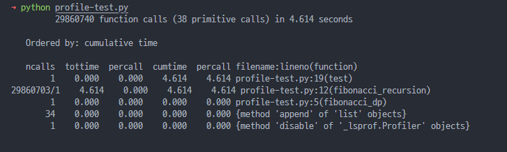

## 들어가며, 
이번 시간에는 **파이썬에서 프로파일링을 수행하는 방법**에 대해서 간단하게 알아봅니다.

> **"최적화하기 전에 프로파일링을 하라."** - Effective Python 2nd 중

SW 개발에서 기능 개발만큼이나 중요한 것은 최적화와 유지보수입니다. 이때 현재 시스템의 연산 및 메모리 사용량 등을 확인하고 분석할 필요가 있는데, 이 과정을 프로파일링이라고 합니다.


## 파이썬에서 프로파일링 수행하기
파이썬에서는 기본 라이브러리로 `profile`과 `cProfile`을 지원합니다. 
두 라이브러리의 자세한 차이점은 [링크](https://www.w3resource.com/python-interview/what-is-the-difference-between-the-cprofile-and-profile-modules-in-python.php)를 참고해보세요!

아래 코드는 피보나치를 구하는 두 가지 버전과 cProfile을 이용하여 프로파일링하는 코드 예제입니다. 

```python
from cProfile import Profile
from pstats import Stats


def fibonacci_dp(n):
    dp = [0, 1]
    for i in range(2, n + 1):
        dp.append(dp[i - 1] + dp[i - 2])
    return dp[n]


def fibonacci_recursion(n):
    if n <= 1:
        return n
    else:
        return fibonacci_recursion(n - 1) + fibonacci_recursion(n - 2)


def test():
    num = 35
    fibonacci_dp(num)
    fibonacci_recursion(num)


profiler = Profile()
profiler.runcall(test)

stats = Stats(profiler)
stats.strip_dirs()
stats.sort_stats("cumulative")
stats.print_stats()
```

프로파일링한 결과는 아래와 같습니다. 결과를 살펴보면 함수 호출 횟수와 소요 시간들을 확인할 수 있습니다. 이를 통해 간단하게 dp버전과 재귀 버전의 로직의 소요 시간을 비교해볼 수 있습니다.



## 마치며
지금까지 간단하게 cProfile을 이용하여 파이썬 프로파일링하는 방법을 알아보았습니다. 이를 통해 프로파일링을 수행하고, 최적화를 통해 시스템을 개선할 수 있습니다. 이외에도 메모리를 프로파일링 하기 위한 [tracemalloc](https://docs.python.org/3/library/tracemalloc.html), [memory_profiler](https://pypi.org/project/memory-profiler/) 개별 함수를 라인 별로 프로파일링 할 수 있는 [line_profile](https://github.com/pyutils/line_profiler) 등이 있으니, 한번 살펴보시는 것도 추천드립니다! 감사합니다 


