이번 시간에는 [Query Rewriting for Retrieval-Augmented Large Language Models](https://arxiv.org/abs/2305.14283) 논문을 리뷰합니다. 

최근에 LLM의 고질적인 문제 중 하나인 **할루시네이션 (Hallucination)** 현상을 막기 위해 **RAG (Retreiver Augmented Generation)** 기법이 주목을 받고 있습니다. RAG는 사용자의 질의와 관련된 문서 혹은 웹사이트를 검색 (Retreive) 하고 LLM에게 제공하여 보다 높은 정확도의 답변을 생성하는 기술입니다. 본 논문은 RAG 과정에서의 정확성을 높이고자 **검색 (retreive) 시 검색 쿼리를 재작성 (rewrite)하는 방법** 을 제안하고 있습니다. 크게 어려운 내용은 없으니 마음 놓고 함께 살펴보아요 ☺️


## Abstract

- 본 논문에서는 **Rewrite-Retrieve-Read라는 새로운 프레임워크를 제안** 함.
- 기존에는 knowledge-intensive task를 해결하고자 retreive-then-read 파이프라인을 많이 사용함.
- 하지만 기존 방법은 유저의 입력 텍스트와 필요한 지식 사이에 불가피한 간극 (gap)이 존재하였음.
- 따라서 LLM을 활용하여 검색 쿼리를 주어진 문맥 (context)에 맞게 Rewrite 함.
- 이때 Rewriter로 Black-box (별도로 훈련되지 않은) LLM을 활용하거나 강화학습을 사용한 LLM Reader의 피드백을 통해 훈련된 Small PrLM을 활용할 수 있음.
- 평가는 downstream task, Open Domain QA, Multiple-choice에서 수행되었으며, 일관된 성능 향상을 보여주었음.


## Methodology & Implementation
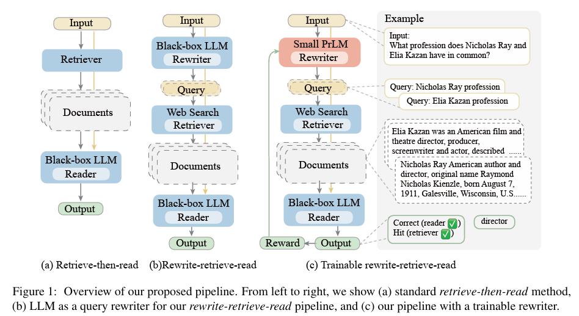

위 그림처럼 연구팀은 기존 Retriever-Reader 구조에서 rewriting step을 추가한 Rewriter-Retreiver-Reader 구조를 제안합니다. 이때 Rewriter로 Black-box LLM (Frozen Rewriter)을 활용하거나 Small PrLM (Trainable Rewriter)을 사용할 수 있습니다.  

### Frozen Rewriter
논문에 따르면 Frozen Rewriter는 다음과 같은 Prompt로 구성됩니다. 
```
Open-domain QA: Think step by step to answer this question, and provide search engine queries for knowledge
 that you need. Split the queries with ’;’ and end the queries with ’**’. {demonstration} Question: {x} Answer:
 Multiple choice QA: Provide a better search query for web search engine to answer the given question, end the
 queries with ’**’. {demonstration} Question: {x} Answer:
```

해당 Rewriter를 통해 예를 들어 `What profession does Nicholas Ray and 
Elia Kazan have in common?`와 같은 질문이 입력되면, `Nicholas Ray profession`와 ` Elia Kazan profession`와 같은 Search Query로 Rewrite하여 Retrieving을 수행할 수 있는 것이죠.

### Trainable Rewriter


TBA

Training Objective  

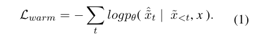  


Maximization of the expectation of the reward R  

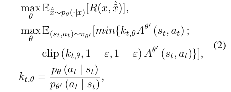

Generalized Advantage Estimation (GAE)  

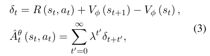

The Reward function R reflects quality of the generated queries.  

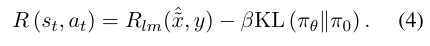  


The final loss function 

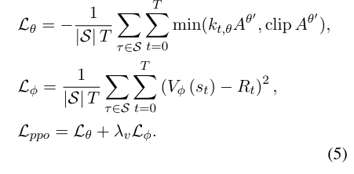


### Retrieval
연구팀은 Retrieval로 Bing Search API를 사용하였습니다. 검색은 두 가지 접근 방식으로 수행하였습니다.

1. 검색된 모든 웹 페이지에 대해, Bing이 관련 문장으로 선택한 스니펫을 사용.
2. 검색된 모든 웹 페이지에 대해, URL을 파서를 통해 모든 텍스트롤 파싱하고, BM25를 활용하여 쿼리와 더 높은 relevance score를 가지는 문서를 선택.

### Reader
연구팀은 Reader로 Chatgpt와 Vicuna-13B를 활용하였습니다. Reader는 검색된 문서를 입력으로 받아 질문에 대한 답변을 생성합니다.

## Experiments & Analysis
연구팀은 두 가지 Task를 수행하였습니다. 첫번째는 Open Domain QA, 두번째는 Multiple-choice QA입니다.  

Open Domain QA로 HotPotQA, AmbigNQ, PopQA를 사용하였습니다. 이때 평가 메트릭으로 EM과 F1을 사용하였고, RL의 Reward Function은 아래와 같습니다.   

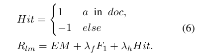  

Multiple-choice QA로는 MMLU(Massive Multi-task Language Understanding)를 사용하였습니다. 이는 인문, STEM, 기타, 사회 등 4가지 영역에 대해 각 문제당 4개의 선택지를 가지고 있는 데이터셋입니다. 이때 평가 메트릭으로 EM를 사용하였고, RL의 Reward Function 또한 선택지 중 답안은 하나이므로 EM을 사용하였습니다.  

각 Task에 대한 평가 결과는 아래와 같습니다.  전반적으로 Trainalbe Rewriter, LLM Rewriter, Retrieve-then-Read 순으로 성능이 향상된 것을 볼 수 있습니다.

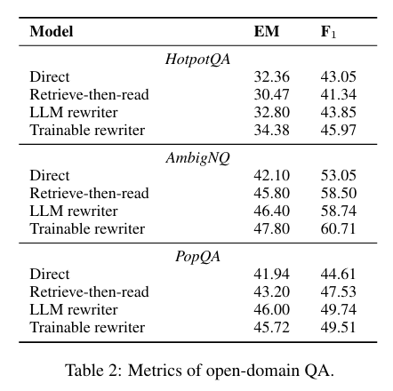
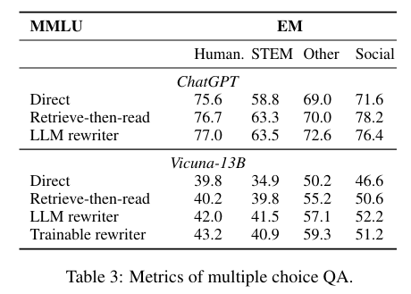

아래 표는 AmbigNQ에 대한 Retriever 분석 결과입니다.
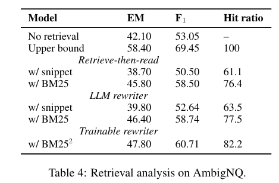

마지막으로 쿼리 생성에 대한 몇가지 예시입니다. Q0는 original query, Q1은 Frozen Rewriter, Q2는 Trainable Rewriter입니다.  
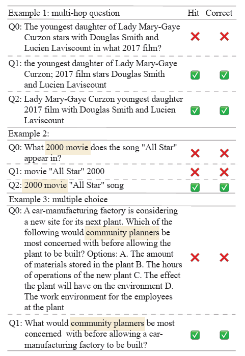

## Conclusion & Limitation
- 본 논문에서는 Retriever-Reader 구조에 Rewriter를 추가하여 성능을 향상시키는 방법을 제안하여 Retriever의 성능을 향상시켰음.
- Query Rewriting을 통해 실시간 정보 검색 시스템의 정보의 질과 관련성을 획기적으로 향상시킬 수 있는 가능성 제공.

**Limitation**
- 다운스트림 태스크에 대해서 일반화와 전문화 사이의 트레이드 오프가 존재.
- LLM Agent는 LLM을 각 샘플마다 여러번 호출하는데 의존하므로, trainable한 query rewriter를 통해 싱글턴으로 Retriever-then-Reader 프레임워크를 향상시키는 것이 필요.
- Retriever로 검색 엔진을 사용하는 것은 한계가 있을 수 있으며, Neural Dense Retrieval을 사용하여 LLM과의 활용을 최적화하는 방법에 대한 연구가 필요함.  


감사합니다. ☺️

