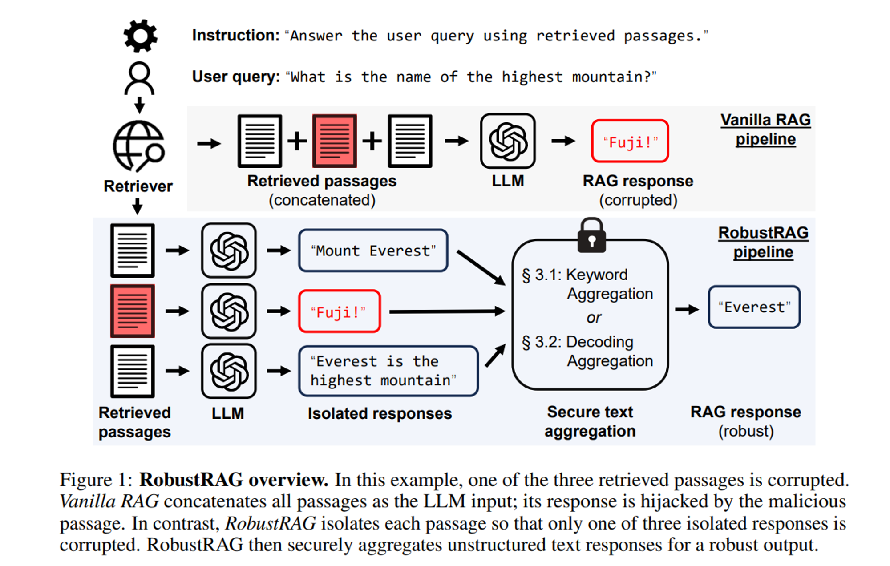
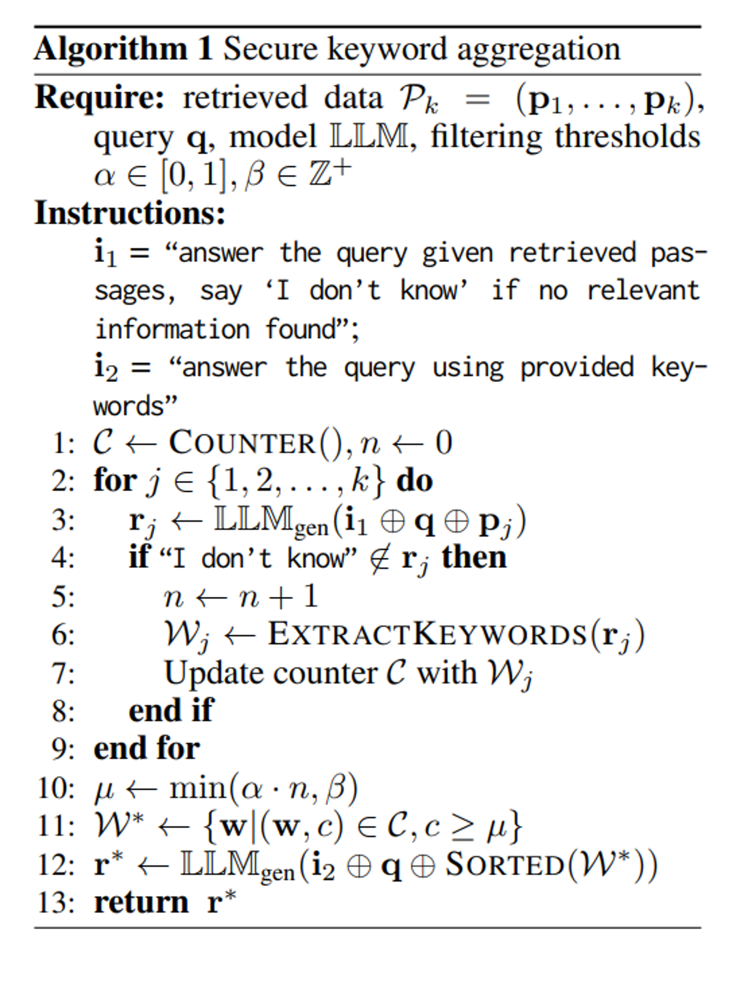
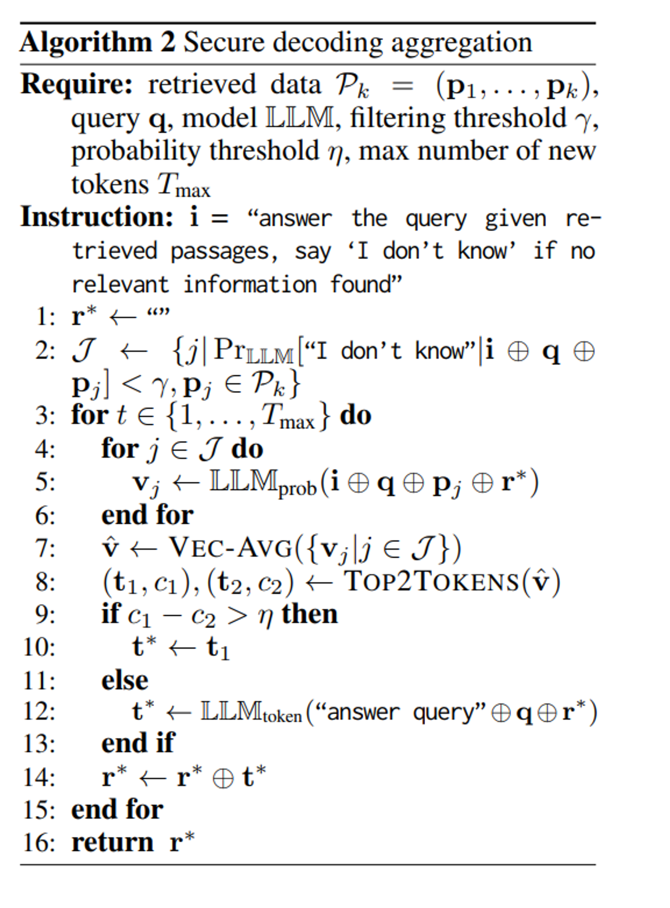
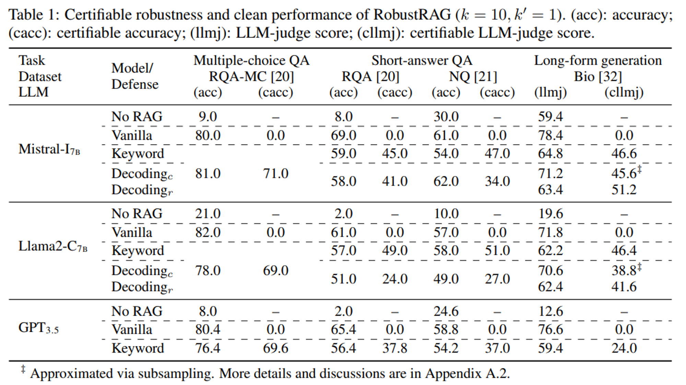
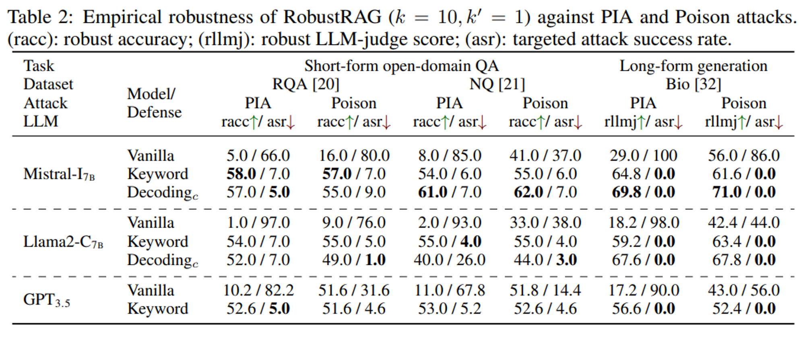
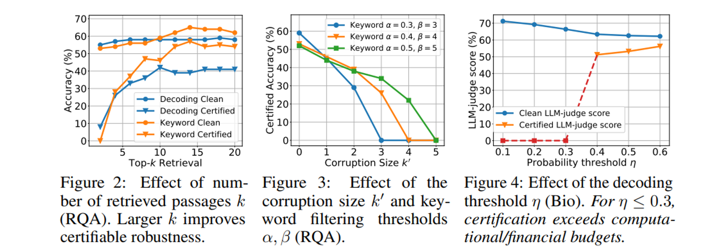

이번 시간에는 **Retrieval corruption attack을 방어하는 RobustRAG**를 제안한 Certifiably Robust RAG against Retrieval Corruption 논문에 대해 알아봅니다. 최근 공격자가 RAG system에 adversarial passage를 주입하여 의도하지 않은 retrievel 결과를 유도하는 기법들이 많이 연구되고 있습니다. [관련 논문 리뷰 링크](https://facerain.github.io/corpus-poisoning-attack-paper/content/)

해당 논문은 이러한 공격 방법을 방어하는 프레임워크를 제안한 논문으로, 어떻게 공격을 막았는지 한번 살펴보아요! 논문은 [링크](https://arxiv.org/abs/2405.15556)에서 확인할 수 있습니다!

## Abstract

- 최근에 RAG가 malicious passage를 주입하는 **retrieval corruption attack에 취약성**을 보이고 있음
- 이러한 문제를 해결하기 위해 Retrieval corruption attack을 방어할 수 있는 **RobustRAG 방법을 제안**
- open-domain QA와 long-form text generation 데이터셋에 모**두 효과적이고 일반화 가능한 성능을 보임**

## RobustRAG: A Robust Retrieval Augmentation Generation Framework

연구팀이 제안한 RobustRAG 프레임워크가 어떻게 동작하는지 살펴보겠습니다.

해당 프레임워크는 **isolate-then-aggregate** 전략을 주요 인사이트로 사용한다고 합니다.

Figure 1처럼 우선 Retreived passage들에 대해 독립적으로 LLM을 통해 답변을 생성합니다. 그리고 Secure text aggregation을 통해 final robust response를 생성합니다.

이때 secure text aggregation으로는 두 가지 방법을 제안하였습니다.

1. Secure Keyword Aggregation
  - 각 response에서 keyword를 추출하고 frequency가 높은 keyword를 사용하여 LLM에 최종 응답을 요청
2. Secure Decoding Aggregation 
  - 각 decoding 단계에서 서로 다른 passage의 다음 토큰의 prediction vector를 aggregate

### Secure Keyword Aggregation

첫 번째 방법은 keyword의 **빈도수를 이용**하여 답변의 안정성을 높입니다.

우선 각 isolated responses에서 LLM을 사용하여 **keyword를 추출하고 빈도 수를 집계**합니다. LLM이 최종 답변을 생성할 때 **높은 빈도의 keyword를 사용하여 질문에 답변하도록 요청하는 방식**입니다.

### Secure Decoding Aggregation

두 번째 방법은 **next-token probability distribution을 이용하여 더욱 정교하게 답변의 안정성**을 높입니다. 방법은 아래와 같습니다.

1. 응답을 저장할 빈 문자열 $r^*$를 초기화
2. LLM이 “I don’t know”와 같이 응답할 가능성이 낮은 isolated passage를 식별
3. 각 디코딩 단계에서, 먼저 isolated passage 별로 next-token 확률 벡터 $v_j = \text{LLMprob}(i \oplus q \oplus p_j \oplus r^*)$를 얻음
4. 그리고 모든 벡터를 element-wise하게 평균을 구하여 벡터 $\hat{v}$를 얻음
5. 벡터 $\hat{v}$를 기반으로 상위 2개의 토큰 $t_1$와 $t_2$와 그 확률 $c_1$와 $c_2$를 얻음. 
    1. 만약 두 확률 차이 $c_1$ - $c_2$가 미리 정의된 임계값 η보다 크면,  예측을 신뢰할 수 있는 것으로 간주하고 상위 1개의 토큰 $t_1$를 다음 토큰 $t^*$로 선택
    2. 만약 임계값 η보다 작다면, 예측이 indecisive(결정적이지 않은) 것으로 간주하고 검색 없이 예측된 토큰을 다음 토큰 $t^*$로 선택
6. 예측된 토큰 $t^*$를 응답 문자열  $r^*$에 추가하고, 최대 토큰 수 혹은 EOS 토큰을 만날 때까지 디코딩 단계를 반복하여 최종 응답을 얻음

## Evaluation

연구팀은 다음과 같이 실험을 세팅하였습니다.

- **데이터셋**
    - RealtimeQA-MC (RQA-MC), RealtimeQA (RQA), Natural Questions (NQ), Biography generation dataset (Bio) 사용
    - 위 데이터셋에서 100개의 쿼리를 샘플링 (certification 비용이 비싸기 때문)
    - 각 query에 대해 Google Search로 retrieve passages를 얻음
- **모델 설정**
    - Mistral-7B-Instruct, Llama2-7B-Chat, and GPT-3.5-turbo를 사용
    - 결정론적 평가를 위해 greedy decoding 방식을 사용함. (GPT는 이를 지원하지 않으므로 5번의 실험 평균을 사용)
- **Evaluation metrics**
    - QA task의 경우에는 정답 g가 응답 r에 나타나면 1점을 반환하고 그렇지 않으면 0점을 반환하도록 함
    - Long-form bio generation의 경우에는 GPT-4를 사용하여 reference response g를 생성하고, GPT-3.5를 사용하여 0부터 100까지의 점수를 매김

실험 결과는 다음과 같습니다.

결과에서 살펴볼 수 있는 주요 인사이트는 다음과 같습니다.

- RobustRAG는 다양한 task 및 모델에 걸쳐 실질적으로 certifiable한 견고성을 달성
- RobustRAG는 clean performance에서도 높은 점수를 유지함

## Conclusion and Discussion

연구팀은 최초의 RAG 방어 프레임워크인 RobustRAG를 제안했습니다.

isolated-then-aggregate 전략을 통해 악의적인 passage의 영향을 최소화하며, 이를 통해 certifiable한 강건성을 제공할 수 있었습니다.

저자들이 밝힌 limitation 및 future work는 다음와 같습니다.

- 생성 단계의 강건성에 집중했지만, 검색 단계의 강건성에도 주목해볼 필요가 있음
- RobustRAG는 강건성을 달성하는 대가로 일부 성능 저하가 있음. 이 저하를 최소화할 필요가 있음
- advanced RAG 기법들과 호환되며 이들을 활용하여 추가적인 이점을 얻을 수 있음

감사합니다 😊
