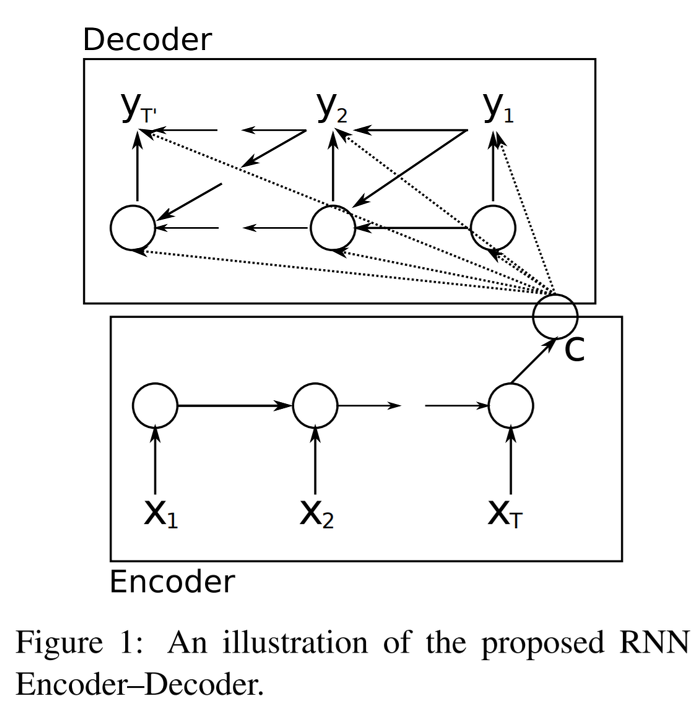
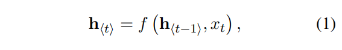
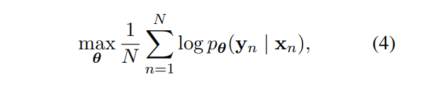
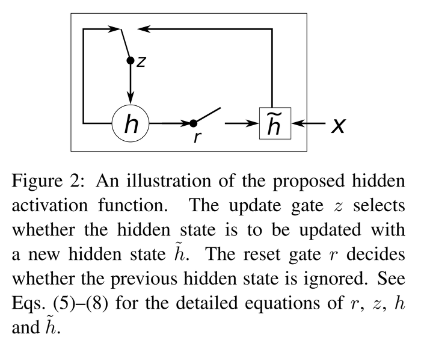
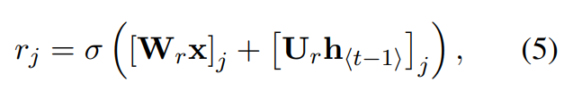
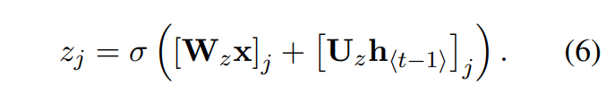
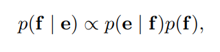
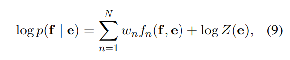
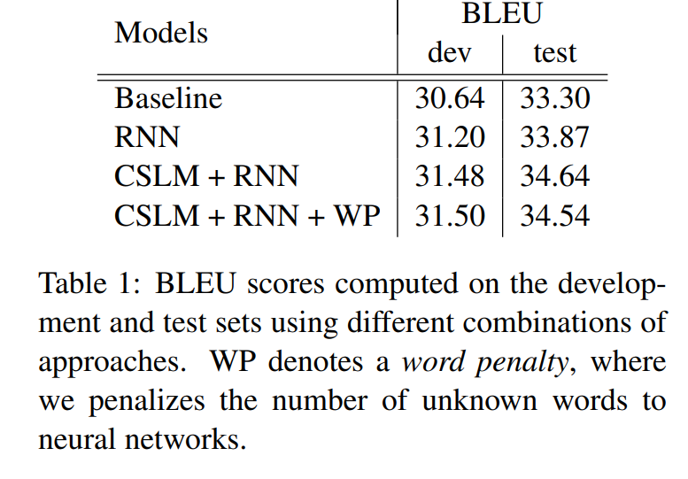
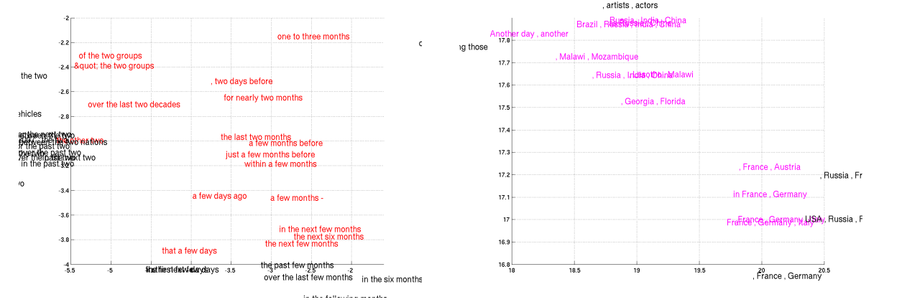

Learning Phrase Representation using RNN Encoder-Decoder for Statistical Machine Translation 논문을 리뷰합니다.  
2014년에 Kyunghyun Cho 교수님 연구팀이 발표한 논문으로, 현재도 자주 쓰이는 **seq2seq**의 기초가 되었습니다. 
원문은 [링크](https://arxiv.org/abs/1406.1078)에서 확인할 수 있습니다.  

## Abstract
- 연구팀은 **RNN Encoder-Decoder** 모델을 제안합니다. 지금 널리 알려진 Seq2Seq 모델의 토대가 된 모델입니다.
- 모델은 **입력 문장(source sentence)** 이 주어졌을 때 **조건부 확률을 최대화**하는 **출력 문장(target sentence)** 을 찾도록 훈련합니다.
- 기존 SMT 시스템보다 **성능이 향상**되었으며, 더 나아가 모델이 언어 구문의 **의미적** 그리고 **문법적**인 표현을 배울 수 있습니다.  

## RNN Encoder-Decoder
연구팀이 제안한 **RNN Encder-Decoder** 모델은 위와 같습니다. 모델의 이름과 같이 크게 **Encoder**와 **Decoder**로 구성되어 있으며, 각 셀의 Hidden Unit은 후술할 **GRU**를 사용하였습니다.   

우선 **Encoder**에서는 **가변 길이의 입력 문장**(X1 ~ XT)을 순서대로 받습니다.  입력 문장의 마지막까지 Encoder에서 받게되면, **전체 입력 문장을 요약한 C라는 hidden state**를 얻을 수 있습니다. (논문에서는 언급하지 않지만 C를 통상 **Context Vector**라고 부릅니다.)  
Encoder의 **각 step의 hidden state** 는 아래 수식처럼 **이전 step의 hidden state (h_t-1)** 과 **현재 step의 입력 (x_t)** 로 구할 수 있습니다.  

  

**Decoder**에서는 앞서 구한 **Context Vector (C)** 와 **이전 step의 hidden state(h_t-1)** 그리고 **이전 step의 출력(y_t-1)** 로 **각 step의 hidden state**를 구할 수 있습니다.   

  

모델은 **Source sentence(X_n)가 주어졌을 때 Output sentence(Y_n)가 나올 확률을 최대화** 할 수 있도록 훈련하는 것이 목표입니다. 이때 세타는 모델의 파라미터를 의미합니다.  

  

훈련된 모델은 두가지 방법으로 사용할 수 있습니다

1. input sequence가 주어졌을 때 **target sequence를 생성** (Ex. 한-영 번역기)
2. input sequence와 target sequence의 **score를 구하기**

## Hidden Unit that Adaptively Remembers and Forgets  

본 논문에서는 Hidden Unit으로 **GRU를 새롭게 제시**합니다. 

(GRU는 논문 발표 이후에 명명되었으며, 논문에서 GRU라는 명칭을 사용하지는 않습니다 🙂) 

GRU는 **LSTM에서 영감**을 받았으며, LSTM보다 구조가 간단하여 **간편하게 구현할 수 있고, 계산량이 적다는 장점**이 있습니다.  

  

GRU는 크게 **Reset gate**와 **Update gate**로 구성이 되어 있습니다. 차례대로 살펴보겠습니다.

### Reset gate

**Reset gate**의 목적은 **이전 hidden state 값을 얼마나 무시**할지 결정합니다. 아래 식에서 W와 R은 학습시킬 가중치 행렬입니다. 마지막에는 시그모이드를 취해 0~1 사이의 값을 가지게 됩니다.  

  

### Update gate

**Update gate는 이전 hidden state 값을 현재 hidden state에 얼마나 반영**할지 결정합니다.  

  

최종적인 hidden state 값은 아래와 같이 구할 수 있습니다.   여기서 ⊙는 element-wise product이며, φ는 tanh 함수입니다. **Update gate와 Reset gate가 이전 hidden state 값의 비율을 조정하여 hidden state 값을 도출**하는 것을 확인할 수 있습니다.  

")  
")  

연구진들은 GRU를 활용한 RNN이 **long-term dependency 문제를 극복**하는데 도움을 줬다고 합니다.
> Q. Long-Term Dependency 문제란 무엇인가요?  
> A. RNN에서 문장이 길어질수록 초기의 은닉층 정보를 마지막까지 전달하지 못하는 문제입니다.  예를 들어, “프랑스는 참 멋진 도시야. 그곳에서 본 에펠탑이 참 기억에 남아.”라는 문장을 생성해야한다고 가정해 봅시다. 이때 두번째 문장에서 “에펠탑”이라는 단어를 생성할 때 앞의 “프랑스”라는 단어를 기억하고 있으면 문장 생성이 수월할 것입니다. 하지만 “프랑스”라는 단어는 time-step이 진행될수록 영향력이 약해져, 결국 뒤에서는 “프랑스” 단어를 기억하지 못하고 “그곳에서 본 자유의 여신상이 참 기억에 남아”라는 엉뚱한 문장을 생성할 수도 있습니다. 이를 해결하기 위한 기법 중 하나가 본 논문에서 제시한 GRU 혹은 LSTM입니다.    

## Statistical machine translation  
연구팀은 제안한 모델을 **통계 기반 기계 번역(Statistical machine translation, SMT) 시스템에 적용**했습니다. SMT 시스템의 목표는 source sentence(e)가 주어졌을 때 아래 식을 maximize하는 translation f를 구하는 것입니다. 이때, P(e|f)를 **translation model**, p(f)를 **language model**이라고 합니다.  

  

하지만 실제로 대부분의 SMT 시스템은 아래 수식과 같이 추가 feature와 weight를 가지는 **log-linear 모델로 log p(f|e)를 계산**합니다.  

  

여기서 f_n과 w_n은 각각 n 번째 feature와 weight를 의미합니다. 그리고 Z(e)는 normalization constant입니다. 이제 **모델의 weight는 BLEU 점수를 최대화할 수 있도록 훈련**됩니다. 

앞서 살펴본 SMT 방식 중에 **phrase-based**가 있습니다. 이것은 번역을 수행할 때 단어들을 구 단위로 묶어 처리하는 방법입니다. 연구팀은 **phrase-based SMT에서 phrase table의 phrase 쌍에 점수를 매기는 파트에 seq2seq 모델을 적용**하였습니다. 

## Experiments

연구팀은 WMT14의 **영어-프랑스어 번역 태스크로 모델을 학습 및 평가**하였습니다. **Baseline 모델로 Moses라는 오픈 소스 기계 번역 모델**을 사용했습니다. 그리고 해당 모델에 RNN, CSLM 그리고 WP를 추가로 적용하여 실험하였습니다. 참고로 **CSLM**은 Schwenk가 제안한 target language model입니다.

- Baseline: Moses 오픈 소스 번역 모델, 기본 세팅
- RNN: RNN Encoder-Decoder 모델 적용
- CSLM + RNN:  RNN Encoder-Decoder과 CSLM 함께 적용
- CSLM + RNN + WP: Unknown Word에 대해 Word Penalty 추가로 적용

이외 자세한 설정이나 파라미터는 논문을 참고해주시기 바랍니다.

**정량 평가와 정성 평가를 진행**하였으며, 실험 결과는 아래와 같습니다.  

  

우선 **정량 평가**를 살펴봅니다.  

SMT에 RNN Encoder-Decoder 모델을 적용했을 때 **Baseline보다 성능이 향상**된 것을 확인할 수 있습니다. 또한 **RNN과 CSLM을 함께 적용했을 때 가장 높은 성능**을 달성하였습니다. 여기에서 연구팀은 **RNN과 CSLM이 독립적으로 번역 시스템의 성능 향상에 기여**했다고 주장합니다.  

## Qualitative Analysis  

다음으로 **정성 평가**를 살펴봅시다. 아래 그림은 모델이 학습한 **Phrase representation**입니다. 연구팀은 모델이 **semantically**하고 **syntactically**하게 phrase를 표현할 수 있다고 합니다.  

  

## Conlcusion

- 가변적인 입력 문장에 대해 가변적인 타겟 문장을 매핑할 수 있는 **RNN Encoder-Decoder라는 새로운 모델을 제시**
- 제시한 모델은 **SMT 시스템의 전체적인 성능을 향상**시킬 수 있었다.
- 추가로, LSTM보다 가볍고 빠르게 학습할 수 있는 **GRU 제시**
- 본 모델은 **번역 시스템 전체(End-to-End)로 대체**할 수 있으며, 더 나아가 **글쓰기나 음성 번역에도 활용**할 수 있다.  

## Reference
- [https://arxiv.org/abs/1406.1078](https://arxiv.org/abs/1406.1078)
- [https://jamiekang.github.io/2017/04/23/learning-phrase-representations-using-rnn-encoder-decoder/](https://jamiekang.github.io/2017/04/23/learning-phrase-representations-using-rnn-encoder-decoder/)
- [https://www.quantumdl.com/entry/5%EC%A3%BC%EC%B0%A81-Learning-Phrase-Representation-using-RNN-EncoderDecoder-for-Statistical-Machine-Translation](https://www.quantumdl.com/entry/5%EC%A3%BC%EC%B0%A81-Learning-Phrase-Representation-using-RNN-EncoderDecoder-for-Statistical-Machine-Translation)