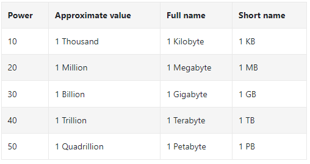
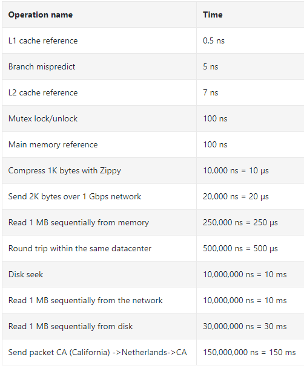
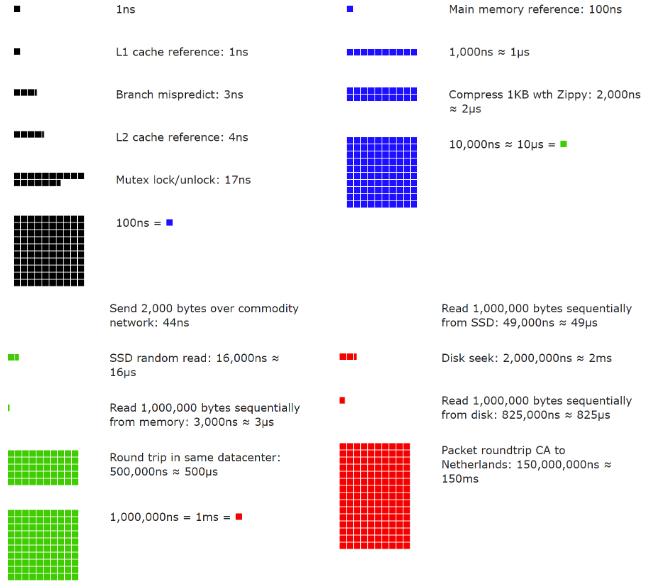

## 메시지 큐
메시지 큐란 메시지의 **무손실**을 보장하는 **비동기** 통신을 지원하는 컴포넌트이다.  
동작 과정
- producer 또는 publisher라 불리는입력 서비스가 메시지를 만들어메시지 큐에 publish 한다.
- 이를 consumer 또는 subscriber라 불리는 서비스 혹은 서버가 메시지를 받아 그에 맞는 동작을 수행한다.

메시지 큐를 이용하면 서비스 또는 **서버 간 결합**이 느슨해져서, **규모 확장성**이 보장되어야 하는 안정적 애플리케이션을 구성하기 좋다.  

생산자는 소비자의 프로세스가 다운되어 있어도 메시지를 발행할 수 있으며, 소비자는 생산자 서비스가 가용한 상태가 아니더라도 메시지를 수신할 수 있다.  

또한 오래  걸릴 수 있는 프로세스를 비동기적으로 처리함과 동시에 서비스의 규모를 독립적으로 확장해야할 때 유용하다.  

## 개략적인 규모 추정

알 수 있는 것들
- 메모리는 빠르지만 디스크는 아직도 느리다
- 디스크 탐색(seek)은 가능한 한 피하라
- 단순한 압축 알고리즘은 빠르다
- 데이터를 인터넷으로 전송하기 전에 가능하면 압축하라
- 데이터 센터는 보통 여러 지역에 분산되어 있고, 센터들간에 데이터를 주고받는 데는 시간이 걸린다

고가용성 (high availability)
- 시스템이 오랜시간 동안 지속적으로 중단 없이 운영될 수 있는 능력을 지칭하는 용어
  
SLA (Service Level Agreement)
- 서비스 사업자와 고객 사이에 맺어진 합의

아마존, 구글, 마이크로소프트와 같은 사업자는 대부분 99% 이상의 SLA를 제공

## QPS와 저장소 요구량 추정
트위터 서비스를 가정하여 QpS와 저장소 요구량을 추정해보자
가정
- 월간 능동 사용자 (MAU)는 3억명
- 50%의 사요아가 트위터를 매일 사용
- 평균적으로 각 사용자는 매일 2건의 트윗을 올린다
- 미디어를 포함하는 트윗은 10% 정도
- 데이터는 5년간 보관

QPS (Query Per Second) 추정치
- DAU (일간 능동 사용자) = 1.5억
- QPS = 1.5억 * 2트윗 / 24시간 / 3600초 = 약 3500
- 최대 QPS (Peek QPS) = 2 * QPS = 약 7000

저장소 요구량
- 평균 트윗 크기
  - tweet_id 64바이트
  - 텍스트 140바이트
  - 미디어 1MB
- 미디어 저장소 요구량: 1.5억 * 2* 10% * 1메가= 30TB/일
- 5년간 미디어를 보관하기 위한 저장소 요구량 = 30TB * 365 * 5

팁
- 근사치를 활용해서 계산하기
- 가정을 적어두기
- 단위를 붙이기
- QPS, 최대 QPS, 저장소 요구량, 캐시 요구량, 서버 수 등을 추정하는 유형이 많이 출제됨

## 참고
- 가상 면접 사례로 배우는 대규모 시스템 설계 기초 (알렉스 쉬)

