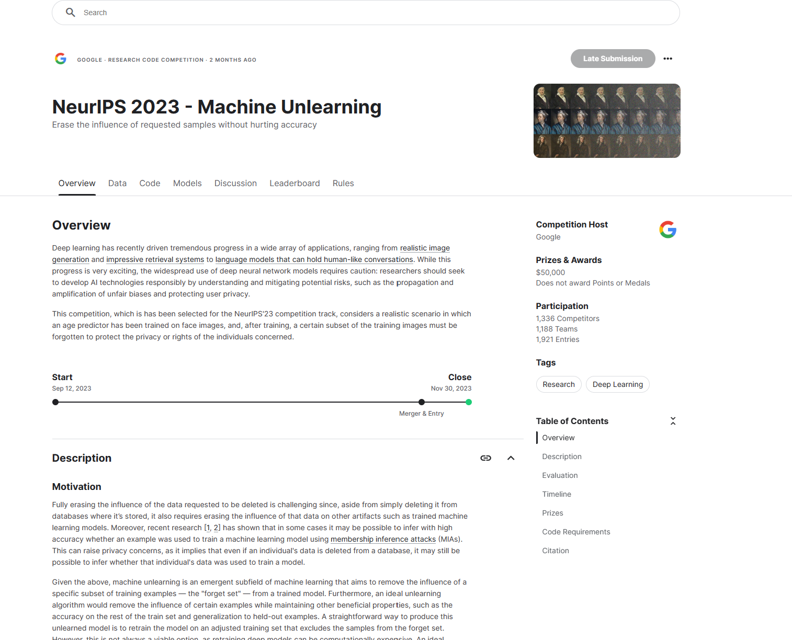
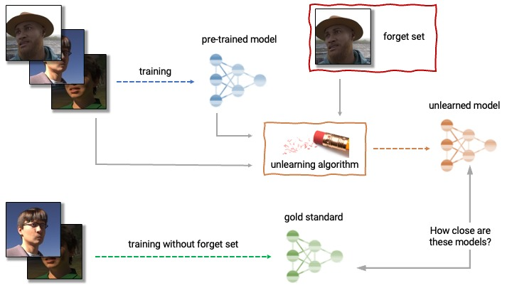
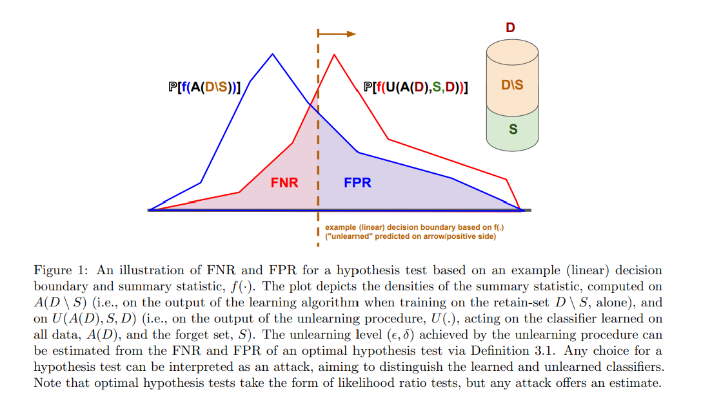
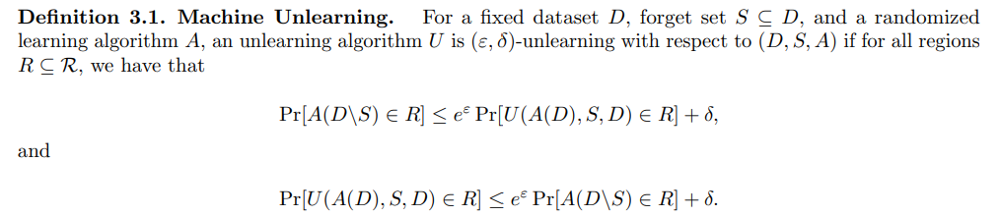

> 모두의 연구소 PERSONA LAB에서 진행한 세미나의 내용들을 참고하여 정리하였습니다 😄 

## 들어가며
이번에 NeurIPS'23에서 구글이 무려 **$50,000** 상당의 캐글 컴페티션을 개최했는데요 ([대회 링크](https://www.kaggle.com/competitions/neurips-2023-machine-unlearning)), 컴페티션의 주제는 **"Machine Unlearning"** 입니다.  Machine Learning은 많이 들어봤어도, Machine unlearning은 생소한 개념인데요, 어떤 주제인지 함께 알아봅시다 😄

## Machine Unlearning?
Machine unlearning은 말 그대로 기존에 모델이 학습했던 **특정 내용을 잊어버리게** 하는 것을 말합니다. 조금 더 자세히 이야기하면 기존 학습된 모델에 **forget set** 이 주어지고 해당 set에 포함된 데이터를 잊어버리게 하는 것을 말합니다. 그렇다면 unlearning된 모델의 분포는 처음부터 forget set을 제외하고 학습한 모델의 분포와 유사해지는 것이죠.  

  

## 왜 Machine Unlearning이 필요할까요?
최근 AI 모델을 학습시키기 위해 방대한 데이터셋을 활용하면서 **privacy (개인 정보) 문제가 불거지고 있습니다.** 대표적인 사례로 2021년도에 이루다가 개인정보 침해 논란으로 서비스를 중단한 적이 있습니다. 또한 최근에는 foundation model 등을 대상으로 한 **membership inference attack (멤버십 추론 공격)** 을 통해 **모델을 학습하는데 사용된 데이터셋을 추론하는 기법** 도 등장하며 AI 모델의 privacy 문제가 더욱 더 논란이 되고 있습니다. 

이러한 **privacy 문제를 해결하기 위해서는 어떻게** 해야할까요? 가장 확실한 방법은 **문제가 발생한 데이터를 삭제하고 모델을 처음부터 다시 학습** 을 시키는 것입니다. 하지만 최근에 모델의 사이즈가 기하급수적으로 커짐에 따라 이런 방법은 **만만치 않은 비용과 리소스가 소모** 됩니다.  

그렇다면 모델을 처음부터 재학습시키는 것이 아닌 기존 모델에서 특정 데이터를 잊어버리게 하는 방법은 없을까요? 바로 이런 문제를 해결하기 위해 나온 것이 바로 **Machine Unlearning** 입니다.  우리는 이를 통해 특정 데이터셋이 모델의 성능을 저하시킨다면, 해당 데이터셋을 잊어버리게 하여 **모델의 성능을 유지 혹은 향상** 시킴과 **동시에 모델을 재학습시키는 비용을 줄일** 수 있습니다.

2021년에 실제로 "Remember What You Want to Forget: Algorithms for Machine Unlearning" 라는 논문을 통해 Machine Unlearning 기법이 제안되기도 하였습니다. ([논문 링크](https://arxiv.org/abs/2103.03279))  

### Machine Unlearning을 어떻게 평가할 수 있을까요?  
그렇다면 어떤 모델이 Unlearning이 잘 되었는지 어떻게 평가할 수 있을까요? 해당 Competition에서는 3가지 metric을 제시합니다.  

1. **Forgetting Quality** : unlearning한 모델과 처음부터 forget set을 제외하고 학습한 모델의 추론 분포가 얼마나 유사한지를 측정합니다.  관련 그림은 아래에 첨부하였습니다. 😄
2. **Utility** : Retain set에 대한 성능 (accuracy)를 측정합니다.  
3. **Efficiency** : Unlearning 알고리즘이 기존 모델 학습보다 오래걸린다면 의미가 없습니다. 따라서 스크래치에서 재 학습하는 시간의 20% 이내로 unlearning이 이루어져야 합니다.  

  

### LLM에서도 활용할 수 있을까?  
앞서 kaggle competition은 image dataset에 대해 이루어졌는데요, **LLM에서도 이러한 기법을 활용할 수 있을까요?** 관련하여 Microsoft에서 2023년에 흥미로운 연구를 진행하였습니다. 바로 **"Who's Harry Potter? Approximate Unlearning in LLMs"** ([논문 링크](https://arxiv.org/abs/2310.02238))로 말 그대로 학습된 LLM에게 해리포터라는 인물을 잊게하는 방법을 제안한 논문입니다. 연구팀은 이를 통해 LLM 사전 훈련에 18만4000시간 이상 소요되지만, 이를 **unlearning하는데는 1시간도 소요되지 않는다는 것** 을 보였습니다. 기회가 된다면 해당 논문도 리뷰해보겠습니다. 😄

이처럼 최근 **"AI와 윤리", "책임 있는 AI" 등이 대두** 되고 있는데, 단순히 모델의 성능 향상 뿐만 아니라, 모델이 가진 위험성을 최소화하고 개선할 수 있는 방법에 대해 고민해보는 것도 좋을 것 같습니다. 감사합니다 😄