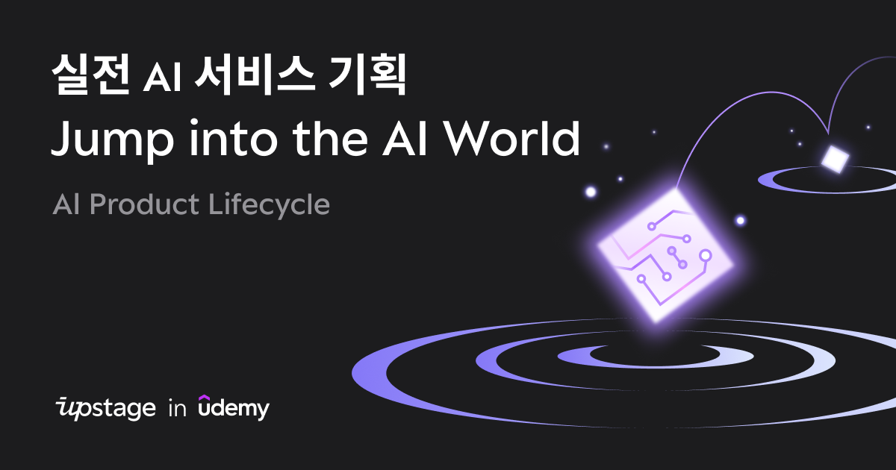
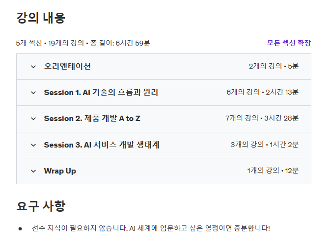

> Upstage에서 진행한 “Jump into the AI World - AI Production Lifecycle” 강의 Ambassador 활동 지원을 받아 작성된 글입니다.   

## 들어가며
안녕하세요. 이번 시간에는 **Upstage**에서 제작한 **“Jump into the AI World - AI Production Lifecycle”** 강의를 리뷰해보겠습니다. 

최근 AskUp, Solar 등을 출시하며 세계적인 AI 시장에서 큰 주목을 받고 있는 Upstage에서 제작한 강의로, AI 서비스 기획에 필요한 A to Z를 담고 있습니다.

강의는 [Udemy](https://www.udemy.com/course/upstage-jump-into-the-ai-world/)에서 바로 확인할 수 있습니다. 그럼 리뷰를 시작하겠습니다 ☺️

## 강의에서 무엇을 다루나요?
실무에서 필요한 **AI product 개발의 전반적인 프로세스** 에 대해 인사이트와 가이드를 제시하는 강의로, **3가지의 세션** 으로 구성되어 있습니다.    

1. **AI 기술의 흐름과 원리**

AI 기술의 전체적인 발전 과정과 역사를 살펴보고, AI의 기본 동작 원리에 대해 학습합니다. 또한  AI product가 어떤 과정으로 세상에 나오게 되는지, 전체적인 프로세스를 조망합니다.

2. **제품 개발 A to Z**

AI 제품의 기획부터 출시 및 유지보수까지 AI 개발에 필요한 기본적인 개념과 A to Z 프로세스를 익합니다. 

3. **AI 서비스 개발 생태계**

AI 생태계의 특징을 알아보고, 효과적인 AI 제품 개발을 위한 전사적인 협업 구조와 직무별 주요 역할 등에 대해 알아봅니다.

강의를 듣고 나면 **AI 서비스 개발의 전체적인 프로세스** 를 익힘과 동시에, 각 단계 별로 **AI 서비스 기획과 개발에 있어 유의해야 할 사항이나 포인트** 를 알려주어 실무에서도 요긴하게 사용할 수 있는 인사이트를 얻어가실 수 있습니다.  

## 강의의 어떤 점이 좋았나요?

1. **AI를 처음 접하는 누구나 쉽게 학습할 수 있습니다.**

AI를 처음 공부하실 때 많이들 수학이나 전문 개발 지식 등이 필요하지 않을까 걱정하십니다. 하지만 본 강의는 우리 실생활 주변의 예시를 들어 AI와 관련된 전문 지식이 없어도 이해하기 쉽게 설명해주는 **덕분에 AI를 처음 접하거나, 개발자가 아니더라도 누구나 편하게 강의를 수강** 할 수 있습니다. 또한 각 섹션 별로 마지막에 **연습 문제** 도 풀어볼 수 있어, 개념을 점검하는데 큰 도움이 됩니다.  

2. **실무에서 바로 활용할 수 있는  단원 별 Checklist와 Usecase 등을 제공합니다.**

또한 단순히 개념을 설명하는 것에서 그치는 것이 아니라, 강의 별로 마지막 부분에 실제 현업에서 바로 적용할 수 있는 checklist와 usecase를 제공합니다.  따라서 실무에서 본 강의의 내용을 더욱 활용할 수 있는 인사이트와 가이드를 얻을 수 있습니다.

3.  **AI 서비스 기획부터 출시 및 피드백까지 깊이 있는 인사이트를 얻을 수 있습니다.**

많은 AI 관련 강의들이 AI 학습이나 모델링 등 AI 개발에만 관련된 특정 한 부분의 내용 만을 다룹니다. 하지만 본 강의는 AI 개발 뿐만 아니라 서비스 기획부터, 데이터 수집, 정제, 학습, 피드백 등 **AI 제품 개발에 필요한 전체적인 과정** 을 엿볼 수 있습니다. 

더불어 특히 강의에서 등장하는 내용들이 **실제 AI 제품을 많이 개발해보지 않았다면 쉽게 얻을 수 없는 굉장히 수준 높고 깊이 있는 인사이트를 제공** 하고 있습니다. 따라서 **AI 공부를 시작하는 분들 뿐만 아니라 실제 현업에서 AI 제품으로 유의미한 Impact를 내야하는 분들 모두** 많은 것을 얻어가실 수 있을 것 같습니다.  

## 마무리하며
사실 처음에는 AI 개발보다는 기획 쪽의 내용이길래 큰 기대를 하지 않고 들었지만, 생각보다 많은 것을 배울 수 있어 뿌듯했던 강의였습니다. 특히 AI의 전반적인 프로세스를 조망해보며, **AI 개발자의 입장에서 모델 개발 뿐만 아니라 서비스 기획이나 유지 보수 측면에서 어떤 것들이 필요한지를 이해** 할 수 있었고, 또한 **현업에서 AI 개발을 진행하며 일어날 수 있는 다양한 문제 상황과 해결 방법을 깊이 있게 배울 수 있어서** 큰 도움이 되었습니다.  
AI에 관심 있는 누구나 본 강의를 들어보면 좋을 것 같아요. 감사합니다. ☺️

`#Jump_into_the_AI_World`
`#AI_Production_Lifecycle`
`#Upstage`
`#업스테이지`
`#AI교육`
`#PM`
`#서비스기획`
`#인공지능입문`
