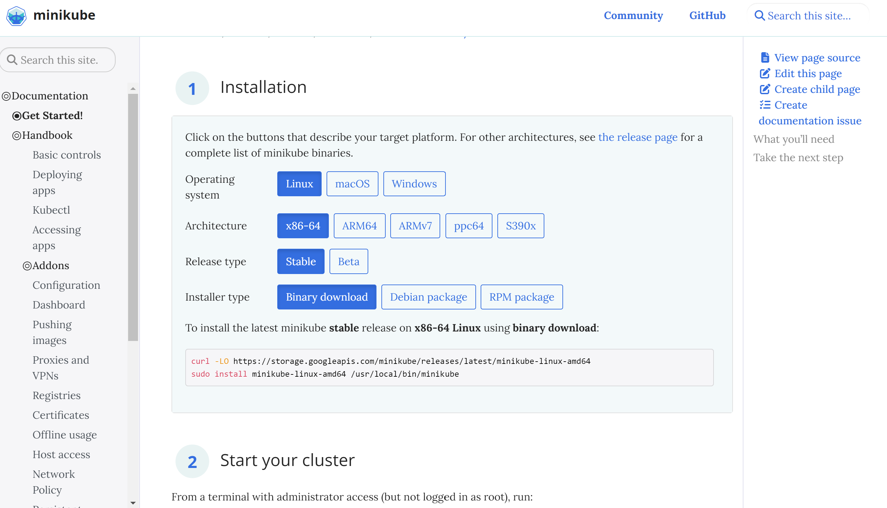

## 개요
윈도우 환경에서 쿠버네티스 환경을 세팅하는 방법에 대해 알아봅니다.

## 시작에 앞서
윈도우에 `WSL2`와 `Ubuntu` 환경이 세팅되어 있어야 합니다.

아래 강좌를 쭉 따라해보시는걸 추천드립니다!

WSL2 이외에도 윈도우 환경에 유용한 여러 개발 환경 세팅들을 할 수 있습니다.

https://nomadcoders.co/windows-setup-for-developers


## Docker Desktop 설치

다음으로 윈도우 환경에서 Docker를 사용하기 위해 Docker Desktop을 설치해줍니다.

https://www.docker.com/get-started/

그리고 Docker Desktop Setting에서 아래 WSL2 세팅을 확인해주세요.


## Kubernetes 설치
아래 사이트에서 아래와 같이 설치를 진행해주세요.

```
curl -LO https://storage.googleapis.com/minikube/releases/latest/minikube-linux-amd64
sudo install minikube-linux-amd64 /usr/local/bin/minikube
```  


설치가 완료된 후, 아래 명령어로 쿠버네티스가 정상적으로 실행되면 성공입니다!
```
minikube start
kubectl get nodes
```


## Reference
- https://kubernetes.io/blog/2020/05/21/wsl-docker-kubernetes-on-the-windows-desktop/