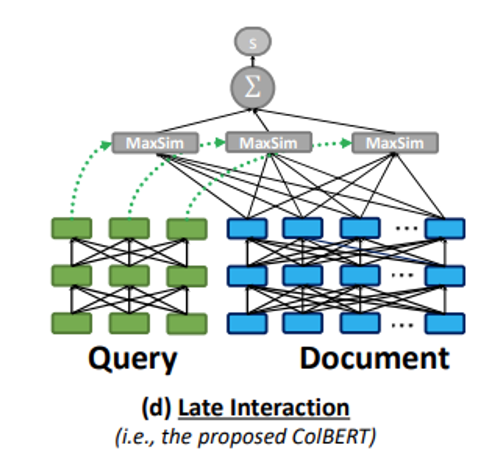
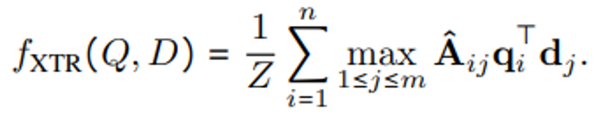
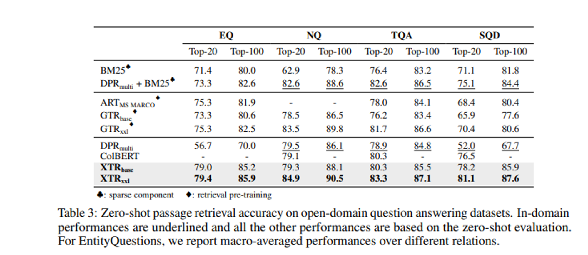

이번 시간에는 구글 딥마인드 팀에서 발표한 **"Rethinking the Role of Token Retrieval in Multi-Vector Retrieval"** 논문을 소개하고자 합니다. 최근 LLM의 부상과 함께 RAG (Retrieval-Augmented Generation)이라는 기술도 많은 주목을 받고 있는데요, 이는 외부의 신뢰할 수 있는 지식 베이스에서 유저의 질문 (query)과 관련된 지식 소스를 참고하여 답변을 생성하는 기술입니다. 이를 통해 LLM의 고질적인 문제점으로 알려진 할루시네이션과 불분명한 출처, 그리고 최신 정보를 모른다는 문제를 해결할 수 있습니다.

여기서 중요한 문제는 바로 유저의 질문 (query)과 관련된 데이터를 지식 베이스에서 적절하게 검색 (retrieval)하는 것입니다. 아무리 모델이 똑똑해도 참고하는 데이터가 이상하고 신뢰할 수 없으면 좋은 답변을 생성할 수가 없습니다. 따라서 Retrieval 분야에서는 어떻게 더욱 빠르고 정확하게 관련된 데이터를 검색해서 가져올 것인가에 집중하고 있습니다.

이번에 소개하는 **논문도 기존에 IR에서 많이 사용하던 ColBERT라는 모델의 문제점을 지적하고 이를 어떻게 해결할 수 있을지 제안**했습니다. 검색은 우리 주변에서도 정말 많이 사용되고 있는 기술이므로, 이번 기회에 같이 알아보아요! 😊  
논문은 [링크](https://arxiv.org/abs/2304.01982)에서 확인할 수 있습니다!

## Abstract
- Multi-Vector retrieval model (ex. ColBERT)은 query와 document 사이의 token-level interaction을 가능하게 하여 많은 Information Retrieval 벤치마크에서 SOTA 성능을 달성함.
- 하지만 기존에는 inference를 위해 3-stage가 필요했으며, 이러한 점은 수백만 개의 문서에 대한 처리로의 확장이 어려웠음.
- 따라서 연구팀은 **XTR, ConteXtualized Token Retriever 모델을 제안**함.
- 기존 ColBERT처럼 document의 모든 토큰이 아닌 retrieved 토큰만 scoring에 사용하여 2~3배 저렴하게 scoring을 수행할 수 있음.
- token retrieval stage에서도 기존 ColBERT 대비 향상된 recall 성능을 보여줌.
- 해당 모델은 BEIR 벤치마크에서 2.8 nDCG@10으로 SOTA를 달성함.

## A brief overview of IR

본격적으로 논문을 살펴보기 전에 Information Retrieval (IR)의 역사에 대해 간략하게 알아보겠습니다.

IR은 대규모 지식 베이스에서 사용자가 원하는 질문에 관련된 데이터를 찾는 문제입니다. 가장 관련 있는 데이터를 가져오기 위해 각 질문과 문서마다 점수를 구하고 순위를 매겨야 합니다.

### Classical IR (Sparse Retrieval)

가장 전통적으로 사용되었던 방법은 TF-IDF, BM-25와 같은 단어 기반 검색 기법입니다. 이들은 문서 내 단어의 빈도를 바탕으로 문서의 순위를 매깁니다.

예를 들어, 어떤 문서에 "cat"이라는 단어가 많이 등장하고 (TF), 다른 문서에는 많이 등장하지 않는다면 (IDF), "cat"이라는 단어는 해당 문서에서 주요하다고 유추할 수 있습니다.

이 방식은 계산이 복잡하지 않으며, 사전에 검색 엔진에서 미리 계산할 수 있습니다. 이러한 이유로, 처리 속도가 중요한 검색 분야에서 빠르고 가볍게 적용할 수 있어 많이 활용되었습니다.

### Neural IR (Dense Retrieval)

2016년대부터 Neural Model을 활용한 자연어 처리가 각광받으면서, 자연스럽게 IR에도 다양한 Neural Model들이 적용되기 시작했습니다. 기존의 Classical IR 방법들은 문서 내의 의미적 특징을 파악할 수 없다는 문제점이 있었습니다.

예를 들어, cat과 kitty라는 단어가 한 문서에 있다고 가정해봅시다. 두 단어는 사실 고양이를 의미하지만, 모델 입장에서는 두 단어를 아예 다른 단어로 인식하게 되는 것이죠. 이 외에도 문장 내의 맥락이나 의미를 기반으로 랭킹을 매길 수 없다는 문제점이 있습니다.

이와 같은 문제를 해결하고자 **Neural Model을 활용해 주어진 문서의 의미적 정보를 살려 Retrieval을 시도**하는 것입니다. 이를 Dense Retrieval이라고 부르기도 합니다.

### Cross Encoder

가장 간단하게 생각해볼 수 있는 모델은 아래 그림처럼 하나의 Encoder (예: BERT)에 Query와 Document를 입력으로 하여 Score를 계산하는 것입니다.

이렇게 하면 기존 Query와 Document의 Token-level 상호작용이 가능하여 보다 의미적인 비교 및 검색이 가능해집니다.

하지만 쿼리가 주어졌을 때 모든 Document를 대상으로 일일이 Encoder를 통해 Score를 구하고 비교해야 하므로, **실제로 수백만 건 이상의 문서를 다뤄야 하는 Retrieval System에서는 적용하기 힘들다는 단점**이 있습니다.

### Bi-encoder

다른 방법으로는 Query와 Document를 처리하는 Encoder를 별도로 두는 것입니다. 대표적으로 DPR 모델이 있습니다.

Query와 Document Encoder가 별도로 있으므로, 학습이 끝난 Document Encoder를 활용하여 미리 Document들의 임베딩을 구해둘 수 있습니다. 이를 통해 실제 Inference 시에는 Query에 대해서만 Encoder를 통해 임베딩을 구하고, FAISS와 같은 라이브러리를 활용해 미리 구해둔 Document 임베딩 중 유사한 것들을 찾아 검색을 수행할 수 있습니다. 앞서 cross encoder의 단점으로 지적되었던 추론 성능 문제를 해결할 수 있습니다.

하지만 **Token-level Interaction이 일어나지 않아 검색 성능에 있어서는 한계**가 있을 수 있습니다.

### ColBERT

**ColBERT 모델은 앞서 지적된 (1) 추론 성능/속도 문제와 (2) Token-level Interaction 문제를 모두 해결**하고자 하였습니다.

ColBERT는 이전 DRP와 달리 Scoring을 할 때 Token-level Interaction을 수행할 수 있도록 **MaxSim** 방식을 사용합니다. 또한, **Late Interaction**을 통해 각 Document의 token-level 벡터들을 미리 저장해두고 Inference 시 불러와서 사용할 수 있습니다. 이를 통해 검색 성능과 속도 두 가지를 모두 잡을 수 있었습니다.

> 검색 성능 면에서 무조건 Neural IR (Dense Retrieval)이 뛰어난 것은 아닙니다. 오히려 핵심 단어에 집중하는 Lexical Match에서는 BM-25와 같은 Sparse Retrieval이 효과적이라는 보고도 있습니다. 관련하여 Sparse Retrieval의 성능을 딥러닝 모델로 높이려는 시도들이 있었으며, 대표적으로 네이버에서 공개한 SPLADE 모델이 있습니다.
> 

이처럼 **IR 분야에서는 1) 어떻게 관련된 문서를 잘 가져올 수 있을까 (검색 성능) 2) 어떻게 빠르고, 가볍게 관련 문서들을 가져올 수 있을까 (비용) 두 문제를 모두 고민**해야 합니다.

이번에 소개해드리는 XTR 논문은 기존 ColBERT 모델의 검색 성능과 비용 관련 문제점을 지적하고, 이를 어떻게 해결했는지 소개하였습니다.

## Background

연구 팀은 ColBERT의 Inference 동작 방식을 다음과 같이 3단계로 소개합니다.

1. Token Retrieval
    
    n개의 query token에 대해 k`개의 관련된 document token vector를 검색합니다.
    
2. Gathering
    
    앞서 검색한 k`개의 후보 문서의 모든 token vector를 가져옵니다. 이때, RAM 기반의 인덱스를 사용하여 관련 token vector를 효율적으로 불러올 수 있습니다.
    
3. Scoring
    
    가져온 document들의 token vector와 query의 token vector를 이용해 점수를 계산하고, 가장 높은 점수를 받은 k개의 문서를 최종 결과로 반환합니다.

연구팀은 위 단계에서 두 가지 문제점을 지적합니다.

1. Complicate & Expensive Scoring

위 3가지 단계에서 Multi Vector를 Retrieve-Gather-Scoring 하는 과정을 거치게 되는데, 여기서 데이터를 로딩하고 floating operation을 하는 작업이 굉장히 비싼 작업이라고 합니다.

2. Train-Inference GAP

ColBERT에서 encoder의 training objective는 Scoring Stage를 위해 설계되었지만, 정작 inference에서는 retrieval로 후보 문서를 불러오는 데 사용되고 있습니다. 이는 Train과 Inference 사이의 Gap을 발생시키고, 해당 모델이 recall 성능을 내지 못하게 만들고 있다고 합니다.

## XTR: Contextualized Token Retriever

위에서 살펴본 두 가지 문제를 해결하기 위해 연구팀이 제안한 모델은 별도의 Gathering 단계 없이 token retrieval 단계에서 가져온 문서의 토큰들을 바로 scoring에 활용합니다.

관련하여 연구팀은 기존 ColBERT에서 sum-of-max scoring function이 document-level의 score를 고려하기 때문에 retrieval에서 효과적으로 동작하지 않음을 지적합니다.

sum-of-max 연산자는 문서 수준의 점수만을 고려하기 때문에, 훈련 중 교차 엔트로피 손실이 거의 0에 가깝게 됩니다.

쿼리 토큰 중 하나라도 높은 유사성을 가진 negative document 토큰이 존재하면, top-k' = 1 토큰 검색이 실패하게 됩니다. 이는 positive document의 토큰을 검색하지 못하게 만듭니다.

sum-of-max 연산자를 사용하는 모델은 일부 부정 토큰의 높은 점수를 낮추지 못합니다. 이는 문서 토큰이 실제 쿼리 토큰과의 관련성에 상관없이 높은 점수를 가지게 만들 수 있습니다.

### In-batch Token Retrieval

위와 같은 문제를 해결하기 위해 연구팀은 train 단계에서 관련된 document의 token들을 직접 retrieve할 수 있도록 모델을 학습시켰습니다.

기존 ColBERT는 아래와 같이 Score와 cross entropy loss를 계산하였습니다.

 XTR이 Score를 계산하는 식은 다음과 같습니다. 기존에서 alignment strategy가 변경되고, Z라는 normarlizer가 추가되었습니다.

 

  Alignment strategy가 의미하는 바는 document 내의 토큰 유사성이 미니 배치에서 top_k_train 내에서 검색될 수 있을 만큼 충분히 높을 때만 고려한다는 것입니다.

  

  Z는 적어도 하나의 문서 토큰을 검색한 쿼리 토큰의 수를 의미합니다. 만약 모든 (A^\hat{ij} = 0)이라면, (Z)를 작은 값으로 클리핑하고 (f_{XTR}(Q, D))는 0이 됩니다. 이로 인해 모델은 positive document의 토큰이 검색되지 못하도록 하여 negative document에 높은 토큰 유사성을 할당할 수 없게 됩니다.

  결과적으로 training의 경우 §2.1에 정의된 것과 동일한 교차 엔트로피 손실을 새 scoring 함수와 함께 사용합니다. 학습 데이터에는 문서 수준 주석만 포함되지만 XTR은 양수 문서의 중요한 토큰을 검색하도록 권장합니다.

Inference 시에는 아래 그림처럼 검색된 각 문서의 전체 vector를 불러오는 것이 아닌, 검색된 token만을 이용하여 scoring을 진행합니다.

이를 통해 scoring 단계의 계산 비용이 크게 줄어들며, 토큰 retrieval score를 재사용함으로써 중복된 내적 및 불필요한 (최대값이 아닌) 내적을 계산하지 않아도 됩니다. 

또한 비용이 많이 드는 gathering단계 (식 (1)을 계산하기 위해 모든 문서 토큰 벡터를 로드해야 함)를 완전히 제거할 수 있습니다.

Table 1을 보면 실제로 쿼리 당 요구되는 추정 FLOPs(초당 부동소수점 연산) 약 4000배 이상 크게 준 것을 확인할 수 있습니다.  

### Missing similarity imputation

하지만 inference 시에 gathering 단계가 없어지면서 고려할 점이 하나 생겼는데요, 바로 어떤 후보 document의 vector가 retreive 되지 않았을 경우입니다. 

training 단계에서는 각 positive document가 최대 n 개의 토큰 유사성을 평균화해야 합니다. 따라서 training이 진행됨에 따라 대부분 n (=쿼리 토큰의 개수)으로 수렴하게 된다고 합니다. 따라서 inference 시에 각 query token에 대해서 누락된 유사성은 n 개의 token 유사성이 있는 positive document로 취급하여 대체하게 됩니다. 수식은 다음과 같습니다.

이전 수식에서 검색되지 않았을 경우의 term 추가되었는데요, 이때  검색이 되지 않았을 경우 m_i의 값은 다음과 같습니다.

qi를 사용한 모든 토큰 검색에 대해 Dˆ에 대한 쿼리 토큰의 Missing similarity은 마지막 top-k ′ 점수에 의해 상한이 됩니다.

연구팀은 이외에도 보다 복잡한 회귀 모델을 활용하는 방안도 검토했지만 결국 해당 방법이 간단하지만 효과적인 솔루션이었다고 합니다.

## Experiments

실험을 위해 RocketQA의 hard negative sample로 MS MARCO 데이터셋을 활용해 파인튜닝을 했습니다.

그리고 평가를 위해 In-domain으로는 MS MARCO, Zero-shot 성능을 평가하기 위해 BEIR에서 13가지 데이터셋 그리고 LoTTE에서 12가지 데이터셋 마지막으로 4가지 open domain QA 데이터셋을 활용했다고 합니다. (EQ: EntityQuestions, NQ: TQAL TrivaiQA, SQD: SQuAD)

또한 18가지 언어의 multilingual 성능을 평가하기 위해 multilingual XTR (mXTR)을 학습하였고, MIRACL을 통해 평가를 수행했다고 합니다.

결과는 아래와 같습니다.

## Limitation & Conclusion

- 기존 ColBERT의 3-stage의 inference 단계를 간소화 시킨 XTR을 제안함
- 이를 통해 Scoring 시 요구되는 FLOPs를 크게 줄이고, 더불어 zero-shot benchmark에서 SOTA를 달성함
- 이외에도 제안한 objective function이 실제로 더 나은 토큰 검색을 유도하며, 골드 문서에서 더 많은 토큰을 검색하여 쿼리와 더 잘 일치하는 문맥을 제공할 수 있음
- 한계점으로는 MS MARCO에서 훈련된 결과만을 평가하였음
    - MS MARCO라는 종속성을 제거하면 어떻게 될지 모른다
    - LLM 기반 검색 데이터셋 생성이 이를 해결해 줄 수 있지 않을까?

감사합니다 😊
