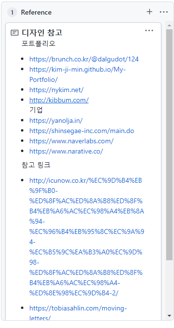
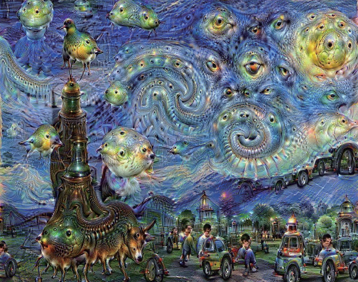

[2021 Review 1편](https://facerain.club/2021-review/)에 이어 2021년 Review 2편을 연재합니다.

(1편을 작성한지 벌써 한 달이나 흘렀습니다. 새해부터 게으름이... 😢)

2편 리뷰의 내용은 아래와 같습니다.

- FacerAin Blog 개발기
- Dongju AI 개발

## FacerAin Blog

2021년도에 가장 기억에 남는 프로젝트는 **개인 블로그 제작**입니다.
처음에는 많이들 사용하는 Tistory나 Velog로 블로그를 시작하려고 했었습니다. 하지만 그래도 **명색이 개발자인데 개인 블로그 정도는 직접 만들어 보자라는 마음으로 개발을 시작** 하였습니다.
React와 GraphQL 기반의 GatsbyJS 프레임워크로 제작하였고 개발에 약 2주 정도 소요되었습니다.

블로그 프레임워크로 Gatsby를 선택한 이유는 아래와 같습니다.

- 이미 익숙한 React 기반의 프레임워크이다.
- 따로 API 서버와 DB를 구현할 필요없이 마크다운만으로 손쉽게 페이지를 만들 수 있다.
- 커뮤니티가 활발하다. 또한 강력한 플러그인들을 많이 지원한다.

Gatsby를 처음 공부할 때 Goorm Edu 강의 [누구나 블로그 개발 할 수 있다! React 기반 Gatsby로 기술 블로그 개발하기](https://edu.goorm.io/lecture/25881/%EB%88%84%EA%B5%AC%EB%82%98-%EB%B8%94%EB%A1%9C%EA%B7%B8-%EA%B0%9C%EB%B0%9C-%ED%95%A0-%EC%88%98-%EC%9E%88%EB%8B%A4-react-%EA%B8%B0%EB%B0%98-gatsby%EB%A1%9C-%EA%B8%B0%EC%88%A0-%EB%B8%94%EB%A1%9C%EA%B7%B8-%EA%B0%9C%EB%B0%9C%ED%95%98%EA%B8%B0)에서 큰 도움을 받았습니다.

남들에게 보여지는 블로그인 만큼 **디자인**에도 크게 신경을 썼는데, 많은 기술 블로그들을 둘러보면서 좋은 디자인을 적용하기 위해 노력했던 기억이 납니다.
멋지고 화려하기만 해서 좋은 디자인이 아님을 느낄 수 있었습니다. 보기 좋고, 쓰기 편한 디자인을 만들기가 참 어렵고 많은 노력이 들어가는구나 느끼는 계기가 되었습니다.

또한 **Typescript**도 처음으로 개발에 도입했는데, 동적 타입을 지원하는 Javascript의 단점을 보완하여 보다 Convention한 개발을 경험할 수 있었습니다.

개발을 마치고, 8월 중순부터 지금까지 총 **20개의 글**을 작성하였으며, 누적 조회수는 **약 8000회**를 달성하였습니다.
아직은 부족한 블로그이지만 방문하는 사람들이 꾸준히 늘고 있다는 것이 참 뿌듯합니다.

앞으로도 Project나 About 페이지, 기타 다양한 기능(RSS, 추천 페이지)등 아직 개발할 것이 많이 남아있습니다.
**필자의 첫 블로그인만큼 애정을 가지고 계속 발전시켜 보겠습니다.** 2022년에도 FacerAin's Blog는 계속됩니다 😊

## "시 쓰는 AI: Dongju"

한국어 시를 창작하는 AI 모델을 개발하는 프로젝트를 진행하고 있습니다. 프로젝트의 이름은 평소 좋아하고 존경하는 윤동주 시인에게서 따왔습니다.
현재 데이터 수집 및 전처리를 진행하고 있고, 지금까지 약 400여편의 한국어 시를 수집 및 전처리하였습니다.

자세한 프로젝트 진행 현황은 추후 블로그 글을 통해 공유하겠습니다.

**"인공지능이 예술을 할 수 있을까?"**
바둑, 운전, 번역 등 인간 고유의 영역으로 여겨졌던 많은 분야들이 하루가 멀다하고 AI로 대체되고 있습니다.
하지만 아직 노래와 소설과 같은 예술 창작만큼은 인공지능이 쉽게 주도권을 가져오지 못하고 있습니다.
아무래도 예술이라는 것은 단순히 수식과 알고리즘을 넘어서는 "무엇"인가가 있지 않을까 합니다.

윤동주 시인처럼 시대가 지나도 사람들에게 감동과 여운을 주는 작품을 과연 AI가 만들 수 있을지. 고민하고 조금이나마 해답을 찾아보고자 합니다.

## 정리하며...

지금까지 2021년 FacerAin 개발 리뷰를 해보았습니다. 2021년도 코로나니 군대니해서 다사다난했던 해였습니다. 그래도 그 속에서 좋은 사람들을 많이 만나고, 새로운 것들을 많이 배울 수 있어 참 뜻깊은 한해였습니다. 2022년도 부디 건강하고 의미있게 보낼 수 있으면 좋겠습니다. 😃

늦었지만 다들 새해복 많이 받으시고, 2022년도 의미있는 한 해 보내시길 바랍니다!

