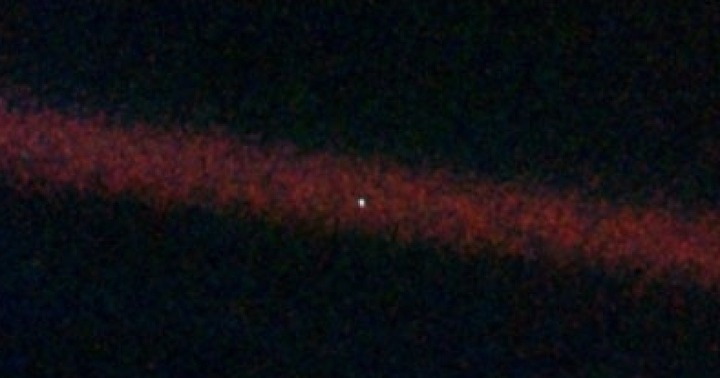

### 2022 회고

2023년 토끼 띠의 한해가 밝았습니다. 🐰

블로그를 처음 시작하고 [2021년 회고](https://facerain.club/2021-review/)를 작성했던게 엊그제 같은데, 벌써 2022 회고를 작성하게 되었습니다.

이번 한 해는 (드디어!) 군대도  전역하고, 네이버 부스트캠프 aitech도 참여하는 등 나름 굵직굵직한 일들이 많이 있었습니다. 

특히 부스트캠프에서 좋은 동료들도 만나고, 값어치를 매길 수 없는 소중한 경험들, 지식들을 키울 수 있었던 뜻 깊은 한해였습니다.

이번 2022 한 해를 한 문장으로 정리한다면 아래와 같습니다.

**“나는 어떤 사람이 되고 싶은가?”**

이번 포스트에서는 위 물음에 대한 답을 정리해보고자 합니다.

관련하여 부스트캠프에서 변성윤 마스터님께서 캠퍼들의 성장을 위한 **두런두런** 이라는 프로그램을 진행하였습니다.

포스트를 작성하는 현재 (2023-01-08) 4회차까지 진행하였는데, 관련하여 느낀 소감과 함께하여 2022 회고를 남겨보고자 합니다.

### **성장**

인생에서 큰 벽처럼 느껴졌던 군대를 어느덧 전역하고,  부스트캠프를 참여하며 나름 앞으로의 인생에서 깊은 고민이 있었습니다.

바로 **내가 잘 성장하고 있을까?**, 또 앞으로 **더 잘 성장하기 위해서는 어떻게 해야 할까?** 에 대한 의문이었습니다.

개발자하면 빼 놓을 수 없는 키워드 중 하나가 바로 **성장**입니다.  

다들 개발자에게 성장은 중요하다, 되도록 성장할 수 있는 환경으로 가라고 합니다.

하지만 구체적으로 성장하는 방법에 관해서는 주변에서 그 누구도 알려주지 않고, 깊게 고민을 해본 기회도 얼마 없습니다.

그런 와중에 마침 부스트캠프에서 성장과 관련된 두런두런 강의를 진행했습니다..

두런두런에서는 개발자의 성장과 커리어, 휴식에 대한 다양한 이야기를 들을 수 있었습니다.

강의에서 한가지 큰 깨달음을 얻을 수 있었는데요.

**“나만 이런 고민을 하는게 아니구나”**

### **조바심**

제가 느끼고 있는 불안함과 욕심, 조바심은 나만 느끼고 있는 것이 아니구나라는 것을 느꼈습니다.

한편으로 위로가 되면서도, 조금 더 제 자신을 객관적으로 볼 수 있는 기회가 되었습니다.

“**나는 왜 조바심을 느끼고 있을까?”**  

위 물음에 답하기 위해 한번 과거로 돌아가보았습니다.

개발을 처음 접한 것은 초등학교 때입니다.

어릴 때 무엇인가를 뚝딱뚝딱 만드는 것을 좋아했고, 이때 개발만한 것이 없었습니다.

따로 돈 들이지 않고, 내 머릿 속에 있는 것을 만들어낼 수 있는 개발이 정말 재밌었습니다.

간단하게 게임을 하나씩 만들어보고 주변 친구들에게 공유하는데서 보람과 성취를 느꼈습니다.

그리고 시간이 흘러 컴퓨터공학과를 진학하고, 지금도 개발자의 꿈을 쫓고 있습니다. 

그래서 나름 비슷한 나이의 또래들보다는 개발 관련해서 이것저것 많이 해보았습니다.

하지만 개발을 경험한 시간에 비해 막상 그럴듯한 이력이나 스펙은 없었습니다.  

**여기서 나는 어릴 때부터 개발에 이만큼 투자했는데, 남들보다 뒤쳐지면 어떡하지에서 오는 불안함이 컸습니다.**  

만약 내가 이 분야에서 두각을 보이지 못한다면, 그동안 투자한 시간들, 또 나에게 남는 것은 무엇이 있을지 막막했고, 그래서 또래보다 항상 앞서 나가야 한다는 조바심이 생기게 되었던 것 같습니다.

하지만 이번 두런두런 강의를 들으며 조바심을 어떻게 다룰지 배울 수 있었습니다. 

**결국 중요한 것은 지금 나 자신이 어떻게 할지라는 점이죠.**

나의 상황을 객관적으로 인지하고, 현재의 성장에 집중해보자는 목표를 가지게 되었습니다.

### **Gap Year**

지금까지 학부 2년을 돌이켜보면 개발 관련하여 이것저것 많이 해본 것 같은데, 기억에 남는 것은 크게 없다고 생각합니다. 왜 그럴까요?

바로 **자기주도적인 활동을 별로 못했기 때문**  이라고 생각합니다.

학부 2년동안 남이 정해준 과제, 남에게 보여주기 위한 발표만 진행했습니다.

그렇기 때문에 깊이 고민하고, 문제를 해결했던 기억나는 경험이 부족했던 것이 아닐까합니다.

그런 의미에서 이번 **부스트캠프가 gap year** 이라고 생각했습니다.

남이 주는 과제만 해결하는 것이 아닌, **내가 하고 싶은 일을 주도적으로 찾고 해보자**라는 목표를 가졌습니다.

관련해서 아래의 질문들에도 답을 해보기로 하였습니다.

- “나는 왜 개발자를 하고 싶을까?”
- “나는 개발자가 되면 행복할 수 있을까?”
- “행복한 개발자가 되려면 어떻게 해야할까?”

### **행복한 개발자가 되려면?**

마침 우연한 기회로 손흥민 선수의 아버지인 손웅정 감독님께서 출연하신 유퀴즈에서 제 나름의 답을 찾을 수 있었습니다.

- **인무원려 필유근우** - 멀리 보지 않으면 가까이서 근심이 생긴다
- 손흥민 선수 본인이 좋아하는 축구를 하면서 행복을 느끼는게 가장 큰 바람
- 대신에 행복하려면 자기가 운동장에서 축구를 잘해야 행복하다
- 그렇기에 하루에 6시간씩 혹독하게 기본기 연습을 할 수 있었다.

이것을 개발자에 대입한다면 다음과 같다고 생각합니다.

- 나도 내가 좋아하는 개발을 하면서 인생에서 행복을 느껴보자.
- 근데 개발을 잘 못하는데 행복한 개발자가 될 수 있을까?
- 우선 개발을 잘해야 한다. 실력 있는 개발자가 되자.
- 실력 있는 개발자가 되기 위해서는 기본기가 중요하다. 기초 지식, 커뮤니케이션 스킬 등을 갈고 닦자.
- 그렇기에 지금 하루종일 개발하고, 공부하고, 공유하는 것들을 의미있고 행복하게 생각할 수 있지 않을까?

그동안 개발을 공부하면서 내심 이런 불안함이 있었습니다.

- 내가 지금 열심히 공부한다고해서 행복한 인생을 살 수 있을까?
- 이걸 배우고 열심히 한다고 과연 취업을 할 수 있을까?
- 내가 지금 배우는 것들이 나중에 쓸모없어지면 어떡하지?
- 지금 주변 동기들보다 뒤쳐지면 어떡하지?

지금 눈 앞의 일들에만 집중하면 근심이 쌓인다는 말처럼

오히려 멀리 보고, 목표가 단순해지니 위와 같은 고민들이 해소되고 자신감을 얻을 수 있었습니다.

지금까지 열심히 공부하고, 노력했던 것들이 의미 없게 느껴지지 않고 행복한 인생의 한 걸음으로 생각할 수 있는 계기가 되었습니다. 

**“실력 있는 개발자가 되자. 그것이 곧 행복한 개발자가 될 수 있는 지름길이다.”**

### 어떻게 쉴 것인가?

사실 이전까지는 인생에서 쉬는 것에 깊이 고민을 해본적이 없었던 것 같습니다.

단순히 내가 힘들고, 일이 잘 안풀리는 것은 내가 노력을 덜 했기 때문이라고, 더 열심히 해야한다고 생각을 했던 것 같습니다.

근데 이번 두런두런을 들으며 **어떻게 잘 쉴 것인가**에 대한 고민도 할 수 있었습니다.

돌이켜보면 도저히 마음과 몸이 따라주지 않는데 무리하게 붙잡고 있느라 이도저도 안된 경험이 많이 있었습니다.

 

그래서 한번 저만의 짧은 쉼 패턴과 긴 쉼 패턴을 고민해보았습니다.

**짧은 쉼**

- 드립 커피 내리기
    - 머리가 복잡할 때면 커피를 직접 갈아서 드립 커피를 내리기
- 1시간 오프라인 타임
    - 일이 잘 안풀릴 수록 잠시 일에서 멀어지자. 의도적으로 인터넷, 채팅을 끊고 혼자 책을 읽거나 생각을 해보자.
- 간단한 운동
    - 우선 몸을 움직이자. 그럼 마음도 편해진다.

**긴 쉼**

- 오랫동안 여행을 떠나기? 드라마 몰아보기? 사실 아직 잘 모르겠다. 이제부터라도 고민해보기.

### 정리하기

지금까지 2022년 동안 이룬 내면의 성장을 위주로 한번 정리를 해보았는데요.

단순히 전에는 개발자가 되고 싶다. IT 쪽에서 일을 하고 싶다였다면,

이번 년도에는 구체적으로 어떤 개발자가 되고 싶고, 어디에서 행복을 느끼고 싶은가 깊게 고민해볼 수 있는 정말 좋은 기회였습니다.

2편에서는 1편에 이어 어떤 프로젝트 등을 진행했고, 구체적으로 어떤 실력있는 개발자가 되고자 하는지 정리하고 공유해보고자 합니다.

마무리하며 요즘 코스모스라는 책을 읽고 있는데, 감명 깊은 구절을 공유하겠습니다.

아래 사진은 태양계 밖을 탐사하기 위해 보내진 보이저 1호가 지구를 찍은 사진입니다.

사진 상의 작은 밝은 점이 우리가 살고 있는 지구, **“창백한 푸른 점”** 입니다.

아래 글은 코스모스의 저자, 칼 세이건이 창백한 푸른 점에 대해 자신의 생각을 남긴 것입니다.

---
  

여기가 우리의 보금자리고 바로 우리입니다.  
이곳에서 우리가 사랑하고 우리가 알고  
우리가 들어봤으며 지금까지 존재한 모든 사람이 살았습니다.  

우리의 기쁨과 고통  
우리가 확신하는 수천 개의 종교와 이념, 경제 체제  
모든 사냥꾼과 식량을 찾는 이들  
모든 영웅과 겁쟁이, 문명의 창조자와 파괴자  
모든 왕과 농부  
모든 사랑에 빠진 연인  
모든 어머니와 아버지  
촉망 받는 아이, 발명가와 탐험가  
모든 스승과 부패한 정치인  
모든 슈퍼스타  
모든 최고의 지도자  
역사 속의 모든 성인과 죄인이  

태양 속에 떠다니는 저 작은 먼지 위에서 살다 갔습니다  
지구는 코스모스라는 거대한 극장 위의 아주 작은 무대입니다  

그 모든 장군과 황제들이 아주 잠시 동안  
저 점의 작은 부분의 지배자가 되려 한 탓에 흘렀던  
수 많은 피의 강들을 생각해십시오  

저 점의 한 영역의 주민들이  
거의 분간할 수도 없는 다른 영역의 주민들에게  
끝없이 저지르는 잔학 행위를 생각해 보십시오  

그들이 얼마나 자주 불화를 일으키고  
얼마나 간절히 서로를 죽이고 싶어 하며  
얼마나 열렬히 증오하는지…  

우리의 만용, 우리의 자만  
우리가 우주 속의 특별한 존재라는 착각에 대해  
저 창백하게 빛나는 점은 이의를 제기합니다  

우리 행성은 사방을 뒤덮은 어두운 우주 속의  
외로운 하나의 알갱이입니다.  
 
이 거대함 속에 묻힌 우리를  
우리 자신으로부터 구해 줄 이들이  
다른 곳에서 찾아올 기미는 보이지 않습니다  

지구는, 아직까지 알려진 바로는  
생명을 품은 유일한 행성입니다  

적어도 가까운 미래에  
우리 종이 이주할 수 있는 곳은 없습니다  
다른 세계는 방문할 수 있지만  
정착은 아직 불가능하죠  

좋든 싫든, 현재로선  
우리가 머물 곳은 지구뿐입니다  

천문학을 공부하면 사람이 겸손해지고  
인격이 함양된다는 말이 있죠  
멀리서 찍힌 이 이미지만큼  
인간의 자만이 어리석다는 걸 잘 보여주는 건 없을 겁니다  

저는 이것이, 우리의 책임을 강조하는 것 같습니다  

**서로 좀 더 친절하게 대하고  
우리가 아는 유일한 보금자리인 창백한 푸른 점을  
소중히 보존하는 것이 우리의 의무입니다.**  

코스모스 中, 칼 세이건  

---

창백한 푸른 점에 살고 있는 한 사람으로써, 2023년의 내면의 목표입니다.

- 나를 사랑하고 가꾸기
- 남들에게 시니컬해지기 말기, 다정하고 친절한 사람이 되자.
- 주변에 베풀고 함께 자라기