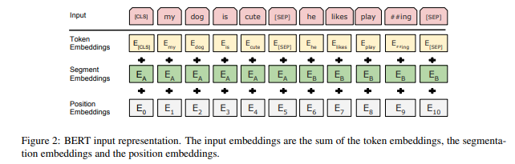

이번 시간에는 [BERT: Pre-training of Deep Bidirectional Transformers for Language Understanding](https://arxiv.org/abs/1810.04805) 논문을 리뷰합니다.  
BERT는 등장과 동시에 Question Answering 등 다양한 NLP 문제들에 강력한 성능을 보여주며 NLP 분야에 한 획을 그은 모델입니다.  

## Abstract
- 연구팀은 BERT(**Bidirectional Encoder Representations from Transformers**) 모델을 제시합니다.
- BERT는 Deep bidirectional representation 모델로 unlabeled text를 **양방향으로 학습한 것이 특징** 입니다. (ELMO와 GPT-1과의 주요한 차이점)
- 모델은 downstream task를 수행하기 위해 큰 모델 수정 없이 **단지 하나의 출력 레이어를 추가하는 것으로 파인튜닝을 진행** 할 수 있습니다.
- 특히 파인튜닝한 bert 모델은 **11개 NLP Task에서 SOTA 성능을 달성** 할 정도로 성능이 좋은 것이 특징입니다.  

## Introduction
최근 많은 NLP Task에서 pre-trained 모델을 사용하고 있습니다. pre-trained 모델이 성능이 좋고 효율적이기 때문입니다.  
pre-trained 언어 모델을 downstream-task에 적용하는 방법으로는 크게 두 가지가 있습니다.
**바로 Feature based와 Fine Tuning입니다.** 두 방법의 특징은 아래와 같습니다.

### Feature based
- **어떤 특정 task를 해결하기 위한 architectures를 만들고, 여기에 pre-trained representations를 추가적인 feature로 제공하는 방법입니다.**
- 대표적인 방법으로는 ELMO가 있습니다.

### Fine Tuning
- **특정 task를 위한 파라미터는 최소한으로 두고, pre-trained parameter를 downstream task로 학습시키는 방식입니다.**
- 대표적인 방법으로는 gpt-1이 있습니다.  

위에서 언급한 ELMO와 GPT-1 모두 단방향 구조라는 공통점이 있습니다. 

> Q. ELMO 구조를 보면 양방향 아닌가요?
> A.  bi-LSTM 구조를 자세히 보면 left-to-right LSTM과 right-to-left LSTM이 결합되어 있습니다. 이 두개의 LSTM은 독립적으로 학습되어 결합되는데, 이는 근본적으로는 양방향이 아닌 단방향 모델이라 할 수 있습니다.  

연구팀은 단방향 구조가 pre-trained 모델의 성능을 제한한다고 생각하였습니다. 따라서 연구팀은 **모든 레이어에서 양방향 학습을 할 수 있는 bert를 제안합니다.**  
이를 위해 bert에는 크게 **두가지 학습 Task를 진행** 합니다.  

### MLM(Masked Laguage Model)  
기존 Language Model의 경우 주어진 단어 시퀀스를 통해 그 다음 단어를 예측하는 Task로 학습합니다. 하지만 이때 현재 입력 단어 이후의 단어들의 정보를 모델에게 알려줄 수 없습니다.(left-to-right, 단방향) 

그에 반해 MLM은 문장에서 무작위 토큰에 빈칸(MASK)을 해놓으면 빈칸(Mask)에 맞는 단어를 찾는 것이 목표로 하는 모델입니다. Transformer encoder에 특정 토큰에 MASK 처리를 한 문장을 한번에 넣고 MASK 단어의 정답을 찾게 하도록합니다. **이는 Mask 단어의 left, right context를 모두 활용해야 하므로  deep-bidirectional  학습을 가능하게 합니다.**  

### NSP(Next Sentence Prediction)

**두 개의 문장이 이어지는 문장인지 모델이 맞추도록 하는 Task입니다.**  자세한 내용은 아래 섹션에서 다시 살펴보겠습니다.

## Model Architecture
BERT는 Transformer에서 Encoder 부분만을 사용하여 구성됩니다.
Transformer가 궁금하신 분은 [글](https://facerain.club/transformer-paper/)을 참고해주세요!  
연구팀은 BERT_base와 BERT_large로 나누어 모델을 구축하였습니다.
각 모델의 파라미터는 아래와 같습니다. L은 레이어의 개수, H는 히든 레이어의 크기, A는 self-attention의 head의 개수를 의미합니다.  
- BERT_base: L=12, H=768, A=12, Total Parameter=110M
- BERT_large L=24, H=1024, A=16, Total Parameter=340M
이때 BERT-base는 OpenAI GPT와의 비교를 위해 같은 모델 사이즈를 채택하였습니다.  

## Input Representation
BERT의 입력은 세가지 임베딩이 더해져 구성됩니다.
  
- Token Embedding
    - 토큰에 WordPiece Embedding을 수행합니다.
    - [CLS]는 문장의 시작을 의미하는 스페셜 토큰으로, 분류 Task에서 사용합니다.
    - 이외에도 문장의 구분을 의미하는 [SEP], MLM에서 Mask할 토큰을 의미하는 [MASK], 배치 데이터의 길이를 맞춰주기 위한 [PAD] 등의 토큰이 있습니다.
- Segment Embedding
    - NSP를 위해 앞 문장에는 A embedding, 뒤의 문장에는 b embedding을 더해줍니다.
- Positional Embedding
    - Transformer와 마찬가지로 Token의 위치 정보를 주입하기 위해 Positional Embedding을 더해줍니다.

## Pre-Training
TBA
