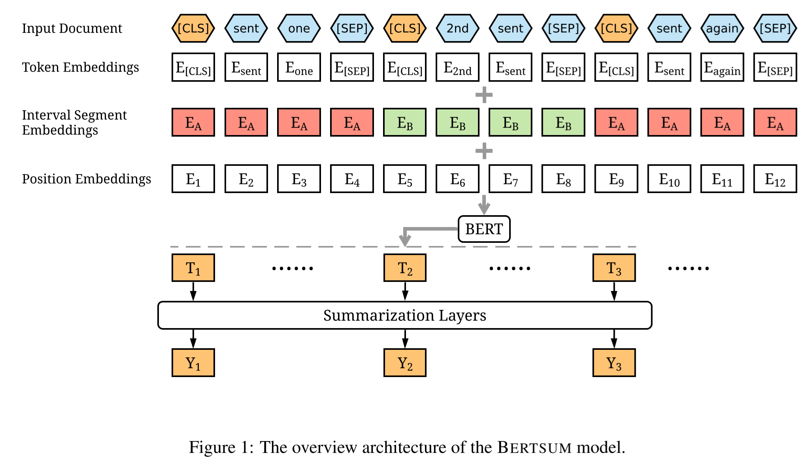
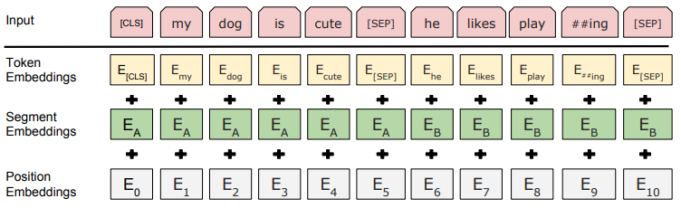
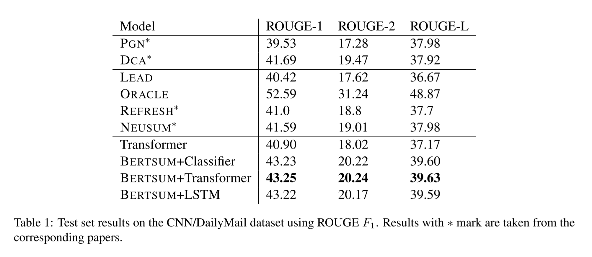
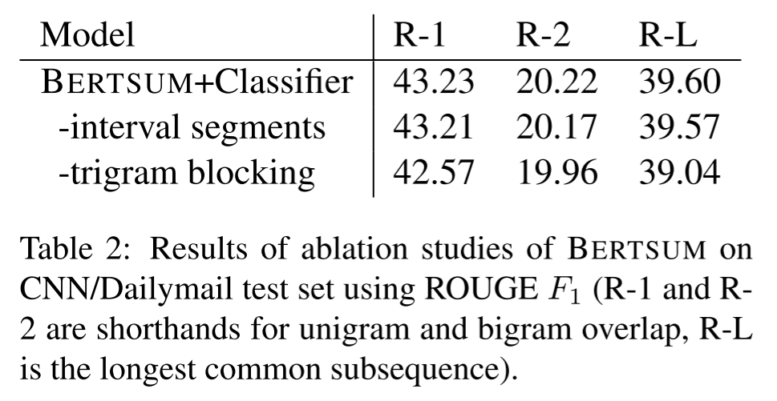
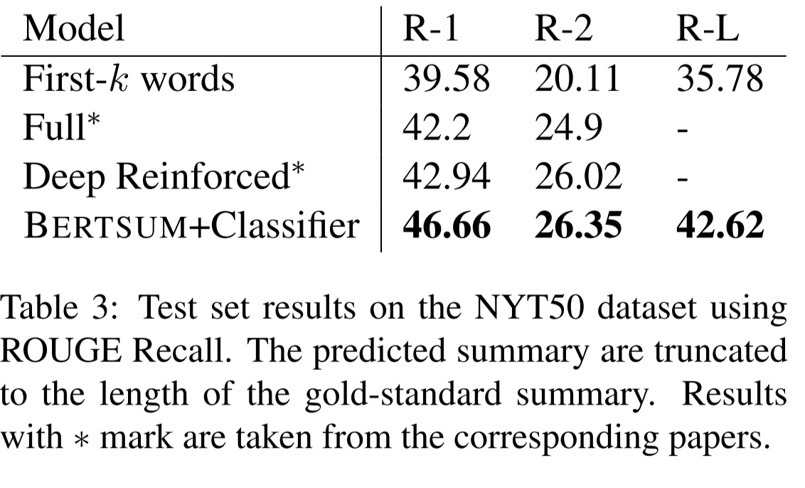

이번 시간에는 **추출 요약을 수행하는 BERTSUM 모델**에 대해 알아보겠습니다. 기존 BERT 구조에서 큰 변화없이 단순한 응용으로 추출 요약이 가능한 것이 인상적입니다. 논문은 [링크](https://arxiv.org/abs/1903.10318)에서 확인할 수 있습니다.

## Abstract

- 연구팀은 BERTSUM이라는 **추출 요약을 할 수 있는 BERT 모델을 제시**
- 관련 **요약 태스크에서 SOTA 성능을 달성**

## Introduction

문서 요약은 한 문서에서 중요한 정보를 추출하여 짧은 길이의 문장으로 요약하는 태스크입니다. 

요약은 크게 두가지 방법으로 나뉩니다. 바로 **생성 요약(abstractive summarization)** 과 **추출 요약(extractive summarization)** 입니다. 

**생성 요약은 주어진 텍스트를 의역하여 문장을 만듭니다.** 즉, 요약문을 생성할 때 본문에 없는 단어나 내용을 사용할 수 있습니다.

**그에 반해 추출 요약은 본문에서 중요한 문장만을 추려내는 방법입니다.** 예시를 통해 알아보겠습니다.

아래는 위키백과에서 기계학습에 관한 글입니다.

✏️✏️✏️

**기계 학습** 또는 **머신 러닝**은 경험을 통해 자동으로 개선하는 컴퓨터 알고리즘의 연구이다.인공지능의 한 분야로 간주된다. 컴퓨터가 학습할 수 있도록 하는 알고리즘과 기술을 개발하는 분야이다. 가령, 기계 학습을 통해서 수신한 이메일이 스팸인지 아닌지를 구분할 수 있도록 훈련할 수 있다.

기계 학습의 핵심은 표현(representation)과 일반화(generalization)에 있다. 표현이란 데이터의 평가이며, 일반화란 아직 알 수 없는 데이터에 대한 처리이다. 이는 전산 학습 이론 분야이기도 하다. 다양한 기계 학습의 응용이 존재한다. 문자 인식은 이를 이용한 가장 잘 알려진 사례이다.  
✏️✏️✏️

위 문장을 **생성 요약한 결과**는 아래와 같습니다. 

머신러닝은 인공지능의 하위 집합이며, 이메일 필터링 및 컴퓨터 비전과 같은 다양한 애플리케이션을 만드는 데 널리 사용된다.

**추출 요약한 결과**는 아래와 같습니다.

기계 학습 또는 머신 러닝은 경험을 통해 자동으로 개선하는 컴퓨터 알고리즘의 연구이다. 문자 인식은 이를 이용한 가장 잘 알려진 사례이다.

**생성 요약은 본문의 내용을 바탕으로 새로운 문장을 생성한데 반해, 추출 요약은 본문에서 중요한 문장을 가져온 것을 볼 수 있습니다.**

**연구팀은 추출 요약에 집중하여 연구를 진행하였습니다.**

기존에도 추출 요약을 해결하고자 하는 시도들은 있었으나, 워낙 복잡한 태스크라 한계가 존재했습니다. 따라서 연구팀은 방대한 데이터셋으로 사전학습된 BERT 모델을 이용하여 문제를 해결하고자 하였습니다.  

## Methodology

BERTSUM의 전체적인 구조는 **BERT를 차용**하였습니다. 다만 추출 요약 Task에 맞게 **파인튜닝 과정에서 몇가지 부분을 살짝 수정**하였습니다. 어떤 부분들이 수정되었는지 같이 알아보겠습니다.  

### Encoding Multiple Sentences

기존 BERT에서는 각 문장들 사이에 [SEP] 토큰만을 사용하여 문장들을 구분하였습니다. 대신 연구팀은 **각 문장의 앞에 [CLS] 토큰을 추가하여 각 문장들의 특징을 해당 토큰에 담을 수 있도록 수정**하였습니다. 아래 그림은 기존 BERT의 입력값입니다. BERTSUM과의 차이점을 확인할 수 있습니다.  

### Interval segment Embedding

기존 BERT에서는 통상 두 개의 문장이 A 문장과 B 문장으로 구분되어 입력되었습니다. 하지만 추출 요약 태스크에서는 두 개 이상의 문장을 입력하여야 합니다. **따라서 연구팀은 Interval segment Embedding을 통해 두 개 이상의 문장에 대해서도 세그먼트 임베딩을 진행하였습니다.** 예를 들어 문장 1, 문장 2, 문장 3, 문장 4가 주어졌다면, 세그먼트 임베딩은 A, B, A, B 식으로 번갈아가며 문장을 구분합니다.  

### Summarization Layers

연구팀은 BERTSUM 출력값 상단에 **summarization-specific layer를 추가하여 문서 요약에 필요한 특징을 추출합니다.** 이를 통해 각 문장별로 요약 정보에 포함할지 여부를 결정합니다.

해당 요약 레이어를 구성하는 방법에는 3가지가 있습니다.

1. 단일 분류 레이어 (FFN + Sigmoid)
2. 문장간 트랜스포머 (Inter-sentence Transformer)
3. LSTM  

## Experiments

연구팀은 뉴스 하이라이트를 모은 CNN/DailyMail 데이터셋과 New York Times Annotated Corpus를 활용하여 실험을 진행했습니다. 

### Trigram Blocking

모델이 예측하는 과정에서 중복(redundancy)를 줄이기 위해서 **Trigram Blocking**을 적용하였습니다. 예를 들어 요약 태스크에서 i like like like you와 같이 문장이 중복되어 나타나는 현상을 방지하기 위함입니다.   

실험 결과는 아래와 같습니다.

  

**BERTSUM 모델이 우수한 성능을 보였으며, 특히 BERTSUM + Transformer 모델이 가장 성능이 우수했습니다**. 이때 BERTSUM + LSTM 모델은 BERTSUM + Classifier 모델과 별 차이가 없다는 점을 주목해볼만 합니다.

추가로 BERTSUM의 구성요소를 평가하기 위한 ablation study 결과는 아래와 같습니다. **interval segments와 trigram blocking이 모델 성능 향상에 큰 영향을 미쳤음을 알 수 있습니다.**  

  

마지막으로 NYT50 데이터셋을 활용한 실험을 진행하였습니다. BERTSUM + Classifier가 가장 좋은 성능을 보이고 있습니다.  

  

## Conclusion

- 추출 요약이 가능한 BERTSUM 모델을 제시
- inter-sentence Transformer를 요약 레이어로 사용한 BERTSUM 모델이 가장 좋은 성능을 보였다.

## Reference
- 구글 BERT의 정석 (수다르산 라비찬디란)