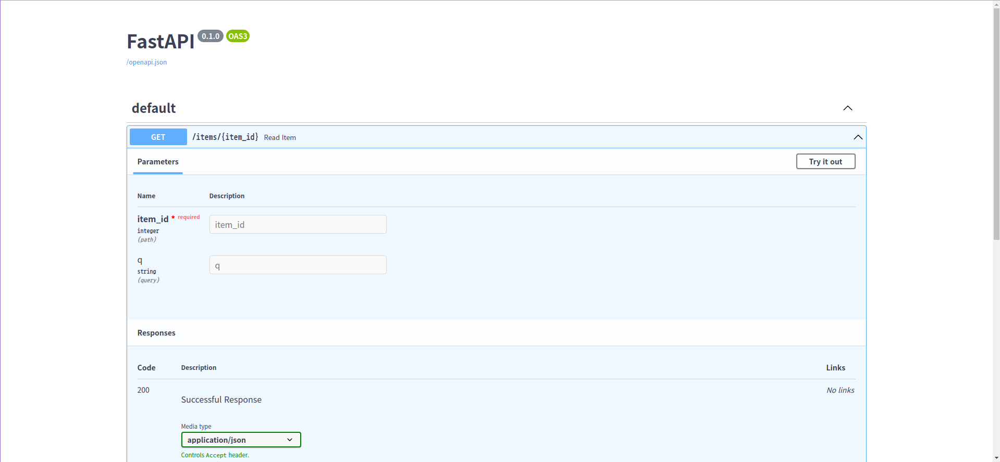

이번 시간에는 Fast API에 대해 알아보고, 간단한 예제를 만들어봅니다.


# Fast API가 무엇인가요?

Fast API는 Python으로 동작하는 **Backend Framework**입니다.

[공식 문서](https://fastapi.tiangolo.com/ko/)에 따르면 Fast API의 **주요 장점**은 아래와 같습니다.

1. **빠르다.**

이름에 Fast가 들어간 것을 보면 알 수 있듯이, Node JS, GO와 비슷한 수준으로 **굉장히 빠른 성능을 자랑**합니다.

2. **높은 생산성.**

타 프레임워크에 비해 **짧은 코드**로 **빠르게 API를 개발**할 수 있습니다. 개발진에 따르면 약 2~3배 정도로 빠르게 개발을 할 수 있다고 합니다.

3. **쉽다.**

Fast API는 직관적이고 배우기 쉽습니다. 예를 들어 Node JS의 Express의 경우에는 JS 문법부터 비동기니 Promise니 입문자가 보기에는 진입장벽이 있습니다.
반면에 Fast API는 Python 기초 문법만 알고 있다면 **누구나 쉽고 빠르게 익힐 수 있습니다.**

4. **문서 자동화**  
   필자가 생각하는 Fast API에서 가장 매력적인 기능입니다. Fast API의 코드를 작성하면 아래와 같이 **자동으로 대화형 API 문서를 제작**해줍니다.


기존에는 코드를 작성하고 수정할 때마다 API 문서를 새로 수정해야 해서 번거로웠는데, Fast API를 사용하면 **코드만 작성해도 자동으로 API 문서를 생성하고 API를 테스트해볼 수 있습니다!**

## Fast API 시작하기

본격적으로 Fast API를 시작해보겠습니다. **두 가지 파이썬 패키지**를 설치하겠습니다.

```shell
pip install fastapi
```

```shell
pip install uvicorn
```

> Q. Uvicorn은 뭔가요?  
> A. Uvicorn은 ASGI(Asynchronous Server Gateway Interface) 웹 서버로 빠른 속도와 비동기 처리가 특징입니다. ASGI에 대한 자세한 설명은 [링크](https://blog.neonkid.xyz/249)를 참고해주세요!

설치가 완료되었으면 **main.py를 만들고** 아래와 같은 코드를 작성해주세요.

```python
/main.py
from typing import Optional

from fastapi import FastAPI

app = FastAPI()

@app.get("/items/{item_id}")
def read_item(item_id: int, q: Optional[str] = None):
    return {"item_id": item_id, "q": q}

```

이제 **서버를 실행**시켜 봅시다. 아래 명령어를 터미널에 입력하면 됩니다.

```shell
uvicorn main:app --reload
```

서버가 정상적으로 실행되었나요?  
웹 브라우저로 **[http://127.0.0.1:8000/items/5?q=test](http://127.0.0.1:8000/items/5?q=test)에 접속**해봅시다!

아래와 같이 **JSON 응답이 오면 성공**입니다!

```json
{
  "item_id": 5,
  "q": "test"
}
```

여러분은 벌써 Fast API를 이용하여 **어엿한 API 서버를 완성**하셨습니다!  
코드도 짧고 전체적으로 크게 어려운 점이 없으실 겁니다. 물론 Optional이니 item_id:int니 **생소한 문법**이 있을 수도 있으나 어려운 것들이 아니니 걱정하지 않으셔도 됩니다! 이들은 **다음 시간에 알아보도록** 하겠습니다.

이 정도만 알아도 **Fast API의 절반 이상 안거라 해도 과언이 아닙니다. 그만큼 쉽고 간단한 프레임워크입니다.**

마지막으로 한가지만 더 해봅시다.

[http://127.0.0.1:8000/docs](http://127.0.0.1:8000/docs)에 접속해주세요.
아래와 같은 대화형 API 문서가 나오나요?


위에서 살펴본 것과 같이 **대화형 API 문서 또한 자동으로 생성**이 잘 되는 것을 확인할 수 있습니다.  
한번 자유롭게 코드도 수정해보고 대화형 API 문서도 조작해보세요! Fast API에 적응하시는데 큰 도움이 되실 겁니다.

## Summary

지금까지 Fast API의 특징 및 장점과 간단한 예제를 알아보았습니다.
Fast API를 사용하면 **지금처럼 쉽고 빠르게 API 서버를 개발**할 수 있습니다.
[Fast API 공식 문서](https://fastapi.tiangolo.com/ko/)도 잘 되어 있으니 막히거나 궁금한 점이 있으시면 한번 참고해보는 것을 추천합니다.  
다음 시간에는 Fast API를 이용하여 **Query Parameter과 Path Parameter**를 사용하는 방법에 대해 알아보겠습니다.
궁금한 점이 있으시면 언제나 댓글 남겨주세요. 감사합니다 :)

## Reference

- [https://fastapi.tiangolo.com/](https://fastapi.tiangolo.com/)
