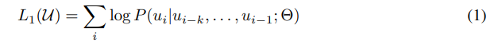
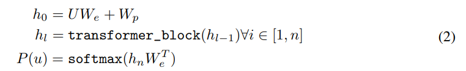
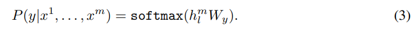
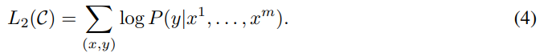
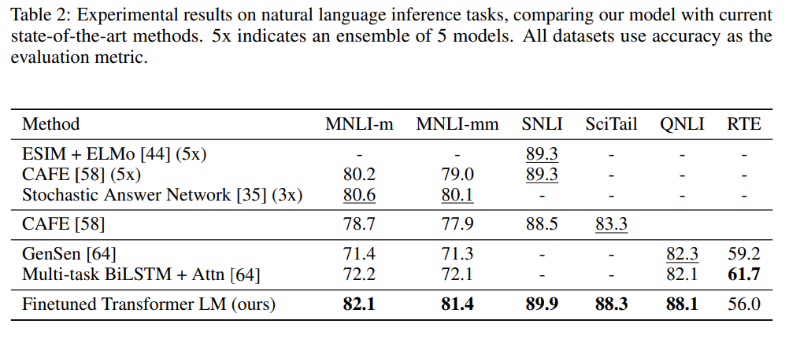
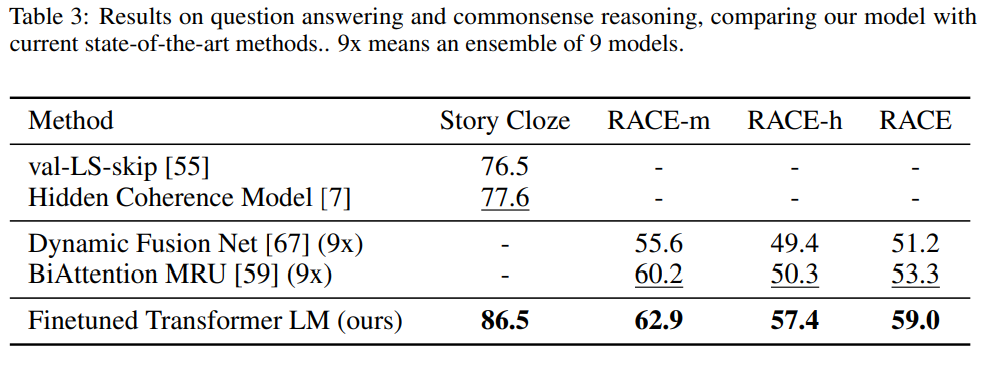
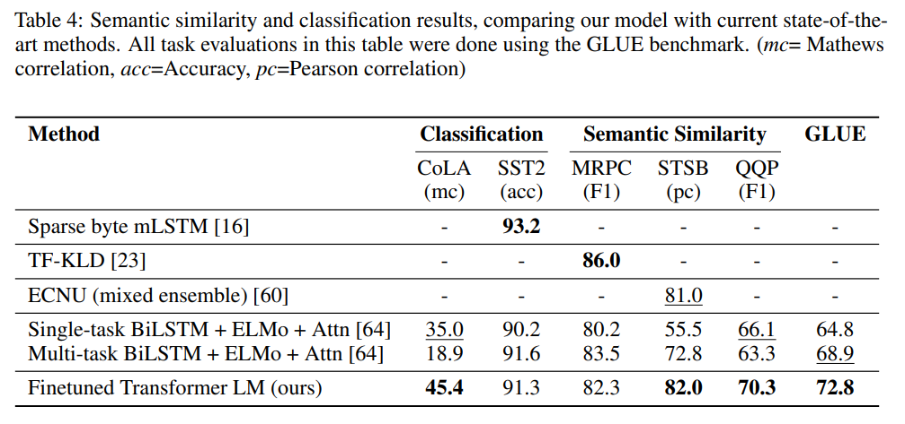
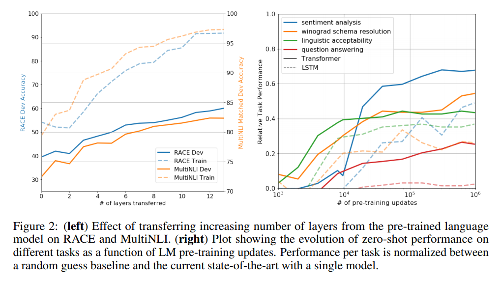
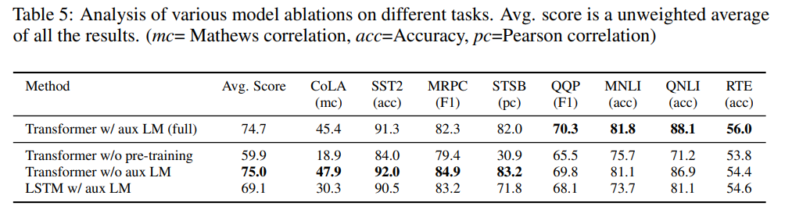

이번 시간에는 GPT-1 논문을 리뷰합니다. **BERT와 함께 NLP에 한 획은 그은 모델 중 하나로**, 이때부터 NLP 프리트레인과 파인튜닝 모델이 힘이 실리기 시작하였습니다.  
최근 GPT-1 모델의 후속작으로 GPT-3 모델까지 발표되었는데, 매우 강력한 성능이 특징입니다. 관련 포스트는 [링크](http://www.aitimes.kr/news/articleView.html?idxno=17370)를 참고해주세요. 그럼 지금부터 GPT-1 모델을 알아보겠습니다. 논문은 [링크](https://cdn.openai.com/research-covers/language-unsupervised/language_understanding_paper.pdf)에서 확인할 수 있습니다.

## Abstract & Introduction

- 연구팀은 unlabeled text corpus로 학습한 **Generative Pre-Training (GPT) 모델 제시**
  - unlabeled text data는 풍부한데 반해, labeled text data는 구하기 어렵다
  - 따라서 unlabeled text data로 프리트레인 할 수 있다면 **시간이나 가격 면에서 효율적임**
- 프리트레인 된 모델은 **개별적인 파인 튜닝으로 특정 태스크를 수행할 수 있음**
  - **모델에 약간의 조정만**으로도 전이(transfer) 할 수 있는 범용 표현(representation)을 학습하는 것이 목표
- **트랜스포머 디코더 모델을 기반**으로 만듬
  - RNN 대비 구조화된 메모리를 사용하고, long-term dependency에 강인함
- GPT는 대부분의 벤치마크 태스크에서 **SOTA 성능을 달성**

## Framework

GPT-1의 훈련 절차는 두가지 단계로 구성됩니다.

1. 대규모 텍스트 코퍼스를 통해 high-capacity 언어 모델을 학습하는 절차 (**프리트레인**)
2. 개별적인 Task에 모델을 적용하는 절차 (**파인튜닝**)

### Unsupervised pre-training

첫번째로 프리트레인 단계에 대해 알아보겠습니다.

프리트레인 단계에서는 토큰들로 구성된 코퍼스가 주어집니다. 아래 수식 같이 언어 모델의 likelihood를 최대화하도록 학습이 진행됩니다.

**GPT-1는 트랜스포머 디코더를 사용하였습니다. 기존 트랜스포머 구조와 크게 다른 것이 없어 이해하기 어렵지 않습니다.**

우선 입력 토큰들에 대해 토큰 임베딩 벡터($W_e$)와 위치 임베딩 벡터($W_p$)를 계산합니다.

그리고 n개의 레이어로 구성된 트랜스포머 디코더를 계산합니다. 마지막으로, 마지막 레이어 블록의 출력 벡터를 FFN(Feed Forward NN)과 소프트맥스를 거쳐 최종 출력을 계산합니다.

### Supervised fine-tuning

**앞서 프리트레인한 모델을 활용하여 특정 Task에 맞는 모델로 파인튜닝을 진행합니다.**

마지막 트랜스포머 블록 $h_{l}^{m}$을 $W_y$의 파라미터를 가지는 선형 output layer에 입력합니다.

따라서 모델은 labeled Dataset인 C의 문제를 해결할 수 있습니다.

연구팀에 따르면 **파인 튜닝의 장점**은 아래와 같습니다.

1. supervised model의 일반화가 향상됨.
   1. 사전 학습 모델의 큰 변화 없이도, supervised 모델을 학습시킬 수 있습니다.
2. 수렴을 가속화할 수 있다.
   1. 파인 튜닝 과정은 기존 모델 대비 더 적은 데이터와 빠른 속도로 학습을 진행할 수 있습니다.

### Task-specific input transformations

이제 GPT 모델이 구체적으로 **각 Task에 맞는 파인 튜닝을 어떻게 진행하는지** 살펴보겠습니다.

**GPT-1은 각 Task 별로 모델 구조에 추가적인 구성요소 없이도 학습이 진행이 가능합니다.** 즉, 입력 데이터 구조와 출력 레이어만 살짝 바꾸면 파인 튜닝이 가능합니다!

위 그림에 잘 설명되어 있어 각 Task 별로 자세한 설명은 생략하겠습니다.

예를 들어 문장 간의 유사도를 구하는 Similarity Task를 살펴보겠습니다.

문장 순서 별로 (Text 1 → Text 2 , Text 2 → Text 1) 입력 데이터를 구성합니다. 그리고 각각 트랜스포머 블록을 거쳐 그 결과를 element-wise하게 더하여 출력 레이어를 거치게 됩니다. **이처럼 입력 데이터와 출력 레이터를 살짝 변경하는 것만으로도 파인 튜닝이 가능합니다.**

## Experiments

파인튜닝 된 GPT-1의 성능은 과연 어떨까요? 한번 살펴보겠습니다. (자세한 모델 실험 구성은 논문을 참고해주세요!)

**실험에 사용한 벤치마크 데이터셋**은 아래 표와 같다고 합니다.

첫번째로 **자연어 추론 (NLI) Task**를 살펴보겠습니다. 대부분의 데이터셋에서 SOTA 성능을 보여주었습니다.

두번째로 **질의응답(QA)와 상식추론(commonsense reasoning) Task**를 살펴보겠습니다. 모든 데이터셋에서 SOTA 성능을 달성하였습니다. 이는 GPT 모델이 long-range context를 효과적으로 다룰 수 있음을 나타냅니다.

마지막으로 **의미적 유사성(Sementic Similiarity)과 분류(Classification) Task**를 살펴보겠습니다. 해당 Task 또한 대부분의 데이터셋에서 SOTA 성능을 달성하였습니다.

## Analysis

연구팀은 **레이어 개수에 따른 전이의 영향(impact of transferring)** 을 살펴보았습니다. 왼쪽 도표는 프리 트레인 모델에서 transfer된 레이어 개수에 따른 성능을 나타낸 것입니다. 두번째로 언어 모델의 프리트레인의 전이가 왜 효과적인지 알아보기 위해 모델의 **Zero-shot performance** 를 살펴보았습니다. 오른쪽 도표는 프리 트레인만을 진행했을 때(zero-shot)의 성능을 나타냈습니다.

이를 통해 다음과 같은 사실을 알 수 있습니다.

1. transfer layer의 개수가 많아질수록 좋은 성능을 낸다. → **프리트레인 모델의 각각의 레이어에서 target task를 풀기 위한 유용한 정보들을 배운다.**
2. 프리 트레인을 진행할 수록 Task의 성능이 좋아진다. → **프리트레인은 다양한 Task를 학습하는데 도움을 준다.**

### Ablation studies

마지막으로 연구팀은 **보조 LM이 모델의 성능에 미치는 영향**을 살펴보았습니다.

여기서 보조 LM이 NLI Task와 QQP에 도움을 준 것을 확인할 수 있습니다. **이는 보조 LM이 데이터셋의 크기가 클수록 성능 향상에 도움이 되지만, 작은 데이터셋에는 그렇지 않다는 점을 나타냅니다.** **또한 프리 트레인을 진행하지 않았을 때 기존 모델 대비 성능이 크게 떨어지는 것을 확인할 수 있습니다.**

## Conclusion

- 프리 트레인과 파인 튜닝을 통해 **특정 Task에 종속되지 않고 성능이 강력한 모델** 을 만들 수 있었음.
- **프리 트레인에서 길고 연속된 텍스트를 통해 world knowledge(?)와 long-range dependency를 학습하고, 이를 성공적으로 파인튜닝을 통해 전이하여 좋은 성능을 보일 수 있었다.**
