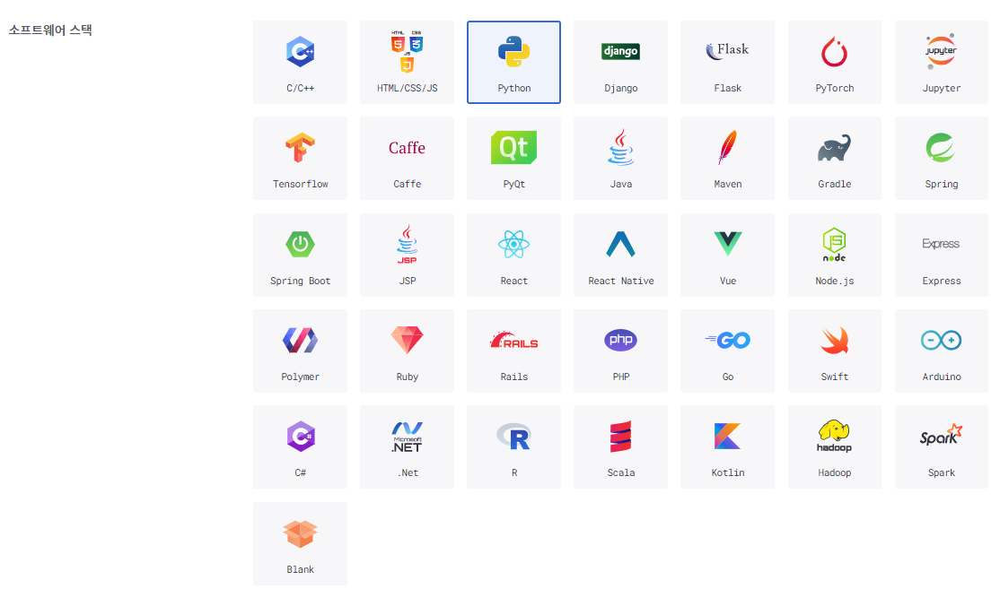
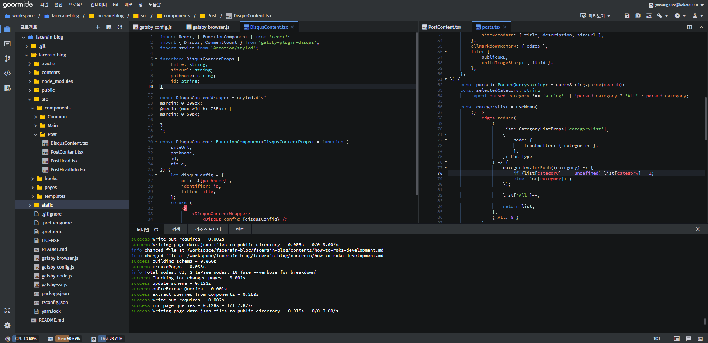
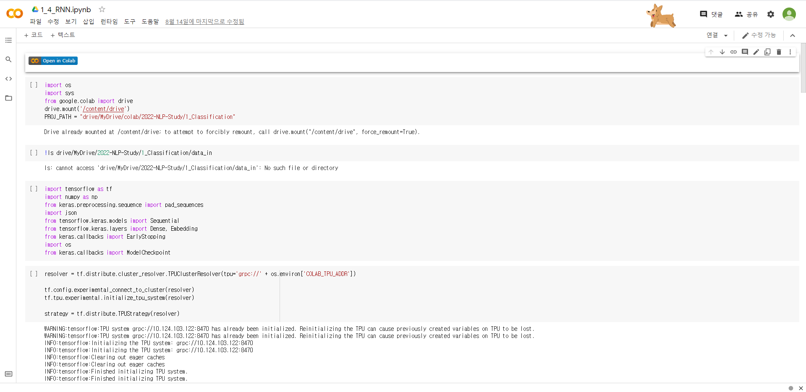
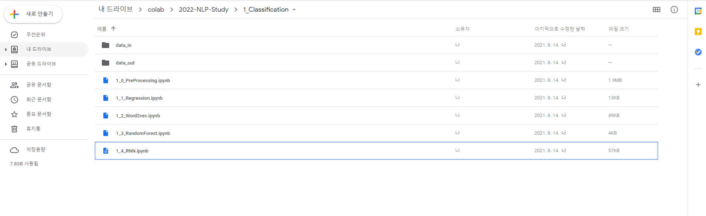
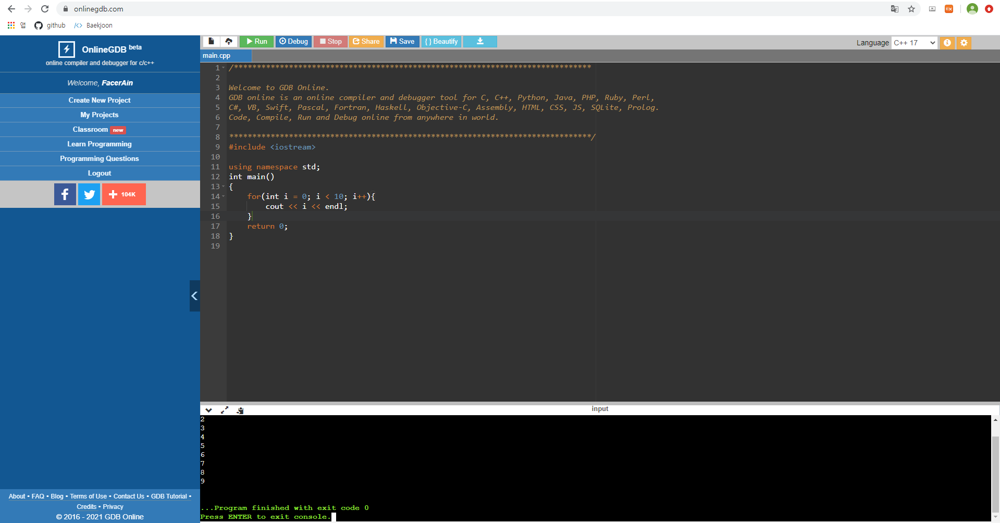

사이버 지식 정보방 (AKA.사지방)에서 개발환경을 구축하는 방법을 알아봅시다.

## 사지방에서 개발을 하나요? 

필자는 2021년 3월부로 대한민국 육군에서 군 복무를 하고 있습니다. 대학교 2학년까지 마치고 온 터라 그동안 배웠던 개발 지식들을 군생활동안 많이 까먹는 것이 아닌가 걱정이 되었습니다.  
하지만 약 6개월 정도 복무한 지금은 오히려 군대가 **개발 실력을 끌어올리기 좋은 환경(?)** 이라고 생각합니다.   
마음만 먹는다면 매일 하루 한 시간 정도 연등 때 시간을 내어 외부 방해 요인 (Ex. 카톡, 유튜브) 없이 오롯이 개발 공부에만 집중할 수 있습니다. 또한 국방부에서 지원하는 10만원 상당의 자기계발비로 평소에 사비로는 엄두도 못냈던 4~5만원대의 개발 서적들을 부담 없이 구매하여 학습할 수 있습니다. 따라서 군생활 기간동안 마음 먹고 꾸준히 하루 한시간씩 1년 넘게 공부한다면 사회에 있을 때보다 더욱 **실력을 기를 수 있는 좋은 기회** 라고 생각합니다. (와!)  

그렇다면 **사이버 지식 정보방(A.K.A 사지방)에서 어떻게 개발을 할 수 있을까요?**

사지방 컴퓨터에는 리눅스 기반의 하모니카 OS가 설치되어 있습니다. 그리고 사지방 관리 프로그램이 설치되어 있어 **컴퓨터를 종료하면 프로그램이나 자료가 초기화**됩니다.  
따라서 여건상 **로컬 개발 환경은 사실상 구축하기 어렵습니다.**
그래서 언제 어디서나 접속할 수 있는 **온라인 개발 환경을 사용하여야 합니다.**

## 어떤 방법들이 있을까요?
인터넷에 찾아보면 온라인 상에서 개발 할 수 있는 방법은 무궁무진합니다. 이 중에서 **사지방에서 사용하기 적합한 몇가지 개발환경만 추려보고자 합니다.** 선정 기준은 아래와 같습니다.

1. **부담 없는 가격**  
아무리 군인 월급이 많이 올랐다지만, 개발 환경에 큰 돈을 쓰기에는 부담스럽습니다. 따라서 **무료이거나 저렴한 가격**으로 개발환경을 구축할 수 있어야 합니다.  

2. **편리한 접근성**  
군대에서 평일에는 아무리 많아야 2시간 정도 컴퓨터를 사용할 수 있습니다. 이때 개발환경 접속하고 세팅하는데 시간이 한나절 걸려서는 안되겠죠? **언제 어디서나 빠르게 개발환경에 접속하고 개발을 진행**할 수 있는지 고려하였습니다.  

3. **준수한 생산성**  
개발은 메모장으로도 충분히 할 수 있습니다. 하지만 대부분이 안쓰는 이유가 있겠죠? 바로 **생산성**입니다. 자동 완성, Git 연동, 코드 포매팅 정도의 **기본적인 생산성 도구들을 지원**하고 있는지 고려하였습니다. 

### 1. Goorm IDE
국내에서 가장 유명한 온라인 IDE입니다. 해외의 AWS Cloud9과 비교해도 손색이 없습니다. 필자도 이 블로그를 Goorm IDE 상에서 개발하였습니다. 우선 UI 측면에서 평소 사용하던 VS Code와 크게 차이가 없어 **편하게 적응** 할 수 있습니다.  

컨테이너 기반으로 동작하며 C++, Python, React, Ruby 등 정말 **다양한 개발 스택을 지원**하고 버튼 클릭만으로 손쉽게 개발 환경을 생성할 수 있습니다. 참고로 무료 플랜에서도 5개까지 컨테이너 생성이 가능하여 학습 목적이라면 충분한 컨테이너 개수라고 생각됩니다.

특히 **웹 개발을 하신다면 Goorm IDE가 무엇보다 좋은 선택** 이라고 생각합니다.  
소스 코드 상의 문법이나 스타일 오류를 잡아주는 **Lint를 지원** 하며, HTML, CSS, JavaScript, TypeScript, JSON에 대해서는 코드를 예쁘게 정렬해 주는 **Code Formatting을 지원** 합니다.  

또한 HTML/CSS/JS로 제작한 문서는 별도의 브라우저에서 확인할 필요 없이 Goorm IDE 상에서 바로 확인할 수 있는 **미리보기 기능을 제공** 하고, 
React, Django 등으로 작업 중인 웹페이지 또한 손쉽게 개발 모드를 켜서 **도메인으로 접속하고 확인** 할 수 있습니다.

따라서 자신이 **웹 개발을 공부하고 싶다면 Goorm IDE를 적극 추천** 드립니다. 이외에도 기본적인 IDE 기능들을 모두 갖추고 있어 **파이썬이나 C++, 알고리즘을 공부하는 데에도 적합한 개발환경** 이라고 생각합니다.  

하지만 **아쉬운 점**도 몇가지 있습니다.   

첫 번째로 **인스턴스 사양이 아쉽습니다.**   
[구름 IDE 플랜](https://ide.goorm.io/pricing)을 살펴보면 무료 플랜의 경우 낮은 CPU 성능에 RAM도 1GB입니다. 물론 웹 개발이나 간단한 프로그램을 개발할 때는 문제가 되지 않지만, 딥러닝 학습 등 **고성능의 사양을 요구하는 작업을 수행하는데에는 한계**가 있습니다. 필자도 자연어처리를 공부할 때 Goorm IDE를 사용해본 적이 있었는데 간단한 RNN 모델을 학습시키는데 **개인 랩탑에서는 약 10분 소요되는 작업이 Goorm IDE에서는 약 1시간 정도가 소요되었습니다.**   

두 번째로 **컨테이너를 항상 켜둘 수 없습니다.** 사용자가 IDE에 접속해 있을때만 컨테이너가 구동이 됩니다. 물론 프리미엄 버전에는 항상 켜두기 기능을 지원하지만 월에 5만원이므로 군인 입장에서는 부담스러운 가격입니다. 따라서 **장시간 구동되어야 하는** 예를 들어 웹 크롤링, 딥러닝 모델 학습, 웹 서버 구동 등에는 **제약이 있습니다.** 

마지막으로는 **커스터마이징이 힘듭니다.** 
위에서 말씀드렸다시피 기본적인 생산성 도구(자동 완성, Git 연동, 코드 포매팅)은 지원합니다. 하지만 Visual Studio Code나 Atom처럼 **자신의 입맛에 맞는 익스텐션들을 추가로 설치할 수 없으며 테마나 폰트 설정도 제한적인 편입니다.** 

Goorm IDE의 장단점을 정리하자면 아래와 같습니다. 	

> **장점**
> - 손쉽고 다양하게 개발 환경 구축 가능
> - 국산 서비스로 지속적인 지원과 업데이트
> - 강력한 웹 개발 도구 지원  

> **단점**
> - 아쉬운 인스턴스 사양
> - 컨테이너를 계속 켜둘 수 없음
> - 커스터마이징 제약 및 사용자 익스텐션 지원 X

### 2. Code-Server
두 번째 개발환경은 **VS Code를 웹 상에서 사용할 수 있게 해주는 code server** 입니다.
Visual Studio Code는 가볍고 다양한 익스텐션을 지원하여 많은 개발자들이 사용하는 IDE입니다. 필자도 사회에 있을 때는 주로 VS code를 이용하여 개발을 했습니다. **Code-Server는 VS code를 서버에 구동시켜 어디서든 웹으로 접속하여 개발할 수 있도록 하는 오픈소스 프로젝트입니다.** 

VS code에서 사용할 수 있는 거의 모든 기능들을 Code-Server에서 동일하게 사용할 수 있습니다. 따라서 평소 VS code로 작업하시던 분들은 Code-Server로 편하게 개발 환경을 구성하실 수 있습니다.

Code-Server를 사용하기 위해서는 **리눅스 기반의 서버가 필요** 합니다. AWS, Azure 등 다양한 방법이 있지만 필자는 **Google Cloud Platform(GCP)을 추천** 합니다. GCP는 **신규 가입한 계정에 대해 약 300달러의 크레딧을 제공** 합니다. 이는 고성능의 인스턴스가 아닌 이상 약 **1년 정도 무리 없이 사용할 수 있는 크레딧** 입니다. GCP 인스턴스를 만들고 그 위에 Code-Server를 구동시키는 방법은 인터넷에도 많이 나와 있고 어렵지도 않으니 누구나 쉽게 시작하실 수 있습니다.

**Code-Server의 가장 큰 장점은 역시 VS code 환경을 웹 상에서 사용할 수 있다**는 점입니다. 따라서 평소 자신이 **즐겨 사용하던 익스텐션이나 테마, 폰트를 VS code 환경과 동일하게 사용할 수 있습니다.**  그리고 Code-Server를 사용하려면 리눅스 인스턴스 또한 개발자가 직접 만들고 관리합니다. 따라서 Linux에 Nginx로 웹 서버를 구동하거나, Dokcer로 작업하는 등 **구름 IDE보다 높은 개발 자유도**를 가지고 있습니다. 또한 **사용자가 접속을 종료해도 인스턴스가 종료되지 않기 때문에** 웹 서버나 크롤링 등 장시간 구동이 필요한 작업에도 유리합니다.

Code-Server의 단점으로는 **인스턴스를 직접 생성해야 하기 때문에 번거롭습니다.** 특히 코딩을 처음 시작하시거나 AWS, GCP와 같은 서비스를 처음 다뤄보시는 분들에게는 진입장벽으로 다가올 수 있습니다. 또한 크레딧을 다 사용하였을 경우 **과금에 대한 걱정**이 있을 수 있습니다.
두 번째로 Code-Server는 마이크로소프트에서 공식으로 개발한 서비스가 아니다보니 **익스텐션을 손쉽게 설치할 수 있는 VS Code MarketPlace를 정상적으로 사용할 수 없습니다.** 따라서 Code-Server에 익스텐션을 **직접 명령어로 다운받아 설치해야 하는 번거로움이 있습니다.**  

> **장점**  
> - VS code와 같은 환경에서 개발 가능
> - 사용자 커스터마이징 가능 (Extension, Theme 등)
> - Goorm IDE 보다 높은 개발 자유도

> **단점**  
> - 인스턴스를 직접 만들고 관리해야 함
> - 타 서비스보다 높은 진입장벽
> - 인스턴스에 과금해야 할 수도 있음
> - VS Code 익스텐션을 수동 설치해야 함

### 3. Colaboratory + Google Drive

세번째 방법은 파이썬으로 **데이터 사이언스나 딥러닝을 공부** 하시는 분들에게 추천합니다.  
바로 **Colaboratory와 Google Drive를 사용하는 개발 환경** 입니다.  
Colaboratory(이하 Colab)는 Google에서 제공하는 클라우드 기반의 Jupyter Notebook 개발 환경 서비스입니다. 무료 플랜으로도 **고성능의 컴퓨팅 자원을 사용할 수 있다**는 점이 가장 큰 특징으로, 개인 PC에서는 30분 걸릴 딥러닝 학습을 Colab에서는 5분 안에 끝낼 수 있습니다.  

또한 Google 계정만 있으면 누구나 쉽고 빠르게 Colab에서 접속하여 개발할 수 있어 **접근성도 정말 좋습니다.** 그리고 Tensorflow, Scikit-Learn과 같은 **데이터 사이언스에 필요한 파이썬 라이브러리가 미리 설치되어 있습니다.**  

하지만 Colab만 단독으로 사용할 경우 불편한 점이 있습니다. 바로 외부에서 **데이터셋을 불러오거나 저장하기가 번거롭다는 것입니다.** 
이를 해결하기 위해 **Google Drive를 함께 사용**합니다. Google Drive와 Colab을 연동하면 Colab에서 쉽게 데이터셋이나 학습 모델을 불러오고 저장할 수 있습니다. Google Drive와 Colab을 연동하는 방법 역시 인터넷에 많이 나와있어 쉽게 구성할 수 있습니다. 필자도 Colab + Google Drive 환경에서 자연어 처리를 공부하고 있는데 성능도 좋고 간편하게 사용할 수 있어서 만족하고 있습니다.

Colab도 **몇가지 단점**을 꼽을 수 있습니다.
첫 번째는 **세션 연결이 중간에 종료될 수 있습니다.** 세션을 12시간 이상 사용하거나 장시간 사용하지 않고 자리를 비울 경우 **세션의 연결이 자동으로 끊깁니다.** 세션 연결이 끊길 경우 **세션 내에 있는 모든 데이터가 사라지게 됩니다.** 이 때문에 사실상 모델 학습을 시키놓고 다음 날 확인하는 방식의 작업이 힘듭니다.  
두 번째로 **낮은 자유도입니다.** Colab은 주피터 노트북 환경으로만 작업할 수 있어 **커스터마이징이나 개발 환경 세팅이 제한적입니다.** 또한 새로운 노트북 파일을 열 때마다 외부 파이썬 라이브러리 설치, 폰트 설정 등의 작업들을 매번 다시 해주어야 하는 점이 번거롭습니다.   

> **장점**
> - 간편한 접속과 사용
> - 강력한 성능을 무료로 사용 가능
> - Google Drive와 연동한 파일 관리 가능

> **단점**
> - 세션이 중간에 끊김
> - 제한적인 커스터마이징과 개발 환경 설정

### 4. OnlineGDB
마지막으로 알아볼 개발 환경은 **OnlineGDB** 입니다.  
OnlineGDB는 사실 IDE보다는 온라인 컴파일러에 가깝습니다. 하지만 소개해드리는 이유는 **알고리즘 문제를 풀고 코딩 테스트를 준비**하는 경우 OnlineGDB만한 개발 환경이 없기 때문입니다.  
Online GDB도 **웹으로 접속해서 바로 사용**할 수 있으며 C, C++, Python, JAVA 등의 **다양한 언어를 지원** 합니다. 또한 Github나 Google 계정으로 로그인해서 **작성한 코드를 저장**할 수도 있습니다.

그리고 구름 IDE나 code server에서는 **디버깅을 하려면 설정 파일을 만들어줘야 하는 등 살짝 불편**하였지만, **OnlineGDB에서는 별도의 설정 없이 바로 디버깅이 가능합니다.**

OnlineGDB의 단점은 첫번째로 **커스터마이징이 힘듭니다.** 즉, 원하는 테마나 폰트, 익스텐션 등을 사용할 수 없습니다.  

두번째로 태생이 IDE가 아닌 온라인 컴파일러이다보니 **콘솔이나 웹 프로젝트 개발은 사실상 어렵습니다.**  

> **장점**
> - 다양한 언어 지원
> - 간단한 사용 방법
> - 편리한 디버깅

> **단점**
> - 제한적인 커스터마이징
> - 프로젝트 개발은 어려움

## Summary
지금까지 4가지의 온라인 개발 환경을 추천드렸습니다.
간단하게 **아래와 같이 요약할 수 있습니다!** 

> Q. 알고리즘 문제를 풀고 싶어요!  
> A. OnlineGDB를 추천합니다!

> Q. 데이터 사이언스, 딥러닝을 공부하고 싶어요!  
> A. Colab + Google Drive를 추천합니다!

> Q. 웹 프로젝트를 진행해보고 싶어요!  
> A. Goorm IDE를 추천합니다!

> Q. 자유도가 높고 커스터마이징이 가능한 개발 환경을 쓰고 싶어요!  
> A. Code Server를 추천합니다!  

개발 환경은 어디까지나 **개인의 취향이고, 정답은 없습니다.**  

그리고 제가 소개해드린 것들 이외에도 더욱 좋은 개발 환경이 있을 수 있습니다.
따라서 독자분들이 자신에게 맞는 개발 환경을 꾸려나가는 것이 가장 바람직하다고 생각합니다! 

마지막으로 나라를 지키기 위해 땀을 흘리시는 모든 군인분들께 존경과 감사를 표하며 이만 글을 줄입니다. 😊

