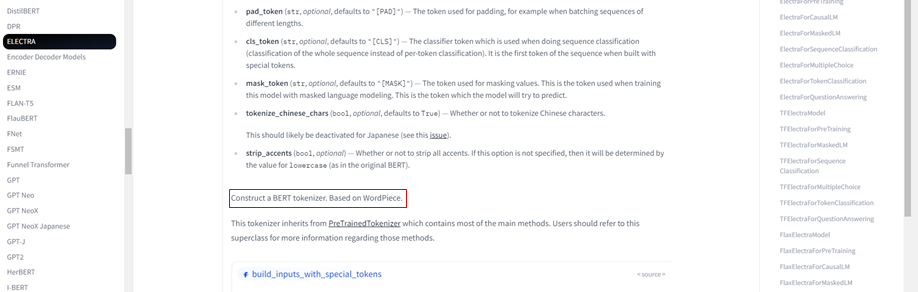

## 1. 개요
안녕하세요!

이번에 우연히 허깅페이스의 [transformer](https://huggingface.co/docs/transformers/index) 라이브러리에 **contribution** 하게 되었습니다.

contribution이 처음이라 참 이런저런 우여곡절이 있었는데요. 

**contribution의 과정**을 소개 드려보고자 합니다 😊  


## 2. 무엇을 컨트리뷰션 하신거죠?
[컨트리뷰션 링크](https://github.com/huggingface/transformers/commit/2d92001076c79b59332e527891e3bda50899b898)  
사실 대단한 건 아니고, 사소한 주석 오타 수정에 기여했습니다!  

이번에 허깅페이스 트랜스포머 분석 프로젝트 중에,

`ElectraTokenizer` 의 **Docstring이 Electra가 아닌 BERT로 잘못 작성된 것**을 발견했습니다. 

그래서 라이브러리 사용자들에게 혼란을 줄 수 있어 이 부분을 수정하였습니다.  




## 3. 왜 이런 문제가 발생한걸까요?
`ElectraTokenizer` 의 경우 `BertTokenizer` 의 코드를 그대로 사용하고 있었습니다.

이때 개발자가 코드를 그대로 **copy**하여 사용하였는데,

**미처 docstring의 BERT를 Electra로 수정하는 작업을 놓친 것** 같습니다. 

실제로 `BartTokenizer`, `RobertaTokenizer` 등의 다른 모델들은 Docsting이 맞게 잘 작성되어 있었습니다.  

## 4. 나도 기여를 할 수 있을까?

뭔가 이상함을 눈치채고, 이를 어떻게 기여할 수 있을지 찾아보기 시작했습니다.

우선 허깅페이스의 **contribution guide**를 살펴보았습니다!  
[가이드 링크](https://github.com/huggingface/transformers/blob/main/CONTRIBUTING.md#start-contributing-pull-requests)  


Guide가 잘 작성되어 있어 step-by-step으로 쉽게 따라갈 수 있었습니다. 

요약하면 아래와 같이 진행하였습니다.  

1. repo **Fork**
2. 내 개발환경으로 불러오기 및 **환경 세팅**
3. 작업을 위한 **브랜치 만들기** `chore/typo`
4. **작업** 🔥
5. **테스트는 생략** 
6. **Push**
7. original repo로 **Pull Request**  

원래 과정에서 **테스트는 생략**하였습니다.

그 이유로는 모델 코드를 크게 수정한 것도 아닌 단순한 주석 수정인데,

굳이 테스트까지 해봐야할까라는 생각을 했었습니다. ~~**(이는 나중에 대참사를 불러오는데…)**~~  

**또한 좋은 커밋 메시지, PR을 작성하기 위해**

다른 컨트리뷰터 분들이 작성한 것을 많이 참고했습니다! 


그렇게 야심차게 **PR을 성공적으로 올렸습니다!**


## 5. 그렇게 행복하게 리뷰받고 끝날 줄 알았지만...

깔끔하게 리뷰 받고, 끝날 줄 알았지만…

상상하지도 못한 곳에 복병이 있었습니다 😢  


**주석만 수정했는데, 테스트에서 걸릴 줄은 상상도 못했습니다.**

허깅페이스에서는 코드 퀄리티를 위해서 다양한 테스트를 수행하고 있습니다.

그리고 테스트에 Github Action과 CircleCI를 사용하고 있습니다.

여기서 **repository의 consistency**를 유지하기 위해,

**복사본의 내용은 동일하게 유지되어야 한다는 정책**에 위배된 것입니다.  


`ElectraTokenizer`의 코드를 살펴보면 상단에 `# Copied from …` 가 있으면,  
**원본 코드(`BertTokenizer`)와 복사본 코드(`ElectraTokenizer`)는 동일하게 유지되어야 했습니다.** 

~~(이걸 어떻게 구현한건데…)~~  

copy check 코드는 [링크](https://github.com/huggingface/transformers/blob/main/utils/check_copies.py)에서 확인할 수 있습니다!  

코드의 퀄리티를 위해서 이정도까지 하는구나 감탄함과 동시에,

그럼 **내 PR은 어쩌지**😢라는 고민에 휩싸이게 되었습니다.  

이를 해결하기 위해 다양한 case들을 생각해보았습니다.

1. **프로젝트의 Consistency가 우선이다!**
    1. Consistency를 위한 trade-off로 생각해야 한다. 
    어차피 `ElectraTokenizer`라는 **클래스 네임이 너무나 명확**해서 사용자들이 Docstring에서 BERT라고 써도 **헷갈리지는 않을 것이다.**
    또, 오히려 이 부분이 Electra와 BERT의 토크나이저는 **같은 코드라는 단서**를 제공할 수 있다.
    모듈 제작자도 분명 이 부분을 신경썼을 것이다.
2. **프로젝트의 Docstring이 우선이다!**
    1. Copy 주석을 없애고, **Electra 코드를 별도로 관리**해야 한다.
    엄연히 `ElectraTokenizer` 클래스의 Docstring이라면, Electra라 소개해야 하는 것이 맞다!
    또한 `BertTokenizer`와 `ElectraTokenizer`가 반드시 **100% 같아야한다는 보장도 없지 않은가**? Bert에서 동작하는 코드가 Electra에서 동작하지 않을 수도 있다.
    마지막으로 허깅페이스는 docstring이 자동으로 공식 doc에도 반영이 된다.
    **NLP에 깊은 지식이 없는 end point 유저들에게 ElectraTokenizer와 BertTokenizer가 같다는 내용은 혼란을 일으킬 수 있다.**
3. **둘 다 맞다. 절충안으로 가자!**
    1. 둘 다 맞는 말이다. **이건 copy check 코드에 예외를 두어야 한다.**
    코드에 대해서는 copy check를 수행하되,
    Docstring에 대해서는 서로 달라도 문제가 없도록 예외를 두어야한다.


## 6. 구세주의 등장

이러지도 저러지도 못하고 고민하고 있는 와중에 **허깅페이스 리뷰어께서 답글**을 달아주셨습니다!

제가 했던 고민들이 무색하게, 주석 끝에 `,BERT→Electra` 을 달면 된다는 것이었습니다.  

```python
#원래 주석
# Copied from transformers.models.bert.tokenization_bert.BertTokenizer with Bert->Electra

#수정한 주석
# Copied from transformers.models.bert.tokenization_bert.BertTokenizer with Bert->Electra,BERT->Electra
```  

위와 같이 주석을 수정하고, `make fix-copies` 를 실행했더니 마법과 같은 일이 일어났습니다.

바로 `Electra` 키워드가 copy check의 예외로 등록됨과 동시에, 모든 `BERT` 키워드가 `Electra`로 수정이 되었습니다. 


그렇게 무사히 모든 테스트와 리뷰를 통과하고 main repository에 merge될 수 있었습니다.  

지금까지 살펴본 PR 과정은 [링크](https://github.com/huggingface/transformers/pull/20192)에서 보실 수 있습니다.  


가 등록되었다.")

## 7. 이번 활동으로 무엇을 느꼈나요?
- **테스트 코드는 매우 매우 매우 매우 매우 중요하다**
    - 허깅페이스와 같이 규모 있는 오픈 소스에서는 코드 퀄리티를 어떻게 유지하는지 궁금했습니다.
    - 물론 직관적인 아키텍처, 상세한 도큐먼트 등의 영향도 있겠지만, **테스트 코드가 굉장히 중요**하다는 것을 느꼈습니다.
    - 꼭 오픈 소스 프로젝트가 아니더라도, 프로젝트를 진행할 때 테스트 코드를 작성해야 한다는 것을 느꼈습니다.
    - 지금 당장은 테스트 코드를 작성하는데 시간이 걸려도, 결과적으로 디버깅 시간을 줄여, 전체적인 개발 속도도 빨라지고 코드퀄리티도 일관적으로 유지할 수 있습니다.
    - **다짐🔥:** **앞으로 나도 테스트 코드 쓰도록 노력해보자! 공부해보기! ⬇️⬇️**  
    - [테스트 코드는 뭐니](https://blog.toycrane.xyz/%ED%85%8C%EC%8A%A4%ED%8A%B8-%EC%BD%94%EB%93%9C%EB%8A%94-%EB%AD%90%EB%8B%88-dd333b306270?gi=ac1fdf914099)

- **모르는 것은 적극적으로 물어보고 의논해보자**
    - copy check 이슈 관련하여 리뷰어께서 허탈할 정도의 간단한 해결법을 주셨습니다.
    - 혼자 고민하는 것도 실력 향상에 도움이 되겠지만, 궁금한 것이나 의논할 것이 있으면 적극적으로 커뮤니케이션을 해야한다는 것을 느꼈습니다.
    - 토론을 통해 이번 케이스처럼 답은 생각보다 간단할 수도 있고, 더 깊은 인사이트를 얻을 수 있다고 생각합니다.
    - **다짐🔥:** **github, reddit, open source community 등에서 세계적인 개발자들과 토론할 수 있는 장은 언제나 열려있으니, 이를 적극적으로 활용해보자!**

- **규모 있는 오픈소스에 기여하면서 배우는게 많다!**
    - 혼자 개발할 때보다 확실히 원작자에게 리뷰를 받아야 한다는 중압감 때문에 사소한 코드라도 여러번 확인하게 되었습니다.
    - 이 과정에서 오픈 소스 프로젝트를 개발하면서 담긴 아이디어, 철학 등을 엿볼 수 있었습니다.
    - **다짐🔥: 앞으로도 규모 있는 오픈 소스 프로젝트에 deep-dive해보고 적극적으로 contribution 해보자!**
    
    감사합니다 :)
