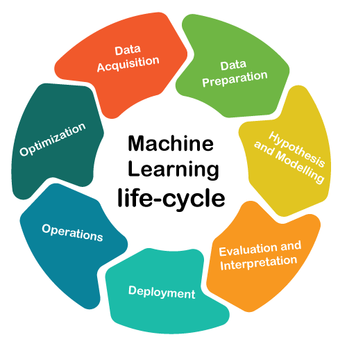

> 본 포스트는 경희대학교 컴퓨터공학과 동아리 D.COM에서 진행한 D.Competition 대회에서 배부한 모델 성능 향상 가이드라인입니다. 전체적인 내용은 Andrew Ng 교수의 Deep Learning 수업을 참고하였습니다. 틀리거나 잘못된 내용이 있으면 언제나 의견 부탁드립니다 😊

## Introduction

본 문서는 여러분들의 **모델의 성능을 끌어올릴 수 있는 Tip을 담은 로드맵**을 제시하고자 합니다.

해당 내용을 바탕으로 더욱 공부하고 적용시켜본다면, **데이터 경진 대회에서 좋은 결과를 얻으실 수 있으실 겁니다.**

딥러닝 모델의 성능을 **단순히 더 좋은 모델, 더 많은 학습 데이터로 학습**시킨다고 향상시킬 수 있을까요?

**정답은 ❌입니다!**

학습 데이터와 모델의 문제를 정확히 이해하고, 이에 맞는 해결 방법을 찾아가는 것이 중요합니다. 한번 같이 살펴봅시다!

## Deep Learning Development Cycle
> Build your first system quickly and then iterate! - Andrew Ng

현업에서 딥러닝 모델 개발을 어떻게 진행할까요? 많은 사람들이 현업에서는 완벽한 계획을 세워서 한 번에 좋은 성능의 모델을 만든다고 생각합니다. 하지만 사실은 우선 빠르게 베이스라인 코드를 완성하고, 지속적으로 피드백을 하여 하나씩 고쳐나가며 성능을 개선합니다. 현재 대부분의 SOTA 모델들은 이러한 시행착오를 바탕으로 좋은 결과를 얻을 수 있었습니다.

즉, **여러 번의 시행착오(Iterate)를 통해 성능을 끌어올릴 수 있는 방법을 찾아야합니다!**

**참고하면 좋은 글**
- [The 7 Steps of Machine Learning. From detecting skin cancer, to sorting… | by Yufeng G | Towards Data Science](https://towardsdatascience.com/the-7-steps-of-machine-learning-2877d7e5548e)

## Variance / Bias Analysis

**모델의 성능을 개선시킬 수 있는 방법을 어떻게 찾을 수 있을까요?** 무작정 방법 이것저것을 시도하는 것은 바람직하지 않습니다. 우리가 시험이 끝나고 성적표나 결과를 통해 피드백하여 다음 시험에서의 성적을 향상시키곤 합니다. 딥러닝 모델도 마찬가지입니다. **딥러닝 모델의 성적표, 바로 평가 메트릭(metric)을 우선 보고 분석해야 합니다!**

**어떤 평가 메트릭을 사용할 것인가?**

사실 정확도(Accuracy) 이외에도 F1 Score, ROC, BELU, SSA 등 다양한 평가 메트릭이 있습니다. 문제 상황에 맞는 적절한 평가 메트릭을 사용하여, 모델의 성능을 정확히 이해하여야 합니다.

**어떻게 평가 메트릭을 분석할 것인가?**

평가 메트릭을 분석하는 방법 또한 여러가지가 있습니다. 여기서는 대표적으로 Training Error와 Validation Error를 바탕으로 모델의 상태를 분석하는 방법에 대해 알아보겠습니다.

그 전에 앞서 **Bias(편향)와 Variance(분산)** 에 대해 알아보겠습니다.

Bias와 Variance는 모델의 상태를 나타내는 척도 중 하나입니다.

**Variance가 높을수록 예측 값들이 흩어져있고**, **Bias가 높을 수록 예측 값들이 정답과 떨어져있다**는 것을 의미합니다.

그렇다면 모델의 Variance와 Bias를 어떻게 볼 수 있을까요? 이때 바로 Training Error와 Validation Error를 이용합니다.

위 그래프의 왼쪽을 보면 **Training Error가 높습니다.** 이는 모델의 예측 값이 정답 값과 동떨어져있다는 것을 의미합니다. 즉, **모델의 Bias가 높다는 뜻**입니다.

그래프의 오른쪽에는 **Training Error와 Validation Error의 차이가 크게 나는 것**을 확인할 수 있습니다. 이는 예측 값들이 흩어져 있어 **모델의 Variance가 높다는  것을 의미**합니다.

지금까지 모델의 Variance와 Bias를 분석하는 방법에 대해 알아보았습니다. **이제 이들을 바탕으로 모델의 성능을 어떻게 향상시킬 수 있을까요?** 다음과 같은 방법이 있습니다.

✨✨✨✨✨✨✨✨✨✨✨✨✨✨✨✨✨✨

**Variance가 높다면? 💯**

- **More Data (1)**
- **Regularization (2)**
- **Model selection (3)**
- **Hyperparameter Tuning (4)**

**Bias가 높다면? 💯**  

- **Bigger Model**
- **Longer/Better Optimzation (5)**
- **Model selection (3)**
- **Hyperparameter Tuning (4)**

✨✨✨✨✨✨✨✨✨✨✨✨✨✨✨✨✨✨

각각의 방법에 대해 한번 자세히 살펴보겠습니다.

**참고하면 좋은 글**

- [https://gaussian37.github.io/machine-learning-concept-bias_and_variance/](https://gaussian37.github.io/machine-learning-concept-bias_and_variance/)

## (1) More Data

한 문제집만 푼 사람보다 여러 문제집들을 많이 풀어본 사람의 성적이 당연히 좋지 않을까요? **더 많은 학습 데이터를 사용하는 것은 모델의 과적합을 피하는 대표적인 방법**입니다. 하지만 더 많은 학습데이터를 수집하는 것이 말처럼 쉽지 않습니다. **학습 데이터 추가로 수집하는데는 아래와 같이 현실적인 어려움이 있습니다.**

1. 학습 데이터를 추가적으로 수집하는데 더 많은 비용과 시간이 소요된다.
2. 언제나 학습 데이터를 더 수집할 수 있는 것이 아니다. (학습 데이터가 더 구할 수 없거나, 대회 환경 같이 학습 데이터가 제한된 경우)
3. 평가 데이터 간의 분포가 달라져 학습 과정에 문제가 발생할 수 있다.

위와 같은 어려움이 있어 주로 대회에서는 **Data Augmentation**이라는 방법을 사용합니다. **이미지를 무작위로 뒤집거나 잘라서 학습 데이터의 양을 늘려주는 것입니다.** 마치 기출 문제를 바탕으로 기출 변형 문제를 만든다고 생각하시면 됩니다.

다행히도 Pytorch에서 Data Augmentation을 위한 모듈을 제공하고 있으니, 편리하게 자신의 코드에 추가할 수 있습니다!

**참고하면 좋은 글**

- [https://nanonets.com/blog/data-augmentation-how-to-use-deep-learning-when-you-have-limited-data-part-2/](https://nanonets.com/blog/data-augmentation-how-to-use-deep-learning-when-you-have-limited-data-part-2/)
- [https://pytorch.org/vision/main/transforms.html](https://pytorch.org/vision/main/transforms.html)

## (2) Regularization

> (참고😁) 한국어로 정규화라고 부르는 Normalization, Standardization, Regularization는 엄연히 다른 개념입니다. 하지만 여기서는 원활한 이해를 위해 이들 개념들을 모델의 과적합을 해결하는 정규화 기법이라고 합쳐서 한번에 소개하도록 하겠습니다.

앞서 모델의 Variance가 높다는 것은 모델이 과적합 되었다는 것을 의미한다고 했습니다.

이를 방지하기 위해 특정 Weight가 높은 값을 가지는 것을 방지할 필요가 있습니다. 이를 위해 사용하는 방법이 바로 **정규화** 입니다. 자세한 설명은 아래 블로그를 참고해주세요! 

**참고하면 좋은 글**

- [https://jeongwooyeol0106.tistory.com/26](https://jeongwooyeol0106.tistory.com/26)
- [https://subinium.github.io/introduction-to-normalization/](https://subinium.github.io/introduction-to-normalization/)

이외에도 정규화 기법의 일종으로 **Drop-out 기법**이 있습니다.

**Drop-out 기법은 임의로 특정 노드를 학습에 제외시켜 모델의 과적합을 방지합니다.**

**참고하면 좋은 글**

- [https://heytech.tistory.com/127](https://heytech.tistory.com/127)
- [https://wandb.ai/wandb_fc/korean/reports/---VmlldzoxNDI4NzEy](https://wandb.ai/wandb_fc/korean/reports/---VmlldzoxNDI4NzEy)

## (3) Model Selection

지금 이순간에도 딥러닝에 대한 연구가 활발히 이루어지고 있습니다. 또한 강력한 성능의 최신 모델들도 계속해서 발표되고 있습니다. 놀라운 점은 대부분의 최신 모델들이 오픈 소스로 공개되어 간단하게 사용할 수 있다는 것입니다!  

이들 모델들을 어떻게 찾을 수 있을까요? **사실 가장 좋은 방법은 최근 발표된 논문들을 쭉 읽고, 최신 연구 트렌드를 익히는 것입니다.** 하지만 학부생 입장에서 해당 방법은 현실적으로 쉽지 않습니다.

필자는 **해결하고자 하는 Task의 벤치마크 리더보드를 확인**해 보는 것을 추천합니다! 예를 들어 질문에 대한 적절한 답을 출력하는 질의응답(QA) Task에서 강력한 모델을 찾아보고 싶다고 가정하겠습니다. QA Task의 성능을 측정하는 벤치마크로 대표적으로 SQuAD가 있습니다. SQuAD의 한국어 버전인 [KorQUAD의 리더보드](https://korquad.github.io/)는 아래와 같습니다. (2022-07 기준)

위 리더보드를 통해 Transformer 계열의 LittleBird 모델이 가장 좋은 성능을 보이고 있음을 확인할 수 있습니다. **이를 통해 해당 논문이나 오픈 소스를 찾아보고 적용**시켜 볼 수 있습니다!

또한 [paperwithcode](https://paperswithcode.com/)에서 **강력한 성능의 최신 트렌드 논문과 모델을 간편하게 확인**할 수 있습니다. 아래 사진은 Image Classification 분야에서 핫한 논문과 오픈소스를 나타낸 것입니다.

이외에도 **Timm(PyTorch Image Models)**, **huggingface** 등 다양한 딥러닝 모델을 pytorch 환경에서 사용할 수 있도록 돕는 라이브러리들이 있습니다. 본 문서에서는 Timm에 대해서 간단하게 살펴보겠습니다. 

[Timm](https://rwightman.github.io/pytorch-image-models/scripts/)은 **Pytorch에서 Computer Vision에서 자주 사용하는 모델들을 사용하게 쉽게 모아둔 라이브러리**입니다. 아래 그림처럼 다양한 CV 관련 모델들을 지원합니다.

또한 [해당 페이지](https://github.com/rwightman/pytorch-image-models/blob/master/results/results-imagenet.csv)에서 아래와 같이 모델들의 파라미터 개수와 대략적인 성능을 비교하여 확인할 수 있습니다.

이러한 사이트와 라이브러리를 활용하여 대회 조건과 환경에 맞는 적절한 모델들을 리스팅하고 비교 및 선택해보시기 바랍니다!

**여기서 잠깐!**

**하지만 단순히 최신 모델, 사이즈가 큰 모델을 사용한다고 좋은 성능을 보장할까요?** ~~(요즘엔 그런 것 같기도 합니다…)~~ 

물론 최근에는 GPT-3와 HyperClova와 같이 초대형 모델을 통해 강력한 성능을 보여주고 있습니다. 하지만 이러한 초대형 모델들은 매우 거대한 학습 데이터와 리소스가 필요할 뿐더러, 실제 서비스에서 다루기도 쉽지 않습니다. 게다가 대회별로 사용할 수 있는 모델의 파라미터 개수 제한이 있는 경우가 있습니다.

이런 경우에 **모델 경량화 기법**이 해결책이 될 수 있습니다!

모델 경량화란 말 그대로 **모델의 성능을 최대한 유지하면서 모델의 사이즈나 연산량을 줄이는 것**을 의미합니다.

이미지 분야에서도 AlexNet, ResNet 등이 좋은 성능을 보여주지만 모델 사이즈와 연산량이 너무 크다는 단점이 있었습니다. 따라서 해당 모델들의 구조를 개선하여 성능을 유지하면서 모델의 복잡도를 줄이는 방법들이 제안되었습니다. 대표적이 예로 **SQueezeNet, MobileNet, ShuffleNet** 등이 있습니다.

이외에도 사이즈가 큰 Teacher Model이 사이즈가 작은 Student 모델에게 지식을 전달하는 **지식 증류(Knowledge Distillation)** 기법도 있습니다.

**참고하면 좋은 글**

- [https://velog.io/@woojinn8/LightWeight-Deep-Learning-0.-딥러닝-모델-경량화](https://velog.io/@woojinn8/LightWeight-Deep-Learning-0.-%EB%94%A5%EB%9F%AC%EB%8B%9D-%EB%AA%A8%EB%8D%B8-%EA%B2%BD%EB%9F%89%ED%99%94)
- [https://blog.pingpong.us/ml-model-optimize/](https://blog.pingpong.us/ml-model-optimize/)

## **(4) Hyperparameter Tuning**

hyperparameter란 모델의 파라미터(weight, bias)를 결정하기 위한 파라미터들을 의미합니다. 대표적인 예로 learning rate, #iterations, #hidden layer, #hidden units, activation funtion, mini batch size 등이 있습니다. **모델의 성능을 결정짓는 중요한 요소** 중 하나입니다.

 아래 그림에서 같은 모델이더라도 하이퍼파라미터를 어떻게 설정하느냐에 따라 성능이 다른 것을 볼 수 있습니다.

그렇다면 하이퍼파라미터를 어떻게 잘 설정할 수 있을까요? 

사실 정해진 방법은 없고, **경험적(emprical)으로 하나하나 설정해보면서 좋은 세팅을 찾는 방법 밖에 없습니다.**  이 과정을 **직접 손으로 하느냐(manual), 아니면 프로그램이 자동으로 수행하느냐(automated)** 에 따라 튜닝 방법이 나뉘게 됩니다. 자세한 내용은 아래 블로그를 참고해주세요!

**참고하면 좋은 글**

- [https://velog.io/@emseoyk/하이퍼파라미터-튜닝#-manual-search](https://velog.io/@emseoyk/%ED%95%98%EC%9D%B4%ED%8D%BC%ED%8C%8C%EB%9D%BC%EB%AF%B8%ED%84%B0-%ED%8A%9C%EB%8B%9D#-manual-search)

## (5) Longer/Better Optimzation

딥러닝은 결국 loss를 최소화하도록 모델을 최적화하는 문제입니다. 이때 optimizer는 매우 중요한 역할을 합니다. **어떤 optimizer 방식을 사용하냐에 따라 모델의 학습이 매우 더디게 진행되거나 local optimization에 빠질 수도 있습니다.**

아래 두 그림은 다양한 Optimizer 종류를 나타내었습니다. 한번 문제에 적합한 **Optimizer와 Learning Rate**가 어떻게 될지 고민해보시기 바랍니다!

**참고하면 좋은 글**

- [https://simsim231.tistory.com/95](https://simsim231.tistory.com/95)
- [https://www.analyticsvidhya.com/blog/2021/10/a-comprehensive-guide-on-deep-learning-optimizers/](https://www.analyticsvidhya.com/blog/2021/10/a-comprehensive-guide-on-deep-learning-optimizers/)
- [https://medium.com/mlearning-ai/optimizers-in-deep-learning-7bf81fed78a0](https://medium.com/mlearning-ai/optimizers-in-deep-learning-7bf81fed78a0)

### Learning Rate Scheduler

**적절한 Learning Rate**를 고정된 값으로 사용할 수도 있지만, **학습이 진행됨에 따라 동적으로 바꿔가며 사용**할 수도 있습니다. 해당 기법을 **Learning Rate Scheduler** 라고 합니다. 이를 통해 모델이 보다 수월하게 최적화를 진행할 수 있습니다.

스케줄러에는 ****MultiplicativeLR, StepLR**** 등 다양한 방식이 있습니다.

아래 그래프는 ExponentialLR의 Learning Rate 변화를 나타낸 것입니다.

**참고하면 좋은 글**

- [[PyTorch] PyTorch가 제공하는 Learning rate scheduler 정리 (tistory.com)](https://sanghyu.tistory.com/113)
- [Pytorch Learning Rate Scheduler (러닝 레이트 스케쥴러) 정리 - gaussian37](https://gaussian37.github.io/dl-pytorch-lr_scheduler/)

참고로 모델의 학습이 더디거나, 과적합이 발생할 때 학습을 **조기 종료(Early Stopping)** 하는 기법도 있습니다.

**참고하면 좋은 글**

- [https://pythonguides.com/pytorch-early-stopping/](https://pythonguides.com/pytorch-early-stopping/)
- [https://quokkas.tistory.com/37](https://quokkas.tistory.com/37)

## Conclusion

이외에도 **앙상블(Ensemble)**, **Cross Validation** 등 성능을 향상시키기 위한 다양한 방법들이 있습니다. 이번 기회를 통해 보다 딥러닝을 깊게 이해하고 실력을 한층 쌓을 수 있는 좋은 기회가 되리라 확신합니다 :)

## Reference
- 본문 중 참고하면 좋은 글에 기재하였습니다 :)