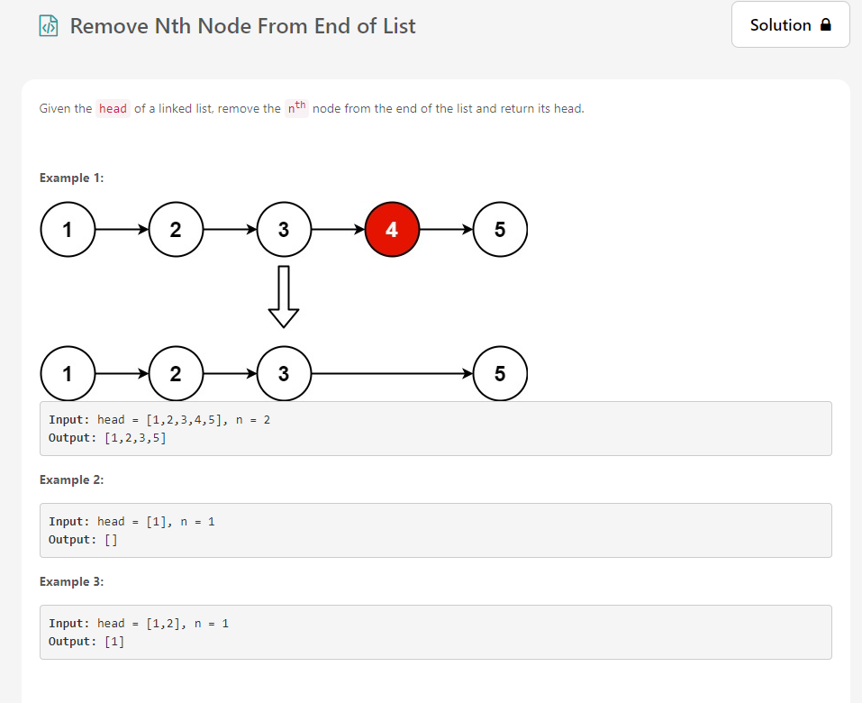
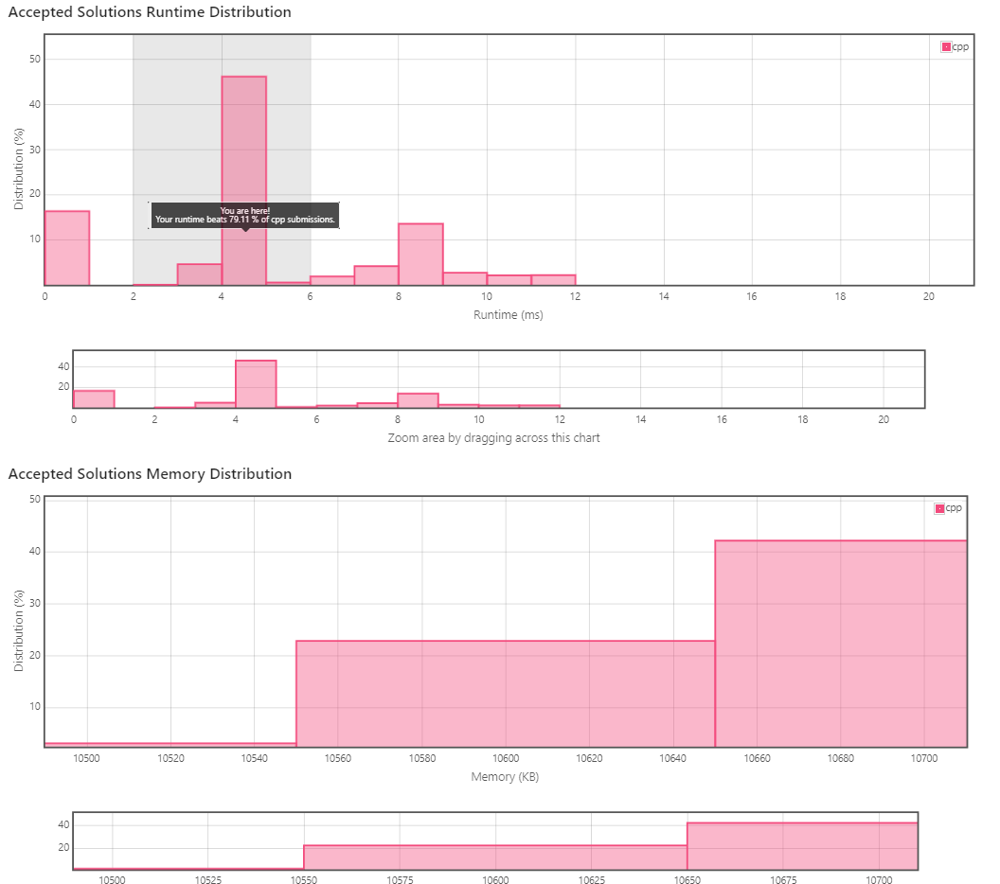

## Top Interview Questions

[https://leetcode.com/explore/interview/card/top-interview-questions-easy/](https://leetcode.com/explore/interview/card/top-interview-questions-easy/)  

LeetCode에서 **기술 인터뷰에 자주 출제되는 문제**들을 정리해둔 문제집입니다. 
Easy, Medium, Hard로 **세 가지 난이도**가 있으며, 필자는 Easy Collection부터 풀어보았습니다. 

  

Easy Collection은 **9개 분야 총 49개 문제로 구성**되어 있습니다.
군대에서 매일 1~2시간씩 풀어서 다 푸는데 약 2주 정도가 소요되었습니다.  

기술 인터뷰 대비 문제집인 만큼 기초적인 자료구조와 알고리즘의 이해를 점검하고 있는 문제가 대다수입니다.

  

전체적인 난이도는 Easy Collection인만큼 **크게 어렵지 않았습니다.** 하지만 문제를 **파면 팔수록 공부할 거리가 많았습니다.** 누구나 이해할 수 있게 명확하고 쉽게 쓰여진 모범 답안 코드, 알고리즘의 성능을 획기적으로 개선한 아이디어들을 보며 많은 것을 배워갈 수 있었습니다.

## Leetcode 도움이 되었나요?
LeetCode 전반적으로 **문제도 깔끔**하고 **실제 인터뷰에서 낼 법한 문제**들이었습니다.

백준에서는 내 풀이와 다른 사람의 풀이를 비교하려면 구글링해야 하고, 그 풀이가 모범 답안인지 확신이 들지도 않았습니다.

하지만 LeetCode에서는 많은 사람의 추천을 받은 **베스트 풀이를 한 눈에** 볼 수 있습니다. 또한 자신의 **알고리즘의 성능을 객관적으로 다른 사람의 것과 비교**하여 확인할 수 있습니다.

  

그리고 **Follow-up** 지문 또한 큰 도움이 되었습니다.
**Follow-up**이란 시간 복잡도를 O(N)으로 개선해보시오, 추가 저장 공간을 사용하지 마시오와 같은 도전 과제라고 생각하시면 됩니다.
실제 인터뷰에서 알고리즘을 더 개선할 수 있는지 등의 질문을 받는다고 하는데 이들을 대비하기에 적합한 것 같습니다.  

  

## 앞으로는?
Easy Collection이라 그런지 문제들이 어렵지는 않았습니다. 하지만 면접에서 갑자기 이런 문제들을 질문한다면 **과연 면접관에게 잘 풀고 설명할 수 있을지** 의문이 들었습니다.

지금까지는 알고리즘 문제를 푸는 것에만 집중했습니다. 하지만 이제는 내가 풀이한 알고리즘을 **남에게 설명하고 증명할 수 있는 능력**을 길러야겠다고 다짐하게 되었습니다. 이를 위해 이제부터 꾸준히 LeetCode에서 푼 문제들을 블로그에 포스팅 해보도록 하겠습니다. :) 

