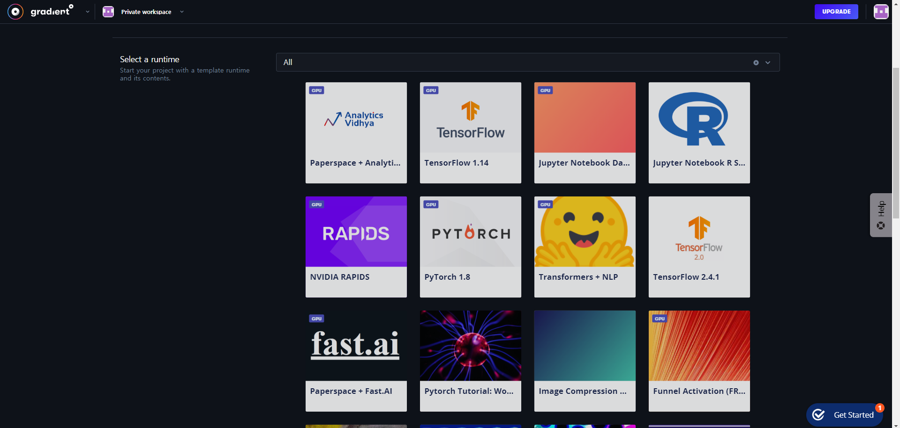
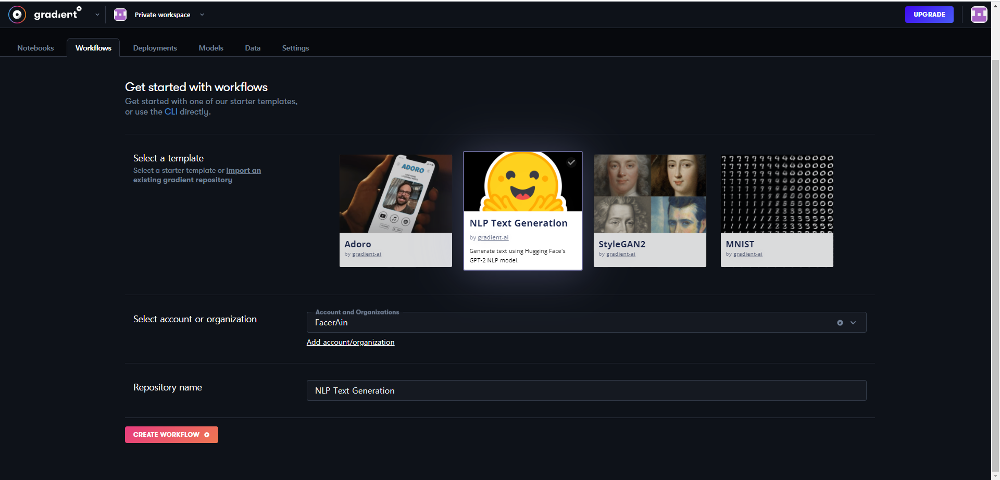

## Paperspace Gradient VS Google Colabatory

딥러닝을 공부하려면 **고성능 컴퓨팅 자원 (특히 GPU)** 를 필요로 합니다.  
하지만 가난한 학생 입장에서 고성능 컴퓨터를 맞추기는 쉽지 않습니다.  
그래서 많은 사람들이 **무료로 고성능 GPU를 활용** 할 수 있는 **Google Colabatory** (이하 Colab)를 사용합니다.

하지만 Colab에도 몇가지 단점들이 있습니다.  
**대표적인 단점** 은 아래와 같습니다.

- **예기치 않은 세션 종료** (일정 시간 이상 자리비움 혹은 12시간 이상 세션 사용)
- **세션 종료 시 데이터 소멸**
- **별도의 저장공간 제공 X**

세션이 종료 되면 그동안 **학습했던 데이터와 모델이 전부 사라지게 되는데,**  
딥러닝을 공부하는 학생 입장에서는 여간 **불편한 일**이 아닙니다.  
또한 별도의 **영구적인 저장 공간을 제공하지 않아** 학습에 필요한 데이터 셋을 불러오고 구글 드라이브와 연동하느라 애를 먹었던 기억이 납니다.

위 문제들을 해결할 수 있는 서비스가 바로 **Paperspace Gradient** 입니다.
Colab과 유사하게 **강력한 GPU 자원을 활용할 수 있는 Jupyter Notebook 환경을 제공** 하는 서비스입니다.

두 서비스의 **차이점** 을 표로 정리하면 아래와 같습니다. (**무료 버전 기준** 입니다.)
|기능|Colab|Paperspace|
|------|-----|-----|
|GPU|Tesla k80, T4|M4000, P4000, P5000|
|RAM|12.72GB|30GB|
|CPU|2x vCPU|8x vCPU|
|영구 Storage|Google Drive|5GB|
|세션 시간 제한|12시간|X|
|자리 비움시 세션 종료|O|X|

### GPU

두 개 서비스 모두 가정용보다 압도적인 GPU 사양을 제공합니다.  
[Geekbench](https://browser.geekbench.com/cuda-benchmarks)에 의하면 성능은 GPU 아래와 같습니다.  
K80 <= M4000 <<< P4000 << P5000 << T4  
K80과 M4000은 비슷한 성능이고 Colab의 T4가 가장 높은 성능을 보여줍니다.  
최근 Colab의 GPU가 T4로 대체되고 있는데, 이 점에서 **GPU 사양은 Colab이 살짝 앞섭니다.**

### RAM

Gradient가 Colab보다 약 2배 많은 **30GB의 RAM을 지원** 합니다.  
데이터를 모델에 적재시킬 때 큰 용량의 RAM이 있으면 좋은데, 이 점은 **Gradient가 훨씬 우수합니다.**

### CPU

데이터 처리를 할 때 CPU 사양 역시 중요합니다.  
CPU 또한 무료 플랜임에도 **Gradient가 8x vCPU로 훨씬 강력한 성능을 제공합니다.**

### 영구 Storage

Colab에서는 별도의 **영구 Storage를 제공하지 않고** , 구글 드라이브와 연동해서 사용하여야 합니다.
반면에 Gradient는 별도의 설정 없이 바로 **5GB의 영구 Storage를 사용할 수 있습니다.** 저장공간 5GB인 것이 살짝 아쉽지만, **학습용으로 사용하기에는 무리가 없다고 생각됩니다.**

### 세션 종료 여부

개인적으로 두 서비스의 가장 큰 차이점이라고 생각됩니다. Colab의 경우 세션을 **12시간 이상 사용** 하거나, **장시간 자리를 비울 경우 세션이 종료** 됩니다. 이 때 세션에서 작업하고 있던 **모든 데이터가 삭제** 되게 됩니다. 반면에 Gradient는 **별도의 시간 제한이 없고,** **자리를 비우거나 작업 중이던 창을 종료해도 세션이 종료되지 않습니다.** 또한 노트북을 열 때마다 Pytorch 등 **파이썬 라이브러를 새로 설치할 필요가 없습니다.** 이 점은 Gradient가 훨씬 좋다고 생각합니다.

### 기타

Github와 연동할 수 있는 **Workflow** , 편하게 작업 환경을 구성할 수 있는 **Runtime Template** 제공 등의 사용자 편의 기능을 제공합니다.  

## 결론

이번 포스트는 Paperspace Gradient에 대해서 알아보았습니다. GPU를 제외한 대부분의 사양이 Colab을 앞서며, 영구 저장공간 제공, 자리를 비워도 세션 사용 가능 등 다양한 매력적인 기능들을 제공합니다. 필자도 딥러닝을 공부할 때 처음에는 Colab을 많이 사용했었는데 중간에 세션이 꺼지고, 데이터가 날라가는 등 여러모로 불편한 점들이 있었습니다. Graident로 이러한 문제들 없이 편하게 작업할 수 있고 게다가 무료라는 점이 가장 매력적입니다. Paperspace Gradient가 딥러닝 공부에 도움이 되길 바랍니다! 😊

## Reference

- https://news.machinelearning.sg/posts/google_colab_vs_paperspace_gradient/
