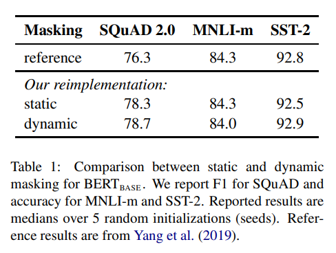
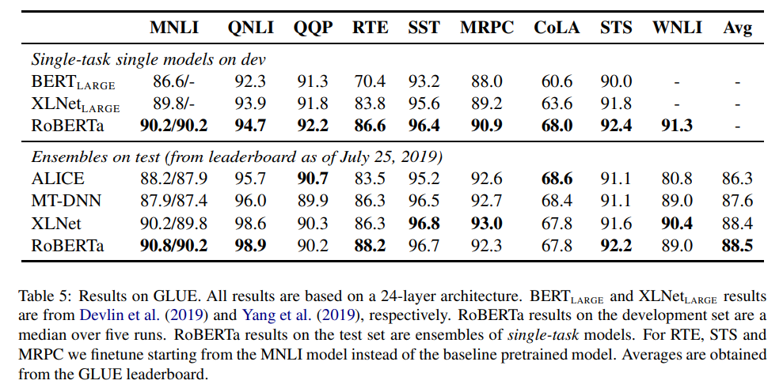
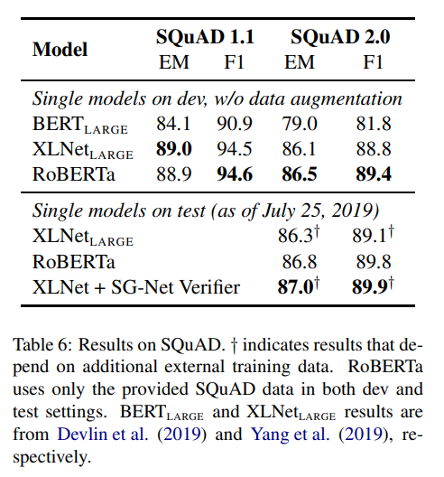
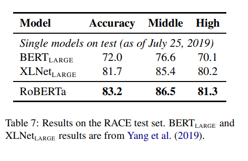

이번 시간에는 [RoBERTa 논문](https://arxiv.org/abs/1907.11692)을 리뷰합니다. RoBERTa는 BERT의 파생 모델로, 기존 모델에 추가적인 학습 방법을 제시하여 성능을 향상시켰습니다. 모델 구조에 큰 변화 없이 학습 방법을 살짝 수정한 것만으로도 모델의 성능을 크게 올릴 수 있다는 점이 인상적인 논문입니다. 그럼 지금부터 RoBERTa 논문 리뷰를 시작합니다 😊

> 원활한 이해를 위해 실제 논문과 글의 순서나 구성을 살짝 바꾸었습니다.

## Abstract

- 이전 연구(Devlin et al., 2019)에서 BERT의 재현연구(**Replication study**)를 통해 다양한 하이퍼파라미터와 학습 데이터 사이즈의 영향을 측정하였음.
- 연구팀은 **다양한 실험을 통해 BERT가 충분히 학습되지 않은 것을 확인**
- 이를 해결하기 위해 **4가지 기법을 적용하여 모델의 성능을 향상**
  - 더 길고 큰 배치로 모델을 학습
  - NSP 태스크를 삭제
  - 보다 긴 문장으로 학습
  - dynamic masking 기법을 적용
- RoBERTa 모델은 GLUE, RACE, SQuAD에서 **SOTA 성능을 달성**

## Training Procedure Analysis

### 1. Static VS Dynamic Masking

**기존 BERT에서는 Static Masking을 수행하였습니다.** 이 방법은 전처리 과정에서 단 한번의 마스킹을 수행합니다. 따라서 모델이 계속 같은 마스킹 된 문장을 보게 되어 학습이 비효율적입니다.

이를 해결하기 위해 연구팀은 **Static Masking 대신 Dynamic Masking을 사용합니다.**

우선 학습 데이터를 10배로 복사합니다. 그리고 40 에폭동안 10개의 다르게 마스킹한 문장을 학습합니다. 즉, 모델은 각 학습 과정동안 같은 mask를 4번 보게 되는 것입니다.

이러한 방법은 데이터셋이 크거나, 더 많은 학습 스텝에서 중요하다고 합니다.

**Dynamic Masking은 Static Masking 과 성능이 비슷하거나 조금 더 좋은 성능을 보였습니다.**

### 2. Model Input Format and Next Sentence Prediction

연구팀은 **NSP 태스크의 타당성을 실험**하기 위해 아래와 같이 학습 데이터를 구성합니다.

- SEGMENT-PAIR + NSP: 기존 BERT와 동일한 설정입니다. NSP를 사용하며, 입력은 512개 이하의 토큰 쌍으로 구성합니다.
- SENTENCE-PAIR + NSP: 위와 마찬가지로 NSP를 사용합니다. 각 세그먼트는 하나의 문장으로 구성됩니다. 이때 하나의 세그먼트가 대부분 512 토큰 보다 짧기 때문에 배치 사이즈를 늘려, SEGMENT-PAIR 방식과 비슷한 총 토큰 수가 되도록 하였습니다.
- FULL-SENTENCES: 하나 이상의 문서에서 연속적으로 샘플링 한 입력값을 사용합니다. 이때 하나의 문서에서 샘플링이 끝나면, 다음 문서를 그대로 샘플링하여, 총 토큰 갯수가 최대 길이(512토큰)을 채우도록 하였습니다. NSP는 사용하지 않습니다.
- DOC-SENTENCES: FULL-SENTENCE 방식과 유사하지만 하나의 문서에서 샘플링이 끝나면 다음 문서에서 이어서 샘플링하지 않습니다. 이 때문에 최대 토큰 길이가 짧아지는데, 이는 배치 사이즈를 동적으로 조정하여 FULL-SENTENCE 방식과 비슷한 총 토큰 수가 되도록 하였습니다.

연구팀은 실험을 통해 두가지 사실을 알아냅니다.

1. **단일 문장을 쌍으로 사용(SENTENCE-PAIR)하는 것은 모델의 성능을 떨어트린다.** 이는 모델이 long-range dependency를 학습할 수 없기 때문입니다.
2. **NSP를 사용하지 않으면, 모델의 성능이 비슷하거나 약간 올라간다.**

DOC-SENTENCES가 가장 좋은 성능을 보였지만, 배치 사이즈가 계속 달라진다는 특징이 있습니다. 따라서 앞으로 **다른 실험과의 일관성을 위해 연구팀은 FULL-SENTENCES 설정을 사용합니다.**

### 3. Training with large batches

BERT base 모델은 1M step에 배치 사이즈 256 문장으로 학습을 진행했습니다. 이는 gradient accumulation을 사용했을 때, 배치 사이즈 2K로 125K 스텝을 진행한 것과 배치 사이즈 8K로 31K step을 진행하는 것은 동일한 computation cost를 가진다고 합니다.

> Q. gradient accumulation이 뭐죠?  
> A. 미니 배치를 통해 구해진 gradient를 n-step동안 Global Gradients에 누적시킨 후 한번에 업데이트 하는 방법입니다. 자세한 내용은 [링크](https://velog.io/@twinjuy/OOM%EB%A5%BC-%ED%95%B4%EA%B2%B0%ED%95%98%EA%B8%B0-%EC%9C%84%ED%95%9C-Batch-Accumulation)를 참고해주세요.

**실험 결과 큰 배치들로 학습하는 것은 모델의 perplexity를 개선할 뿐만 아니라 end-task의 정확도도 향상시켰습니다.** 또한 큰 배치들은 분산 데이터 병렬 학습을 통해 **병렬화하기 더욱 쉽다고 합니다.**

### 4. Text Encoding

기존 BERT에서는 문자 단위(character-level)의 BPE를 사용하였습니다.

**하지만 RoBERTa는 byte level BPE를 사용하였습니다.** **이를 통해 Unknown 토큰 없이도, 적당한 크기(50K units) 서브워드 사전으로 학습을 진행할 수 있습니다.**

Byte level BPE는 몇 개의 Task에서 성능이 떨어진다는 단점이 있지만, 성능 하락폭이 크지 않고 유니버설 인코딩의 장점이 있다고 연구팀은 판단하여 연구팀은 Byte level BPE를 적용하였습니다.

BBPE에 대한 자세한 실험은 추후 연구에서 진행한다고 합니다.

## RoBERTa

**연구팀은 앞서 말한 네가지 학습 기법을 적용시킨 Robustly optimized BERT approach(RoBERTa) 모델을 제안합니다.** 추가적으로 프리트레이닝에 더 많은 데이터를 적용시키고, 훈련 횟수를 늘려 실험을 진행하였습니다.

### Results

**아래 그림과 같이 RoBERTa 모델은 더 많은 데이터로 더 학습을 시킬 수록 좋은 성능을 보였습니다. 특히 추가적인 학습 데이터와 스텝에도 모델이 오버피팅되지 않고, 성능이 향상되었다는 점이 주목할 합니다.**

이어서 RACE, SQuaD, RACE 벤치마크를 테스트하였는데, **RoBERTa는 대부분의 태스크에서 SOTA 성능을 달성하였습니다.**

## Conclusion

- 연구팀은 기존 BERT 모델에서 몇가지 개선할 부분을 찾음
- 모델을 더 많은 데이터로, 큰 배치로, 더 오래 학습시켜 성능을 향상시킬 수 있었음
- NSP 태스크 제거하고, 더 긴 문장들로 학습시킴.
- Dynamic Masking을 적용
- **이를 통해 RoBERTa는 대부분의 벤치마크 Task에서 SOTA 성능을 달성할 수 있었음**

## Reference

- 구글 BERT의 정석(수다르산 라비찬디란)
