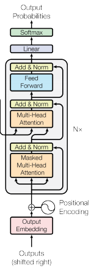
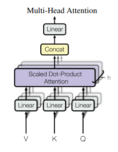
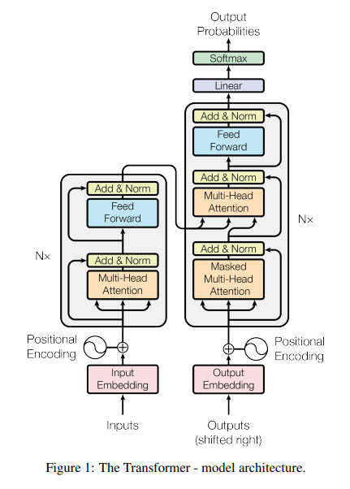
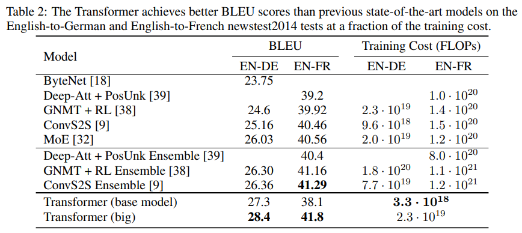
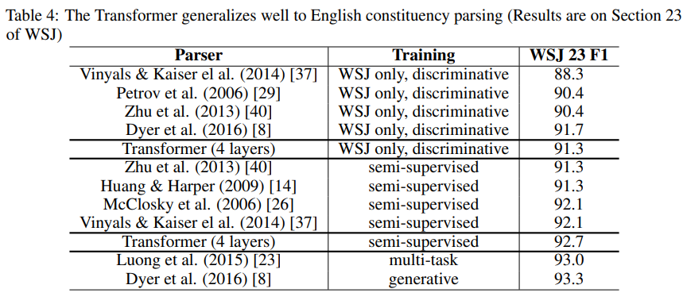

이번 시간에는 NLP 발전에 한 획을 그은 [Attention is All You Need](https://arxiv.org/abs/1706.03762) 논문을 리뷰합니다.  
본 논문에서는 self-attention만을 사용한 transformer라는 모델을 제안합니다. 기존 Seq2Seq 등의 모델들은 순차적인 연산이라는 특성 때문에 성능 향상에 제약이 있었습니다. 하지만 Transformer는 병렬화 연산을 가능하게하여 해당 문제를 해결하였습니다. 이를 통해 연산 속도를 높임과 동시에 SOTA 성능을 달성할 수 있었습니다. 특히 Transformer는 최근 막강한 성능을 보여주는 BERT, GPT의 기반이 되는 모델로, 최근 NLP 기술 트렌드를 이해하는데 필수가 되는 모델이라 할 수 있습니다.

아래 글은 그림으로 Transformer 모델을 설명하였습니다. 함께 보시면 큰 도움이 됩니다!

- [Transformers Explained Visually (Part 3): Multi-head Attention, deep dive](https://towardsdatascience.com/transformers-explained-visually-part-3-multi-head-attention-deep-dive-1c1ff1024853)
- [The Illustrated Transformer](https://jalammar.github.io/illustrated-transformer/)

## Abstract & Introduction

- 기존에는 인코더-디코더 기반의 sequence 모델이 주류를 이루었음
- 인코더-디코더 모델은 내부에 RNN 또는 CNN을 사용하였고, 어텐션 기법을 적용하여 성능을 끌어올렸다.
- 연구팀은 RNN, CNN 없이 오직 Attention에 기반한 Transformer라는 새로운 모델을 제안
- Transformer는 번역 task에서 기존 모델 대비 높은 성능을 보임
- 또한 본 모델은 병렬화 연산을 적극 활용하여 학습 시간과 자원을 적게 사용할 수 있었음
- Transformer는 번역 작업 이외의 다른 task에도 성공적으로 적용할 수 있음.

## Introduction & Background

기존 RNN 기반의 Seq2Seq 모델은 입력을 순차적으로 받고, 연산 또한 이전 결과의 입력을 받아야 한다는 (순차적인 연산) 특징이 있었습니다.

하지만 이러한 방식은 병렬화가 제한되어 성능 향상에 제약이 있었습니다. 이를 해결하기 위해factorization tricks 또는 conditional computation을 도입하여 해결하려는 최근의 연구도 있었습니다. 하지만 이들 연구도 근본적인 문제를 해결하지는 못했습니다.

또한 순차 연산을 줄이기 위한 노력으로 Extended Neural GPU, ByteNet, ConvS2S 등의 접근도 있었습니다. 하지만 이들도 Position 사이의 거리가 멀어질수록 연산량이 덩달아 증가하는 단점이 존재하였습니다. (ConvS2S은 선형적으로, ByteNet은 logarithm하게 증가)

**연구팀이 제안한 Transformer 모델은 self-attention만을 사용하여 위 연산량 문제를 효과적으로 대처하였습니다.**
Transformer 모델의 구조는 아래와 같습니다.

## Encoder

**Transformer는 크게 Encoder와 Decoder로 구성되어 있습니다.** Encoder부터 자세히 살펴보겠습니다.  

인코더는 N = 6개의 레이어들의 스택으로 구성되어 있으며, 각 레이어는 두개의 서브 레이어로 구성됩니다.
첫번째는 multi-head self-attention 그리고 두번째는 position-wise fully connected network가 있습니다.
또한 두 서브 레이어 각각에 residual connection(잔차 연결)을 적용하고, 뒤이어 layer normalization 적용 되어있습니다.

## Decoder

디코더도 N=6개의 레이어들의 스택으로 구성되어 있습니다.
추가로 디코더에서는 세 개의 서브 레이어가 있습니다. Masking이 추가된 Masked Multi Head Attention, 인코더의 정보를 참조하는 Multi-Head Attention 그리고 Feed Forward로 구성되어 있습니다.
인코더 스택과 마찬가지로 residual connection(잔차 연결)과 layer normalization가 적용되어 있습니다. Decoder에서 계산이 끝나면 선형 변환과, Softmax를 거쳐 다음 단어의 확률을 계산하게 됩니다.

## Scaled Dot-Product Attention

서브 레이어의 구성 요소를 하나씩 살펴보겠습니다. **앞서 인코더와 디코더에서 나온 Multi-Head Attention은 Scaled Dot-Product Attention으로 구성된 것입니다.**  
수식은 아래와 같습니다. Dot-Product Attention와 거의 유사합니다. Q, K, V는 각각 Query, Key, Value 행렬이며, $d_k$는 Query와 Key의 차원을 의미합니다.

$$
Attention(Q,K,V) = softmax({QK^{T}\over \sqrt{d_{k}}})V
$$

기존에는 attention function으로 주로 addictive attention과 dot-product attention을 사용합니다.

additive attention은 compability function으로 feed-forward network를 사용하고, dot-product attention은 행렬 곱을 사용한다는 특징이 있습니다.

**본 모델에서는 dot-product attention을 사용합니다. 그 이유는 행렬 곱셈(dot-product) 구현이 최적화가 잘 되어있어 보다 빠르고 공간을 절약하기 때문입니다.**

다만 dot-product function의 경우 Query와 Key의 차원 $d_k$가 커질수록 addictive attention보다 성능이 떨어질 수도 있습니다. 그 이유는 $d_k$가 커질수록 Q, K의 행렬 곱의 값이 매우 커져 학습을 정상적으로 진행할 수 없기 때문입니다.

**이를 해결하기 위해 Q와 K의 행렬 곱을 $\sqrt{d_{k}}$로 나눠주는 scaling을 수행합니다.**

> Q. $d_k$가 커질수록 Q, K의 행렬 곱의 값이 커지는 이유가 뭐죠?  
> A. 평균이 0이고 분산이 1인 독립 랜덤 변수 Q와 K가 있다고 가정해봅시다. 이들의 행렬곱 $\sum^{d_k}_{i=1}$은 평균이 0이고 분산이 $d_k$가 됩니다. 따라서 Query와 Key의 차원 $d_k$가 매우 커질 경우 행렬 곱의 값 또한 매우 커질 수 있습니다.

## Multi-Head Attention

**본 연구에서는 동시에 여러 개의 Attention Map을 생성하여 모델이 다양한 관점에서 문장을 해석할 수 있도록하는 Multi-Head Attention을 제안합니다.**
아래 그림을 살펴보면 문장에서 it이라는 단어의 attention이 The Animal일지, Tired일지 애매합니다. Multi-Head Attention은 이러한 문제를 해결하고자 여러 개의 Head (논문에서는 8개)를 두어 모델이 Head 개수만큼의 Scaled dot product Attention 연산을 수행할 수 있게합니다. 이를 통해 모델은 다양한 관점의 Attention Map을 만들어 성능을 향상할 수 있습니다.

Multihead Attention은 동시에 Head 개수만큼의 Attention을 수행하고, 각 Head들의 결과를 합쳐(Concat)하여 결과를 도출합니다.  
수식은 아래와 같습니다.

$W_i^Q \in \R^{d_{model}\times d_k}, W_i^K \in \R^{d_{model}\times d_k},W_i^V \in \R^{d_{model}\times d_v} \, and  \, W^O \in \R^{hd_{v}\times d_{model}}$  
$MultiHead(Q,K,V)=Concat(head_1,...,head_2)W^O \\ where \, head_i = Attention(QW^Q_i, KW_i^k,VW_i^V)$

## Attention의 적용

**Transformer는 멀티헤드 어텐션을 세가지의 방법으로 사용합니다.**

### Encoder

Encoder에서 Multi-Head Attention에서 Key,Query,Value의 입력이 이전 인코더 레이어의 출력입니다. **이는 해당 인코더에서 각 position은 이전 인코더 레이어의 모든 position의 정보를 활용할 수 있다는 것을 의미합니다.**

### Decoder

Decoder에서 masked Multi-Head Attention에서는 Encoder와 마찬가지로 이전 디코더 레이어의 출력을 입력으로 받습니다. **인코더와의 차이점은 특정 단어 이후의 단어들을 참조하지 못하도록 masking을 수행합니다.** 그 이유는 트랜스포머는 RNN과 달리 순차적으로 문장 데이터가 입력되는 것이 아닌, 한꺼번에 문장 데이터가 입력이 됩니다. 따라서 어떤 단어를 번역할 때 그 뒤에 있는 단어들의 정보까지 참조하게 된다면 모델 학습에 방해가 될 수 있기 때문에 현재 학습하는 단어 위치 이후의 단어들의 값을 $-\infin$ 처리합니다.

### Encoder-Decoder

Decoder에서 Multi-Head Attention 부분입니다. Query는 이전 디코더 레이어의 출력 값이고, Key와 Value는 인코더의 출력 값을 사용합니다. **이를 통해 Decoder가 출력 문장을 생성할 때, 입력 문장의 모든 위치의 단어들을 참조할 수 있습니다.** 이러한 구조는 Seq2Seq With Attention 모델과 닮아있다고 할 수 있습니다.

## Position-wise Feed-Forward Networks

Attention 이후에 fully connected feed-forward network를 지납니다. **이때 FFN은 각 position, 즉 각 단어마다 적용하게 됩니다.** 따라서 FFN에 position-wise라는 이름이 붙었습니다. 입력 벡터 x에 대해 선형 변환을 거친 뒤, ReLU 함수를 적용합니다. 그리고 한번 더 선형 변환을 적용하게 됩니다. 이때 레이어에서 각각의 position의 벡터들에 대해서 같은 파라미터 값($W_1, b_1, W_2, b_2$)를 사용합니다. 레이어가 달라지면 다른 파라미터 값을 사용합니다. 논문에서 이 과정은 kernel size가 1이고, channel이 layer인 convolution을 두 번 수행한 것으로 이해할 수 있다고 합니다. 수식은 아래와 같습니다.

$$ FFN(X) = max(0,xW_1+b_1)W_2+b_2 $$

## Embedding and Softmax

다른 sequence transduction model과 비슷하게 모델의 입력 부분에 learned embedding 층을 적용하였습니다. decoder의 출력 부분에서는 다음 단어의 확률을 예측하기 위해 선형 변환과 softmax 함수를 사용합니다. 또한 transformer에서 인코더와 디코더의 embedding 레이어, 그리고 softmax 이전의 선형변환 레이어는 동일한 Weight Matrix를 사용합니다. 단, 두 임베딩 레이어는 weights에 $\sqrt{d_{model}}$ 을 곱해줍니다.

## Positional Encoding

**Transformer은 RNN이나 CNN 모델과 다르게 순서 정보를 부가적으로 주입해주어야 합니다.** 이를 위해 본 논문에서는 임베딩을 거친 후 인코더와 디코더에 값을 넣기 전에 Positional Encoding을 수행합니다. Positional Encoding 방법에는 여러 가지가 있으나, **연구팀은 Sinusoid Encoding 방식을 선택했습니다.** pos는 position, i는 dimension을 의미합니다.

$PE(pos,2i) = sin(pos/10000^{2i/d_{model}}) \\ PE(pos,2i+1) = cos(pos/10000^{2i/d_{model}})$

sinusoid한 Positional Encoding에 대한 자세한 설명은 [[Transformer]-1 Positional Encoding은 왜 그렇게 생겼을까? 이유](https://velog.io/@gibonki77/DLmathPE)을 참고해주세요.

이를 통해 모델이 문장의 relative position 정보를 함께 학습할 수 있습니다. 또한 sinusoid 특징 덕분에 Inference 단계에서 training 때보다 더욱 긴 문장이 입력되더라도 모델이 문제없이 처리할 수 있습니다.

## 왜 Self-Attention을 써야하는가

self-attention을 사용하면 크게 **세 가지의 이점**이 있다고 합니다.

1. 각 Layer당 계산 복잡도의 감소
2. 병렬 처리 가능한 계산이 늘어남
3. long-range dependency 간의 거리의 최소화

아래 표를 보면 다른 모델과 비교했을 때 **Transformer의 강점을** 확인할 수 있습니다. 대부분의 NLP 문제에서 시퀀스의 길이 n이 임베딩 차원 d보다 작은 경우가 대부분입니다. 따라서 위에서 말한 세가지 요소가 모두 뛰어난 것을 볼 수 있습니다.

추가로 Self Attention을 사용하면 시각화가 가능하여, **모델이 왜 이런 결과를 내놓았는지 해석 가능(interpretable)하다는 장점이 있습니다.** 아래 그림은 Model의 Attention Map을 시각화한 것입니다.

## Training

연구팀은 WMT 2014 English-German dataset과 WMT 2014 English-French dataset을 이용하여 학습을 진행하였습니다. 문장들은 byte-pair encoding(BPE) 방식으로 인코딩하였습니다.

8개의 NVIDIA P100 GPU를 이용하여 학습을 진행하였으며, base model의 경우에는 12시간, big model의 경우 3.5일의 시간이 소요되었습니다.

추가로 Optimizer로는 Adam optimizer를 적용하였으며, Residual Dropout과 Label Smoothing 기법도 적용하였습니다.

## Results

결과는 아래와 같습니다. **Transformer는 번역 Task에서 SOTA 성능을 달성하였습니다**.
또한 Training Cost을 주목하면, **타 모델 대비 적은 연산량으로 높은 성능을 보여주고 있습니다.**

### 모델 변형

모델에서 몇가지 요소를 변형하고 추가 실험을 진행하였습니다. 결과를 요약하면 아래와 같습니다.

1. (A): head가 너무 많으면 성능이 떨어짐.
2. (B): key의 크기(dk)가 작아지면 모델의 성능이 떨어질 수 있음
3. (C): 모델의 크기가 커질수록 성능이 좋아진다.
4. (D): dropout으로 성능을 향상시킬 수 있다.
5. (E): sinusoid가 아닌 다른 positional embedding을 사용해도 성능에 큰 차이는 없다.  
   

### 다른 Task에의 적용

본 모델을 English Constituency Parsing task에 적용시켰을때의 결과입니다. **SOTA에 근접한 높은 성능을 내는 것을 볼 수 있습니다.**  

## Conclusion

- 오직 어텐션에 기반한 Transformer 모델 제안
- 병렬화를 통한 훨씬 빠른 학습이 가능
- 번역 task에서 SOTA 성능 달성
- 번역 이외의 다른 task로의 적용이 기대됨
